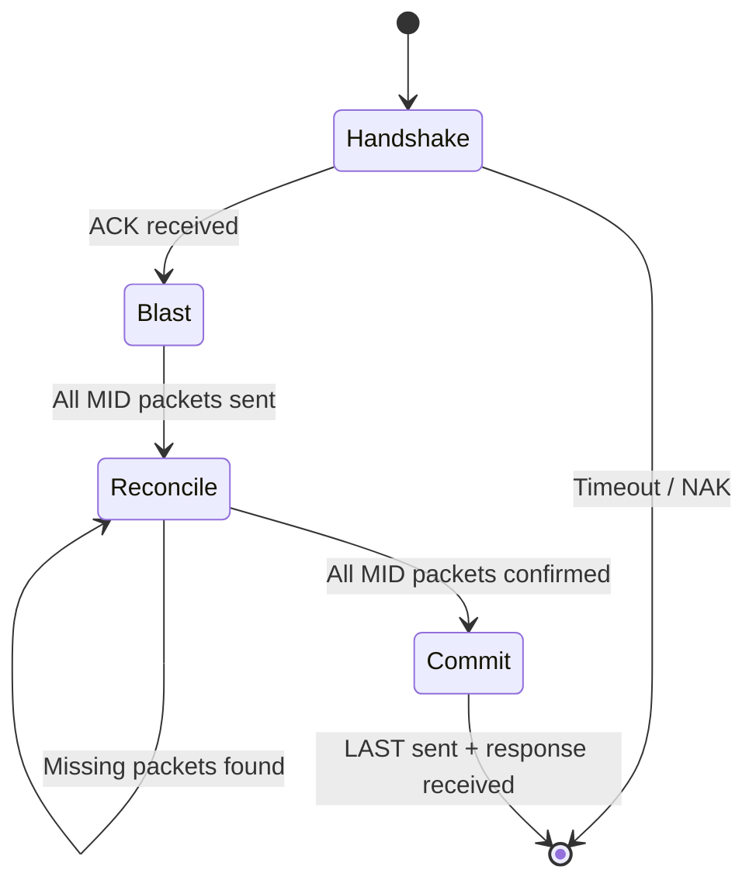

# Communication Protocol Specification

**Source of truth** for the contract between the ESP32-S3 firmware and the React configurator.

## 1. Physical Transport

| Property        | Value                                        |
| --------------- | -------------------------------------------- |
| Interface       | USB HID (Vendor Defined)                     |
| Usage Page      | `0xFFFF`                                     |
| Report ID       | `3` (COMM_REPORT_ID)                         |
| Report Size     | **63 bytes** (host → device & device → host) |
| Vendor ID       | `0x303A`                                     |
| Product ID      | `0x1324`                                     |

## 2. Packet Anatomy

All communication uses a fixed 63-byte HID report:

```
Byte  Field                  Size   Description
───── ────────────────────── ────── ──────────────────────────────────────
  0   flags                  1      Bitfield (see §3)
 1-2  remaining_packets      2      Little-endian u16. Packets remaining after this one.
  3   payload_len            1      Bytes of valid payload in this packet (0-58)
 4-61 payload                58     Application data (zero-padded if payload_len < 58)
 62   crc8                   1      CRC-8 over bytes 0-61 (polynomial 0x07)
```

> The `crc8` field uses polynomial `0x07` with initial value `0x00`. Both sides MUST validate CRC before processing.

## 3. Flag Definitions

### Transport Flags (bits 7-3)

| Bit | Hex    | Name         | Meaning                                     |
| --- | ------ | ------------ | ------------------------------------------- |
| 7   | `0x80` | `FIRST`      | First packet of a transmission              |
| 6   | `0x40` | `MID`        | Middle packet (not first, not last)         |
| 5   | `0x20` | `LAST`       | Last packet (commit)                        |
| 4   | `0x10` | `ACK`        | Acknowledgement                             |
| 3   | `0x08` | `NAK`        | Negative acknowledgement                    |

### Combined Flag Values (Blast + Reconcile)

| Hex    | Composition  | Name          | Context                               |
| ------ | ------------ | ------------- | ------------------------------------- |
| `0x50` | `MID\|ACK`   | `STATUS_REQ`  | Sender requests bitmap from receiver  |
| `0x48` | `MID\|NAK`   | `BITMAP`      | Receiver reports which packets arrived|

### Process Flags (bits 2-0)

| Bit | Hex    | Name    | Meaning                                  |
| --- | ------ | ------- | ---------------------------------------- |
| 2   | `0x04` | `OK`    | Command processed successfully           |
| 1   | `0x02` | `ERR`   | Command processing failed                |
| 0   | `0x01` | `ABORT` | Abort the current multi-packet transfer  |

## 4. Single-Packet Transfer

For payloads ≤ 58 bytes, use a combined `FIRST|LAST` packet:

```
Sender  ──[FIRST|LAST, remaining=0, payload]──>  Receiver
Sender  <──[ACK|OK, response_payload]──────────  Receiver
```

## 5. Multi-Packet Transfer (Blast + Reconcile)

For payloads > 58 bytes, the protocol uses a 4-phase state machine:



### Phase 1: Handshake

```
Sender  ──[FIRST, remaining=N-1, payload[0]]──>  Receiver
Sender  <──[ACK]───────────────────────────────  Receiver
```

The receiver allocates a buffer of `(remaining+1) × 58` bytes.

### Phase 2: Blast

```
Sender  ──[MID, remaining=N-2, payload[1]]──>  Receiver
Sender  ──[MID, remaining=N-3, payload[2]]──>  Receiver
...
Sender  ──[MID, remaining=1,   payload[N-2]]──>  Receiver
```

Packets are sent without waiting for individual ACKs.

### Phase 3: Reconcile (up to 5 rounds)

```
Sender  ────[STATUS_REQ]──────────────>  Receiver
Sender  <────[BITMAP, bitmap_payload]──  Receiver
```

The bitmap has one bit per packet index. Bit = 1 means received. The sender retransmits any MID packets whose bits are 0 (excluding index 0 = FIRST and index N-1 = LAST).

### Phase 4: Commit

```
Sender  ──[LAST, remaining=0, payload[N-1]]──>  Receiver
```

The receiver assembles the full payload and processes the command.

## 6. Application-Level Payload Format

After transport reassembly, the full payload has this structure:

### Request (Host → Device)

```
Byte  Field        Size  Description
───── ──────────── ───── ──────────────────────────
  0   module_id    1     Target module (see §7)
  1   cmd          1     Command (GET=0x00, SET=0x01)
  2   key_id       1     Config key identifier (see §8)
  3+  data         var   JSON payload (for SET commands)
```

### Response (Device → Host)

```
Byte  Field        Size  Description
───── ──────────── ───── ──────────────────────────
  0   module_id    1     Source module
  1   cmd          1     Echo of the command
  2   key_id       1     Echo of the key ID
 3-6  status       4     esp_err_t, little-endian (0 = ESP_OK)
  7+  json_data    var   JSON response payload (GET results, etc.)
```

## 7. Module IDs

| ID     | Name            | Description                      |
| ------ | --------------- | -------------------------------- |
| `0x00` | `MODULE_CONFIG` | Configuration read/write         |
| `0x01` | `MODULE_SYSTEM` | System commands (key injection)  |
| `0x02` | `MODULE_ACTION` | (Reserved)                       |
| `0x03` | `MODULE_STATUS` | Device status push/pull          |

## 8. Config Key IDs

| ID     | Name                     | Kind       | GET                             | SET                     |
| ------ | ------------------------ | ---------- | ------------------------------- | ----------------------- |
| `0x00` | `CFG_KEY_TEST`           | System     | Returns test JSON               | Stores test JSON        |
| `0x01` | `CFG_KEY_HELLO`          | System     | Returns hello message           | —                       |
| `0x02` | `CFG_KEY_PHYSICAL_LAYOUT`| Physical   | Returns layout JSON             | Stores layout JSON      |
| `0x03` | `CFG_KEY_LAYER_0`        | Layout     | Returns Base layer              | Stores Base layer       |
| `0x04` | `CFG_KEY_LAYER_1`        | Layout     | Returns FN1 layer               | Stores FN1 layer        |
| `0x05` | `CFG_KEY_LAYER_2`        | Layout     | Returns FN2 layer               | Stores FN2 layer        |
| `0x06` | `CFG_KEY_LAYER_3`        | Layout     | Returns FN3 layer               | Stores FN3 layer        |
| `0x07` | `CFG_KEY_MACROS`         | Macro      | Returns macro outline           | —                       |
| `0x08` | `CFG_KEY_MACRO_LIMITS`   | Macro      | Returns `{maxEvents, maxMacros}`| —                       |
| `0x09` | `CFG_KEY_MACRO_SINGLE`   | Macro      | `{id}` → full macro             | Upsert or `{delete:id}` |
| `0x0A` | `CFG_KEY_CKEYS`          | CKey       | Returns CKey outline            | —                       |
| `0x0B` | `CFG_KEY_CKEY_SINGLE`    | CKey       | `{id}` → full CKey              | Upsert or `{delete:id}` |

## 9. System Commands

| Byte 1 (cmd)  | Name                    | Payload               |
| ------------- | ----------------------- | --------------------- |
| `0x01`        | `SYS_CMD_INJECT_KEY`    | `[row, col, state]`   |
| `0x02`        | `SYS_CMD_CLEAR_INJECTED`| (none)                |

## 10. Action Code Ranges

| Range             | Hex              | Description                     |
| ----------------- | ---------------- | ------------------------------- |
| NONE              | `0x0000`         | No action                       |
| HID Keys          | `0x0001–0x00FF`  | Standard USB HID usage codes    |
| Media Keys        | `0x0100–0x01FF`  | Consumer control codes          |
| Transparent       | `0xFFFF`         | Falls through to layer below    |
| System Actions    | `0x2000–0x20FF`  | Layer switches, BLE, media, RGB |
| Custom Keys       | `0x3000–0x3FFF`  | User-defined custom key actions |
| Macros            | `0x4000–0x4FFF`  | Macro trigger codes             |

## 11. Failure & Recovery

| Scenario             | Sender behavior                    | Receiver behavior                |
| -------------------- | ---------------------------------- | -------------------------------- |
| CRC mismatch         | Discard packet silently            | Discard packet silently          |
| Handshake ACK timeout| Abort transfer, return error       | Clean up allocated buffer        |
| Bitmap timeout       | Retry STATUS_REQ (max 5 rounds)    | —                                |
| Max reconcile rounds | Abort transfer, return error       | Clean up on timeout              |
| Device disconnect    | Reject pending promise, reconnect  | —                                |
| ABORT flag received  | —                                  | Free buffer, reset state         |

### Auto-Reconnect

The configurator maintains `wantConnection = true` after a user-initiated connect. On disconnect:
1. Fires `onConnectionChange(false)` callback
2. Starts 2-second polling via `navigator.hid.getDevices()`
3. Also listens for the `connect` HID event for faster recovery
4. On reconnection, fires `onConnectionChange(true)` — UI re-fetches all data
