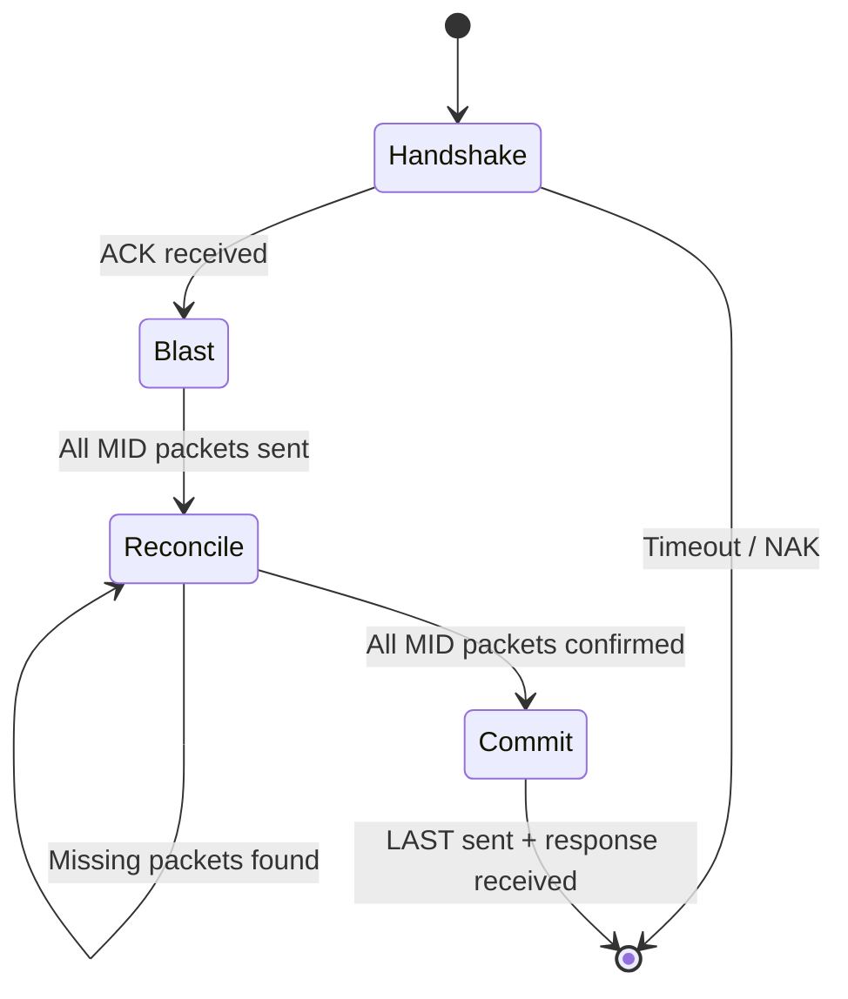

# Communication Protocol Specification

**Source of truth** for the contract between the ESP32-S3 firmware and the React configurator.

## 1. Physical Transports

The protocol engine operates independently of the physical transport. It supports two active transports:

### USB Transport (WebHID)

| Property        | Value                                        |
| --------------- | -------------------------------------------- |
| Interface       | USB HID (Vendor Defined, Interface 1)        |
| Usage Page      | `0xFFFF`                                     |
| Report ID       | `3` (COMM_REPORT_ID)                         |
| Max Packet Size | **63 bytes** (host → device & device → host) |
| Vendor ID       | `0x303A`                                     |
| Product ID      | `0x1324`                                     |

### BLE Transport (Web Bluetooth)

| Property             | Value                                                  |
| -------------------- | ------------------------------------------------------ |
| Service UUID         | `4D544546-0001-4B42-4254-455F434F4D4D` (TEF COMM Service)|
| RX Characteristic    | `...0002...` (Write, Write Without Response)           |
| TX Characteristic    | `...0003...` (Notify, Read)                            |
| MTU Characteristic   | `...0004...` (Notify, Read)                            |
| Max Packet Size      | **Dynamically bound by MTU, up to 260 bytes**          |

> **Note:** The BLE transport negotiates its MTU. The `MTU Characteristic` returns the maximum allowed COMM packet size (MTU - 3). Both host and device must chunk packets to this negotiated size.

## 2. Packet Anatomy

The protocol uses variable-length packets (up to the transport's max packet size). The minimum packet size is 5 bytes (4 bytes header + 1 byte CRC).

```
Byte    Field                  Size   Description
─────── ────────────────────── ────── ──────────────────────────────────────
  0     flags                  1      Bitfield (see §3)
 1-2    remaining_packets      2      Little-endian u16. Packets remaining after this one.
  3     payload_len            1      Bytes of valid payload in this packet
4-(3+N) payload                N      Application data (where N = payload_len)
  4+N   crc8                   1      CRC-8 over bytes 0 to (3+N) (polynomial 0x07)
```

> The `crc8` field uses polynomial `0x07` with initial value `0x00`. Both sides MUST validate CRC before processing. The CRC is located at the logical end of the packet, regardless of how much trailing zero-padding the physical transport (like USB HID) might add.

## 3. Flag Definitions

### Transport Flags (bits 7-3)

| Bit | Hex    | Name         | Meaning                                     |
| --- | ------ | ------------ | ------------------------------------------- |
| 7   | `0x80` | `FIRST`      | First packet of a transmission              |
| 6   | `0x40` | `MID`        | Middle packet (not first, not last)         |
| 5   | `0x20` | `LAST`       | Last packet (commit)                        |
| 4   | `0x10` | `ACK`        | Acknowledgement                             |
| 3   | `0x08` | `NAK`        | Negative acknowledgement                    |

### Combined Flag Values (Blast + Reconcile)

| Hex    | Composition  | Name          | Context                               |
| ------ | ------------ | ------------- | ------------------------------------- |
| `0x50` | `MID\|ACK`   | `STATUS_REQ`  | Sender requests bitmap from receiver  |
| `0x48` | `MID\|NAK`   | `BITMAP`      | Receiver reports which packets arrived|

### Process Flags (bits 2-0)

| Bit | Hex    | Name    | Meaning                                  |
| --- | ------ | ------- | ---------------------------------------- |
| 2   | `0x04` | `OK`    | Command processed successfully           |
| 1   | `0x02` | `ERR`   | Command processing failed                |
| 0   | `0x01` | `ABORT` | Abort the current multi-packet transfer  |

## 4. Single-Packet Transfer

For payloads small enough to fit within a single packet (i.e., `payload_len` ≤ `max_packet_size - 5`), use a combined `FIRST|LAST` packet:

```
Sender  ──[FIRST|LAST, remaining=0, payload]──>  Receiver
Sender  <──[ACK|OK, response_payload]──────────  Receiver
```

## 5. Multi-Packet Transfer (Blast + Reconcile)

For payloads larger than a single packet's capacity, the protocol uses a 4-phase state machine:


```mermaid
stateDiagram-v2
    [*] --> Handshake
    Handshake --> Blast : ACK received
    Handshake --> [*] : Timeout / NAK
    Blast --> Reconcile : All MID packets sent
    Reconcile --> Reconcile : Missing packets found
    Reconcile --> Commit : All MID packets confirmed
    Commit --> [*] : LAST sent + response received
```

### Phase 1: Handshake

```
Sender  ──[FIRST, remaining=N-1, payload[0]]──>  Receiver
Sender  <──[ACK]───────────────────────────────  Receiver
```

The receiver allocates its global buffer. **Note:** Only one multi-packet transfer can occur at a time across all transports.

### Phase 2: Blast

```
Sender  ──[MID, remaining=N-2, payload[1]]──>  Receiver
Sender  ──[MID, remaining=N-3, payload[2]]──>  Receiver
...
Sender  ──[MID, remaining=1,   payload[N-2]]──>  Receiver
```

Packets are sent without waiting for individual ACKs.

### Phase 3: Reconcile (up to 5 rounds)

```
Sender  ────[STATUS_REQ]──────────────>  Receiver
Sender  <────[BITMAP, bitmap_payload]──  Receiver
```

The bitmap has one bit per packet index. Bit = 1 means received. The sender retransmits any MID packets whose bits are 0 (excluding index 0 = FIRST and index N-1 = LAST).

### Phase 4: Commit

```
Sender  ──[LAST, remaining=0, payload[N-1]]──>  Receiver
```

The receiver assembles the full payload and processes the command.

## 6. Application-Level Payload Format

After transport reassembly, the full payload has this structure:

### Request (Host → Device)

```
Byte  Field        Size  Description
───── ──────────── ───── ──────────────────────────
  0   module_id    1     Target module (see §7)
  1   cmd          1     Command (GET=0x00, SET=0x01)
  2   key_id       1     Config key identifier (see §8)
  3+  data         var   JSON payload (for SET commands)
```

### Response (Device → Host)

```
Byte  Field        Size  Description
───── ──────────── ───── ──────────────────────────
  0   module_id    1     Source module
  1   cmd          1     Echo of the command
  2   key_id       1     Echo of the key ID
 3-6  status       4     esp_err_t, little-endian (0 = ESP_OK)
  7+  json_data    var   JSON response payload (GET results, etc.)
```

## 7. Module IDs

| ID     | Name            | Description                      |
| ------ | --------------- | -------------------------------- |
| `0x00` | `MODULE_CONFIG` | Configuration read/write         |
| `0x01` | `MODULE_SYSTEM` | System commands (key injection)  |
| `0x02` | `MODULE_ACTION` | (Reserved)                       |
| `0x03` | `MODULE_STATUS` | Device status push/pull          |
| `0x04` | `MODULE_SPLIT`  | Split link pairing/commands      |
| `0x05` | `MODULE_BLE`    | Proxied BLE commands (Slave)     |

## 8. Config Key IDs

| ID     | Name                     | Kind       | GET                             | SET                     |
| ------ | ------------------------ | ---------- | ------------------------------- | ----------------------- |
| `0x00` | `CFG_KEY_TEST`           | System     | Returns test JSON               | Stores test JSON        |
| `0x01` | `CFG_KEY_HELLO`          | System     | Returns hello message           | —                       |
| `0x02` | `CFG_KEY_PHYSICAL_LAYOUT`| Physical   | Returns layout JSON             | Stores layout JSON      |
| `0x10` | `CFG_KEY_LAYOUTS`        | Layout     | Returns layout outline          | —                       |
| `0x11` | `CFG_KEY_LAYOUT_SINGLE`  | Layout     | `{id}` → full layout            | Upsert or `{delete:id}` |
| `0x12` | `CFG_KEY_LAYOUT_LIMITS`  | Layout     | Returns `{maxLayouts}`          | —                       |
| `0x07` | `CFG_KEY_MACROS`         | Macro      | Returns macro outline           | —                       |
| `0x08` | `CFG_KEY_MACRO_LIMITS`   | Macro      | Returns `{maxEvents, maxMacros}`| —                       |
| `0x09` | `CFG_KEY_MACRO_SINGLE`   | Macro      | `{id}` → full macro             | Upsert or `{delete:id}` |
| `0x0A` | `CFG_KEY_CKEYS`          | CKey       | Returns CKey outline            | —                       |
| `0x0B` | `CFG_KEY_CKEY_SINGLE`    | CKey       | `{id}` → full CKey              | Upsert or `{delete:id}` |
| `0x0C` | `CFG_KEY_SYSTEM`         | System     | Returns device identity         | Stores device identity  |

## 9. System Commands

| Byte 1 (cmd)  | Name                    | Payload               |
| ------------- | ----------------------- | --------------------- |
| `0x01`        | `SYS_CMD_INJECT_KEY`    | `[row, col, state]`   |
| `0x02`        | `SYS_CMD_CLEAR_INJECTED`| (none)                |

## 10. Action Code Ranges

| Range             | Hex              | Description                     |
| ----------------- | ---------------- | ------------------------------- |
| NONE              | `0x0000`         | No action                       |
| HID Keys          | `0x0001–0x00FF`  | Standard USB HID usage codes    |
| Media Keys        | `0x0100–0x01FF`  | Consumer control codes          |
| Transparent       | `0xFFFF`         | Falls through to layer below    |
| System Actions    | `0x2000–0x20FF`  | BLE, media, RGB                 |
| Custom Keys       | `0x3000–0x3FFF`  | User-defined custom key actions |
| Macros            | `0x4000–0x4FFF`  | Macro trigger codes             |
| Layer Actions     | `0x5000–0x50FF`  | Momentary, Toggle, On, Off layer|

## 11. Failure & Recovery

| Scenario             | Sender behavior                    | Receiver behavior                |
| -------------------- | ---------------------------------- | -------------------------------- |
| CRC mismatch         | Discard packet silently            | Discard packet silently          |
| Handshake ACK timeout| Abort transfer, return error       | Clean up session lock            |
| Bitmap timeout       | Retry STATUS_REQ (max 5 rounds)    | —                                |
| Max reconcile rounds | Abort transfer, return error       | Clean up on timeout              |
| Device disconnect    | Reject pending promise, reconnect  | Free session lock                |
| ABORT flag received  | —                                  | Free session lock, reset state   |

### Auto-Reconnect

The configurator maintains `wantConnection = true` after a user-initiated connect. On disconnect:
1. Fires `onConnectionChange(false)` callback
2. Starts 2-second polling via `navigator.hid.getDevices()` or Web Bluetooth equivalent.
3. Also listens for the `connect` event for faster recovery.
4. On reconnection, fires `onConnectionChange(true)` — UI re-fetches all data.
