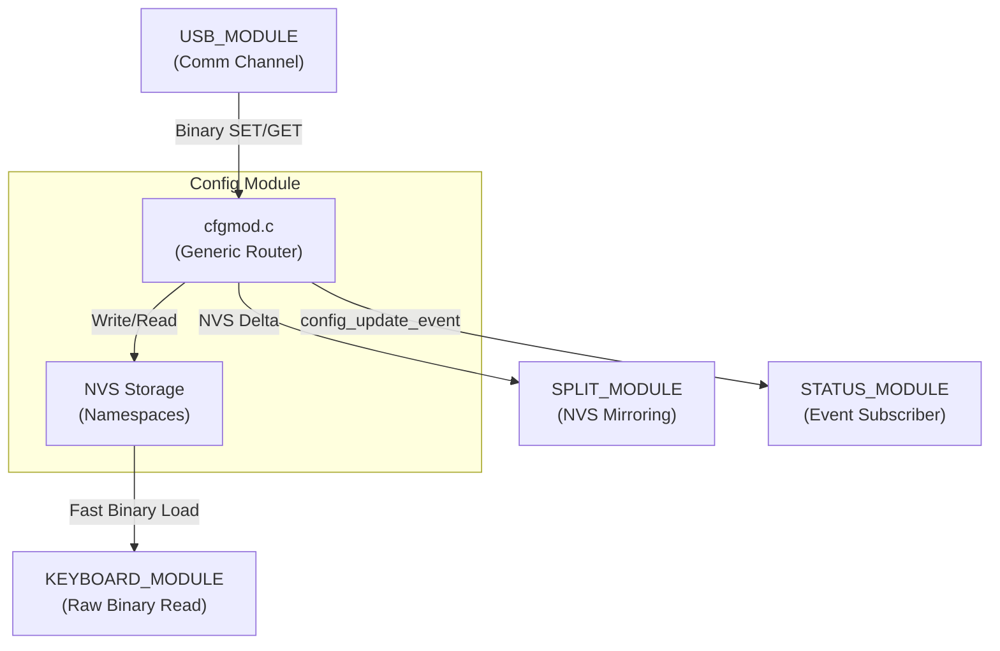

# Config Module (config_module)

> **Source:** `components/config_module/` — `cfgmod.c`, `cfg_ble.c`, `cfg_layouts.c`, `cfg_macros.c`, `cfg_system.c`, `cfg_physical.c`, `cfg_custom_keys.c`
> **Public API:** `include/cfgmod.h`, `include/cfg_ble.h`, `include/cfg_layouts.h`, `include/cfg_system.h`

The **Config Module** is the authoritative source of truth for all persistent state in the firmware. It provides a high-level abstraction over Non-Volatile Storage (NVS), managing the serialization and runtime distribution of user settings while optimizing for both storage longevity and execution speed.

---

## Internal Architecture

The module employs a reactive, registry-based architecture that decouples generic storage logic from specific configuration schemas.

### 1. Pure Binary Storage
To maximize performance and minimize memory usage, the module stores all configurations purely as binary C-structs in NVS. The structs are explicitly ordered by decreasing size to ensure natural memory alignment, and strict bounds validation is applied on all sets.

### 2. Index-Based Collections
For complex, multi-item configurations like Macros and Custom Keys, the module avoids "scanning" NVS (which is slow). Instead, it uses a **Bitmask Index**:
- `mac_idx`: A bitmask tracking which of the 64 macro slots are active.
- `ck_idx`: A similar mask for custom key slots.
This allows the firmware to enumerate active items instantly by reading a single record.

### 3. In-Place Binary Operations
Configuration operations process binary structures directly. To prevent stack overflows, large structs are never instantiated on the task stack. Instead, the module uses in-place bounds checking and `memcpy()` operations directly against the `comm_module`'s global, session-locked receive buffer.

---

## NVS Namespace Mapping

The module partitions data into dedicated NVS namespaces to prevent key collisions and optimize lookup times.

| Namespace | Kind | Content |
|---|---|---|
| `cfg_lay` | `LAYOUT` | Matrix action codes (Layers 0-15) and `lay_idx`. |
| `cfg_mac` | `MACRO` | Macro event sequences and the `mac_idx`. |
| `cfg_ck` | `CKEY` | Press/Release/Tap/Hold rules and `ck_idx`. |
| `cfg_spl` | `SPLIT` | ESP-NOW pairing data and role configuration. |
| `cfg` | *Others* | Generic items (System, Physical) prefixed as `k<kind>_<key>`. |

---

## Cross-Module Connections

The Config Module acts as the central state provider for every functional subsystem.

### [USB_MODULE](file:///home/srleg/Projects/Tecleados-ESP-Firmware/universe/modules/USB_MODULE.md) — Configuration Transport
- **Command Routing**: Registers a callback for `MODULE_CONFIG`. It handles the vendor-specific HID channel for the web configurator.

### [STATUS_MODULE](file:///home/srleg/Projects/Tecleados-ESP-Firmware/universe/modules/STATUS_MODULE.md) — Reactive Notifications
- **Event Bus**: Posts `CONFIG_EVENT_KIND_UPDATED` whenever a setting is saved. This triggers the Status Module to push a fresh system snapshot to the UI.

### [KEYBOARD_MODULE](file:///home/srleg/Projects/Tecleados-ESP-Firmware/universe/modules/KEYBOARD_MODULE.md) — High-Speed Logic
- **Direct Reads**: The keyboard engine reads binary structs directly from NVS for sub-millisecond layer switches.
- **Refresh Callbacks**: Registers `on_update` callbacks that cause the keyboard matrix to reload its action-code cache immediately after a USB write.

### [SPLIT_MODULE](file:///home/srleg/Projects/Tecleados-ESP-Firmware/universe/modules/SPLIT_MODULE.md) — Distributed Synchronization
- **Master-to-Slave Sync**: Whenever the Master half receives a `CFG_CMD_SET`, it fragments the binary delta and pushes it to the Slave to ensure both halves have synchronized layout registers.

---

## USB Wire Protocol

Communications follow a **Request/Response** pattern on the Comm channel.

### Frame Structure
### Frame Structure
`[ModuleID (1b)] [Cmd (1b)] [KeyID (1b)] [Reserved (1b)] [Status (4b)] [Binary Payload (Nb)]`

> **Note**: An explicitly sized custom header (7 bytes) ensures that the payload perfectly aligns to an 8-byte boundary, mitigating ESP32 `LoadStoreAlignment` exceptions.

### Key ID Map
| Key ID | Field | Description |
|---|---|---|
| `0x02` | `PHYSICAL_LAYOUT` | Raw geometry for the UI configurator. |
| `0x10` | `LAYOUTS` | Layout outline (IDs + names). |
| `0x11` | `LAYOUT_SINGLE` | Detailed action codes for a layout (GET/SET/DELETE). |
| `0x12` | `LAYOUT_LIMITS` | Returns max layout slots. |
| `0x07` | `MACROS` | The full macro outline (names and IDs). |
| `0x08` | `MACRO_LIMITS` | Returns max events per macro and max macro slots. |
| `0x09` | `MACRO_SINGLE` | Detailed event sequence for one macro (GET/SET/DELETE). |
| `0x0A` | `CKEYS` | The full custom key outline. |
| `0x0B` | `CKEY_SINGLE` | Logic rules for one custom key (GET/SET/DELETE). |
| `0x0C` | `SYSTEM` | Device identity (name, split mirror, shared BLE addr). |

---

## Dependency Flow

---

## File Map

| File | Responsibility |
|---|---|
| `cfgmod.c` | Core router, USB callback management, and dual-path NVS logic. |
| `cfg_layouts.c` | High-speed binary storage for matrix action codes. |
| `cfg_macros.c` | Manages macro index and multi-event storage. |
| `cfg_custom_keys.c` | Handles complex press/release/tap/hold logic rules. |
| `cfg_ble.c` | Identity management for 9 BLE profiles and bond key persistence. |
| `cfg_system.c` | Global device identity and system-wide thresholds. |
| `cfg_physical.c` | Stores the raw physical geometry string. |
