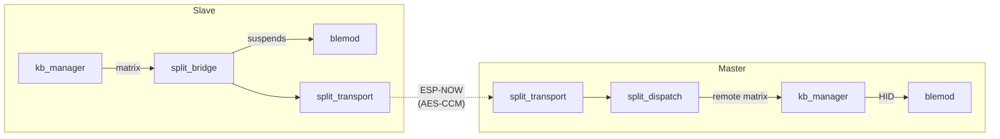

# Split Module

## Overview

The **Split Module** is responsible for transforming two independent ESP32 devices into a single, cohesive mechanical keyboard. It establishes and maintains a low-latency wireless link, handles dynamic role negotiation (Master/Slave), and provides the transparent proxying of matrix state, BLE control commands, and configuration data between the two halves.

All communication is performed over **ESP-NOW**, achieving sub-millisecond overhead for keystroke transmission while maintaining highly secure, encrypted communication between the devices.

The public API is exposed via `include/splitmod.h`, while protocol constants are in `include/split_protocol.h`. Consumers initialize the module via `splitmod_init()` and use the provided API to trigger pairing, manage roles, or read the split status.

---

## Internal Architecture

The module utilizes a **Master/Slave Proxy** model. Roles are not hardcoded to Left or Right; instead, they are negotiated dynamically upon connection. The implementation is highly modularized into a layered pipeline, with `splitmod.c` acting as a thin orchestrator.

### 1. Dynamic Role Negotiation

Roles are determined by a strict, priority-based algorithm within `split_role.c` (`split_role_decide()`). The rules are evaluated in the following order:

1. **Unsynced BLE Data**: If one half has a new BLE bond that hasn't synced to the peer, it becomes Master to prevent bond loss.
2. **USB Host Connection**: A half plugged into a USB host becomes Master, as the host expects HID reports via that physical connection.
3. **BLE Host Connection**: The half with an active BLE connection owns the wireless output path.
4. **Last Persisted Role**: The role from the previous session is maintained across reboots, preventing spurious inversions.
5. **MAC Tiebreaker**: The device with the higher MAC address wins (deterministic fallback).

The checks are provably antisymmetric, ensuring that it is impossible for both sides to adopt the same role. 

### 2. Encrypted ESP-NOW Transport & Security

Security is enforced at the transport layer (`split_transport.c` & `split_crypto.c`) using **AES-128-CCM** with robust anti-replay mechanisms:

#### Key Hierarchy (TSK-First Architecture)

| Key | Slot | Lifetime | Purpose |
|-----|------|----------|---------|
| **Paired Key** | `s_handshake_key` | NVS-persisted | Encrypts `ROLE_NEGOTIATE` and `DISCOVERY`; acts as fallback for cross-reboot reconnects. |
| **Transient Session Key (TSK)** | `s_session_key` | Per-session (in RAM) | Encrypts ALL other traffic after the first successful `ROLE_NEGOTIATE`. |

- **TSK Derivation**: A per-session key is generated after every successful `ROLE_NEGOTIATE` handshake. Both sides share a 32-bit random salt, and the TSK is derived using `SHA-256(paired_key || min(own_salt, peer_salt) || max(own_salt, peer_salt))[0:16]`. 
- **Dual-Key Decryption Fallback**: If a received packet fails to decrypt with the TSK, the transport attempts decryption with the Paired Key. This allows a freshly rebooted device (with no TSK) to successfully re-enter a session with a peer that still has a stale TSK.
- **Grace Period & Rejection**: A 1500 ms grace period follows TSK activation to absorb in-flight packets encrypted with old keys. A reactive recovery process forces a disconnect after 5 consecutive decryption failures.
- **Anti-Replay**: The packet header contains a 48-bit monotonic sequence number. The upper 16 bits act as a persistent **Sequence Epoch** (stored in NVS and incremented on boot) to prevent nonce reuse across device resets.
- **DMA Isolation**: To prevent DMA access faults (e.g., on ESP32-S3), all PSA Crypto operations utilize a 512-byte static DMA workspace in global DRAM. Stack memory is strictly avoided for cryptographic processing.

### 3. Configuration Synchronization & Fragmentation

Because the ESP-NOW payload is limited to ~236 bytes, large NVS payloads (like the configuration blob, BLE bonds, or Macro databases) are fragmented.
- **Reassembly**: Handled by `split_config_sync.c` using a 256-bit bitmap, supporting up to 255 fragments (~57 KB) per logical message. Memory buffers reside in PSRAM to conserve internal DRAM.
- **Background Writes**: Reassembled blobs are deferred and written to NVS by the background `split_task` to prevent blocking the WiFi RX task. 
- **Timeouts & ACKs**: Reassemblies time out after 2 seconds. The Master waits up to 5 seconds per configuration entry for a `CONFIG_SYNC_ACK` semaphore from the Slave before proceeding.

### 4. State-Machine Task

A dedicated FreeRTOS task (`split_task.c`) operates at ~100 Hz to drive the connection lifecycle:

| State | Tick Behavior |
|-------|---------------|
| `DISABLED` | Split feature turned off. |
| `IDLE` | Enabled, but unpaired. Waiting for pairing command. |
| `PAIRING` | Broadcasts `DISCOVERY` beacons every 500 ms. |
| `CONNECTING` | Retransmits `ROLE_NEGOTIATE` every 500 ms until an ACK is received. |
| `CONNECTED` | Sends 150 ms heartbeats, processes background NVS writes, and manages latency benchmarks. |
| `DISCONNECTED` | Reconnects with exponential backoff (500 ms → 5 s). |

---

## File Structure & Responsibilities

The module is broken into single-responsibility C files, orchestrated by `splitmod.c`.

### Core Flow
- `splitmod.c`: Public API (`splitmod_*`), event-handler registration, initialization.
- `split_session.c`: Centralizes session state (role, MACs, seq counters, RSSI, latency). 
- `split_task.c`: Main ~100 Hz state-machine task. Handles connection logic and deferred config writes.
- `split_dispatch.c`: Inbound message routing, anti-replay, and payload validation.

### Transport & Protocol
- `split_transport.c`: ESP-NOW sending/receiving, AES-CCM encrypt/decrypt, peer table management.
- `split_protocol.c`: Protocol definitions, header serialization/deserialization.
- `split_crypto.c`: X25519 ECDH and HKDF primitives.
- `split_pair.c`: Pairing FSM (`DISCOVERY` → `PAIR_REQUEST` → `PAIR_RESPONSE`).
- `split_role.c`: Priority-based role decision algorithm.

### Application Integration
- `split_bridge.c`: Links split actions with keyboard scanning and BLE module. Handles BLE role-based suspension and state handover.
- `split_sync.c`: Remote matrix state serialization (`KEY_STATE_FULL`/`KEY_STATE_DELTA`). Mutex-protected.
- `split_config_sync.c`: Fragmented NVS replication with role-aware BLE/bond sync guards.
- `split_bench.c`: RTT benchmarking via PING/PONG.
- `split_usb.c`: `MODULE_SPLIT` USB commands from the Configurator.

---

## Protocol Overview (`split_protocol.h`)

All over-the-air packets share a standard 10-byte header (Version `0x02`):
`[magic:2][proto:1][type:1][seq:6][payload:0..236][mic:4]`

### Message Types
| Type | ID | Description |
|---|---|---|
| `DISCOVERY` | `0x01` | Pairing broadcast beacon. Unencrypted. |
| `PAIR_REQUEST/RESPONSE` | `0x02`/`0x03` | X25519 key exchange. Unencrypted. |
| `ROLE_NEGOTIATE` | `0x10` | Role negotiation handshake containing live connection context. |
| `ROLE_SWAP_REQ/ACK` | `0x11`/`0x12` | Request/acknowledge role swap. |
| `KEY_STATE_FULL/DELTA` | `0x20`/`0x21` | Matrix key states. Sent from Slave to Master. |
| `HEARTBEAT` | `0x30` | Keepalive. Slave sets `sent_us`, Master echoes it identically to calculate RTT. |
| `DISCONNECT` | `0x31` | Graceful shutdown signal. |
| `CONFIG_SYNC/ACK` | `0x40`/`0x41` | NVS config data fragment. |
| `PING/PONG` | `0x50`/`0x51` | RTT benchmark probes. |
| `BLE_CMD/STATUS` | `0x60`/`0x61` | Configurator tunnel for managing BLE from the Slave via USB. |

### Heartbeat RTT Measurement
The slave transmits a `HEARTBEAT` frame containing its local time `sent_us`. The Master explicitly echoes this exact value back in its response. Upon receiving the response, the slave computes:
`RTT = now_us - sent_us` and stores `latency_us = RTT / 2`.

---

## Concurrency & Safety Notes

- **Cross-Core Sequence Allocator**: Minting sequence numbers (`split_session_next_seq()`) utilizes a `portMUX_TYPE` critical section. This prevents the transport TX context, event-bus task, and WiFi RX task from pulling identical sequence numbers across CPU cores, which would poison the anti-replay system.
- **Deferred Work Execution**: Callbacks running in the event-bus (like `on_config_updated`) cannot call `split_config_sync_push` directly, because the fragment-push retry loop blocks (`vTaskDelay`). Instead, the callback simply flips a bit mask (`s_config_sync_kind_mask`), and the `split_task` safely executes the push later.

---

## Cross-Module Integration

The split module is tightly integrated with other firmware components to ensure seamless functionality.

### Dependency Graph

### Keyboard Module
- **Slave Mode**: The slave registers `on_matrix_change` as a callback to `kb_manager`. Every physical matrix change is packaged as `SPLIT_MSG_KEY_STATE_FULL` (to avoid state corruption from dropped delta packets) and sent to the Master. Local HID output is paused. 
- **Adaptive Scan Rate**: The slave evaluates its battery level and triggers `kb_manager_set_scan_divisor()` to throttle scanning and save power. (÷1 for >30%, ÷2 for 10-30%, ÷4 for <10% battery).
- **Master Mode**: Inbound matrices are XOR-merged with the local matrix via `kb_manager_set_remote_matrix()`.

### BLE Module
- **Role-Based Suspend**: The slave suspends its BLE radio (`ble_hid_set_suspended(true)`) to prevent 2.4 GHz interference and host conflicts.
- **MAC Sharing**: When a half becomes Master, it utilizes `cfg_system.ble_shared_addr` for seamless host reconnection. `ble_hid_seed_handover_state()` is used to seamlessly transfer the host's BLE context during a role swap without breaking the connection.
- **BLE Proxying**: Configurator commands arriving via USB on the slave are tunneled to the master over `SPLIT_MSG_BLE_CMD`, maintaining the Master as the single source of truth for BLE state.

### Configuration Module
- Any change to persistent memory (`CONFIG_EVENT_KIND_UPDATED`) flags the `split_task` to propagate the update. The Master enforces strict ownership over BLE and Bond configurations, rejecting any BLE updates that might inadvertently arrive from the Slave and triggering a corrective reverse-sync instead.

---

## Public API (`include/splitmod.h`)

| Function | Description |
|---|---|
| `splitmod_init()` | Initializes transport, task, and attempts peer connection if configured. |
| `splitmod_start_pairing(timeout_ms)` | Triggers broadcast and listens for pairing attempts. |
| `splitmod_cancel_pairing()` | Aborts a pairing attempt. |
| `splitmod_unpair()` | Wipes NVS keys and disconnects from peer. |
| `splitmod_request_role_swap()` | Asks the connected peer to swap roles. |
| `splitmod_get_status()` | Returns a lock-free snapshot of current state, role, latency, and RSSI. |
| `splitmod_is_enabled()` | Evaluates if split mode is toggled on via config. |
| `splitmod_is_connected()` | Checks if the system is currently in `SPLIT_STATE_CONNECTED`. |
| `splitmod_is_link_stale()` | Determines if a heartbeat has been missed (link drop). |
| `splitmod_get_role()` | Returns `SPLIT_ROLE_MASTER` or `SPLIT_ROLE_SLAVE`. |
