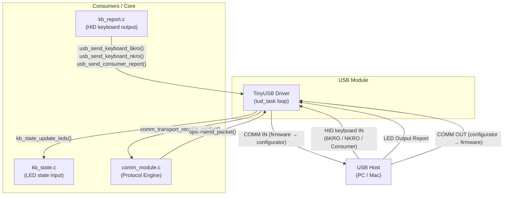

# USB Module (`usbmod`)

The `usb_module` component is the **physical wire interface** of the keyboard. It wraps TinyUSB into a clean interface that exposes exactly two things to the rest of the firmware:

1. **HID keyboard output** — sending keystrokes to the USB host.
2. **A vendor-defined communication transport** — registering with the `comm_module` to act as a transport for the wireless/wired configurator protocol.

The module itself is **deliberately dumb about what goes through the comm channel**. It does not parse configuration or care about BLE. It receives bytes via USB endpoints, forwards them to `comm_module`, and sends bytes back when `comm_module` asks it to.

---

## Directory Structure

```
components/usb_module/
├── CMakeLists.txt           
├── USB_MODULE.md            
├── usbmod.c                 # Main init, keyboard HID API, TinyUSB glue
└── include/
    ├── usbmod.h             # Public API (keyboard HID, callbacks, init)
    └── usb_descriptors.h    # USB device/config descriptors, report descriptors
```

---

## USB Interfaces

The device presents itself to the host with the following identity:

| Field        | Value       |
|--------------|-------------|
| Vendor ID    | `0x303A`    |
| Product ID   | `0x1324`    |
| Manufacturer | `Tecleados` |
| Product      | `TEF`    |
| Serial       | (Derived from MAC) |

There are **two HID interfaces**:

### Interface 0 — Keyboard (`ITF_NUM_HID_KBD`)

Unidirectional: device sends keyboard reports to the host. The host can send LED status reports back.

| Report ID | Name              | Size      | Purpose                                    |
|-----------|-------------------|-----------|--------------------------------------------|
| `1`       | `REPORT_ID_KEYBOARD` | 8 bytes | 6KRO boot keyboard (1 modifier + 6 keycodes) |
| `2`       | `REPORT_ID_NKRO`     | ~30 bytes | N-Key Rollover bitmap (231 keys = 29 bytes + modifier) |
| `4`       | `REPORT_ID_CONSUMER` | 2 bytes | Media/consumer control (volume, play, etc.) |

- **Endpoint IN**: `0x81` (`EPNUM_HID_KBD_IN`)
- Supports both boot protocol (6KRO) and report protocol (NKRO).

### Interface 1 — Comm Channel (`ITF_NUM_HID_COMM`)

Bidirectional vendor-defined channel used by the WebHID Configurator.

| Report ID | Name           | Size     | Direction       |
|-----------|----------------|----------|-----------------|
| `3`       | `REPORT_ID_COMM` | 63 bytes | Bidirectional   |

- **Endpoint IN**: `0x82` (`EPNUM_HID_COMM_IN`) — device → host
- **Endpoint OUT**: `0x02` (`EPNUM_HID_COMM_OUT`) — host → device

---

## Integration with `comm_module`

The `usb_module` acts purely as a transport adapter for the `comm_module` protocol engine.

During `usb_init()`, the module registers itself:

```c
const comm_transport_ops_t usb_ops = {
    .send_packet = usb_comm_send_packet,
    .is_ready = usb_comm_is_ready,
    .get_max_packet_size = usb_comm_get_max_packet_size
};
comm_transport_register(COMM_TRANSPORT_USB, &usb_ops);
```

When a raw HID OUT report arrives on Interface 1, the TinyUSB callback strips the report ID and directly feeds it to the `comm_module`:

```c
comm_transport_receive_packet(COMM_TRANSPORT_USB, payload, payload_len);
```

The maximum packet size for the USB transport is hardcoded to **63 bytes** (`COMM_REPORT_SIZE - 1`), bound by the HID endpoint descriptor.

---

## Task Architecture

The module runs the TinyUSB background task:

```
┌─────────────────────────────────────────────────────────────────────────┐
│  Core 1                                                                 │
│  ────────────────────────────────                                       │
│                                                                         │
│  usb_task                                                               │
│  Priority: 5 | Stack: 4 KB                                              │
│  Calls tud_task() in a tight loop                                       │
│  Drives all USB I/O                                                     │
└─────────────────────────────────────────────────────────────────────────┘
```

**`usb_task`** is pinned to **Core 1** to isolate USB I/O from application logic running on Core 0.

## Dependency Flow



The USB module does **not** route or process COMM payloads. It simply bridges the physical USB wire to the abstract `comm_module` engine.
