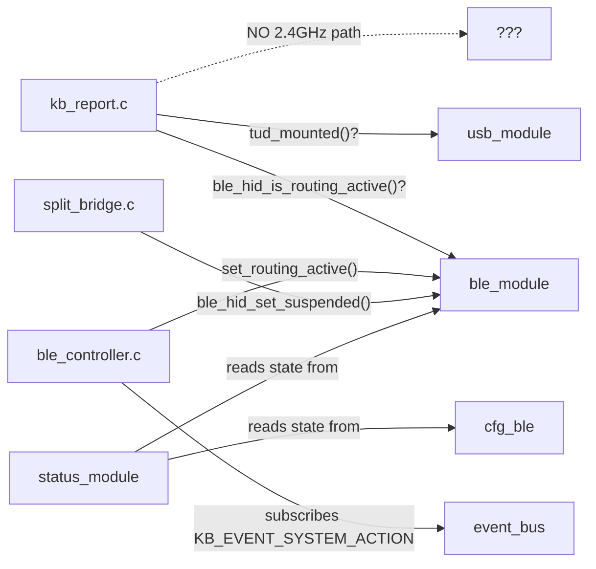
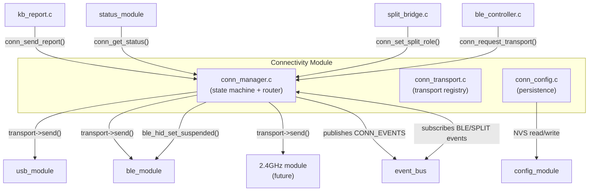
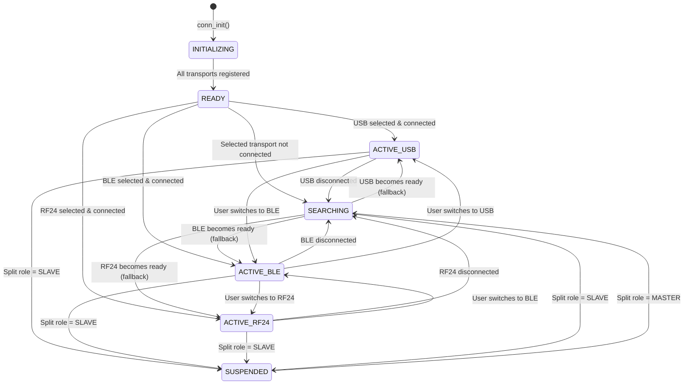

# Connectivity Module — Design Proposal


## Table of Contents

- [Problem Statement](#problem-statement)
- [Goals](#goals)
- [Non-Goals](#non-goals)
- [Current Architecture (Before)](#current-architecture-before)
- [Proposed Architecture (After)](#proposed-architecture-after)
- [Transport Model](#transport-model)
- [State Machine](#state-machine)
- [Public API](#public-api)
- [Event Contract](#event-contract)
- [Report Routing](#report-routing)
- [Split Integration](#split-integration)
- [2.4 GHz Dongle Transport](#24-ghz-dongle-transport)
- [Config Persistence](#config-persistence)
- [Init Order Impact](#init-order-impact)
- [Migration Path](#migration-path)
- [File Layout](#file-layout)
- [Open Questions](#open-questions)

---

## Problem Statement

Today, transport selection logic is **scattered across 5+ modules** with no single owner:

| Concern | Currently lives in |
|---------|-------------------|
| "Which transport gets HID reports?" | `kb_report.c` (hard-coded BLE-first check) |
| "Toggle BLE routing on/off" | `ble_controller.c` → `blemod.c` → `cfg_ble.c` |
| "Is USB connected?" | `tud_mounted()` checked inline in `kb_report.c` |
| "Selected BLE profile" | `cfg_ble.c` state struct |
| "Suspend/resume BLE on split role change" | `split_bridge.c` |
| "Push connectivity status to configurator" | `status_module.c` |

This means:

1. **No unified transport priority** — the BLE-vs-USB decision is a hard `if/else` in `kb_report.c` with no extensibility point for 2.4 GHz.
2. **No automatic fallback** — if BLE routing is ON but disconnected, reports are silently dropped instead of falling back to USB.
3. **Adding a new transport (2.4 GHz dongle)** requires touching `kb_report.c`, `ble_controller.c`, `status_module.c`, `split_bridge.c`, and `cfg_ble.c` — high risk of regressions.
4. **Split role changes trigger ad-hoc BLE suspend/resume** with no central coordination — the split module directly calls `ble_hid_set_suspended()`.
5. **Config persistence is BLE-centric** — `cfg_ble_state_t.ble_routing_enabled` is a boolean that only models "BLE vs not-BLE", not "which of N transports is active."

---

## Goals

1. **Single source of truth** for "which transport is currently delivering HID reports" — one module, one state, one API.
2. **Transport-agnostic routing** — `kb_report.c` calls into the connectivity module; it never checks USB/BLE/2.4 GHz directly.
3. **Clean extensibility** for the 2.4 GHz dongle transport without modifying existing modules.
4. **Automatic fallback** — if the selected transport loses its connection, fall back gracefully (configurable).
5. **Split-aware** — the connectivity module understands split roles and coordinates BLE suspend/resume centrally.
6. **Backward-compatible config migration** — existing `cfg_ble.ble_routing_enabled` maps cleanly to the new model.

---

## Non-Goals

- Changing the internal BLE stack (NimBLE), USB stack (TinyUSB), or ESP-NOW implementation.
- Modifying the communication protocol or configurator wire format (those adapt separately).
- Replacing the `split_bridge` module — the connectivity module *coordinates with* split, not *replaces* it.

---

## Current Architecture (Before)



**Pain points visible in the diagram:**
- `kb_report.c` has **direct dependencies** on both `ble_module` and `usb_module` internals.
- `split_bridge.c` reaches directly into `ble_module` to suspend/resume.
- There is **no node** where a 2.4 GHz transport could be inserted.
- `status_module` assembles connectivity state by pulling from multiple sources.

---

## Proposed Architecture (After)



**Key changes:**
- `kb_report.c` only calls `conn_send_report()` — it has **zero knowledge** of which transport is active.
- All transport lifecycle coordination flows through `conn_manager.c`.
- `split_bridge.c` notifies the connectivity module of role changes; the connectivity module handles BLE suspend/resume.
- A new transport (2.4 GHz) registers via `conn_transport_register()` — no existing code changes.
- `status_module` queries a single `conn_get_status()` call instead of assembling state from 3 sources.

---

## Transport Model

Each transport is represented as a **driver struct** that the connectivity module invokes polymorphically:

```c
typedef enum {
    CONN_TRANSPORT_USB,        // Always available (physically wired)
    CONN_TRANSPORT_BLE,        // Bluetooth LE HOGP
    CONN_TRANSPORT_RF24,       // 2.4 GHz ESP-NOW dongle (future)
    CONN_TRANSPORT_MAX
} conn_transport_id_t;

typedef struct {
    conn_transport_id_t id;
    const char *name;                   // "USB", "BLE", "2.4GHz"
    
    // Lifecycle
    esp_err_t (*enable)(void);          // Power on / start advertising
    esp_err_t (*disable)(void);         // Power off / stop advertising
    esp_err_t (*suspend)(void);         // Temporary pause (split role change)
    esp_err_t (*resume)(void);          // Resume from suspend
    
    // State queries
    bool (*is_available)(void);         // Hardware present + enabled in config?
    bool (*is_connected)(void);         // Host is actively connected?
    bool (*is_ready)(void);             // Can accept a HID report right now?
    
    // Report delivery
    esp_err_t (*send_keyboard)(const uint8_t *report, size_t len);
    esp_err_t (*send_nkro)(uint8_t modifier, const uint8_t *bitmap, size_t len);
    esp_err_t (*send_consumer)(uint16_t keycode);
} conn_transport_ops_t;
```

### Transport Driver Implementations

Each existing module provides a thin **adapter** that fills in this struct:

```c
// In conn_transport_usb.c (lives inside connectivity_module/)
static const conn_transport_ops_t s_usb_ops = {
    .id           = CONN_TRANSPORT_USB,
    .name         = "USB",
    .enable       = usb_transport_enable,     // no-op (always on)
    .disable      = usb_transport_disable,    // no-op
    .suspend      = usb_transport_suspend,    // no-op
    .resume       = usb_transport_resume,     // no-op
    .is_available = usb_transport_available,  // return tud_mounted()
    .is_connected = usb_transport_connected,  // return tud_mounted() && tud_hid_n_ready(0)
    .is_ready     = usb_transport_ready,      // return tud_hid_n_ready(0)
    .send_keyboard = usb_transport_send_kbd,
    .send_nkro    = usb_transport_send_nkro,
    .send_consumer = usb_transport_send_consumer,
};
```

```c
// In conn_transport_ble.c
static const conn_transport_ops_t s_ble_ops = {
    .id           = CONN_TRANSPORT_BLE,
    .name         = "BLE",
    .enable       = ble_transport_enable,     // ble_hid_set_routing_active(true)
    .disable      = ble_transport_disable,    // ble_hid_set_routing_active(false)
    .suspend      = ble_transport_suspend,    // ble_hid_set_suspended(true)
    .resume       = ble_transport_resume,     // ble_hid_set_suspended(false)
    .is_available = ble_transport_available,  // cfg_system.bluetooth_enabled
    .is_connected = ble_transport_connected,  // ble_hid_is_connected()
    .is_ready     = ble_transport_ready,      // ble_hid_is_connected()
    .send_keyboard = ble_transport_send_kbd,  // NKRO→6KRO conversion + ble_hid_send_keyboard_report()
    .send_nkro    = NULL,                     // BLE doesn't support NKRO
    .send_consumer = ble_transport_send_consumer,
};
```

> **Note:** The USB and BLE modules **keep their existing public APIs unchanged**. The transport adapters are thin wrappers inside the connectivity module that call into them. No invasive changes to `blemod.c` or `usbmod.c`.

---

## State Machine

The connectivity module runs a single state machine that manages the **active transport**:



### State Descriptions

| State | Meaning |
|-------|---------|
| `INITIALIZING` | Module init in progress, transports registering |
| `READY` | All transports registered, no user selection yet |
| `ACTIVE_*` | HID reports are being delivered via the named transport |
| `SEARCHING` | User's preferred transport is unavailable; trying fallback order |
| `SUSPENDED` | This half is a split slave — all host communication paused |

### Fallback Behavior

When the selected transport disconnects, the connectivity module enters `SEARCHING` and attempts fallback in a configurable priority order:

```c
// Default priority (user-configurable)
static const conn_transport_id_t s_fallback_order[] = {
    CONN_TRANSPORT_BLE,    // Priority 1: BLE (wireless preferred)
    CONN_TRANSPORT_RF24,   // Priority 2: 2.4 GHz dongle
    CONN_TRANSPORT_USB,    // Priority 3: USB (always available)
};
```

> **Important:** Fallback is **optional and configurable**. If the user wants strict "BLE only, never fall back to USB" behavior (matching today's behavior), they can disable fallback. The default should match current behavior for backward compatibility.

### Fallback Configuration

```c
typedef enum {
    CONN_FALLBACK_NONE,       // Never fall back (current behavior)
    CONN_FALLBACK_AUTO,       // Auto-switch to next available transport
    CONN_FALLBACK_USB_ONLY,   // Fall back to USB only (safe default)
} conn_fallback_mode_t;
```

**Default: `CONN_FALLBACK_NONE`** — preserving backward compatibility.

---

## Public API

```c
// ──────────────────────────────────────────────
// Lifecycle
// ──────────────────────────────────────────────
esp_err_t conn_init(void);     // Register transports, load config, subscribe events

// ──────────────────────────────────────────────
// Transport selection (called by ble_controller.c replacements / system actions)
// ──────────────────────────────────────────────
esp_err_t conn_request_transport(conn_transport_id_t id);    // "I want to use BLE"
esp_err_t conn_toggle_transport(conn_transport_id_t id);     // Toggle between current and id
conn_transport_id_t conn_get_active_transport(void);         // What's active right now?

// ──────────────────────────────────────────────
// Report delivery (called by kb_report.c)
// ──────────────────────────────────────────────
bool      conn_hid_ready(void);                                         // Is active transport ready?
esp_err_t conn_send_keyboard_report(const uint8_t *nkro_bitmap);        // Route to active transport
esp_err_t conn_send_consumer_report(uint16_t keycode);                  // Route to active transport

// ──────────────────────────────────────────────
// State queries (called by status_module, configurator, etc.)
// ──────────────────────────────────────────────
conn_status_t     conn_get_status(void);         // Full snapshot of connectivity state
conn_state_t      conn_get_state(void);          // Current state machine state
bool              conn_is_transport_available(conn_transport_id_t id);
bool              conn_is_transport_connected(conn_transport_id_t id);

// ──────────────────────────────────────────────
// Split coordination (called by split_bridge.c)
// ──────────────────────────────────────────────
esp_err_t conn_set_split_role(split_role_t role);   // MASTER → resume, SLAVE → suspend all

// ──────────────────────────────────────────────
// Transport registration (called during init by transport adapters)
// ──────────────────────────────────────────────
esp_err_t conn_transport_register(const conn_transport_ops_t *ops);

// ──────────────────────────────────────────────
// BLE profile operations (pass-through, keeps BLE profile logic in ble_module)
// ──────────────────────────────────────────────
esp_err_t conn_ble_profile_pair(uint8_t profile_id);
esp_err_t conn_ble_profile_select(uint8_t profile_id);
esp_err_t conn_ble_profile_toggle(uint8_t profile_id);
```

### Status Snapshot Struct

```c
typedef struct {
    conn_state_t          state;              // Current state machine state
    conn_transport_id_t   active_transport;   // Which transport is routing reports
    conn_transport_id_t   preferred_transport; // User's preferred transport
    conn_fallback_mode_t  fallback_mode;      // Current fallback policy
    
    // Per-transport status
    struct {
        bool available;    // Hardware present + enabled
        bool connected;    // Host connected
        bool ready;        // Can send right now
    } transports[CONN_TRANSPORT_MAX];
    
    // BLE-specific (exposed for status_module backward compat)
    uint8_t  ble_selected_profile;
    int8_t   ble_pairing_profile;     // -1 = none
    uint16_t ble_connected_bitmap;
    
    // Split
    split_role_t split_role;
} conn_status_t;
```

---

## Event Contract

### New Event Base: `CONN_EVENTS`

```c
ESP_EVENT_DECLARE_BASE(CONN_EVENTS);

typedef enum {
    // Transport lifecycle
    CONN_EVENT_TRANSPORT_CHANGED,     // payload: conn_transport_changed_t
    CONN_EVENT_TRANSPORT_CONNECTED,   // payload: conn_transport_id_t
    CONN_EVENT_TRANSPORT_DISCONNECTED,// payload: conn_transport_id_t
    
    // State machine transitions
    CONN_EVENT_STATE_CHANGED,         // payload: conn_state_changed_t
    
    // Fallback
    CONN_EVENT_FALLBACK_ACTIVATED,    // payload: conn_fallback_event_t
} conn_event_id_t;

typedef struct {
    conn_transport_id_t from;
    conn_transport_id_t to;
} conn_transport_changed_t;

typedef struct {
    conn_state_t from;
    conn_state_t to;
} conn_state_changed_t;

typedef struct {
    conn_transport_id_t preferred;    // What the user wanted
    conn_transport_id_t fell_back_to; // What we actually connected to
} conn_fallback_event_t;
```

### Events This Module Subscribes To

| Event | Source | Reaction |
|-------|--------|----------|
| `BLE_EVENT_PROFILE_CONNECTED` | `blemod` | Update BLE transport → `is_connected` = true |
| `BLE_EVENT_PROFILE_DISCONNECTED` | `blemod` | Update BLE transport; trigger fallback if was active |
| `BLE_EVENT_ROUTING_CHANGED` | `blemod` | Sync internal state |
| `BLE_EVENT_PAIRING_*` | `blemod` | Update pairing status for `conn_get_status()` |
| `SPLIT_EVENT_ROLE_CHANGED` | `splitmod` | Call `conn_set_split_role()` internally |
| `SPLIT_EVENT_BLE_STATUS_UPDATED` | `splitmod` | Mirror master's BLE state (on slave) |
| `CONFIG_EVENT_KIND_UPDATED` | `cfgmod` | Reload connectivity config from NVS |

### Events This Module Replaces

The connectivity module **absorbs** some responsibilities currently handled by direct event subscriptions:

| Old pattern | New pattern |
|-------------|-------------|
| `status_module` subscribes to `BLE_EVENTS` for transport mode | `status_module` subscribes to `CONN_EVENTS` |
| `ble_controller` subscribes to `KB_EVENT_SYSTEM_ACTION` | Connectivity module subscribes, delegates BLE profile ops |
| `split_bridge` calls `ble_hid_set_suspended()` directly | `split_bridge` calls `conn_set_split_role()` |

---

## Report Routing

### New `kb_report.c` (simplified)

```c
// BEFORE (current):
bool kb_hid_ready(void) {
    if (ble_hid_is_routing_active()) {
        return ble_hid_is_connected();
    }
    return tud_mounted() && tud_hid_n_ready(ITF_NUM_HID_KBD);
}

esp_err_t kb_send_report(const uint8_t *v_nkro) {
    if (ble_hid_is_routing_active()) {
        // Convert NKRO → 6KRO, call ble_hid_send_keyboard_report()
    } else {
        // Call usb_send_keyboard_*()
    }
}

// AFTER (proposed):
bool kb_hid_ready(void) {
    return conn_hid_ready();
}

esp_err_t kb_send_report(const uint8_t *v_nkro) {
    return conn_send_keyboard_report(v_nkro);
}

esp_err_t kb_send_consumer_report(uint16_t keycode) {
    return conn_send_consumer_report(keycode);
}
```

> **Tip:** `kb_report.c` goes from ~120 lines of transport-aware logic to ~15 lines of delegation. It becomes a pure pass-through, and could eventually be eliminated entirely — the keyboard module could call `conn_send_report()` directly.

### Internal Routing Logic in `conn_manager.c`

```c
esp_err_t conn_send_keyboard_report(const uint8_t *nkro_bitmap) {
    const conn_transport_ops_t *t = s_active_transport;
    if (!t || !t->is_ready()) {
        return ESP_ERR_INVALID_STATE;
    }
    
    // NKRO support depends on transport capabilities
    if (t->send_nkro) {
        uint8_t mod = extract_modifier(nkro_bitmap);
        return t->send_nkro(mod, nkro_bitmap + 1, NKRO_BITMAP_LEN);
    } else {
        // Convert NKRO → 6KRO for transports that don't support it (BLE, RF24)
        uint8_t report[8];
        nkro_to_6kro(nkro_bitmap, report);
        return t->send_keyboard(report, sizeof(report));
    }
}
```

---

## Split Integration

The split module currently reaches into `ble_module` directly. With the connectivity module, the interaction is cleaner:

### Current Flow (Before)

```
split_bridge.c  ──→  ble_hid_set_suspended(true)   // Direct call
split_bridge.c  ──→  ble_hid_set_suspended(false)   // Direct call
split_bridge.c  ──→  ble_hid_seed_handover_state()  // Direct call
```

### Proposed Flow (After)

```
split_bridge.c  ──→  conn_set_split_role(SLAVE)     // Connectivity module suspends ALL transports
split_bridge.c  ──→  conn_set_split_role(MASTER)    // Connectivity module resumes active transport
```

```c
esp_err_t conn_set_split_role(split_role_t role) {
    if (role == SPLIT_ROLE_SLAVE) {
        // Suspend all transports
        for (int i = 0; i < CONN_TRANSPORT_MAX; i++) {
            if (s_transports[i] && s_transports[i]->suspend) {
                s_transports[i]->suspend();
            }
        }
        s_state = CONN_STATE_SUSPENDED;
    } else if (role == SPLIT_ROLE_MASTER) {
        // Resume preferred transport, start reconnection
        resume_preferred_transport();
        s_state = CONN_STATE_SEARCHING;
    }
    publish_state_change();
    return ESP_OK;
}
```

> **Important:** BLE-specific split coordination (bond sync, handover state seeding, connection bitmap mirroring) stays in `split_bridge.c`. The connectivity module only handles the **transport lifecycle** (suspend/resume/select). This keeps the boundary clean.

### Role Swap Handover

During a role swap, the connectivity module participates:

```
1. split_bridge detects role swap
2. split_bridge calls conn_set_split_role(SLAVE)     → connectivity suspends all
3. split_bridge exchanges handover state with peer (bonds, bitmap, selected profile)  
4. peer's split_bridge calls conn_set_split_role(MASTER) → connectivity resumes
5. connectivity module picks up preferred transport and starts reconnecting
```

The `ble_hid_seed_handover_state()` call still happens in `split_bridge.c` **before** step 4, so the BLE module has the right state when connectivity resumes it.

---

## 2.4 GHz Dongle Transport

The 2.4 GHz ESP-NOW dongle is a roadmap item. With the connectivity module in place, adding it becomes a self-contained task:

### Integration Points

```c
// In conn_transport_rf24.c (future)
static const conn_transport_ops_t s_rf24_ops = {
    .id           = CONN_TRANSPORT_RF24,
    .name         = "2.4GHz",
    .enable       = rf24_enable,         // Start ESP-NOW in dongle mode
    .disable      = rf24_disable,
    .suspend      = rf24_suspend,
    .resume       = rf24_resume,
    .is_available = rf24_available,      // Dongle paired?
    .is_connected = rf24_connected,      // Dongle responding to pings?
    .is_ready     = rf24_ready,
    .send_keyboard = rf24_send_kbd,
    .send_nkro    = NULL,               // 6KRO only over ESP-NOW (bandwidth)
    .send_consumer = rf24_send_consumer,
};

// Registration during init:
conn_transport_register(&s_rf24_ops);
```

### Coexistence with Split

> **Warning:** Both Split and RF24 Dongle use **ESP-NOW over the 2.4 GHz radio**. They cannot operate simultaneously on the same radio channel without careful coordination.

Possible strategies:
1. **Mutual exclusion**: If split is enabled, RF24 dongle is unavailable (simplest).
2. **Time-division**: Split gets priority; RF24 reports are queued during split traffic.
3. **Channel separation**: Split on channel A, dongle on channel B (if hardware supports it).

For the initial implementation, **mutual exclusion** is recommended — split keyboards don't need a dongle because the master half already handles host communication.

---

## Config Persistence

### New Config Kind: `CFGMOD_KIND_CONNECTIVITY`

```c
typedef struct {
    conn_transport_id_t preferred_transport;    // User's preferred transport
    conn_fallback_mode_t fallback_mode;         // Fallback behavior
    conn_transport_id_t fallback_order[CONN_TRANSPORT_MAX]; // Priority list
    bool transport_enabled[CONN_TRANSPORT_MAX]; // Per-transport enable/disable
} conn_config_t;
```

**NVS namespace:** `cfg` (shared), **key:** `k5_conn`

### Migration from `cfg_ble`

The existing `ble_routing_enabled` field maps directly:

```c
// Migration logic in conn_config.c
if (legacy_cfg_ble.ble_routing_enabled) {
    conn_config.preferred_transport = CONN_TRANSPORT_BLE;
} else {
    conn_config.preferred_transport = CONN_TRANSPORT_USB;
}
conn_config.fallback_mode = CONN_FALLBACK_NONE; // Preserve current behavior
```

> **Note:** `cfg_ble_state_t.ble_routing_enabled` is **kept for backward compatibility** during migration. The connectivity module reads it on first boot, writes its own config, and from then on is the source of truth. The `ble_routing_enabled` field becomes a derived/synced value.

---

## Init Order Impact

### Current Init Order

```
event_bus → button → cfg → rgb → usb → ble → ble_controller → status → split → keyboard
```

### Proposed Init Order

```
event_bus → button → cfg → rgb → usb → ble → conn_init() → status → split → keyboard
                                               ▲
                                               │ Replaces ble_controller_init()
                                               │ Registers USB/BLE transports
                                               │ Loads conn_config from NVS
                                               │ Subscribes to BLE/SPLIT/CONFIG events
                                               │ Subscribes to KB_EVENT_SYSTEM_ACTION
```

- `conn_init()` replaces `ble_controller_init()` in the init sequence.
- `conn_init()` must be called **after** `usb_init()` and `ble_hid_init()` so transport adapters can query their stacks.
- `conn_init()` must be called **before** `kb_manager_start()` so report routing is ready when scanning begins.

---

## Migration Path

This is a significant architectural change. A phased approach reduces risk:

### Phase 1 — Facade (Low risk)

1. Create `connectivity_module/` with the public API.
2. Internal implementation **delegates to existing code** — `conn_send_report()` calls the existing `kb_report.c` logic.
3. `kb_report.c` is unchanged; new callers (e.g., a future module) use `conn_*()`.
4. `ble_controller.c` logic moves into `conn_manager.c` (system action subscription).
5. Add `CONN_EVENTS` on top of existing events (additive, not replacing).

### Phase 2 — Inversion (Medium risk)

1. `kb_report.c` is simplified to call `conn_send_report()`.
2. Transport adapters (`conn_transport_usb.c`, `conn_transport_ble.c`) encapsulate the routing logic.
3. `split_bridge.c` calls `conn_set_split_role()` instead of `ble_hid_set_suspended()`.
4. `status_module` switches to `CONN_EVENTS` for transport state.
5. Config migration: `cfg_ble.ble_routing_enabled` → `conn_config.preferred_transport`.

### Phase 3 — Extension (Low risk)

1. Add `conn_transport_rf24.c` for the 2.4 GHz dongle.
2. Add fallback logic (configurable).
3. Configurator UI adds transport selector panel.

---

## File Layout

```
components/connectivity_module/
├── CMakeLists.txt
├── CONNECTIVITY_MODULE.md                 # Module documentation
├── include/
│   ├── conn_manager.h                     # Public API (lifecycle, routing, queries)
│   ├── conn_transport.h                   # Transport ops struct + registration
│   ├── conn_events.h                      # CONN_EVENTS definitions
│   └── conn_types.h                       # Shared types (states, configs, status)
├── conn_manager.c                         # State machine, event subscriptions, routing
├── conn_config.c                          # NVS persistence, migration from cfg_ble
├── conn_transport.c                       # Transport registry
├── conn_transport_usb.c                   # USB transport adapter
├── conn_transport_ble.c                   # BLE transport adapter
└── conn_transport_rf24.c                  # 2.4 GHz adapter (stub/future)
```

---

## Open Questions

| # | Question | Options | Recommendation |
|---|----------|---------|----------------|
| 1 | **Should fallback be enabled by default?** | (a) No — match current behavior exactly, (b) Yes — USB as last resort | **(a)** for backward compat; users opt-in |
| 2 | **Should `kb_report.c` be eliminated entirely?** | (a) Keep as thin wrapper, (b) Keyboard module calls `conn_*()` directly | **(a)** — less churn in Phase 2 |
| 3 | **Where does the NKRO→6KRO conversion live?** | (a) In each transport adapter, (b) In `conn_manager.c` centrally | **(b)** — one conversion, all transports benefit |
| 4 | **Should `ble_controller.c` be deleted or kept?** | (a) Delete — its logic moves into `conn_manager.c`, (b) Keep as glue | **(a)** — it's 60 lines, all migrating |
| 5 | **RF24 + Split mutual exclusion or coexistence?** | (a) Mutual exclusion, (b) Coexistence | **(a)** for v1 — split master handles host output anyway |
| 6 | **Should the connectivity module own BLE profile selection?** | (a) Yes — `conn_ble_profile_select()`, (b) No — profile ops stay in `blemod` | **(a)** — it's pass-through but gives one API surface |
| 7 | **Config sync between split halves?** | (a) Sync `conn_config` like other config kinds, (b) Per-half independent | **(a)** — transport preference should be consistent |

---

## Summary

The Connectivity Module introduces a **single orchestration layer** between the keyboard pipeline and the physical transports. It:

- **Centralizes** the "which transport?" decision in one state machine.
- **Abstracts** transports behind a uniform `conn_transport_ops_t` driver interface.
- **Enables** the 2.4 GHz dongle transport as a clean addition (no existing code changes).
- **Coordinates** split role changes and BLE suspend/resume from one place.
- **Simplifies** `kb_report.c` from transport-aware routing to a one-line delegation.
- **Preserves** backward compatibility through phased migration and config translation.

The key architectural principle: **transport modules (USB, BLE, RF24) keep their internal complexity, but the decision of which one is active belongs to exactly one module.**
