# Connectivity Module — Implementation Plan

> Exhaustive step-by-step blueprint for implementing the architecture described in [CONNECTIVITY_MODULE_DESIGN.md](file:///home/srleg/Projects/Tecleados-ESP-Firmware/ideas/connectivity_module/CONNECTIVITY_MODULE_DESIGN.md).

---

## Table of Contents

- [Guiding Principles](#guiding-principles)
- [Terminology](#terminology)
- [Key Design Clarification: USB COMMS Channel](#key-design-clarification-usb-comms-channel)
- [Phased Rollout Summary](#phased-rollout-summary)
- [Phase 1 — Foundation & Facade](#phase-1--foundation--facade)
  - [1.1 Create Component Skeleton](#11-create-component-skeleton)
  - [1.2 Core Type System (`conn_types.h`)](#12-core-type-system-conn_typesh)
  - [1.3 Event Definitions (`conn_events.h`)](#13-event-definitions-conn_eventsh)
  - [1.4 Transport Interface (`conn_transport.h`)](#14-transport-interface-conn_transporth)
  - [1.5 Transport Registry (`conn_transport.c`)](#15-transport-registry-conn_transportc)
  - [1.6 USB Transport Adapter (`conn_transport_usb.c`)](#16-usb-transport-adapter-conn_transport_usbc)
  - [1.7 BLE Transport Adapter (`conn_transport_ble.c`)](#17-ble-transport-adapter-conn_transport_blec)
  - [1.8 RF24 Transport Stub (`conn_transport_rf24.c`)](#18-rf24-transport-stub-conn_transport_rf24c)
  - [1.9 Config Persistence (`conn_config.c`)](#19-config-persistence-conn_configc)
  - [1.10 Core State Machine (`conn_manager.c`)](#110-core-state-machine-conn_managerc)
  - [1.11 Public API Header (`conn_manager.h`)](#111-public-api-header-conn_managerh)
  - [1.12 Absorb `ble_controller.c`](#112-absorb-ble_controllerc)
  - [1.13 Register `CONN_EVENTS` in Event Bus](#113-register-conn_events-in-event-bus)
  - [1.14 Update `main.c` Init Order](#114-update-mainc-init-order)
  - [1.15 Build Integration (`CMakeLists.txt`)](#115-build-integration-cmakeliststxt)
  - [1.16 Phase 1 Verification](#116-phase-1-verification)
- [Phase 2 — Inversion (Report Routing Migration)](#phase-2--inversion-report-routing-migration)
  - [2.1 Rewrite `kb_report.c`](#21-rewrite-kb_reportc)
  - [2.2 Migrate `split_bridge.c`](#22-migrate-split_bridgec)
  - [2.3 Migrate `status_module`](#23-migrate-status_module)
  - [2.4 Config Migration (`cfg_ble` → `conn_config`)](#24-config-migration-cfg_ble--conn_config)
  - [2.5 Update Configurator Protocol](#25-update-configurator-protocol)
  - [2.6 Phase 2 Verification](#26-phase-2-verification)
- [Phase 3 — Extension (2.4 GHz Dongle)](#phase-3--extension-24-ghz-dongle)
  - [3.1 Implement RF24 Transport Driver](#31-implement-rf24-transport-driver)
  - [3.2 Fallback Logic Implementation](#32-fallback-logic-implementation)
  - [3.3 Configurator Transport Selector](#33-configurator-transport-selector)
  - [3.4 Phase 3 Verification](#34-phase-3-verification)
- [Cross-Cutting Concerns](#cross-cutting-concerns)
  - [Thread Safety](#thread-safety)
  - [Memory Budget](#memory-budget)
  - [Error Handling](#error-handling)
  - [Logging Strategy](#logging-strategy)
- [Open Questions Resolution](#open-questions-resolution)
- [Risk Matrix](#risk-matrix)
- [File Change Manifest](#file-change-manifest)
- [Testing Strategy](#testing-strategy)

---

## Guiding Principles

1. **Zero functional regression** — After each phase, the keyboard must behave identically to today. No keystroke may be lost, no latency added to the report path.
2. **Additive before destructive** — New code is added alongside old code first. Old code is removed only after the new path is proven.
3. **USB COMMS always available** — The USB comm channel (Interface 1, Report ID 3) for the web configurator is **never** gated by transport selection. Even when the active HID report transport is BLE, the USB comm pipe remains fully functional. Transport selection only governs *HID report routing* (keyboard, NKRO, consumer).
4. **Minimal module surgery** — `blemod.c`, `usbmod.c`, and `split_*.c` internals are not modified. The connectivity module wraps them; it does not invade them.
5. **One owner per decision** — After Phase 2, "which transport gets HID reports?" is answered in exactly one place: `conn_manager.c`.

---

## Terminology

| Term | Meaning |
|------|---------|
| **Transport** | A physical medium that can carry HID reports to a host (USB, BLE, RF24) |
| **COMMS Channel** | The USB HID Interface 1 bidirectional pipe used for the web configurator protocol. **Not** a transport — it never carries HID keyboard reports |
| **Active transport** | The single transport currently receiving HID reports from the keyboard pipeline |
| **Preferred transport** | The user's configured default transport (persisted in NVS) |
| **Fallback** | Automatic switch to a lower-priority transport when the preferred one disconnects |
| **Routing** | The decision of which transport gets a given HID report |

---

## Key Design Clarification: USB COMMS Channel

> [!IMPORTANT]
> **USB has two completely independent roles that must not be conflated:**
>
> 1. **USB as HID Report Transport** (Interface 0) — Keyboard/NKRO/Consumer reports. This is what transport selection controls.
> 2. **USB as COMMS Channel** (Interface 1) — Web configurator protocol. This is **always active** whenever the USB cable is physically connected, regardless of which transport is selected for HID reports.
>
> When the user selects BLE as the active transport and the USB cable is connected:
> - ❌ No HID keyboard reports are sent over USB Interface 0
> - ✅ The COMMS channel (Interface 1) remains fully operational for the web configurator
>
> This means the connectivity module's `conn_transport_usb.c` adapter only wraps the **HID report functions** (`usb_send_keyboard_6kro`, `usb_send_keyboard_nkro`, `usb_send_consumer_report`). It must **never** touch the COMMS channel, which continues to operate independently through `usbmod_register_callback()` and the existing USB processing pipeline.
>
> The TinyUSB stack itself, the USB task, and all COMMS-related tasks (`usb_processing_task`, `usb_tx_task`, `timeouts_task`) remain untouched and always running.

### Implication for Transport State Queries

```
USB Transport:
  is_available()  → tud_mounted()                        (USB cable connected)
  is_connected()  → tud_mounted() && tud_hid_n_ready(0)  (Interface 0 keyboard endpoint)
  is_ready()      → tud_hid_n_ready(0)                   (Can send on Interface 0)

USB COMMS Channel:
  Always runs independently via usb_processing_task.
  Not part of transport selection. Not gated by conn_manager.
  Works whenever tud_mounted() is true, regardless of active transport.
```

---

## Phased Rollout Summary

```mermaid
gantt
    title Connectivity Module Rollout
    dateFormat X
    axisFormat %s
    
    section Phase 1 — Foundation
    Component skeleton & types    :p1a, 0, 1
    Transport interface & registry :p1b, 1, 2
    USB adapter                   :p1c, 2, 3
    BLE adapter                   :p1d, 2, 3
    RF24 stub                     :p1e, 3, 4
    Config persistence            :p1f, 3, 4
    State machine (conn_manager)  :p1g, 4, 6
    Absorb ble_controller         :p1h, 6, 7
    Event bus integration         :p1i, 7, 8
    main.c + CMakeLists           :p1j, 8, 9
    Phase 1 verification          :milestone, p1v, 9, 9
    
    section Phase 2 — Inversion
    Rewrite kb_report.c           :p2a, 9, 10
    Migrate split_bridge          :p2b, 10, 11
    Migrate status_module         :p2c, 11, 12
    Config migration              :p2d, 12, 13
    Configurator protocol update  :p2e, 13, 14
    Phase 2 verification          :milestone, p2v, 14, 14
    
    section Phase 3 — Extension
    RF24 driver implementation    :p3a, 14, 16
    Fallback logic                :p3b, 16, 17
    Configurator transport UI     :p3c, 17, 18
    Phase 3 verification          :milestone, p3v, 18, 18
```



---

## Phase 1 — Foundation & Facade

**Goal:** Create the `connectivity_module` component with its full public API, type system, transport registry, and state machine. Wire it into the init sequence. At the end of Phase 1, the new module is running alongside the old code — it subscribes to events and maintains state, but `kb_report.c` still uses the old routing logic directly. No behavior changes.

### 1.1 Create Component Skeleton

Create the directory structure under `components/`:

```
components/connectivity_module/
├── CMakeLists.txt
├── CONNECTIVITY_MODULE.md
├── include/
│   ├── conn_manager.h
│   ├── conn_transport.h
│   ├── conn_events.h
│   └── conn_types.h
├── conn_manager.c
├── conn_config.c
├── conn_transport.c
├── conn_transport_usb.c
├── conn_transport_ble.c
└── conn_transport_rf24.c
```

**`CMakeLists.txt`:**

```cmake
idf_component_register(
    SRCS "conn_manager.c"
         "conn_config.c"
         "conn_transport.c"
         "conn_transport_usb.c"
         "conn_transport_ble.c"
         "conn_transport_rf24.c"
    INCLUDE_DIRS "include"
    REQUIRES event_bus config_module usb_module ble_module split
)
```

> [!NOTE]
> The `REQUIRES` list declares build-time dependencies. The connectivity module needs:
> - `event_bus` — for subscribing/publishing events
> - `config_module` — for NVS persistence and `cfgmod_register_kind`
> - `usb_module` — for `tud_mounted()`, `usb_send_*` functions
> - `ble_module` — for `ble_hid_*` functions
> - `split` — for `split_role_t`, `splitmod_get_role()`

---

### 1.2 Core Type System (`conn_types.h`)

This header defines all shared types used across the module. No function declarations — purely data types.

```c
#pragma once

#include <stdbool.h>
#include <stdint.h>

/* =========================================================================
 * Transport identification
 * ========================================================================= */

typedef enum {
    CONN_TRANSPORT_USB = 0,    // Always available (physically wired)
    CONN_TRANSPORT_BLE,        // Bluetooth LE HOGP
    CONN_TRANSPORT_RF24,       // 2.4 GHz ESP-NOW dongle (future)
    CONN_TRANSPORT_MAX
} conn_transport_id_t;

/* =========================================================================
 * State machine states
 * ========================================================================= */

typedef enum {
    CONN_STATE_INITIALIZING = 0,  // Module init in progress
    CONN_STATE_READY,             // Transports registered, no user selection yet
    CONN_STATE_ACTIVE,            // HID reports being delivered via active transport
    CONN_STATE_SEARCHING,         // Preferred transport unavailable, trying fallback
    CONN_STATE_SUSPENDED,         // Split slave — all host communication paused
} conn_state_t;

/* =========================================================================
 * Fallback configuration
 * ========================================================================= */

typedef enum {
    CONN_FALLBACK_NONE = 0,     // Never fall back (matches current behavior)
    CONN_FALLBACK_AUTO,         // Auto-switch to next available transport
    CONN_FALLBACK_USB_ONLY,     // Fall back to USB only (safe default for future)
} conn_fallback_mode_t;

/* =========================================================================
 * Persisted configuration
 * ========================================================================= */

typedef struct {
    conn_transport_id_t   preferred_transport;               // User's desired transport
    conn_fallback_mode_t  fallback_mode;                     // Fallback behavior
    conn_transport_id_t   fallback_order[CONN_TRANSPORT_MAX]; // Priority list
    bool                  transport_enabled[CONN_TRANSPORT_MAX]; // Per-transport on/off
} conn_config_t;

/* =========================================================================
 * Status snapshot (returned by conn_get_status)
 * ========================================================================= */

typedef struct {
    conn_state_t          state;              // Current state machine state
    conn_transport_id_t   active_transport;   // Which transport is routing reports
    conn_transport_id_t   preferred_transport; // User's preferred transport
    conn_fallback_mode_t  fallback_mode;      // Current fallback policy

    // Per-transport status
    struct {
        bool available;   // Hardware present + enabled
        bool connected;   // Host connected
        bool ready;       // Can send right now
    } transports[CONN_TRANSPORT_MAX];

    // BLE-specific (exposed for status_module backward compat)
    uint8_t  ble_selected_profile;
    int8_t   ble_pairing_profile;     // -1 = none
    uint16_t ble_connected_bitmap;

    // Split
    uint8_t  split_role;   // split_role_t stored as uint8_t to avoid header dep
} conn_status_t;
```

**Design rationale:**

- `conn_transport_id_t` uses a simple enum starting at 0 so it can index into arrays directly (e.g., `s_transports[id]`, `transport_enabled[id]`).
- `CONN_TRANSPORT_USB` is index 0 because it is always present — no `NULL` check needed when falling back to USB.
- BLE-specific fields are included in `conn_status_t` for backward compatibility with `status_module`. This avoids a separate query — `conn_get_status()` returns everything in one snapshot.
- `split_role` is `uint8_t` to avoid pulling `splitmod.h` into this header. The caller casts as needed.

---

### 1.3 Event Definitions (`conn_events.h`)

```c
#pragma once

#include "esp_event.h"
#include "conn_types.h"

/* =========================================================================
 * CONN_EVENTS base
 * ========================================================================= */

ESP_EVENT_DECLARE_BASE(CONN_EVENTS);

/* =========================================================================
 * Event IDs
 * ========================================================================= */

typedef enum {
    // Transport lifecycle
    CONN_EVENT_TRANSPORT_CHANGED = 0, // payload: conn_transport_changed_t
    CONN_EVENT_TRANSPORT_CONNECTED,   // payload: conn_transport_id_t
    CONN_EVENT_TRANSPORT_DISCONNECTED,// payload: conn_transport_id_t
    
    // State machine transitions
    CONN_EVENT_STATE_CHANGED,         // payload: conn_state_changed_t
    
    // Fallback
    CONN_EVENT_FALLBACK_ACTIVATED,    // payload: conn_fallback_event_t
} conn_event_id_t;

/* =========================================================================
 * Event payloads
 * ========================================================================= */

typedef struct {
    conn_transport_id_t from;
    conn_transport_id_t to;
} conn_transport_changed_t;

typedef struct {
    conn_state_t from;
    conn_state_t to;
} conn_state_changed_t;

typedef struct {
    conn_transport_id_t preferred;     // What the user wanted
    conn_transport_id_t fell_back_to;  // What we actually connected to
} conn_fallback_event_t;
```

**This header is added to the `event_bus` `REQUIRES` so any module can subscribe to `CONN_EVENTS` without depending on the full `connectivity_module`.**

However, since event bases need to live in a common location and `CONN_EVENTS` is a new event domain, we have two options:

> [!IMPORTANT]
> **Option A (recommended):** Define `CONN_EVENTS` base declaration in `event_bus.h` (consistent with how `KB_EVENTS`, `BLE_EVENTS`, `CONFIG_EVENTS`, and `SPLIT_EVENTS` are declared there). The payload structs and event ID enum live in `conn_events.h` in the connectivity module.
>
> **Option B:** Define everything in `conn_events.h` and add `connectivity_module` to the `REQUIRES` of any subscriber (e.g., `status_module`).
>
> Option A is consistent with the existing pattern. The `ESP_EVENT_DEFINE_BASE(CONN_EVENTS)` goes in `conn_manager.c`.

**Changes to `event_bus.h`:**

```c
// Add after the existing ESP_EVENT_DECLARE_BASE lines:
ESP_EVENT_DECLARE_BASE(CONN_EVENTS);
```

**Changes to `event_bus` `CMakeLists.txt`:**

The `event_bus` component currently has no `REQUIRES` (it only depends on `esp_event`). It stays unchanged — `ESP_EVENT_DECLARE_BASE` is just a forward declaration, it doesn't require linking.

---

### 1.4 Transport Interface (`conn_transport.h`)

```c
#pragma once

#include <stdbool.h>
#include <stddef.h>
#include <stdint.h>

#include "esp_err.h"
#include "conn_types.h"

/* =========================================================================
 * Transport driver interface
 *
 * Each transport (USB, BLE, RF24) fills in this struct to provide
 * polymorphic lifecycle and report delivery. The connectivity module's
 * state machine invokes these callbacks without knowing which transport
 * is behind them.
 * ========================================================================= */

typedef struct {
    conn_transport_id_t id;
    const char *name;                   // "USB", "BLE", "2.4GHz"
    
    /* ---- Lifecycle ---- */
    esp_err_t (*enable)(void);          // Power on / start advertising
    esp_err_t (*disable)(void);         // Power off / stop advertising
    esp_err_t (*suspend)(void);         // Temporary pause (split slave)
    esp_err_t (*resume)(void);          // Resume from suspend
    
    /* ---- State queries ---- */
    bool (*is_available)(void);         // Hardware present + enabled in config?
    bool (*is_connected)(void);         // Host is actively connected?
    bool (*is_ready)(void);             // Can accept a HID report right now?
    
    /* ---- HID Report delivery ---- */
    
    /**
     * @brief Send a standard keyboard HID report (6KRO: 8 bytes).
     * @param report  8-byte report: [modifier, reserved, key0..key5]
     * @param len     Report length (always 8 for 6KRO).
     */
    esp_err_t (*send_keyboard)(const uint8_t *report, size_t len);
    
    /**
     * @brief Send an NKRO report (USB only). NULL if transport doesn't support it.
     * @param modifier  The modifier byte.
     * @param bitmap    NKRO key bitmap.
     * @param len       Bitmap length in bytes.
     */
    esp_err_t (*send_nkro)(uint8_t modifier, const uint8_t *bitmap, size_t len);
    
    /**
     * @brief Send a consumer control (media key) report.
     * @param keycode  16-bit HID consumer usage code.
     */
    esp_err_t (*send_consumer)(uint16_t keycode);
} conn_transport_ops_t;

/* =========================================================================
 * Transport registration
 * ========================================================================= */

/**
 * @brief Register a transport driver. Called during conn_init().
 * @param ops  Pointer to the transport's ops struct (must have static lifetime).
 * @return ESP_OK on success, ESP_ERR_INVALID_ARG if NULL or duplicate ID.
 */
esp_err_t conn_transport_register(const conn_transport_ops_t *ops);

/**
 * @brief Get the registered transport driver for a given ID.
 * @return Pointer to ops struct, or NULL if not registered.
 */
const conn_transport_ops_t *conn_transport_get(conn_transport_id_t id);

/**
 * @brief Check if a transport ID has been registered.
 */
bool conn_transport_is_registered(conn_transport_id_t id);
```

---

### 1.5 Transport Registry (`conn_transport.c`)

Simple static array indexed by `conn_transport_id_t`:

```c
#include "conn_transport.h"

#include <stddef.h>
#include "esp_log.h"

#define TAG "CONN_TR"

static const conn_transport_ops_t *s_transports[CONN_TRANSPORT_MAX] = {NULL};

esp_err_t conn_transport_register(const conn_transport_ops_t *ops) {
    if (!ops || ops->id >= CONN_TRANSPORT_MAX) return ESP_ERR_INVALID_ARG;
    if (s_transports[ops->id]) {
        ESP_LOGW(TAG, "Transport '%s' already registered for id %d", ops->name, ops->id);
        return ESP_ERR_INVALID_STATE;
    }
    s_transports[ops->id] = ops;
    ESP_LOGI(TAG, "Registered transport: %s (id=%d)", ops->name, ops->id);
    return ESP_OK;
}

const conn_transport_ops_t *conn_transport_get(conn_transport_id_t id) {
    if (id >= CONN_TRANSPORT_MAX) return NULL;
    return s_transports[id];
}

bool conn_transport_is_registered(conn_transport_id_t id) {
    return (id < CONN_TRANSPORT_MAX) && (s_transports[id] != NULL);
}
```

**Complexity analysis:** O(1) for all operations. No dynamic allocation.

---

### 1.6 USB Transport Adapter (`conn_transport_usb.c`)

This thin wrapper calls into `usbmod.h` functions. It concerns itself **only** with HID report delivery on Interface 0 (the keyboard interface). The COMMS channel on Interface 1 is completely independent and untouched.

```c
#include "conn_transport.h"
#include "usbmod.h"
#include "usb_descriptors.h"  // for ITF_NUM_HID_KBD

#include "esp_log.h"

#define TAG "CONN_USB"

/* ---- Lifecycle (no-ops for USB — TinyUSB stack is always running) ---- */

static esp_err_t usb_transport_enable(void)  { return ESP_OK; }
static esp_err_t usb_transport_disable(void) { return ESP_OK; }
static esp_err_t usb_transport_suspend(void) { return ESP_OK; }
static esp_err_t usb_transport_resume(void)  { return ESP_OK; }

/* ---- State queries ---- */

static bool usb_transport_available(void) {
    // USB hardware is always available if cable is connected.
    return tud_mounted();
}

static bool usb_transport_connected(void) {
    // Interface 0 (keyboard) is ready for reports.
    return tud_mounted() && tud_hid_n_ready(ITF_NUM_HID_KBD);
}

static bool usb_transport_ready(void) {
    return tud_hid_n_ready(ITF_NUM_HID_KBD);
}

/* ---- Report delivery ---- */

static esp_err_t usb_transport_send_kbd(const uint8_t *report, size_t len) {
    if (len < 8) return ESP_ERR_INVALID_SIZE;
    
    if (usb_keyboard_use_boot_protocol()) {
        // Boot protocol: send 6KRO report directly
        return usb_send_keyboard_6kro(report[0], &report[2]) ? ESP_OK : ESP_FAIL;
    }
    
    // Report protocol: we receive a 6KRO report but USB can handle it too.
    // This path is for when conn_manager converts NKRO→6KRO for non-NKRO
    // transports and then also needs USB fallback in boot mode.
    return usb_send_keyboard_6kro(report[0], &report[2]) ? ESP_OK : ESP_FAIL;
}

static esp_err_t usb_transport_send_nkro(uint8_t modifier,
                                          const uint8_t *bitmap, size_t len) {
    return usb_send_keyboard_nkro(modifier, bitmap, (uint16_t)len)
               ? ESP_OK : ESP_FAIL;
}

static esp_err_t usb_transport_send_consumer(uint16_t keycode) {
    return usb_send_consumer_report(keycode) ? ESP_OK : ESP_FAIL;
}

/* ---- Driver struct ---- */

static const conn_transport_ops_t s_usb_ops = {
    .id            = CONN_TRANSPORT_USB,
    .name          = "USB",
    .enable        = usb_transport_enable,
    .disable       = usb_transport_disable,
    .suspend       = usb_transport_suspend,
    .resume        = usb_transport_resume,
    .is_available  = usb_transport_available,
    .is_connected  = usb_transport_connected,
    .is_ready      = usb_transport_ready,
    .send_keyboard = usb_transport_send_kbd,
    .send_nkro     = usb_transport_send_nkro,
    .send_consumer = usb_transport_send_consumer,
};

const conn_transport_ops_t *conn_transport_usb_get_ops(void) {
    return &s_usb_ops;
}
```

> [!NOTE]
> **Why USB lifecycle is all no-ops:** The TinyUSB stack is initialized once in `usb_init()` and runs forever. There is no concept of "enabling" or "suspending" the USB stack — it's always on. The keyboard endpoint simply won't receive reports when BLE is the active transport, but the COMMS endpoint continues operating.
>
> **Suspend for USB** is a no-op even in split-slave mode. The USB cable might still be connected on the slave for configurator access. The connectivity module just stops *routing HID reports* to USB, but doesn't tear down the USB stack.

---

### 1.7 BLE Transport Adapter (`conn_transport_ble.c`)

```c
#include "conn_transport.h"
#include "blemod.h"
#include "cfg_ble.h"

#include <string.h>
#include "esp_log.h"

#define TAG "CONN_BLE"

/* ---- NKRO → 6KRO conversion (moved from kb_report.c) ---- */

static void nkro_to_6kro(const uint8_t *v_nkro,
                          uint8_t *out_modifiers,
                          uint8_t out_basic_keys[6]) {
    memset(out_basic_keys, 0, 6);
    size_t out = 0;

    for (uint16_t kc = 1; kc < 0xE0; ++kc) {
        if (v_nkro[kc >> 3] & (uint8_t)(1U << (kc & 7U))) {
            if (out < 6) {
                out_basic_keys[out++] = (uint8_t)kc;
            }
        }
    }
    *out_modifiers = v_nkro[0xE0 >> 3];
}

/* ---- Lifecycle ---- */

static esp_err_t ble_transport_enable(void) {
    ble_hid_set_routing_active(true);
    return ESP_OK;
}

static esp_err_t ble_transport_disable(void) {
    ble_hid_set_routing_active(false);
    return ESP_OK;
}

static esp_err_t ble_transport_suspend(void) {
    ble_hid_set_suspended(true);
    return ESP_OK;
}

static esp_err_t ble_transport_resume(void) {
    ble_hid_set_suspended(false);
    return ESP_OK;
}

/* ---- State queries ---- */

static bool ble_transport_available(void) {
    // BLE is available if not suspended and the stack is initialized.
    // The actual "enabled" check is handled by conn_manager via config.
    return !ble_hid_is_suspended();
}

static bool ble_transport_connected(void) {
    return ble_hid_is_connected();
}

static bool ble_transport_ready(void) {
    return ble_hid_is_connected();
}

/* ---- Report delivery ---- */

static esp_err_t ble_transport_send_kbd(const uint8_t *report, size_t len) {
    if (len < 8) return ESP_ERR_INVALID_SIZE;
    return ble_hid_send_keyboard_report(report, 8);
}

static esp_err_t ble_transport_send_consumer(uint16_t keycode) {
    return ble_hid_send_consumer_report(keycode);
}

/* ---- Driver struct ---- */

static const conn_transport_ops_t s_ble_ops = {
    .id            = CONN_TRANSPORT_BLE,
    .name          = "BLE",
    .enable        = ble_transport_enable,
    .disable       = ble_transport_disable,
    .suspend       = ble_transport_suspend,
    .resume        = ble_transport_resume,
    .is_available  = ble_transport_available,
    .is_connected  = ble_transport_connected,
    .is_ready      = ble_transport_ready,
    .send_keyboard = ble_transport_send_kbd,
    .send_nkro     = NULL,                   // BLE doesn't support NKRO
    .send_consumer = ble_transport_send_consumer,
};

const conn_transport_ops_t *conn_transport_ble_get_ops(void) {
    return &s_ble_ops;
}
```

**Key detail:** The NKRO→6KRO conversion lives here because BLE can only do 6KRO. When `conn_manager.c` calls the routing logic, if the active transport is BLE, it calls into a central conversion path (see §1.10) and then invokes `send_keyboard`. The BLE adapter doesn't receive raw NKRO bitmaps — it receives pre-converted 6KRO reports.

> [!TIP]
> **Alternative placement:** The NKRO→6KRO conversion could live centrally in `conn_manager.c` (the design doc's recommendation). This is actually better because it keeps adapters thin and the conversion is transport-agnostic (RF24 will also need it). The helper `nkro_to_6kro` defined here would be moved to `conn_manager.c` and exported internally. The BLE adapter's `send_keyboard` just forwards the pre-converted 6KRO report.
>
> **Recommendation: Place it in `conn_manager.c`.** The code above shows it in the BLE adapter for illustration, but the actual implementation should follow the centralized approach.

---

### 1.8 RF24 Transport Stub (`conn_transport_rf24.c`)

A compile-only stub. All functions return "not available" or errors. This allows the transport ID to exist in the enum and registry without any real 2.4 GHz code.

```c
#include "conn_transport.h"
#include "esp_log.h"

#define TAG "CONN_RF24"

static esp_err_t rf24_enable(void)   { return ESP_ERR_NOT_SUPPORTED; }
static esp_err_t rf24_disable(void)  { return ESP_OK; }
static esp_err_t rf24_suspend(void)  { return ESP_OK; }
static esp_err_t rf24_resume(void)   { return ESP_OK; }
static bool rf24_available(void)     { return false; }
static bool rf24_connected(void)     { return false; }
static bool rf24_ready(void)         { return false; }

static esp_err_t rf24_send_kbd(const uint8_t *report, size_t len) {
    return ESP_ERR_NOT_SUPPORTED;
}

static esp_err_t rf24_send_consumer(uint16_t keycode) {
    return ESP_ERR_NOT_SUPPORTED;
}

static const conn_transport_ops_t s_rf24_ops = {
    .id            = CONN_TRANSPORT_RF24,
    .name          = "2.4GHz",
    .enable        = rf24_enable,
    .disable       = rf24_disable,
    .suspend       = rf24_suspend,
    .resume        = rf24_resume,
    .is_available  = rf24_available,
    .is_connected  = rf24_connected,
    .is_ready      = rf24_ready,
    .send_keyboard = rf24_send_kbd,
    .send_nkro     = NULL,
    .send_consumer = rf24_send_consumer,
};

const conn_transport_ops_t *conn_transport_rf24_get_ops(void) {
    return &s_rf24_ops;
}
```

---

### 1.9 Config Persistence (`conn_config.c`)

Registers `CFGMOD_KIND_CONNECTIVITY` with the config module, providing default/serialize/deserialize/update callbacks. Handles first-boot migration from `cfg_ble.ble_routing_enabled`.

> [!IMPORTANT]
> **A new `cfgmod_kind_t` value is required.** The enum in `cfgmod.h` must be extended:
> ```c
> CFGMOD_KIND_CONNECTIVITY, // Transport selection & fallback config
> ```
> This must be added **before** `CFGMOD_KIND_MAX`.

**Config struct (same as `conn_config_t` in `conn_types.h`):**

```c
// Default: USB preferred, no fallback, all transports enabled
static void conn_config_default(void *dest) {
    conn_config_t *cfg = (conn_config_t *)dest;
    cfg->preferred_transport = CONN_TRANSPORT_USB;
    cfg->fallback_mode = CONN_FALLBACK_NONE;
    cfg->fallback_order[0] = CONN_TRANSPORT_BLE;
    cfg->fallback_order[1] = CONN_TRANSPORT_RF24;
    cfg->fallback_order[2] = CONN_TRANSPORT_USB;
    cfg->transport_enabled[CONN_TRANSPORT_USB]  = true;
    cfg->transport_enabled[CONN_TRANSPORT_BLE]  = true;  // Actual availability depends on hardware
    cfg->transport_enabled[CONN_TRANSPORT_RF24] = false;  // Not available until Phase 3
}
```

**NVS key:** `k5_conn` in the shared `cfg` namespace.

**Migration from `cfg_ble`:**

```c
static void conn_config_migrate_from_ble(conn_config_t *cfg) {
    const cfg_ble_state_t *ble_st = cfg_ble_get_state();
    if (ble_st->ble_routing_enabled) {
        cfg->preferred_transport = CONN_TRANSPORT_BLE;
    } else {
        cfg->preferred_transport = CONN_TRANSPORT_USB;
    }
    cfg->fallback_mode = CONN_FALLBACK_NONE;  // Preserve exact current behavior
}
```

The migration runs **once** on first boot: if `k5_conn` doesn't exist in NVS but `cfg_ble` does, the migration fires and writes the new key. On all subsequent boots, `k5_conn` is read directly.

> [!NOTE]
> **`cfg_ble.ble_routing_enabled` is not removed.** During Phase 1 and 2, it continues to be written as a derived/synced value so that the `status_module` and `split_bridge` can still read it during the transition period. After Phase 2 is complete, `ble_routing_enabled` becomes a read-only derived field that `conn_config` keeps in sync.

---

### 1.10 Core State Machine (`conn_manager.c`)

This is the heart of the module. It manages:
1. Transport registration and initial selection
2. The state machine (INITIALIZING → READY → ACTIVE/SEARCHING/SUSPENDED)
3. Event subscriptions and publications
4. HID report routing
5. BLE profile pass-through operations (formerly in `ble_controller.c`)
6. Split role coordination

**Internal State:**

```c
static struct {
    conn_state_t         state;
    conn_config_t        config;
    conn_transport_id_t  active_transport;   // Currently routing reports
    conn_transport_id_t  preferred_transport; // From config
    
    // BLE-specific state cache (for conn_get_status)
    uint8_t  ble_selected_profile;
    int8_t   ble_pairing_profile;
    uint16_t ble_connected_bitmap;
    
    // Split
    uint8_t  split_role;  // split_role_t
} s_ctx = {
    .state              = CONN_STATE_INITIALIZING,
    .active_transport   = CONN_TRANSPORT_USB,     // Safe default
    .preferred_transport = CONN_TRANSPORT_USB,
    .ble_selected_profile = 0,
    .ble_pairing_profile  = -1,
    .ble_connected_bitmap = 0,
    .split_role           = 0,  // SPLIT_ROLE_NONE
};
```

**Initialization sequence (`conn_init`):**

```c
esp_err_t conn_init(void) {
    // 1. Register transport drivers
    conn_transport_register(conn_transport_usb_get_ops());
    conn_transport_register(conn_transport_ble_get_ops());
    conn_transport_register(conn_transport_rf24_get_ops());
    
    // 2. Register config kind and load from NVS
    conn_config_init();  // Registers CFGMOD_KIND_CONNECTIVITY, migrates if needed
    conn_config_load(&s_ctx.config);
    s_ctx.preferred_transport = s_ctx.config.preferred_transport;
    
    // 3. Determine initial active transport
    if (s_ctx.config.preferred_transport == CONN_TRANSPORT_BLE) {
        // Check if BLE is actually available
        const conn_transport_ops_t *ble = conn_transport_get(CONN_TRANSPORT_BLE);
        if (ble && ble->is_available() && ble->is_connected()) {
            s_ctx.active_transport = CONN_TRANSPORT_BLE;
        }
        // If BLE is preferred but not connected yet, the report path will
        // return ESP_ERR_INVALID_STATE until BLE connects. This matches
        // current behavior exactly.
    }
    
    // 4. Sync BLE routing state to match active transport selection
    //    This replaces what ble_controller_init() used to do implicitly.
    if (s_ctx.active_transport == CONN_TRANSPORT_BLE ||
        s_ctx.preferred_transport == CONN_TRANSPORT_BLE) {
        ble_hid_set_routing_active(
            s_ctx.config.preferred_transport == CONN_TRANSPORT_BLE);
    }
    
    // 5. Seed BLE state cache
    const cfg_ble_state_t *ble_st = cfg_ble_get_state();
    s_ctx.ble_selected_profile = ble_st->selected_profile;
    s_ctx.ble_connected_bitmap = ble_hid_get_connected_profiles_bitmap();
    s_ctx.ble_pairing_profile  = ble_hid_get_pairing_profile();
    
    // 6. Subscribe to events
    //    — BLE events: update connection state, trigger fallback
    esp_event_handler_register(BLE_EVENTS, ESP_EVENT_ANY_ID,
                               conn_on_ble_event, NULL);
    //    — Config events: reload connectivity config on update
    esp_event_handler_register(CONFIG_EVENTS, CONFIG_EVENT_KIND_UPDATED,
                               conn_on_config_event, NULL);
    //    — Split events: handle role changes
    esp_event_handler_register(SPLIT_EVENTS, SPLIT_EVENT_ROLE_CHANGED,
                               conn_on_split_event, NULL);
    esp_event_handler_register(SPLIT_EVENTS, SPLIT_EVENT_BLE_STATUS_UPDATED,
                               conn_on_split_ble_status, NULL);
    //    — System actions: absorb ble_controller.c logic
    esp_event_handler_register(KB_EVENTS, KB_EVENT_SYSTEM_ACTION,
                               conn_on_kb_sys_action, NULL);
    
    // 7. Transition to READY (or ACTIVE if a transport is already connected)
    s_ctx.state = CONN_STATE_READY;
    resolve_active_transport();  // May transition to ACTIVE
    
    ESP_LOGI(TAG, "Connectivity module initialized "
             "(preferred=%s, active=%s, state=%d)",
             transport_name(s_ctx.preferred_transport),
             transport_name(s_ctx.active_transport),
             s_ctx.state);
    
    return ESP_OK;
}
```

**Report routing (the critical hot path):**

```c
// Central NKRO → 6KRO conversion (used by BLE, RF24, and USB boot protocol)
static void virtual_nkro_to_6kro(const uint8_t *v_nkro,
                                  uint8_t *out_report) {
    memset(out_report, 0, 8);
    size_t out = 0;
    
    for (uint16_t kc = 1; kc < 0xE0; ++kc) {
        if (v_nkro[kc >> 3] & (uint8_t)(1U << (kc & 7U))) {
            if (out < 6) {
                out_report[2 + out++] = (uint8_t)kc;
            }
        }
    }
    out_report[0] = v_nkro[0xE0 >> 3];  // Modifier byte
}

esp_err_t conn_send_keyboard_report(const uint8_t *v_nkro) {
    const conn_transport_ops_t *t = conn_transport_get(s_ctx.active_transport);
    if (!t || !t->is_ready || !t->is_ready()) {
        return ESP_ERR_INVALID_STATE;
    }
    
    // Try NKRO if the transport supports it and we're in report protocol
    if (t->send_nkro) {
        // Check if USB and in boot protocol mode.
        //
        // IMPORTANT: usb_keyboard_use_boot_protocol() reflects the
        // HID Set_Protocol request from the host (Setup packet on
        // Interface 0). TinyUSB's tud_hid_set_protocol_cb() fires
        // synchronously when the host switches between Boot (0) and
        // Report (1) protocol. Our usbmod layer caches this flag in
        // a static bool that is updated atomically inside that
        // callback.
        //
        // Guarantee: the flag is always up-to-date BEFORE the next
        // conn_send_keyboard_report() call, because:
        //   a) The TinyUSB task processes Setup packets before
        //      handing control back to the poll loop.
        //   b) The cached bool is written from the USB task and read
        //      from the kb_mgr task. On ARM Cortex-M / Xtensa, a
        //      single-byte store is inherently atomic, so no lock is
        //      needed.
        //
        // If the host changes protocol mid-report (extremely rare),
        // the worst case is one stale report using the previous
        // protocol, which self-corrects on the very next scan cycle.
        // This is acceptable: BIOS transitions are one-time events
        // at boot, not continuous toggles.
        if (s_ctx.active_transport == CONN_TRANSPORT_USB &&
            usb_keyboard_use_boot_protocol()) {
            // Fall through to 6KRO path — BIOS expects Boot
            // protocol (8-byte report), never NKRO.
        } else {
            uint8_t modifier = v_nkro[0xE0 >> 3];
            return t->send_nkro(modifier, v_nkro, NKRO_BYTES);
        }
    }
    
    // Convert NKRO → 6KRO for transports that don't support NKRO
    uint8_t report[8];
    virtual_nkro_to_6kro(v_nkro, report);
    return t->send_keyboard(report, 8);
}

esp_err_t conn_send_consumer_report(uint16_t keycode) {
    const conn_transport_ops_t *t = conn_transport_get(s_ctx.active_transport);
    if (!t || !t->is_ready || !t->is_ready()) {
        return ESP_ERR_INVALID_STATE;
    }
    return t->send_consumer(keycode);
}

bool conn_hid_ready(void) {
    if (s_ctx.state == CONN_STATE_SUSPENDED) return false;
    
    const conn_transport_ops_t *t = conn_transport_get(s_ctx.active_transport);
    if (!t) return false;
    
    // If preferred is BLE but BLE isn't ready, DO NOT fall through to USB
    // (unless fallback is configured). This matches current behavior.
    if (s_ctx.preferred_transport == CONN_TRANSPORT_BLE &&
        s_ctx.active_transport == CONN_TRANSPORT_BLE) {
        return t->is_ready();
    }
    
    return t->is_ready();
}
```

> [!WARNING]
> **Performance is critical here.** `conn_send_keyboard_report` is called from the 1200 Hz scan loop. The current `kb_report.c` path is ~50 cycles (two `if` checks + one function call). The new path adds one pointer dereference (vtable lookup) + one function call. This is negligible — the bottleneck is always the USB/BLE stack, not the dispatcher.

> [!IMPORTANT]
> **USB Boot Protocol state reliability.** The `usb_keyboard_use_boot_protocol()` check in the routing path above is the sole gate between sending NKRO payloads vs. 6KRO payloads over USB. A stale value here would mean sending an NKRO bitmap to a BIOS/UEFI that only understands Boot protocol — resulting in no keystrokes being recognized.
>
> **Verification obligation (Phase 1):** Confirm that `usbmod.c` updates its boot-protocol cache **synchronously** inside `tud_hid_set_protocol_cb()`. The flag must be set *before* the callback returns, not deferred to a queue or event. Audit the TinyUSB callback chain:
>
> ```
> Host Set_Protocol(Boot) → tud_task() → tud_hid_set_protocol_cb()
>   → usbmod: s_use_boot_protocol = true  (synchronous write)
> ```
>
> If TinyUSB's callback runs on a different core than `conn_send_keyboard_report`, add a `__atomic_store_n` / `__atomic_load_n` pair (or `_Atomic bool`) to guarantee cross-core visibility on the ESP32-S3's dual Xtensa LX7.

**System action handler (absorbs `ble_controller.c`):**

```c
static void conn_on_kb_sys_action(void *arg, esp_event_base_t base,
                                   int32_t event_id, void *event_data) {
    // Split slave: physical keys are forwarded to master.
    // Don't double-process them here.
    if (splitmod_get_role() == SPLIT_ROLE_SLAVE) return;
    
    const kb_sys_action_event_t *ev = (const kb_sys_action_event_t *)event_data;
    uint16_t action_code = ev->action_code;
    kb_action_ev_t event = (kb_action_ev_t)ev->event;
    
    // --- BLE Toggle ---
    if (action_code == SYS_ACTION_BLE_TOGGLE) {
        if (event == KB_EV_SINGLE_TAP) {
            if (s_ctx.preferred_transport == CONN_TRANSPORT_BLE) {
                conn_request_transport(CONN_TRANSPORT_USB);
            } else {
                conn_request_transport(CONN_TRANSPORT_BLE);
            }
        }
        return;
    }
    
    // --- BLE Profile operations ---
    if (action_code >= SYS_ACTION_BLE_1 && action_code <= SYS_ACTION_BLE_9) {
        uint8_t profile_id = action_code - SYS_ACTION_BLE_1;
        switch (event) {
            case KB_EV_HOLD:
                conn_ble_profile_pair(profile_id);
                break;
            case KB_EV_SINGLE_TAP:
                conn_ble_profile_select(profile_id);
                break;
            case KB_EV_DOUBLE_TAP:
                conn_ble_profile_toggle(profile_id);
                break;
            default:
                break;
        }
    }
}
```

**BLE profile pass-through operations:**

```c
esp_err_t conn_ble_profile_pair(uint8_t profile_id) {
    ble_hid_profile_pair(profile_id);
    return ESP_OK;
}

esp_err_t conn_ble_profile_select(uint8_t profile_id) {
    // Selecting a BLE profile implicitly means the user wants BLE transport.
    // Switch preferred transport to BLE if it isn't already.
    if (s_ctx.preferred_transport != CONN_TRANSPORT_BLE) {
        conn_request_transport(CONN_TRANSPORT_BLE);
    }
    ble_hid_profile_connect_and_select(profile_id);
    return ESP_OK;
}

esp_err_t conn_ble_profile_toggle(uint8_t profile_id) {
    ble_hid_profile_toggle_connection(profile_id);
    return ESP_OK;
}
```

**Transport switch (`conn_request_transport`):**

> [!IMPORTANT]
> **Operation ordering is critical.** Any module that reacts to `CONN_EVENT_TRANSPORT_CHANGED` (e.g., `status_module`) will immediately read both `conn_config` and the legacy `cfg_ble` state. Both domains **must** be fully consistent *before* the event fires. The order below is load-bearing:
>
> 1. Update `conn_config` (authoritative source of truth)
> 2. Write derived `cfg_ble.ble_routing_enabled` to NVS (backward compat)
> 3. Update BLE routing flag in blemod (so `ble_hid_is_routing_active()` is correct)
> 4. Resolve active transport (updates `s_ctx.active_transport`)
> 5. Persist `conn_config` to NVS
> 6. **Only then** fire `CONN_EVENT_TRANSPORT_CHANGED`
>
> Any subscriber that calls `conn_get_status()`, `cfg_ble_get_state()`, or `ble_hid_is_routing_active()` inside their event handler will see fully synchronized state.

```c
esp_err_t conn_request_transport(conn_transport_id_t id) {
    if (id >= CONN_TRANSPORT_MAX) return ESP_ERR_INVALID_ARG;
    
    conn_transport_id_t old = s_ctx.active_transport;
    
    // ── Step 1: Update authoritative conn_config ──
    s_ctx.preferred_transport = id;
    s_ctx.config.preferred_transport = id;
    
    // ── Step 2: Sync derived cfg_ble.ble_routing_enabled ──
    //    This MUST happen before any event fires so that
    //    status_module and split_bridge see consistent state
    //    when they read cfg_ble_get_state().
    cfg_ble_state_t *ble_st = cfg_ble_get_state_mutable();
    ble_st->ble_routing_enabled = (id == CONN_TRANSPORT_BLE);
    cfg_ble_save_state();
    
    // ── Step 3: Update blemod routing flag ──
    bool ble_should_be_active = (id == CONN_TRANSPORT_BLE);
    if (ble_hid_is_routing_active() != ble_should_be_active) {
        ble_hid_set_routing_active(ble_should_be_active);
    }
    
    // ── Step 4: Resolve which transport is actually active ──
    resolve_active_transport();
    
    // ── Step 5: Persist conn_config to NVS ──
    conn_config_save(&s_ctx.config);
    
    // ── Step 6: Fire event ONLY after all state is consistent ──
    if (old != s_ctx.active_transport) {
        conn_transport_changed_t ev = { .from = old, .to = s_ctx.active_transport };
        esp_event_post(CONN_EVENTS, CONN_EVENT_TRANSPORT_CHANGED,
                       &ev, sizeof(ev), 0);
    }
    
    return ESP_OK;
}
```

**BLE event handler:**

```c
static void conn_on_ble_event(void *arg, esp_event_base_t base,
                               int32_t event_id, void *data) {
    switch ((ble_event_id_t)event_id) {
    case BLE_EVENT_PROFILE_CONNECTED: {
        int idx = *(int *)data;
        if (idx >= 0 && idx < 16) {
            s_ctx.ble_connected_bitmap |= (uint16_t)(1u << idx);
        }
        resolve_active_transport();
        break;
    }
    case BLE_EVENT_PROFILE_DISCONNECTED: {
        int idx = *(int *)data;
        if (idx >= 0 && idx < 16) {
            s_ctx.ble_connected_bitmap &= (uint16_t)~(1u << idx);
        }
        // If BLE was active and disconnected, may need fallback
        if (s_ctx.active_transport == CONN_TRANSPORT_BLE &&
            !ble_hid_is_connected()) {
            handle_transport_disconnect(CONN_TRANSPORT_BLE);
        }
        break;
    }
    case BLE_EVENT_ROUTING_CHANGED:
        // Keep our state consistent with blemod's routing flag
        break;
    case BLE_EVENT_PAIRING_STARTED:
        s_ctx.ble_pairing_profile = *(int *)data;
        break;
    case BLE_EVENT_PAIRING_COMPLETE: {
        const ble_pairing_result_t *r = (const ble_pairing_result_t *)data;
        s_ctx.ble_pairing_profile = -1;
        s_ctx.ble_selected_profile = (uint8_t)r->profile_idx;
        break;
    }
    case BLE_EVENT_PAIRING_FAILED:
    case BLE_EVENT_PAIRING_TIMEOUT:
        s_ctx.ble_pairing_profile = -1;
        break;
    }
}
```

**`resolve_active_transport` — the core routing decision:**

> [!CAUTION]
> **Fallback switches are ephemeral — they MUST NOT persist to NVS.** When `resolve_active_transport()` selects a fallback transport (because the preferred one is unavailable), it only updates `s_ctx.active_transport` — it **never** writes to `s_ctx.config.preferred_transport` and **never** calls `conn_config_save()`. The user's preferred transport preference is sacred and can only be changed by an explicit user action through `conn_request_transport()`.
>
> This is critical for flash longevity: if `CONN_FALLBACK_AUTO` is enabled and the user frequently moves in and out of BLE range, each disconnect→fallback→reconnect cycle would trigger 2 NVS writes (one for fallback, one for recovery). At 100K write endurance per sector, a user who disconnects 20 times/day would exhaust a sector in ~14 years — acceptable, but unnecessary. More importantly, if the user's BLE host is temporarily unreachable, they don't want their preferred transport silently overwritten to USB.
>
> The invariant is: **`conn_config_save()` is called exclusively from `conn_request_transport()` and `conn_config_init()`** — both of which represent deliberate user/system intent, never automatic reactions.

```c
static void resolve_active_transport(void) {
    const conn_transport_ops_t *pref = conn_transport_get(s_ctx.preferred_transport);
    
    // If preferred transport is ready, use it
    if (pref && pref->is_connected && pref->is_connected()) {
        set_active_transport(s_ctx.preferred_transport);
        s_ctx.state = CONN_STATE_ACTIVE;
        return;
    }
    
    // Preferred transport not ready. Check fallback policy.
    if (s_ctx.config.fallback_mode == CONN_FALLBACK_NONE) {
        // No fallback: stay on preferred transport even if not ready.
        // Reports will return ESP_ERR_INVALID_STATE. This matches current behavior.
        s_ctx.active_transport = s_ctx.preferred_transport;
        s_ctx.state = CONN_STATE_SEARCHING;
        return;
    }
    
    // Try fallback order.
    // NOTE: Fallback selection is EPHEMERAL. We update s_ctx.active_transport
    // but NOT s_ctx.config.preferred_transport and NOT NVS. The user's
    // preference is preserved. When the preferred transport becomes
    // available again, resolve_active_transport() will naturally select it
    // on the next invocation (triggered by CONN_EVENT_TRANSPORT_CONNECTED).
    for (int i = 0; i < CONN_TRANSPORT_MAX; i++) {
        conn_transport_id_t fb = s_ctx.config.fallback_order[i];
        if (fb == s_ctx.preferred_transport) continue;  // Already tried
        
        const conn_transport_ops_t *t = conn_transport_get(fb);
        if (t && t->is_connected && t->is_connected()) {
            set_active_transport(fb);
            s_ctx.state = CONN_STATE_ACTIVE;
            
            // Publish fallback event (no NVS write!)
            conn_fallback_event_t ev = {
                .preferred = s_ctx.preferred_transport,
                .fell_back_to = fb,
            };
            esp_event_post(CONN_EVENTS, CONN_EVENT_FALLBACK_ACTIVATED,
                           &ev, sizeof(ev), 0);
            return;
        }
    }
    
    // Nothing available
    s_ctx.state = CONN_STATE_SEARCHING;
}
```

**Split role handler:**

```c
esp_err_t conn_set_split_role(uint8_t role) {
    s_ctx.split_role = role;
    
    if (role == SPLIT_ROLE_SLAVE) {
        // Suspend all transports (BLE suspend is the critical one)
        for (int i = 0; i < CONN_TRANSPORT_MAX; i++) {
            const conn_transport_ops_t *t = conn_transport_get(i);
            if (t && t->suspend) {
                t->suspend();
            }
        }
        conn_state_t old = s_ctx.state;
        s_ctx.state = CONN_STATE_SUSPENDED;
        publish_state_change(old, CONN_STATE_SUSPENDED);
    } else if (role == SPLIT_ROLE_MASTER || role == SPLIT_ROLE_NONE) {
        // Resume: re-evaluate which transport should be active
        for (int i = 0; i < CONN_TRANSPORT_MAX; i++) {
            const conn_transport_ops_t *t = conn_transport_get(i);
            if (t && t->resume) {
                t->resume();
            }
        }
        conn_state_t old = s_ctx.state;
        s_ctx.state = CONN_STATE_SEARCHING;
        resolve_active_transport();
        publish_state_change(old, s_ctx.state);
    }
    
    return ESP_OK;
}

static void conn_on_split_event(void *arg, esp_event_base_t base,
                                 int32_t event_id, void *data) {
    if (event_id == SPLIT_EVENT_ROLE_CHANGED) {
        uint8_t role = *(const uint8_t *)data;
        conn_set_split_role(role);
    }
}
```

> [!IMPORTANT]
> **Critical nuance:** `conn_set_split_role()` handles the BLE suspend/resume that currently lives in `split_bridge.c:apply_ble_routing_for_role()`. However, during Phase 1 this is additive — `split_bridge.c` still calls `ble_hid_set_suspended()` directly. In Phase 2, `split_bridge.c` is migrated to call `conn_set_split_role()` and its direct BLE calls are removed.
>
> During Phase 1, to avoid double-calling, **the connectivity module's split event handler is registered but the `conn_set_split_role` body only updates internal state without calling `suspend()`/`resume()` on the transports.** The actual suspend/resume continues via `split_bridge.c`. This is the "facade" aspect of Phase 1.

---

### 1.11 Public API Header (`conn_manager.h`)

```c
#pragma once

#include "esp_err.h"
#include "conn_types.h"
#include "conn_transport.h"

/* =========================================================================
 * Lifecycle
 * ========================================================================= */

esp_err_t conn_init(void);

/* =========================================================================
 * Transport selection
 * ========================================================================= */

esp_err_t           conn_request_transport(conn_transport_id_t id);
esp_err_t           conn_toggle_transport(conn_transport_id_t id);
conn_transport_id_t conn_get_active_transport(void);

/* =========================================================================
 * Report delivery (called by kb_report.c)
 * ========================================================================= */

bool      conn_hid_ready(void);
esp_err_t conn_send_keyboard_report(const uint8_t *v_nkro);
esp_err_t conn_send_consumer_report(uint16_t keycode);

/* =========================================================================
 * State queries
 * ========================================================================= */

conn_status_t conn_get_status(void);
conn_state_t  conn_get_state(void);
bool          conn_is_transport_available(conn_transport_id_t id);
bool          conn_is_transport_connected(conn_transport_id_t id);

/* =========================================================================
 * Split coordination
 * ========================================================================= */

esp_err_t conn_set_split_role(uint8_t role);

/* =========================================================================
 * BLE profile pass-through
 * ========================================================================= */

esp_err_t conn_ble_profile_pair(uint8_t profile_id);
esp_err_t conn_ble_profile_select(uint8_t profile_id);
esp_err_t conn_ble_profile_toggle(uint8_t profile_id);
```

---

### 1.12 Absorb `ble_controller.c`

The existing `ble_controller.c` (60 lines in `main/`) is a thin event handler that subscribes to `KB_EVENT_SYSTEM_ACTION` and routes BLE profile operations. This logic is absorbed into `conn_manager.c`'s `conn_on_kb_sys_action` handler (detailed in §1.10).

**Changes:**

| File | Action | Detail |
|------|--------|--------|
| [ble_controller.c](file:///home/srleg/Projects/Tecleados-ESP-Firmware/main/ble_controller.c) | DELETE (Phase 2) | Logic moves to `conn_manager.c`. During Phase 1, keep it alive but remove the event subscription. The connectivity module subscribes instead. |
| [ble_controller.h](file:///home/srleg/Projects/Tecleados-ESP-Firmware/main/ble_controller.h) | DELETE (Phase 2) | No longer needed. |
| [main.c](file:///home/srleg/Projects/Tecleados-ESP-Firmware/main/main.c) L67 | MODIFY | Replace `ble_controller_init()` with `conn_init()`. |
| [main/CMakeLists.txt](file:///home/srleg/Projects/Tecleados-ESP-Firmware/main/CMakeLists.txt) | MODIFY | Remove `ble_controller.c` from SRCS, add `connectivity_module` to REQUIRES. |

**Phase 1 approach:** In Phase 1, `ble_controller.c` remains in the build but its `ble_controller_init()` call is removed from `main.c`. The connectivity module's `conn_on_kb_sys_action` takes over the event subscription. This avoids double-handling.

---

### 1.13 Register `CONN_EVENTS` in Event Bus

**File:** [event_bus.h](file:///home/srleg/Projects/Tecleados-ESP-Firmware/components/event_bus/include/event_bus.h)

Add after line 15:

```c
ESP_EVENT_DECLARE_BASE(CONN_EVENTS);
```

**File:** `conn_manager.c` (the definition):

```c
ESP_EVENT_DEFINE_BASE(CONN_EVENTS);
```

No changes to `event_bus.c` — it only creates the default loop. Event base definitions just need to be linked.

---

### 1.14 Update `main.c` Init Order

**Current ([main.c](file:///home/srleg/Projects/Tecleados-ESP-Firmware/main/main.c) L56-72):**

```c
event_bus_init();
button_init();
cfg_init();
rgb_init(GPIO_NUM_48);
usb_init();
ble_hid_init();
ble_controller_init();   // ← REPLACED
status_module_init();
splitmod_init();
kb_manager_start();
```

**Proposed:**

```c
event_bus_init();
button_init();
cfg_init();
rgb_init(GPIO_NUM_48);
usb_init();
ble_hid_init();
conn_init();              // ← REPLACES ble_controller_init()
status_module_init();
splitmod_init();
kb_manager_start();
```

**Why this position:**
- After `usb_init()` and `ble_hid_init()` — so transport adapters can query their stacks.
- Before `status_module_init()` — so `status_module` can subscribe to `CONN_EVENTS`.
- Before `splitmod_init()` — so the connectivity module's split event subscription is ready before split starts.
- Before `kb_manager_start()` — so report routing is available when scanning begins.

---

### 1.15 Build Integration (`CMakeLists.txt`)

**New file: `components/connectivity_module/CMakeLists.txt`**

```cmake
idf_component_register(
    SRCS "conn_manager.c"
         "conn_config.c"
         "conn_transport.c"
         "conn_transport_usb.c"
         "conn_transport_ble.c"
         "conn_transport_rf24.c"
    INCLUDE_DIRS "include"
    REQUIRES event_bus config_module usb_module ble_module split keyboard
)
```

> [!NOTE]
> `keyboard` is listed in REQUIRES because `conn_manager.c` needs `kb_system_action.h` for `SYS_ACTION_BLE_TOGGLE`, `SYS_ACTION_BLE_1`, etc. and `kb_layout.h` for `NKRO_BYTES`. This is the same dependency that `ble_controller.c` already has via `main`.

**Modified: [main/CMakeLists.txt](file:///home/srleg/Projects/Tecleados-ESP-Firmware/main/CMakeLists.txt)**

```cmake
idf_component_register(SRCS "main.c"
                       PRIV_REQUIRES spi_flash
                       INCLUDE_DIRS "."
                       REQUIRES keyboard button_module rgb_module usb_module
                               config_module ble_module status_module
                               event_bus split connectivity_module)
```

Changes:
- Remove `"ble_controller.c"` from SRCS
- Add `connectivity_module` to REQUIRES

---

### 1.16 Phase 1 Verification

| Check | How | Expected Result |
|-------|-----|-----------------|
| Compile | `idf.py build` | No errors, no warnings from connectivity_module |
| Boot | Flash and monitor | `CONN_INIT: Connectivity module initialized` in log |
| USB HID | Type on keyboard (USB mode) | Keystrokes appear on host (unchanged behavior) |
| BLE HID | Switch to BLE, type | Keystrokes appear on BLE host (unchanged behavior) |
| BLE toggle | FN + BLE toggle key | Transport switches (handled by `conn_on_kb_sys_action`) |
| BLE profile pair | FN + profile key (hold) | Pairing starts (pass-through to `ble_hid_profile_pair`) |
| BLE profile select | FN + profile key (tap) | Profile connects (pass-through to `ble_hid_profile_connect_and_select`) |
| Split slave | Connect split halves | BLE suspends on slave (still via `split_bridge.c` in Phase 1) |
| Configurator | Connect via WebHID | Status push works, config read/write works |
| USB COMMS in BLE mode | Switch to BLE, keep USB connected, open configurator | Configurator works over USB COMMS while HID goes over BLE |
| Memory | `heap_caps_get_free_size()` | <500 bytes increase in DRAM usage |

---

## Phase 2 — Inversion (Report Routing Migration)

**Goal:** Flip the actual report routing from the old `kb_report.c` inline checks to the connectivity module. Remove all direct `blemod.h`/`usbmod.h` calls from `kb_report.c` and `split_bridge.c`. At the end of Phase 2, the connectivity module is the **sole owner** of "which transport gets HID reports."

---

### 2.1 Rewrite `kb_report.c`

**Before ([kb_report.c](file:///home/srleg/Projects/Tecleados-ESP-Firmware/components/keyboard/kb_report.c) — 93 lines, 7 includes):**

```c
#include "usbmod.h"
#include "usb_descriptors.h"
#include "ble_hid_service.h"
#include "blemod.h"

bool kb_hid_ready(void) {
    if (ble_hid_is_routing_active()) {
        return ble_hid_is_connected();
    }
    return tud_mounted() && tud_hid_n_ready(ITF_NUM_HID_KBD);
}

esp_err_t kb_send_report(const uint8_t *v_nkro) {
    if (ble_hid_is_routing_active()) {
        // NKRO→6KRO conversion + ble_hid_send_keyboard_report()
    }
    // USB path: boot vs report protocol
}
```

**After (~15 lines, 1 include):**

```c
#include "kb_report.h"
#include "conn_manager.h"

bool kb_hid_ready(void) {
    return conn_hid_ready();
}

esp_err_t kb_send_report(const uint8_t *v_nkro) {
    return conn_send_keyboard_report(v_nkro);
}

esp_err_t kb_send_consumer_report(uint16_t media_keycode) {
    return conn_send_consumer_report(media_keycode);
}
```

**Dependency changes for `keyboard` component:**

The `keyboard` component's `CMakeLists.txt` currently lists `usb_module` and `ble_module` in its REQUIRES. After Phase 2:
- Add `connectivity_module` to REQUIRES
- `usb_module` and `ble_module` can potentially be removed from keyboard's direct REQUIRES, but keep them if other keyboard files still reference them (e.g., `kb_state.c` reads LED state from USB — this stays).

> [!WARNING]
> Check if any other file in `components/keyboard/` directly includes `blemod.h` or `usbmod.h` beyond `kb_report.c`. If so, those dependencies must be kept. The NKRO→6KRO conversion moves out of `kb_report.c` into `conn_manager.c`.

---

### 2.2 Migrate `split_bridge.c`

**Current direct BLE calls in [split_bridge.c](file:///home/srleg/Projects/Tecleados-ESP-Firmware/components/split/split_bridge.c):**

| Line | Call | Migration |
|------|------|-----------|
| 78 | `ble_hid_is_suspended()` | Internal to BLE adapter; conn_manager tracks suspended state |
| 86 | `ble_hid_skip_directed_adv()` | Keep as-is — this is BLE-internal optimization, not transport routing |
| 88 | `ble_hid_set_suspended()` | Replace with internal conn_manager call (split_bridge calls `conn_set_split_role()`) |
| 165 | `ble_hid_set_routing_active()` | Replace with `conn_request_transport()` |
| 167-175 | `ble_hid_profile_pair/connect/toggle` | Replace with `conn_ble_profile_pair/select/toggle()` |
| 191-194 | `cfg_ble_get_state()`, `ble_hid_get_connected_profiles_bitmap()` | Replace with `conn_get_status()` |

**New `apply_ble_routing_for_role()`:**

```c
static void apply_ble_routing_for_role(split_role_t role) {
    // The connectivity module handles transport suspend/resume.
    // split_bridge only needs to notify it of the role change.
    // The directed-ADV skip is BLE-internal and stays.
    if (role == SPLIT_ROLE_MASTER) {
        ble_hid_skip_directed_adv();  // BLE optimization, not routing
    }
    conn_set_split_role((uint8_t)role);
}
```

**New `split_bridge_execute_ble_cmd()`:**

```c
void split_bridge_execute_ble_cmd(uint8_t cmd, uint8_t arg) {
    switch (cmd) {
    case BLE_USB_CMD_TOGGLE_ROUTING:
        conn_toggle_transport(CONN_TRANSPORT_BLE);
        break;
    case BLE_USB_CMD_PAIR:
        conn_ble_profile_pair(arg);
        break;
    case BLE_USB_CMD_CONNECT:
        conn_ble_profile_select(arg);
        break;
    case BLE_USB_CMD_TOGGLE_CONN:
        conn_ble_profile_toggle(arg);
        break;
    default:
        ESP_LOGW(TAG, "unknown BLE cmd 0x%02X", cmd);
        break;
    }
}
```

**New `split_bridge_send_ble_status_to_slave()`:**

```c
void split_bridge_send_ble_status_to_slave(void) {
    if (split_session_get_state() != SPLIT_STATE_CONNECTED ||
        split_session_get_role()  != SPLIT_ROLE_MASTER) return;
    
    conn_status_t st = conn_get_status();
    split_ble_status_payload_t p = {
        .routing_active   = (st.active_transport == CONN_TRANSPORT_BLE) ? 1 : 0,
        .selected_profile = st.ble_selected_profile,
        .connected_bitmap = st.ble_connected_bitmap,
        .pairing_profile  = st.ble_pairing_profile,
    };
    split_transport_send(split_session_peer_mac(), SPLIT_PROTO_SPLIT,
                         SPLIT_MSG_BLE_STATUS, split_session_next_seq(),
                         (const uint8_t *)&p, sizeof(p));
}
```

**Dependency changes for `split` component:** Add `connectivity_module` to REQUIRES. Remove direct `blemod.h` include from `split_bridge.c` (but keep it in other split files that need it, e.g., `split_role.c` doesn't directly use blemod).

---

### 2.3 Migrate `status_module`

**Current ([statusmod.c](file:///home/srleg/Projects/Tecleados-ESP-Firmware/components/status_module/statusmod.c)):** Subscribes to `BLE_EVENTS`, `CONFIG_EVENTS`, and `SPLIT_EVENTS` separately. Assembles transport mode from `cfg_ble.ble_routing_enabled`.

**After Phase 2:** Subscribe to `CONN_EVENTS` for transport state. Keep split event subscriptions (split state/role isn't transport state). Keep BLE event subscriptions for pairing status (these are BLE-specific, not transport-generic).

**Alternatively (simpler):** `status_module` can switch entirely to `conn_get_status()` for transport mode, and subscribe to `CONN_EVENT_TRANSPORT_CHANGED` + `CONN_EVENT_STATE_CHANGED` instead of `BLE_EVENT_ROUTING_CHANGED`.

**Key change in `status_on_ble_event`:**

```c
case BLE_EVENT_ROUTING_CHANGED:
    // REMOVED — transport_mode now comes from CONN_EVENTS
    break;
```

**New handler:**

```c
static void status_on_conn_event(void *arg, esp_event_base_t base,
                                  int32_t event_id, void *data) {
    if (splitmod_get_role() == SPLIT_ROLE_SLAVE) return;
    
    switch ((conn_event_id_t)event_id) {
    case CONN_EVENT_TRANSPORT_CHANGED: {
        const conn_transport_changed_t *ev = (const conn_transport_changed_t *)data;
        s_cache.transport_mode = (ev->to == CONN_TRANSPORT_BLE) ? 1 : 0;
        break;
    }
    default:
        return;
    }
    send_status_push();
}
```

**Init change:**

```c
// Add:
esp_event_handler_register(CONN_EVENTS, ESP_EVENT_ANY_ID,
                           status_on_conn_event, NULL);
```

**Dependency change:** Add `connectivity_module` to `status_module`'s CMakeLists REQUIRES.

> [!NOTE]
> The status push JSON format (`{"mode":N,...}`) remains unchanged. `mode=1` means BLE is the active transport, `mode=0` means USB. The configurator doesn't need changes for Phase 2.

---

### 2.4 Config Migration (`cfg_ble` → `conn_config`)

**Phase 2 steps:**

1. `conn_config_init()` checks if `k5_conn` exists in NVS.
2. If not, reads `cfg_ble_get_state()->ble_routing_enabled` and creates the initial `conn_config_t`.
3. From this point, `conn_config` is the source of truth for transport selection.
4. `cfg_ble.ble_routing_enabled` is kept **in sync** by `conn_manager.c`: every time `conn_request_transport()` changes the transport, it also calls `cfg_ble_save_state()` with the updated `ble_routing_enabled` value. This ensures backward compatibility with:
   - The configurator (which reads `ble_routing_enabled` for the BLE panel)
   - Config sync between split halves (which syncs `cfg_ble` as `CFGMOD_KIND_CONNECTION`)

**Why not replace `cfg_ble.ble_routing_enabled` entirely?**

> [!WARNING]
> `cfg_ble_state_t` is synced between split halves by `split_config_sync.c` as `CFGMOD_KIND_CONNECTION`. The sync payload includes `ble_routing_enabled`. Removing this field would break config sync compatibility between halves running different firmware versions. The safe approach is to keep `ble_routing_enabled` as a **derived field** that is always kept in sync with `conn_config.preferred_transport`.

---

### 2.5 Update Configurator Protocol

The web configurator currently sends BLE toggle/profile commands over the COMMS channel using `MODULE_BLE` (`0x05`). These commands currently reach `split_bridge_ble_usb_callback()` → `split_bridge_execute_ble_cmd()` → direct `blemod.h` calls.

**Phase 2 changes:**
- `split_bridge_execute_ble_cmd()` is updated to call `conn_*()` functions (see §2.2).
- No wire protocol changes. The command IDs (`BLE_USB_CMD_TOGGLE_ROUTING`, etc.) stay the same.
- The configurator TypeScript code doesn't change.

**Future (Phase 3):** Add new commands for transport selection (switch to USB, switch to 2.4 GHz). These would be new command IDs under `MODULE_BLE` or a new `MODULE_CONNECTIVITY` module ID.

---

### 2.6 Phase 2 Verification

| Check | How | Expected Result |
|-------|-----|-----------------|
| Compile | `idf.py build` | No errors |
| `kb_report.c` deps | Check includes | Only `conn_manager.h`, no `blemod.h`/`usbmod.h` |
| USB typing | Type on keyboard | Identical to Phase 1 |
| BLE typing | Switch to BLE, type | Identical to Phase 1 |
| BLE toggle via key | FN + BLE toggle | Transport switches, status push fires |
| BLE toggle via configurator | Click toggle in BLE panel | Transport switches via COMMS channel |
| Split slave suspend | Connect halves | BLE suspends on slave, no direct blemod calls |
| Split role swap | Swap roles | New master resumes BLE, new slave suspends |
| Config persistence | Toggle to BLE, reboot | BLE is preferred transport after reboot |
| USB COMMS in BLE mode | BLE active, USB cable connected | Configurator works over USB COMMS |
| Status push | All events | `mode` field reflects active transport |
| Latency | Oscilloscope or timer | No measurable increase in key-to-report latency |
| `ble_controller.c` | Verify no references | File deleted, no remaining includes |

---

## Phase 3 — Extension (2.4 GHz Dongle)

Phase 3 implements the 2.4 GHz ESP-NOW dongle transport and the configurable fallback system. This is a clean extension that requires no changes to the code written in Phases 1-2.

### 3.1 Implement RF24 Transport Driver

Replace the stub in `conn_transport_rf24.c` with a real ESP-NOW based HID transport driver. This is a significant standalone effort that depends on dongle hardware. Key design points:

- Uses ESP-NOW in station mode to communicate with a USB dongle (another ESP32)
- The dongle acts as a USB HID device on the host side
- Report format: 6KRO only (bandwidth constraint)
- Pairing: button-triggered, similar to BLE profile pairing
- Mutual exclusion with Split (both use ESP-NOW over the same radio)

> [!IMPORTANT]
> **Future Roadmap: RF24 + Split Coexistence via Radio Multiplexing.**
>
> The mutual exclusion constraint above is the pragmatic Phase 3 decision. However, users commonly expect split keyboards to work with 2.4 GHz dongles — the master half should aggregate keystrokes from the slave (over ESP-NOW split link) and then forward the merged HID report to the dongle (also over ESP-NOW).
>
> This requires a **radio multiplexer** architecture where the master node time-shares the ESP-NOW radio between two peers (slave half and dongle). Key design considerations for a future phase:
>
> - **Time-division multiplexing**: The master alternates between polling the slave for matrix state and transmitting HID reports to the dongle. At 1200 Hz scan rate, each cycle has ~830 µs budget. ESP-NOW round-trip is ~2-4 ms, so a reduced scan rate (~200-300 Hz) or async receive model would be needed.
> - **Channel management**: Split and dongle may need to share the same Wi-Fi channel, or the master performs fast channel hops.
> - **Aggregation point**: `conn_manager.c` already merges split slave matrix data (via `split_sync`) before routing. The RF24 transport adapter would simply receive the already-merged virtual NKRO bitmap through the normal `conn_send_keyboard_report()` path — no special aggregation logic needed in the transport layer.
> - **Failure isolation**: If the dongle link drops, split communication must remain unaffected (and vice versa). The radio multiplexer must have independent error handling per peer.
>
> This is architecturally feasible because the transport interface already abstracts away the delivery mechanism — the RF24 adapter's `send_keyboard()` just needs to relay pre-merged reports. The complexity lives entirely in the ESP-NOW scheduling layer, not in the connectivity module's state machine.

### 3.2 Fallback Logic Implementation

Enable `CONN_FALLBACK_AUTO` and `CONN_FALLBACK_USB_ONLY` modes. The `resolve_active_transport()` function already contains the fallback logic (see §1.10). Phase 3 just enables the non-`NONE` paths and adds:

- A configurable retry timer (try reconnecting to preferred transport periodically)
- Status LED feedback during fallback (brief RGB flash)
- Configurator notification via status push

> [!CAUTION]
> **Automatic fallback MUST NOT trigger NVS writes.** This is enforced by the design in §1.10: `resolve_active_transport()` only updates `s_ctx.active_transport` (RAM), never `s_ctx.config.preferred_transport` (NVS). The `conn_config_save()` call lives exclusively in `conn_request_transport()`, which is only invoked by explicit user actions (keypress, configurator command).
>
> **Verification obligation (Phase 3):** Add an assertion or compile-time guard to ensure no code path from `resolve_active_transport()` or `handle_transport_disconnect()` calls `conn_config_save()`. A user who constantly moves in and out of BLE range with `CONN_FALLBACK_AUTO` enabled must cause zero NVS writes — the fallback is ephemeral, and the preferred transport recovers automatically when it reconnects.

### 3.3 Configurator Transport Selector

Add a new UI panel in the configurator:
- Transport selector dropdown (USB / BLE / 2.4 GHz)
- Fallback mode toggle
- Per-transport enable/disable switches
- Uses new COMMS commands under `MODULE_CONNECTIVITY` or extended `MODULE_BLE`

### 3.4 Phase 3 Verification

- Full regression of Phase 1 + 2 checks
- RF24 dongle pairing and report delivery
- Fallback: unplug USB → falls back to BLE (if configured)
- Fallback: BLE disconnects → falls back to USB (if configured)
- Split + RF24 mutual exclusion verified

---

## Cross-Cutting Concerns

### Thread Safety

The connectivity module's internal state (`s_ctx`) is accessed from:

1. **The event loop task** — all event handlers (`conn_on_ble_event`, `conn_on_kb_sys_action`, etc.)
2. **The keyboard scan task** — `conn_hid_ready()`, `conn_send_keyboard_report()`
3. **The USB processing task** — `conn_get_status()` (via status callback)

ESP-IDF's default event loop runs all handlers on a **single task**. So handlers (1) are already serialized. However, (2) and (3) run on different tasks.

**Strategy:**

- **Read-only queries** (`conn_hid_ready`, `conn_send_keyboard_report`, `conn_get_status`) read `s_ctx.active_transport` and then call into the transport driver. Since `s_ctx.active_transport` is a single `uint8_t` enum, reads are atomic on ARM. No lock needed for the read path.
- **State mutations** (`conn_request_transport`, `conn_set_split_role`, event handlers) are serialized through the event loop. External APIs that mutate state (`conn_request_transport`) can either:
  - (a) Post an internal event and handle the mutation in the event loop task, or
  - (b) Use a lightweight spinlock/mutex for the critical section.

**Recommendation:** Option (a) for correctness. The `conn_request_transport` function posts a `CONN_INTERNAL_REQUEST_TRANSPORT` event to the default loop, and the actual state mutation happens in the handler. This ensures all mutations are serialized. The report delivery path (`conn_send_keyboard_report`) only reads, so it stays lock-free.

> [!TIP]
> The current `kb_report.c` also accesses `ble_hid_is_routing_active()` from the scan task without a lock — this works because it's a single boolean read. The connectivity module follows the same pattern: `s_ctx.active_transport` is a single enum value that is atomically updated.

### Memory Budget

| Component | DRAM | PSRAM | Notes |
|-----------|------|-------|-------|
| `s_ctx` static state | ~80 bytes | — | Main state struct |
| `conn_config_t` | ~24 bytes | — | Persisted config |
| Transport registry | 3 × 4 bytes = 12 bytes | — | Pointer array |
| Transport ops structs | 3 × ~80 bytes = 240 bytes | — | Static const, likely in .rodata (flash) |
| Event handlers | 5 × ~20 bytes = 100 bytes | — | `esp_event_handler_register` internal |
| **Total** | **~220 bytes DRAM** | **0** | |

The module adds negligible memory overhead. All transport ops structs are `const` and live in flash.

### Error Handling

| Error | Handling |
|-------|----------|
| Transport send fails | Return error to `kb_report.c`, which retries on next scan cycle (unchanged behavior) |
| NVS read/write fails | Log error, use defaults (same pattern as all other config modules) |
| Transport not registered | `conn_transport_get()` returns NULL, routing functions return `ESP_ERR_INVALID_STATE` |
| Invalid transport ID | Return `ESP_ERR_INVALID_ARG` |

### Logging Strategy

| Tag | Level | Messages |
|-----|-------|----------|
| `CONN_MGR` | INFO | Init, transport changes, state transitions |
| `CONN_MGR` | DEBUG | Fallback attempts, resolve_active calls |
| `CONN_TR` | INFO | Transport registration |
| `CONN_CFG` | INFO | Config load/save, migration |
| `CONN_USB` | DEBUG | (minimal — USB adapter is all no-ops) |
| `CONN_BLE` | DEBUG | BLE routing enable/disable |

---

## Open Questions Resolution

These are the open questions from the design document with recommended resolutions:

| # | Question | Resolution | Rationale |
|---|----------|------------|-----------|
| 1 | Should fallback be enabled by default? | **No** (`CONN_FALLBACK_NONE`) | Backward compatibility. Current behavior is strict: if BLE is selected, reports only go to BLE. Users opt in. |
| 2 | Should `kb_report.c` be eliminated entirely? | **Keep as thin wrapper** | 3 lines of code. Eliminates the need to audit every `kb_send_report` call site in the keyboard module. Provides a stable internal API within the keyboard component. |
| 3 | Where does NKRO→6KRO conversion live? | **Centrally in `conn_manager.c`** | One implementation, all transports benefit. The conversion is transport-agnostic logic. |
| 4 | Should `ble_controller.c` be deleted or kept? | **Delete** (Phase 2) | Its 60 lines migrate entirely into `conn_on_kb_sys_action`. No value in keeping a dead file. |
| 5 | RF24 + Split mutual exclusion or coexistence? | **Mutual exclusion** (Phase 3), **radio multiplexer roadmap** (future) | Split master already handles host output. Adding RF24 to a split setup creates radio contention. Phase 3 enforces mutual exclusion. A future phase can introduce time-division radio multiplexing on the master node to enable split+dongle coexistence (see §3.1 roadmap note). |
| 6 | Should connectivity module own BLE profile selection? | **Yes** — pass-through API | Single API surface (`conn_ble_profile_*`). Internally delegates to `blemod.h`. Gives the connectivity module visibility into profile changes for state tracking. |
| 7 | Config sync between split halves? | **Yes** — sync `conn_config` | Transport preference should be consistent across halves. Add `CFGMOD_KIND_CONNECTIVITY` to the split config sync list alongside `CFGMOD_KIND_CONNECTION`. |

---

## Risk Matrix

| Risk | Probability | Impact | Mitigation |
|------|-------------|--------|------------|
| Report latency increase | Low | High | Benchmark Phase 2 with oscilloscope. The added indirection is 1-2 pointer dereferences. |
| Double BLE suspend/resume during Phase 1 | Medium | Medium | Phase 1 connectivity module tracks state but doesn't call suspend/resume. Only Phase 2 takes over. |
| Config sync race between `conn_config` and `cfg_ble` | Medium | Medium | Strict operation ordering in `conn_request_transport()`: update conn_config → write derived cfg_ble → update blemod flag → resolve active → persist NVS → fire event. Subscribers always see fully consistent state (see §1.10 ordering note). |
| Flash wear from automatic fallback | Medium | High | `resolve_active_transport()` only updates RAM (`s_ctx.active_transport`), never NVS. `conn_config_save()` is restricted to explicit user actions via `conn_request_transport()`. See §1.10 and §3.2 for enforcement. |
| Split role swap drops keystrokes | Low | High | Existing behavior preserved exactly. Connectivity module's `conn_set_split_role` follows same suspend→resume pattern. |
| Web configurator breaks | Low | Medium | Wire protocol unchanged in Phase 2. `status_module` push format unchanged. |
| NVS key collision (`k5_conn`) | Very Low | Low | Verify no existing key uses `k5_conn` prefix. |

---

## File Change Manifest

### New Files

| File | Phase | Description |
|------|-------|-------------|
| `components/connectivity_module/CMakeLists.txt` | 1 | Build definition |
| `components/connectivity_module/CONNECTIVITY_MODULE.md` | 1 | Module documentation |
| `components/connectivity_module/include/conn_manager.h` | 1 | Public API |
| `components/connectivity_module/include/conn_transport.h` | 1 | Transport driver interface |
| `components/connectivity_module/include/conn_events.h` | 1 | Event definitions |
| `components/connectivity_module/include/conn_types.h` | 1 | Shared type definitions |
| `components/connectivity_module/conn_manager.c` | 1 | State machine, routing, event handling |
| `components/connectivity_module/conn_config.c` | 1 | NVS persistence, migration |
| `components/connectivity_module/conn_transport.c` | 1 | Transport registry |
| `components/connectivity_module/conn_transport_usb.c` | 1 | USB transport adapter |
| `components/connectivity_module/conn_transport_ble.c` | 1 | BLE transport adapter |
| `components/connectivity_module/conn_transport_rf24.c` | 1 | RF24 stub |

### Modified Files

| File | Phase | Changes |
|------|-------|---------|
| [event_bus.h](file:///home/srleg/Projects/Tecleados-ESP-Firmware/components/event_bus/include/event_bus.h) | 1 | Add `ESP_EVENT_DECLARE_BASE(CONN_EVENTS)` |
| [cfgmod.h](file:///home/srleg/Projects/Tecleados-ESP-Firmware/components/config_module/include/cfgmod.h) | 1 | Add `CFGMOD_KIND_CONNECTIVITY` to enum |
| [main.c](file:///home/srleg/Projects/Tecleados-ESP-Firmware/main/main.c) | 1 | Replace `ble_controller_init()` → `conn_init()` |
| [main/CMakeLists.txt](file:///home/srleg/Projects/Tecleados-ESP-Firmware/main/CMakeLists.txt) | 1 | Remove `ble_controller.c`, add `connectivity_module` |
| [kb_report.c](file:///home/srleg/Projects/Tecleados-ESP-Firmware/components/keyboard/kb_report.c) | 2 | Rewrite to delegate to `conn_manager` |
| [split_bridge.c](file:///home/srleg/Projects/Tecleados-ESP-Firmware/components/split/split_bridge.c) | 2 | Replace direct `blemod.h` calls with `conn_*()` |
| [statusmod.c](file:///home/srleg/Projects/Tecleados-ESP-Firmware/components/status_module/statusmod.c) | 2 | Add `CONN_EVENTS` subscription for transport mode |
| keyboard `CMakeLists.txt` | 2 | Add `connectivity_module` to REQUIRES |
| split `CMakeLists.txt` | 2 | Add `connectivity_module` to REQUIRES |
| status_module `CMakeLists.txt` | 2 | Add `connectivity_module` to REQUIRES |

### Deleted Files

| File | Phase | Reason |
|------|-------|--------|
| [ble_controller.c](file:///home/srleg/Projects/Tecleados-ESP-Firmware/main/ble_controller.c) | 2 | Logic absorbed into `conn_manager.c` |
| [ble_controller.h](file:///home/srleg/Projects/Tecleados-ESP-Firmware/main/ble_controller.h) | 2 | No longer needed |

---

## Testing Strategy

### Unit-Level Checks

Each transport adapter can be tested in isolation:

```
// Pseudo-test for USB adapter
assert(usb_transport_available() == tud_mounted());
assert(usb_transport_connected() == (tud_mounted() && tud_hid_n_ready(0)));
assert(usb_transport_send_kbd(report, 8) == ESP_OK);  // when mounted
```

### Integration Scenarios

| Scenario | Steps | Verification |
|----------|-------|--------------|
| **Cold boot USB** | Power on with USB cable | Keystroke appears on USB host |
| **Cold boot BLE** | Previously configured BLE, power on | BLE reconnects, keystroke over BLE |
| **USB→BLE switch** | Press BLE toggle key | Keystrokes move to BLE host, USB COMMS still works |
| **BLE→USB switch** | Press BLE toggle key | Keystrokes move to USB host |
| **BLE disconnect** | Turn off BLE host | `SEARCHING` state. No fallback (CONN_FALLBACK_NONE). Reports return error. |
| **BLE disconnect + fallback** | Enable CONN_FALLBACK_USB_ONLY, disconnect BLE host | Reports automatically switch to USB |
| **Split: master→slave** | Initiate role swap | New slave suspends BLE, new master resumes |
| **Split slave + configurator** | On slave half, connect USB, open configurator | Configurator works (USB COMMS), no HID reports on USB |
| **Configurator BLE toggle** | Click toggle in BLE panel of configurator | Transport switches, status push reflects new mode |
| **Config persist** | Switch to BLE, reboot | BLE is still the preferred transport |
| **Config sync** | Switch transport on one half | Other half receives updated `conn_config` via split sync |
| **NKRO over USB** | Type on USB in report protocol mode | Full NKRO bitmap sent |
| **6KRO over BLE** | Type on BLE | 6KRO conversion happens, no phantom keys |
| **Rapid BLE profile switch** | Tap profile 1, then profile 2 quickly | No crash, final state = profile 2 connected |

### Performance Benchmarks

| Metric | Target | Method |
|--------|--------|--------|
| Report routing overhead | < 5 µs per report | Timer around `conn_send_keyboard_report()` |
| Event handling latency | < 1 ms | Timestamp CONN_EVENT publications |
| State machine transition | < 100 µs | Timer around `resolve_active_transport()` |
| Memory increase | < 500 bytes DRAM | `heap_caps_get_free_size()` before/after |
