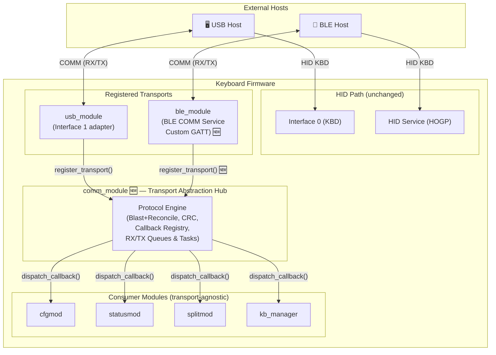

# BLE COMM Channel — Implementation Plan

> **Goal:** Add a bidirectional, non-HID communication channel over Bluetooth Low Energy so the keyboard can be configured wirelessly from Android, iOS (via Bluefy/WebBLE browsers), and desktop — mirroring the existing USB COMM channel.

---

## Table of Contents

- [Step-by-Step Implementation Task List](#step-by-step-implementation-task-list)
- [Situation Analysis](#situation-analysis)
- [Architectural Strategy](#architectural-strategy)
- [Terminology](#terminology)
- [Key Design Decisions](#key-design-decisions)
- [Phased Rollout Summary](#phased-rollout-summary)
- [Phase 0 — `comm_module` Extraction](#phase-0--comm_module-extraction)
- [Phase 1 — BLE COMM GATT Service](#phase-1--ble-comm-gatt-service)
- [Phase 2 — Configurator Dual-Transport Support](#phase-2--configurator-dual-transport-support)
- [Phase 3 — Split Keyboard BLE COMM Verification](#phase-3--split-keyboard-ble-comm-verification)
- [Cross-Cutting Concerns](#cross-cutting-concerns)
- [Platform Compatibility Matrix](#platform-compatibility-matrix)
- [Risk Matrix](#risk-matrix)
- [File Change Manifest](#file-change-manifest)

---

## Step-by-Step Implementation Task List

### Phase 0: `comm_module` Extraction
- [x] **Step 1:** Create `components/comm_module/` directory structure and `CMakeLists.txt`.
- [x] **Step 2:** Migrate `usb_defs.h` to `comm_defs.h` (rename types and add protocol sizing constants).
- [x] **Step 3:** Migrate `usb_crc.c/h` to `comm_crc.c/h` (update for dynamic length parameter).
- [x] **Step 4:** Create `comm_transport.h` and `comm_transport.c` for the abstraction interface.
- [x] **Step 5:** Create `comm_session.h` and `comm_session.c` to implement the exclusive transport mutex and session lock.
- [x] **Step 6:** Migrate `usb_send.c/h` to `comm_send.c/h` (remove USB hard dependency).
- [x] **Step 7:** Migrate `usb_callbacks.c/h` to `comm_dispatch.c/h` (routing, queue, task creation, transport disconnect cleanup hooks).
- [x] **Step 8:** Migrate `usb_callbacks_rx/tx.c` to `comm_rx/tx.c`, replacing transport-specific static buffers with a globally shared static buffer protected by `comm_session`.
- [x] **Step 9:** Create public API header `comm_module.h`.
- [x] **Step 10:** Update `usb_module` (`usbmod.c`, `CMakeLists.txt`, `usb_descriptors.h`) to strip old comm logic and register as a transport.
- [x] **Step 11:** Update all consumers (`cfgmod.c`, `statusmod.c`, `splitmod.c`, `kb_manager.c`, etc.) to use `comm_module.h`.
- [x] **Step 12:** Update `main.c` init order to call `comm_init()` before `usb_init()`.
- [x] **Phase 0 Verification:**
  - **Step 1:** Flash both ESP32S3 units with the latest firmware via USB.
  - **Step 2:** Connect Unit A to PC via USB (Master unit).
  - **Step 3:** Open the Configurator App (WebHID) on the PC and connect to the device.
    - *Expected:* Connection succeeds and device configuration is read successfully via USB.
  - **Step 4 (Blast Mode & Session Lock):** Make a change to the keymap in the app and click "Save".
    - *Expected:* The config transfers successfully. The ESP-IDF terminal should log `Blast mode: expecting X packets` followed by `Payload RX Complete!` and speed metrics. The USB connection should not drop.
  - **Step 5 (Split Integration):** Power on Unit B (Slave unit) and press keys on it.
    - *Expected:* Keystrokes from Unit B are sent to the PC through Unit A. This verifies `splitmod` correctly uses the new `comm_module` for ESP-NOW bridging.

### Phase 1: BLE COMM GATT Service
- [x] **Step 1:** Create `components/ble_module/ble_comm_service.c` and `.h` with custom UUIDs.
- [x] **Step 2:** Create `components/ble_module/ble_comm_transport.c` and `.h` to implement `comm_transport_ops_t`.
- [x] **Step 3:** Update `blemod.c` to initialize the COMM service and manage connection state.
- [x] **Step 4:** Update `ble_module/CMakeLists.txt` and `sdkconfig.defaults` (NimBLE resource tuning).
- [x] **Phase 1 Verification:**
  - **Step 1:** Keep the Master ESP32S3 (Unit A) powered on.
  - **Step 2:** Open a BLE testing app on your phone or PC (e.g., **nRF Connect** or **LightBlue**).
  - **Step 3 (Discovery):** Scan for Bluetooth devices and connect to the keyboard.
    - *Expected:* Connection succeeds.
  - **Step 4 (Service Check):** Browse the listed GATT services.
    - *Expected:* A Custom Service with UUID `4D544546-0001-4B42-4254-455F434F4D4D` (COMM Service) is present.
  - **Step 5 (Characteristics Check):** Expand the COMM Service.
    - *Expected:* You see three characteristics:
      - `...0002...` (RX) with properties **Write, Write Without Response**.
      - `...0003...` (TX) with properties **Read, Notify**.
      - `...0004...` (MTU) with properties **Read, Notify**.
  - **Step 6 (MTU Read):** Tap "Read" on the MTU characteristic (`0004`).
    - *Expected:* It returns a 2-byte hex value (e.g., `0xFF 0x00` or `0x00 0x01` etc.) representing the maximum negotiated payload size.
  - **Step 7 (Subscription):** Enable notifications (Subscribe) on the TX (`0003`) and MTU (`0004`) characteristics.
    - *Expected:* The ESP-IDF terminal logs `COMM TX SUBSCRIBED (conn=X)`.

### Phase 2: Configurator Dual-Transport Support
- [x] **Step 1:** Create `configurator/src/services/ITransport.ts` abstraction.
- [x] **Step 2:** Create `CommProtocol.ts` to share blast+reconcile protocol engine logic.
- [x] **Step 3:** Create `BLETransport.ts` implementing Web Bluetooth.
- [x] **Step 4:** Refactor `HIDTransport.ts` and `DeviceController.ts` to use `ITransport`.
- [x] **Step 5:** Update `App.tsx` with a transport selector UI (USB vs Bluetooth).
- [x] **Phase 2 Verification:** Test full configurator functionality via Web Bluetooth on desktop and Android.
  - **Step 2.V1 (Desktop Basic Connection):** Connect via USB and BLE using the Configurator UI. Ensure both transports can fetch all configuration data correctly.
  - **Step 2.V2 (Reconnection Stability):** Connect via BLE, then disconnect using the UI button. Reconnect again without refreshing the site. Verify that no zombie listeners cause duplicate packets and that the `unexpected transport 1` error does not appear in the ESP-IDF monitor.
  - **Step 2.V3 (Hard Refresh Stability):** Press F5 while connected via BLE. Then click connect. Verify it reconnects properly.
  - **Step 2.V4 (State Reset):** Connect via BLE and navigate through the Configurator. Disconnect. Verify that the UI properly clears all layout, macro, combo, and custom key caches from the store, and that the loading screen behaves progressively.
  - **Step 2.V5 (Write Operations):** With BLE connected, create a new Macro, assign it to a key, and save it. Disconnect, F5, reconnect, and verify the macro is preserved accurately.
  - **Step 2.V6 (Android Web Bluetooth):** Repeat Step 2.V1 to 2.V5 on an Android device using a Chromium-based browser to ensure cross-platform Web Bluetooth compliance.
### Phase 3: Split Keyboard Verification & Documentation
- [ ] **Step 1:** Verify slave suspension logic correctly disables COMM service.
- [ ] **Step 2:** Perform role swap and ensure new master's BLE COMM is functional.
- [ ] **Step 3:** Update `universe/` documentation, `COMM_PROTOCOL.md`, and local module `.md` files.


## Situation Analysis

### What We Have Today

The firmware has **two completely independent USB interfaces** presented to the host:

| Interface                  | Role                                      | Direction | Status    |
| ----------------------------| -------------------------------------------| -----------| -----------|
| Interface 0 — HID Keyboard | Keyboard/NKRO/Consumer reports            | IN only   | ✅ Working |
| Interface 1 — HID COMM     | 63-byte vendor-defined bidirectional pipe | IN + OUT  | ✅ Working |

The COMM channel carries all configurator traffic: config read/write, status polling, split management, BLE profile control, and key injection. It uses the [Blast+Reconcile protocol](file:///home/srleg/Projects/Tecleados-ESP-Firmware/COMM_PROTOCOL.md) with CRC-8 integrity.

Over Bluetooth, the firmware only offers the **HID Keyboard** service (HOGP). There is no equivalent of Interface 1 over BLE. This means:

- ❌ Configuration is impossible without a USB cable
- ❌ Android/iOS devices cannot configure the keyboard at all
- ❌ Desktop BLE-only connections cannot access the configurator

### What We Want



Both USB and BLE COMM channels feed into the **same** callback routing system. The modules (`cfg_usb_callback`, `status_module_callback`, `split_usb_callback`, `ble_usb_callback`, `kb_system_usb_callback`) never know which transport delivered the data.

---

## Architectural Strategy

> [!IMPORTANT]
> **The Core Insight:** The existing module callbacks ([`execute_callback()`](file:///home/srleg/Projects/Tecleados-ESP-Firmware/components/usb_module/usb_callbacks.c#L240-L253)) and the TX function ([`send_payload()`](file:///home/srleg/Projects/Tecleados-ESP-Firmware/components/usb_module/usb_callbacks_tx.c#L366-L383)) are already transport-agnostic in spirit — they work on byte arrays and module IDs. The only thing coupling them to USB is the physical send/receive path.
>
> We do **not** rewrite the protocol. We do **not** duplicate the callback system. We introduce a thin **transport abstraction** that lets the same protocol, same callbacks, same blast+reconcile state machines work over either USB or BLE.

### The Strategy in One Sentence

**Extract the protocol engine from the USB module, wrap USB and BLE as interchangeable transports behind a common interface, and let the configurator choose which transport to use.**

---

## Terminology

| Term                      | Meaning                                                                                                                  |
| ---------------------------| --------------------------------------------------------------------------------------------------------------------------|
| **COMM channel**          | The bidirectional data pipe used for configuration (not HID reports). Currently USB-only, will become transport-agnostic |
| **Transport**             | A physical medium carrying COMM packets (USB HID Interface 1, or BLE GATT custom service)                                |
| **BLE COMM Service**      | A new custom GATT service with RX/TX characteristics for configuration data                                              |
| **comm_channel**          | The new firmware abstraction layer that routes COMM traffic regardless of transport                                      |
| **Active COMM transport** | Which transport is currently servicing a COMM session. Can be USB, BLE, or both simultaneously                           |

---

## Key Design Decisions

### Decision 1: Transport Abstraction Layer via `comm_module` Extraction

**Approach:** Extract the entire COMM protocol engine (Blast+Reconcile, CRC, callback registry, processing queue/task, TX queue/task) out of `usb_module` into a new, independent `comm_module` component. Both `usb_module` and `ble_module` then register themselves as transports with `comm_module`, and all consumer modules (`cfgmod`, `statusmod`, `splitmod`, `keyboard`) depend on `comm_module` directly.

> [!IMPORTANT]
> See [Implementation: Decoupling COMM from USB](#implementation-decoupling-comm-from-usb-comm_module-extraction) for the exhaustive, step-by-step plan covering the `comm_module` extraction.


### Decision 2: BLE GATT Service Design

**Approach:** A single custom GATT service with two characteristics: one for RX (client→device writes), one for TX (device→client notifications).

```
Service:    TEF COMM Service  (128-bit custom UUID)
            UUID: 4D544546-0001-4B42-4254-455F434F4D4D
                  ("MTEF" + 0001 + "KB" + "BT" + "E_COMM")

Char 1:     COMM RX (Write Without Response + Write)
            UUID: 4D544546-0002-4B42-4254-455F434F4D4D
            Properties: WRITE | WRITE_NO_RSP
            Max size: Up to 260 bytes (dynamically bound by negotiated MTU)

Char 2:     COMM TX (Notify + Read)
            UUID: 4D544546-0003-4B42-4254-455F434F4D4D
            Properties: READ | NOTIFY
            Value: Up to 260 bytes
            Descriptors: CCCD (auto-created by NimBLE when NOTIFY flag is set)

Char 3:     COMM MTU (Read + Notify)
            UUID: 4D544546-0004-4B42-4254-455F434F4D4D
            Properties: READ | NOTIFY
            Value: 2 bytes (Current maximum packet size, uint16_t little-endian, e.g., 20 to 260)
            Descriptors: CCCD (auto-created by NimBLE)
```

**Why this design:**
- **260-byte max packets** — Because BLE supports larger MTUs (e.g., 256), the absolute maximum packet size is decoupled from USB's 63-byte constraint and increased to 260 bytes (a 1-byte `payload_len` allows up to 255 bytes of payload + 5 bytes framing). BLE packets will be dynamically sized up to `min(260, ble_att_mtu - 3)` to massively increase throughput, while USB remains strictly locked to 63 bytes.
- **Write Without Response** — Faster than Write With Response for blast mode. The blast+reconcile protocol already handles reliability at the application layer.
- **Two characteristics instead of one** — Separating RX and TX avoids ambiguity about read-back semantics and keeps the CCCD subscription clean.
- **Custom 128-bit UUIDs** — Required to avoid collisions with standard Bluetooth SIG services. The UUIDs are derived from "TEF COMM" for readability in debugging tools.

### Decision 3: Packet Format Reuse

**The core COMM packet structure is reused over BLE.** No changes to:
- Flag byte definitions
- Blast+Reconcile state machines
- Module ID routing
- Application-level payload format

However, to support variable packet lengths (see Decision 4) gracefully, the monolithic `usb_packet_msg_t` struct will be decomposed. Instead of a hardcoded 63-byte struct with padding logic, an incoming packet of length `N` will be logically and physically divided into three parts:

1. **Header**: Defined as `comm_packet_header_t` (4 bytes: `flags`, `remaining_packets`, `payload_len`), located at `(0 .. sizeof(Header) - 1)`.
2. **Payload**: Located at `(sizeof(Header) .. sizeof(Header) + payload_len - 1)`.
3. **CRC**: Located immediately after the payload at index `sizeof(comm_packet_header_t) + header->payload_len`.

This means the minimum theoretical packet size becomes `sizeof(comm_packet_header_t) + 0 + 1` (which is 5 bytes). `comm_dispatch.c` and `comm_crc.c` will treat incoming data as a raw `uint8_t *` array of physical transport length `N`. Because transports like USB rigidly pad packets with zeroes up to 63 bytes, the protocol engine **must not** look at `N - 1` for the CRC. 

Instead, it will cast the first bytes to `comm_packet_header_t`, determine the expected logical length (`sizeof(header) + payload_len + 1`), verify that the physical length `N` is sufficient (`if (N < expected_logical_length) return error;`), validate the CRC at the logical end, and access the payload. Any padding bytes provided by the transport after the CRC are simply ignored. This makes dynamic MTU sizing fundamentally simpler. The configurator's `HIDTransport.ts` protocol logic can be reused with only the physical I/O layer swapped.

### Decision 4: Variable Packet Sizing (MTU Independence)

**Challenge:** BLE's default MTU is 23 bytes (20 bytes usable), but the USB COMM channel uses 63-byte packets. While most modern devices negotiate MTUs > 66 bytes, some older stacks or specific OS versions do not. We do not want to artificially constrain users.

**Solution:** The COMM protocol engine (`comm_module`) will be refactored to support **variable packet sizes**. The protocol structure inherently supports this because the framing overhead is fixed (5 bytes: 1b Flags, 2b Remaining, 1b Payload Len, 1b CRC) and the `Payload Len` defines the valid data within that specific packet.

- `COMM_REPORT_SIZE` is decoupled from the internal routing. We introduce `COMM_MAX_PACKET_SIZE` (260).
- Each transport defines its `max_packet_size`. USB always returns 63. BLE returns `min(260, ble_att_mtu(conn) - 3)`.
- The `comm_tx` task dynamically chunks large payloads based on the target transport's `max_packet_size` (Payload per packet = max_packet_size - 5).
- To avoid race conditions with asynchronous MTU negotiation, the `COMM_MTU` characteristic supports `READ` and `NOTIFY`. The firmware pushes a notification when `BLE_GAP_EVENT_MTU` completes. The configurator subscribes to notifications and reads the initial value to determine the negotiated size, chunking its outbound Web Bluetooth writes accordingly.

This allows the protocol to seamlessly scale down to 20-byte packets (15 bytes of payload) on legacy BLE connections, run at exactly 63 bytes on USB, and scale all the way up to 253-byte packets (248 bytes of payload) on modern BLE connections, maximizing throughput with zero application-layer fragmentation hacks.

**sdkconfig change:** We will still request a large MTU to optimize throughput.
```
CONFIG_BT_NIMBLE_ATT_PREFERRED_MTU=256
```

### Decision 5: Configurator Client Strategy

**The Web Configurator will support both WebHID (existing) and Web Bluetooth (new).**

| API           | Used for | Browser Support                         |
| ---------------| ----------| -----------------------------------------|
| WebHID        | USB COMM | Chrome, Edge, Opera (desktop)           |
| Web Bluetooth | BLE COMM | Chrome (desktop + Android), Edge, Opera |

**iOS situation:**
- Safari does not support Web Bluetooth
- **Bluefy** (iOS browser) provides Web Bluetooth support — users install this free browser and open the same configurator URL
- This is a well-established pattern in the BLE IoT ecosystem

**Architecture:**

```typescript
// New transport abstraction in the configurator
interface ITransport {
    connect(): Promise<void>;
    disconnect(): Promise<void>;
    isConnected(): boolean;
    sendPacket(data: Uint8Array): Promise<void>;
    onPacketReceived(callback: (data: Uint8Array) => void): void;
    onConnectionChange(callback: (connected: boolean) => void): void;
}

// HIDTransport implements ITransport (refactored from current code)
// BLETransport implements ITransport (new)
// DeviceController takes an ITransport instead of HIDTransport directly
```

### Decision 6: Security Model

The BLE COMM service **requires encryption** (same as the existing HID service). All COMM characteristics use `BLE_GATT_CHR_F_READ_ENC` / `BLE_GATT_CHR_F_WRITE_ENC` flags, meaning:

- A device must be **bonded** (paired) before it can read/write COMM data
- This uses the existing "Just Works" pairing model already in `blemod.c`
- No additional pairing flow is needed — if you can type on the keyboard via BLE, you can also configure it

**Why this is sufficient:**
- The configuration data is not sensitive enough to warrant PIN/passkey entry
- The keyboard is already physically in the user's hands
- MITM attacks on keyboard configuration are impractical (the attacker would need to be within BLE range and bonded)

### Decision 7: Split Keyboard Implications

**Current behavior:**
- The USB COMM channel is physically on whichever half has the USB cable
- BLE commands sent to the slave via USB are proxied over ESP-NOW to the master
- Config writes are synced from master to slave after the write

**With BLE COMM:**
- The BLE COMM service runs on the **master half only** (since the slave's BLE is suspended)
- A configurator connected via BLE is always talking to the master — no proxying needed for BLE commands
- Config writes still sync to the slave via ESP-NOW (existing mechanism)
- If the configurator connects to the slave via USB while the master has BLE COMM active, both channels can coexist independently

**No proxy logic needed for BLE COMM.** This is simpler than USB, where the slave must proxy BLE commands. The BLE COMM is inherently on the master, which is the BLE authority.

### Decision 8: Exclusive Transport Mutex & Shared Static Buffers (`comm_session`)

**Challenge:**
In the legacy USB-only implementation, `usb_callbacks_rx.c` and `usb_callbacks_tx.c` each allocated a static 21,500-byte BSS array (`rx_buf` and `tx_buf`). This locked up 43 KB of continuous SRAM. While a dynamic allocation pool was considered to reduce this idle footprint, relying on `heap_caps_malloc` to grab a continuous 21.5 KB chunk after hours of BLE/FreeRTOS operation poses a massive **heap fragmentation risk**, likely leading to fatal OOM crashes. Furthermore, configuring the keyboard concurrently via multiple transports (e.g., USB and BLE simultaneously) is an extreme edge case that needlessly complicates state management.

**Solution:**
Adopt an **Exclusive Session Lock (Mutex)** architecture with a **Single Global Static Buffer Set**:

1. **The Session Mutex (`comm_session.c/.h`):** Introduce a global state manager that tracks the `active_transport`. When a `FIRST` packet arrives from Transport A, the session manager locks the COMM channel, granting Transport A exclusive access.
2. **First-Come, First-Served Rejection:** If Transport B attempts to send COMM packets while Transport A holds the lock, the packets are immediately rejected with a `PAYLOAD_FLAG_ERR` (Reason: BUSY). This elegantly prevents multi-channel collisions.
3. **Shared Static Memory:** Because only one transport can ever use the COMM protocol at a time, we only need *one* set of static buffers (`static uint8_t s_rx_buf[21500]` and `s_tx_buf[21500]`) shared globally across all transports within `comm_module`. This uses exactly the same amount of memory as the legacy USB firmware (43 KB), completely eliminating heap fragmentation risks and dynamic memory leaks while granting BLE COMM access for "free" in terms of RAM.
4. **Unified Watchdog:** The session lock is automatically released when the transaction successfully completes, or if the `COMM_TIMEOUT_MS` (1000 ms) watchdog fires due to a client disconnect or stalled transfer.

---

## Phased Rollout Summary

| Phase | Scope | Risk | Duration Estimate |
|-------|-------|------|-------------------|
| **Phase 0** | `comm_module` extraction + USB transport adapter wiring | Low — pure refactor, zero behavioral change | 2–3 days |
| **Phase 1** | BLE COMM GATT service + BLE transport adapter | Medium — new GATT service, NimBLE integration | 2–3 days |
| **Phase 2** | Configurator Web Bluetooth support + transport abstraction | Medium — new browser API, UI changes | 2–3 days |
| **Phase 3** | Split keyboard BLE COMM verification | Low — mostly verification | 1 day |

**After each phase, the keyboard must still work identically to today.** Phase 0 is a pure refactor with zero behavioral change. Phase 1 adds the BLE GATT service. Phase 2 adds the configurator client-side BLE support. Phase 3 validates split keyboard scenarios.

---

## Phase 0 — `comm_module` Extraction

### Motivation

The COMM protocol engine — packet framing (flags, remaining_packets), Blast+Reconcile state machines, CRC-8 integrity, the processing queue/task, the TX queue/task, timeout watchdog, module callback registry, and `send_payload()` — currently lives inside `components/usb_module/`. This is purely a historical accident: USB was the first (and only) transport.

Adding BLE as a second transport creates an unacceptable dependency:

```
ble_module ──depends-on──► usb_module   ← WRONG
```

The BLE module would need to `#include "usb_callbacks_rx.h"`, `#include "usb_send.h"`, etc., and its `CMakeLists.txt` would `REQUIRES usb_module`. This couples two independent hardware drivers through an implementation detail.

**The correct architecture:**

```
usb_module ──depends-on──► comm_module  ← USB is a transport
ble_module ──depends-on──► comm_module  ← BLE is a transport

cfgmod     ──depends-on──► comm_module  ← registers MODULE_CONFIG callback
statusmod  ──depends-on──► comm_module  ← registers MODULE_STATUS callback
splitmod   ──depends-on──► comm_module  ← registers MODULE_SPLIT / MODULE_BLE callbacks
keyboard   ──depends-on──► comm_module  ← registers MODULE_SYSTEM callback
```

---

### Scope: What Moves, What Stays

The guiding principle is: **anything that doesn't need TinyUSB or NimBLE moves to `comm_module`.** Anything that touches a specific hardware stack stays in its transport module.

#### Files That MOVE to `comm_module` (renamed)

| Current location (`usb_module/`) | New location (`comm_module/`) | Reason |
|---|---|---|
| `usb_defs.h` | `comm_defs.h` | Protocol constants, flags, `comm_packet_msg_t` (renamed from `usb_packet_msg_t`), module IDs, callback typedef — none of this is USB-specific |
| `usb_crc.c` / `usb_crc.h` | `comm_crc.c` / `comm_crc.h` | CRC-8 computation. Currently depends on `usb_descriptors.h` only for `COMM_REPORT_SIZE` — that constant moves to `comm_defs.h` |
| `usb_callbacks.c` / `usb_callbacks.h` | `comm_dispatch.c` / `comm_dispatch.h` | The processing queue, `process_incoming_packet()`, callback registry (`s_module_callbacks[]`, `register_callback()`, `execute_callback()`), the `usb_processing_task`, and the `timeouts_task`. This is the protocol engine core |
| `usb_callbacks_rx.c` / `usb_callbacks_rx.h` | `comm_rx.c` / `comm_rx.h` | RX buffer, blast mode RX state machine, `process_rx_request()`, `erase_rx_buffer()`. Zero USB dependency |
| `usb_callbacks_tx.c` / `usb_callbacks_tx.h` | `comm_tx.c` / `comm_tx.h` | TX buffer, blast mode TX state machine, `send_payload()`, TX queue, TX task. Zero USB dependency |
| `usb_send.c` / `usb_send.h` | `comm_send.c` / `comm_send.h` | `build_send_single_msg_packet()` and `send_single_packet()`. Currently, `send_single_packet()` calls `tud_hid_n_report()` directly — this **hard USB dependency must be replaced** with the transport abstraction (see below) |
| *(New Component File)* | `comm_session.c` / `comm_session.h` | Exclusive session lock manager protecting globally shared static buffers |

#### Files That STAY in `usb_module`

| File | Reason |
|---|---|
| `usbmod.c` / `usbmod.h` | TinyUSB driver init, USB task, HID keyboard send functions (`usb_send_keyboard_6kro`, `usb_send_keyboard_nkro`, `usb_send_consumer_report`), USB string descriptor overrides. All TinyUSB-specific |
| `usb_descriptors.h` | USB HID report descriptors, interface enums, device descriptor. Pure USB. The only shared constant (`COMM_REPORT_SIZE`) moves to `comm_defs.h`; `usb_descriptors.h` will `#include "comm_defs.h"` to get it |

---

### Detailed Implementation Steps

#### Step 1 — Create the `comm_module` Component Skeleton

Create `components/comm_module/` with this structure:

```
components/comm_module/
├── CMakeLists.txt
├── include/
│   ├── comm_defs.h          ← protocol types, flags, module IDs
│   ├── comm_crc.h           ← CRC API
│   ├── comm_dispatch.h      ← callback registry + processing queue
│   ├── comm_rx.h            ← RX state machine API
│   ├── comm_tx.h            ← TX state machine API
│   ├── comm_send.h          ← packet send abstraction
│   ├── comm_transport.h     ← transport interface (register/receive)
│   └── comm_session.h       ← exclusive session lock manager
├── comm_crc.c
├── comm_dispatch.c
├── comm_rx.c
├── comm_tx.c
├── comm_send.c
├── comm_transport.c
└── comm_session.c
```

**`CMakeLists.txt`:**
```cmake
idf_component_register(
    SRCS "comm_crc.c" "comm_dispatch.c" "comm_rx.c" "comm_tx.c"
         "comm_send.c" "comm_transport.c" "comm_session.c"
    INCLUDE_DIRS "." "include" "../../components/utils"
    REQUIRES freertos esp_timer
)
```

> [!NOTE]
> **No dependency on `esp_tinyusb`, `bt`, or any hardware driver.** The only RTOS-level requirements are FreeRTOS (queues, tasks, semaphores) and `esp_timer` (for timestamp functions). The `utils` include is for `basic_utils.h`.

---

#### Step 2 — Migrate `comm_defs.h` (from `usb_defs.h`)

This is the most critical header — it defines the entire protocol vocabulary.

**Renames:**

| Old name | New name | Notes |
|---|---|---|
| `usb_packet_msg_t` | `comm_packet_header_t` | Decomposed from a 63-byte buffer to just the 4-byte header |
| `usb_msg_module_t` | `comm_module_id_t` | The module ID enum |
| `USB_MODULE_COUNT` | `COMM_MODULE_COUNT` | End sentinel for the enum |
| `usb_data_callback_t` | `comm_data_callback_t` | The callback function pointer typedef. **Must be updated to accept `comm_transport_t source` as its first parameter.** |

**Additions to `comm_defs.h`:**

```c
// Protocol sizing constants
#define COMM_MAX_PACKET_SIZE 260

// Packet header (4 bytes)
typedef struct __attribute__ ((packed)) {
    uint8_t flags;
    uint16_t remaining_packets;
    uint8_t payload_len;
} comm_packet_header_t;
```

All flag `#define`s (`PAYLOAD_FLAG_FIRST`, etc.) move unchanged.

---

#### Step 3 — Migrate `comm_crc.c` (from `usb_crc.c`)

1. Copy `usb_crc.c` → `comm_crc.c`
2. Replace `#include "usb_descriptors.h"` with `#include "comm_defs.h"` (for `COMM_REPORT_SIZE`)
3. Rename functions: `usb_crc_prepare_packet()` → `comm_crc_prepare_packet()`, `usb_crc_verify_packet()` → `comm_crc_verify_packet()`
4. **Update Signatures**: Both CRC functions must now accept a `uint16_t len` parameter alongside the `uint8_t *packet` to compute the CRC at the dynamically correct `len - 1` position, breaking the hardcoded reliance on a 63-byte macro.
5. Header `comm_crc.h` exports the new names

---

#### Step 4 — Create `comm_transport.h/.c` (Transport Interface)

This is the new abstraction that doesn't exist today. It enables plugging in USB and BLE without either knowing about the other.

**`comm_transport.h`:**

```c
#pragma once

#include <stdbool.h>
#include <stdint.h>

typedef enum {
    COMM_TRANSPORT_NONE = -1,
    COMM_TRANSPORT_USB = 0,
    COMM_TRANSPORT_BLE,
    COMM_TRANSPORT_COUNT
} comm_transport_t;

/** Sentinel: broadcast to ALL connected transports.
 *  Used by event-driven callers (e.g., unsolicited status pushes) that need
 *  to reach every active configurator, regardless of transport. */
#define COMM_TRANSPORT_BROADCAST ((comm_transport_t)0x7F)

typedef struct {
    /** Send a single packet up to max_packet_size.
     *  The packet is already CRC-stamped. Returns true on success. */
    bool (*send_packet)(const uint8_t *packet, uint16_t len);

    /** Returns true if this transport is physically connected and ready. */
    bool (*is_ready)(void);

    /** Returns the maximum packet size (including 5-byte protocol overhead) 
     *  supported by this transport currently. */
    uint16_t (*get_max_packet_size)(void);
} comm_transport_ops_t;

/** Register a transport's operations. Called once during init. */
void comm_transport_register(comm_transport_t id,
                             const comm_transport_ops_t *ops);

/** Get the operations for a specific transport. Returns NULL if not registered. */
const comm_transport_ops_t *comm_transport_get(comm_transport_t id);

/** Called by a transport driver when it receives a raw packet.
 *  Enqueues the packet along with the source transport ID. */
void comm_transport_receive_packet(comm_transport_t source,
                                   const uint8_t *packet, uint16_t len);

/** Mark a transport as having an active configurator connection.
 *  For USB: call when the first COMM packet is received (confirming a configurator is on the other end).
 *  For BLE: call when the client subscribes to COMM TX notifications (CCCD enabled). */
void comm_transport_set_connected(comm_transport_t id, bool connected);

/** Check if a specific transport has an active configurator connection. */
bool comm_transport_is_connected(comm_transport_t id);

/** Check if ANY transport has an active configurator connection.
 *  Used by event handlers to decide whether to bother building status pushes. */
bool comm_transport_any_connected(void);
```

**`comm_transport.c`:**

- Stores `comm_transport_ops_t` in a static array indexed by `comm_transport_t`.
- Maintains a `static bool s_connected[COMM_TRANSPORT_COUNT]` bitmap tracking which transports have an active configurator.
- `comm_transport_receive_packet()` prepends a 1-byte `source` identifier to the raw packet and pushes the combined array into `comm_dispatch`'s central Message Buffer (`s_comm_message_buffer`). This allows the processing task to safely identify the transport source of each variable-length packet while sharing a single buffer.
- When `comm_send_payload()` receives `COMM_TRANSPORT_BROADCAST`, `comm_transport.c` iterates all connected transports and enqueues a separate TX item for each, allowing all active configurators to receive the update.

---

#### Step 5 — Create `comm_session.h/.c` (Blast-Only Exclusive Session Lock)

The session lock protects the shared 21.5 KB RX and TX static buffers during multi-packet blast transfers. **Single-packet operations do not acquire the session lock** — they execute synchronously within the processing task context and never touch the shared buffers.

**`comm_session.h`:**
```c
#pragma once

#include <stdbool.h>
#include "comm_transport.h"

/** Initialize the session manager mutex. */
void comm_session_init(void);

/** 
 * Attempt to acquire the blast session lock for a specific transport.
 * Called when a FIRST packet with remaining > 0 arrives (multi-packet transfer).
 * Returns true if the lock was acquired or already held by this transport.
 * Returns false if another transport currently holds the lock (blast in progress).
 */
bool comm_session_try_lock(comm_transport_t transport);

/** 
 * Release the blast session lock.
 * Called on blast completion, timeout, disconnect, or abort.
 */
void comm_session_unlock(void);

/** 
 * Get the transport currently holding the blast lock.
 * Returns COMM_TRANSPORT_NONE if no blast is active.
 */
comm_transport_t comm_session_get_active(void);
```

**`comm_session.c`:**
- Implements a simple state manager tracking `s_active_transport` protected by a FreeRTOS Mutex.
- When idle, `s_active_transport` is `COMM_TRANSPORT_NONE`.
- **Blast-only scope**: The lock is only acquired when `process_rx_request()` detects a `FIRST` packet with `remaining_packets > 0` (indicating a multi-packet blast). Single-packet operations (`FIRST|LAST`) bypass the lock entirely.

---

#### Step 6 — Migrate `comm_send.c` (from `usb_send.c`)

This is where the **hard USB coupling is broken.**

Current `usb_send.c` has two functions:
1. `build_send_single_msg_packet()` — Builds a `comm_packet_msg_t`, CRC-stamps it, calls `send_single_packet()`. **Transport-agnostic** apart from calling the function below.
2. `send_single_packet()` — Calls `tud_hid_n_report(ITF_NUM_HID_COMM, ...)`. **This is the USB hard dependency.**

**Migration:**

`comm_send.c` replaces the hard-coded TinyUSB call with the transport abstraction:

```c
// comm_send.c

bool comm_send_single_packet(comm_transport_t target, uint8_t *packet, uint16_t logical_len) {
    // COMM universalizes the CRC. It computes and places the CRC at index `logical_len - 1`
    // (which is sizeof(comm_packet_header_t) + payload_len). Transports simply send the buffer.
    comm_crc_prepare_packet(packet, logical_len);

    const comm_transport_ops_t *ops = comm_transport_get(target);

    if (!ops || !ops->is_ready || !ops->is_ready()) {
        ESP_LOGW(TAG, "Transport %d not ready", target);
        return false;
    }

    return ops->send_packet(packet, logical_len);
}
```

**Thread-Safety Rationale:**
`comm_send_single_packet` explicitly accepts the `target` transport as a parameter. We **do not** use an implicit `comm_transport_get_reply_target()` getter inside the single-packet send function because protocol engine timeouts (`comm_timeouts_task`) run asynchronously. If a blast times out, `comm_rx` must explicitly pass its cached `active_rx_transport` to ensure the asynchronous `STATUS_REQ` or `ERR` packet routes to the correct transport, bypassing the state of the synchronous processing task.

`comm_build_send_single_packet()` must also be updated to accept the `target` parameter and pass it down.

---

#### Step 7 — Migrate `comm_dispatch.c` (from `usb_callbacks.c`)

**What moves:**
- `usb_processing_queue` → `s_comm_message_buffer` (Replaced the legacy queue with a FreeRTOS MessageBuffer via `xMessageBufferCreate(8192)` to support variable-length BLE packets without exploding the heap).
- `process_incoming_packet()` — The flag router (RX vs TX, blast reconcile, etc.)
- `usb_processing_task()` → `comm_processing_task()` (Uses `xMessageBufferReceive` to extract the variable-length packet, reads the 1-byte `source` tag prepended by the transport adapter, and passes it explicitly into the callback router).
- `timeouts_task()` → `comm_timeouts_task()`
- `s_module_callbacks[]` array, `register_callback()`, `execute_callback()`
- `usb_callbacks_init()` → `comm_dispatch_init()` — creates the MessageBuffer and spawns both tasks. (Also, move the misplaced `#include <freertos/...>` directives from inside the function body to the top of the file).

**What does NOT move:**
- `usbmod_tud_hid_set_report_cb()` — This is the TinyUSB entry point for receiving USB packets. It stays in `usb_module`, but instead of directly enqueuing to the processing queue, it calls `comm_transport_receive_packet(COMM_TRANSPORT_USB, packet, len)`.
- `usbmod_tud_hid_get_report_cb()` — Stays in `usb_module`.
- `tud_hid_descriptor_report_cb()` — Stays in `usb_module`.

**The TinyUSB-specific packet ingestion in `usbmod_tud_hid_set_report_cb()`** (currently in `usb_callbacks.c`, lines 45–116) stays in `usb_module` but is drastically simplified to act purely as a transport adapter. It handles:
1. Keyboard LED reports → `kb_state_update_leds()` (keyboard-specific, stays)
2. COMM interface packets → strips report ID byte, validates length, then directly calls `comm_transport_receive_packet(COMM_TRANSPORT_USB, payload, payload_len)`.

**Protocol Logic Migration, Concurrency Gate & Parameter Chaining:**
Because `comm_send_single_packet` now requires a `target` transport, synchronous error responses must be explicitly chained. When `process_incoming_packet()` handles a packet, it first validates the CRC at `sizeof(comm_packet_header_t) + payload_len`. If the CRC fails during blast mode, it drops the packet silently, allowing the Configurator to naturally resend it during reconciliation. If it succeeds, it passes the `target` transport down to `process_rx_request(target, msg)` in `comm_rx.c` or handles the single-packet synchronous callback directly.

**Cleanup:** `usb_callbacks.h` will be stripped of everything except the TinyUSB-specific callbacks:

```c
#pragma once
// TinyUSB callbacks remain here — they're USB-specific
uint16_t usbmod_tud_hid_get_report_cb(...);
void usbmod_tud_hid_set_report_cb(...);
```

---

#### Step 8 — Migrate `comm_rx.c` and `comm_tx.c` with Shared Static Buffers

In addition to updating internal includes (`comm_defs.h`, `comm_send.h`, `comm_crc.h`, `comm_session.h`), **transport-specific arrays are replaced by a single global set of shared static arrays**:

**`comm_rx.c`** (from `usb_callbacks_rx.c`):
- **Shared Static Buffer:** Create `static uint8_t s_shared_rx_buf[21500];`. Because the blast-only `comm_session` lock guarantees only one transport runs a blast at a time, this single buffer is safely shared.
- **Session State:** Maintain a single `comm_rx_session_t` struct (not per-transport) tracking `buf_len`, `last_activity_us`, and blast mode bitmap state.
- **Signature Refactor:** The legacy internal state machine functions (`process_rx_request` and `process_tx_response`) passed the monolithic `usb_packet_msg_t` struct by value. Since this struct is being replaced by a 4-byte header, refactor their signatures to accept `comm_transport_t target, const uint8_t *packet, uint16_t len` (or a pointer to the new header).
- **RX Concurrency Check:** In `process_rx_request(...)`, when a `FIRST` packet with `remaining_packets > 0` arrives, attempt `comm_session_try_lock(source)`. If the lock fails (another transport is blasting), reply with `PAYLOAD_FLAG_ERR` (BUSY) and drop the packet. Single-packet operations (`FIRST|LAST`) skip the lock entirely.
- **Clean RX Release:** In `process_rx_buffer()` (and on any abort), reset the `comm_rx_session_t` state and call `comm_session_unlock()` to free the blast lock.

**`comm_tx.c`** (from `usb_callbacks_tx.c`):
- **Shared Static Buffer:** Create `static uint8_t s_shared_tx_buf[21500];`.
- **Session State:** Maintain a single `comm_tx_session_t` tracking `buf_len` and blast mode TX state.
- **Non-Blocking TX (Preserving Current Pattern):** `comm_send_payload(target, payload, len)` heap-allocates a copy of the payload, packages it into a `tx_queue_item_t` with the `target` transport, and pushes it to the TX FreeRTOS queue. Returns immediately. The TX task dequeues one item at a time, copies the payload into `s_shared_tx_buf`, runs the blast/single-packet state machine, and frees the heap copy on completion. This is the same proven pattern from the legacy `send_payload()`, extended with a `target` field.
- **No Blocking Mutex. No Deadlock.** Because `comm_send_payload` is non-blocking (enqueue + return), the `comm_processing_task` never blocks. There is no need for the TX ACK bypass mechanism. STATUS_REQ and BITMAP packets flow through the normal processing task → `process_tx_response()` path, exactly as they do today.
- **Completion Semaphore:** The TX task still uses `tx_done_sem` (a binary semaphore). After dequeuing a TX item and running the state machine, the TX task waits on `xSemaphoreTake(tx_done_sem, pdMS_TO_TICKS(TX_TIMEOUT_MS))` for the transfer to complete or time out. `erase_tx_buffer()` signals `tx_done_sem` to unblock the task for the next queued item.
- **Broadcast Support:** When `target == COMM_TRANSPORT_BROADCAST`, `comm_send_payload` enqueues one copy per connected transport (iterating `comm_transport_is_connected()`). For typical status pushes (~100 bytes), this means 1-2 small heap allocations, which is negligible.

---

#### Step 9 — Public API Header (`comm_module.h`)

A clean, single-entry-point header that consumers include:

```c
// comm_module.h — public API for the comm protocol engine
#pragma once

#include "comm_defs.h"
#include "comm_transport.h"
#include "comm_session.h"    // For transport disconnect cleanup

/** Initialize the comm protocol engine (queues, tasks, timeouts). */
void comm_init(void);

/** Register a module callback for incoming COMM data. */
void comm_register_callback(comm_module_id_t module, comm_data_callback_t cb);

/** Get the transport that delivered the packet currently being processed.
 *  Only valid inside a module callback context (called from comm_processing_task).
 *  Returns COMM_TRANSPORT_NONE if called outside a callback. */
comm_transport_t comm_get_current_source(void);

/** Send a payload to a specific transport or broadcast to all connected transports.
 *  
 *  @param target  One of:
 *    - A specific transport (e.g., COMM_TRANSPORT_USB, COMM_TRANSPORT_BLE)
 *    - comm_get_current_source() when inside a callback (request-response pattern)
 *    - COMM_TRANSPORT_BROADCAST for unsolicited pushes (sends to ALL connected transports)
 *  @returns true if the payload was enqueued for at least one transport.
 *           false if no transport was available or the queue was full. */
bool comm_send_payload(comm_transport_t target, const uint8_t *payload, uint16_t payload_len);
```

---

#### Step 10 — Update `usb_module` (Slim Down)

After extraction, `usb_module` contains only:

| File | Contents |
|---|---|
| `usbmod.c` | TinyUSB init, USB task, HID keyboard functions, TinyUSB callback trampolines, USB event handler (mounted/unmounted), USB-specific COMM packet ingestion |
| `usbmod.h` | Public API: `usb_init()`, `usb_send_keyboard_6kro()`, etc. No more `usbmod_register_callback()` — replaced by `comm_register_callback()` |
| `usb_descriptors.h` | Device/config/report descriptors. `#include "comm_defs.h"` for `COMM_REPORT_SIZE` |
| `usb_callbacks.h` | TinyUSB callback declarations only |
*(All other COMM-related headers in usb_module are deleted)*

**Updated `usb_module/CMakeLists.txt`:**
```cmake
idf_component_register(
    SRCS "usbmod.c"
    INCLUDE_DIRS "." "include" "../../components/utils"
    REQUIRES esp_tinyusb driver freertos keyboard comm_module
)
```

Key change: `REQUIRES comm_module` (instead of building the COMM code itself).

**USB transport registration** (added to `usb_init()` in `usbmod.c`):

```c
#include "comm_transport.h"

static bool usb_comm_send_packet(const uint8_t *packet, uint16_t len) {
    // Wait until COMM HID endpoint is ready (max 100ms timeout) to prevent random drops
    uint32_t wait_timeout_ticks = pdMS_TO_TICKS(100);
    if (wait_timeout_ticks == 0) wait_timeout_ticks = 1;
    TickType_t start_tick = xTaskGetTickCount();
    
    while (!tud_hid_n_ready(ITF_NUM_HID_COMM)) {
        if (xTaskGetTickCount() - start_tick > wait_timeout_ticks) {
            ESP_LOGW("USB", "COMM HID not ready (timeout)");
            return false;
        }
        vTaskDelay(1);
    }

    // The protocol engine has already placed the CRC at sizeof(comm_packet_header_t) + payload_len.
    // The transport simply pads the remainder to USB's 63-byte constraint.
    if (len > 63) return false;

    if (len < 63) {
        uint8_t padded_packet[63] = {0};
        memcpy(padded_packet, packet, len);
        return tud_hid_n_report(ITF_NUM_HID_COMM, REPORT_ID_COMM, padded_packet, 63);
    }

    return tud_hid_n_report(ITF_NUM_HID_COMM, REPORT_ID_COMM, packet, 63);
}

static bool usb_comm_is_ready(void) {
    return tud_mounted() && tud_hid_n_ready(ITF_NUM_HID_COMM);
}

static uint16_t usb_comm_get_max_packet_size(void) {
    return 63; // USB COMM is always exactly 63 bytes
}

static const comm_transport_ops_t s_usb_transport_ops = {
    .send_packet        = usb_comm_send_packet,
    .is_ready           = usb_comm_is_ready,
    .get_max_packet_size = usb_comm_get_max_packet_size,
};

void usb_init() {
    // ... existing TinyUSB init ...

    // Register USB as a COMM transport
    comm_transport_register(COMM_TRANSPORT_USB, &s_usb_transport_ops);

    // ... existing task creation ...
}
```

---

#### Step 11 — Update All Consumers

Each consumer needs two changes:
1. **Include:** `usbmod.h` → `comm_module.h` (for callback registration and `send_payload`)
2. **CMake:** `REQUIRES usb_module` → `REQUIRES comm_module` (only if they were depending on it for COMM, not for HID keyboard sends)

**Consumer-by-consumer migration:**

| Module | Currently uses from `usb_module` | Change |
|---|---|---|
| `config_module/cfgmod.c` | `usbmod_register_callback(MODULE_CONFIG, ...)` + `send_payload()` via `usb_send.h` | `#include "comm_module.h"` → `comm_register_callback()` + `comm_send_payload()`. CMake: swap `usb_module` → `comm_module` |
| `status_module/statusmod.c` | `usbmod_register_callback(MODULE_STATUS, ...)` + `send_payload()` via `usb_send.h` / `usb_callbacks_tx.h` | Same pattern. CMake: swap `usb_module` → `comm_module` |
| `split/splitmod.c` | `usbmod_register_callback(MODULE_SPLIT, ...)` + `usbmod_register_callback(MODULE_BLE, ...)` | Same pattern. CMake: add `comm_module` alongside existing |
| `split/split_usb.c` | `send_payload()` via `usb_send.h` + `usbmod.h` | `#include "comm_module.h"` → `comm_send_payload()` |
| `keyboard/kb_manager.c` | `usbmod_register_callback(MODULE_SYSTEM, ...)` + HID keyboard functions | Split: `comm_module.h` for callback registration, keep `usbmod.h` for `usb_send_keyboard_*()` and `usb_keyboard_use_boot_protocol()`. CMake: add `comm_module` |
| `keyboard/kb_report.c` | `usb_send_keyboard_6kro()`, `usb_send_keyboard_nkro()`, `usb_send_consumer_report()`, `usb_keyboard_use_boot_protocol()` | **No change** — these are USB HID functions, not COMM. Stays on `usbmod.h` |
| `split/split_task.c` | Includes `usbmod.h` | Check what it uses — likely HID or mounted state. May need no change |
| `split/split_dispatch.c` | Includes `usbmod.h` | Same investigation needed |

> [!IMPORTANT]
> **Clean Refactor**: As there are no backward compatibility constraints, the includes in all consumer files (`cfgmod.c`, `statusmod.c`, `splitmod.c`, `split_usb.c`, `kb_manager.c`, etc.) must be directly updated to `#include "comm_module.h"` during Phase 0. No legacy shim headers will be retained in `usb_module`.
>
> **Unsolicited Status Pushes Are Preserved and Broadcast**: The event-driven `send_status_push()` calls in `statusmod.c` remain unchanged. These calls will use `comm_send_payload(COMM_TRANSPORT_BROADCAST, ...)`, which sends the update to ALL connected configurator transports. If no transport is connected (`comm_transport_any_connected() == false`), the push is silently dropped (no allocation, no queue traffic). This ensures both a USB and BLE configurator receive real-time state updates simultaneously.

---

#### Step 12 — Update `main.c` Init Order

```c
// main/main.c
#include "comm_module.h"  // NEW

static void init_procedure(void) {
    event_bus_init();
    button_init(*single_press_test, *double_press_test);
    cfg_init();
    rgb_init(GPIO_NUM_48);

    comm_init();      // NEW: start protocol engine (queues, tasks)
    usb_init();       // Existing: TinyUSB driver + registers USB transport
    ble_hid_init();   // Existing: NimBLE + (later) registers BLE transport

    ble_controller_init();
    status_module_init();
    splitmod_init();
    kb_manager_start();
}
```

`comm_init()` must run **before** `usb_init()` because `usb_init()` calls `comm_transport_register()` and the transport registry must already exist. The processing queue/task and TX queue/task are also started here.

> [!NOTE]
> `cfg_init()` and other modules may safely call `comm_register_callback()` **before** `comm_init()` executes. The callback registry is backed by a static array (guaranteed zero-initialized by the C runtime), so assigning function pointers is 100% thread-safe before any FreeRTOS queues or tasks are created. This ensures modules can load configs that `comm_init()` might need.

---

### Naming Convention Summary

| Old (USB-centric) | New (transport-agnostic) |
|---|---|
| `usb_packet_msg_t` | `comm_packet_header_t` (Decomposed from 63-byte payload struct to 4-byte header) |
| `usb_msg_module_t` | `comm_module_id_t` |
| `usb_data_callback_t` | `comm_data_callback_t` |
| `USB_MODULE_COUNT` | `COMM_MODULE_COUNT` |
| `RX_TIMEOUT_MS` / `TX_TIMEOUT_MS` (`1000`) | `COMM_TIMEOUT_MS` (`1000`) |
| `usb_crc_prepare_packet()` | `comm_crc_prepare_packet()` |
| `usb_crc_verify_packet()` | `comm_crc_verify_packet()` |
| `usbmod_register_callback()` | `comm_register_callback()` |
| `usbmod_execute_callback()` | `comm_execute_callback()` |
| `usb_callbacks_init()` | `comm_dispatch_init()` |
| `usb_tx_init()` | `comm_tx_init()` |
| `usb_processing_task` | `comm_processing_task` |
| `usb_cb_timeouts_task` | `comm_timeouts_task` |
| `send_payload()` | `comm_send_payload()` |
| `send_single_packet()` | `comm_send_single_packet()` |
| `build_send_single_msg_packet()` | `comm_build_send_single_packet()` (Assembles raw byte arrays dynamically instead of fixed structs) |
| `static uint8_t rx_buf[21500]` | `static uint8_t s_shared_rx_buf[21500]` protected by `comm_session` |
| `static uint8_t tx_buf[21500]` | `static uint8_t s_shared_tx_buf[21500]` protected by `comm_session` |

---

### Verification Checklist

| # | Check | Method |
|---|-------|--------|
| 1 | Clean build | `idf.py build` with zero warnings or errors |
| 2 | USB COMM still works | Connect configurator, read/write all config types |
| 3 | Blast mode (USB) | Transfer a full layout (~20KB), verify bitmap reconciliation in logs |
| 4 | Status push (USB) | Change BLE profile, verify push arrives in configurator |
| 5 | Split commands (USB) | Pair/unpair split, read remote matrix, role swap |
| 6 | BLE HID unaffected | Connect BLE keyboard, type, switch profiles |
| 7 | Split keyboard | Full split test (pair, type, sync, swap roles) |
| 8 | No USB regression | Hot-plug USB cable, verify mount/unmount events and buffer cleanup |

**Unit Tests (host-side):**

The following `comm_module` components are pure logic with no hardware dependencies and SHOULD be unit-tested on the host (Linux/macOS) before flashing:

| Module | Test Cases |
|--------|------------|
| `comm_crc.c` | Known vectors: empty packet, full payload, single-byte. Round-trip: `prepare` then `verify` returns true. Tamper: flip a bit, verify returns false |
| `comm_session.c` | Lock/unlock sequence. Double-lock same transport (idempotent). Lock A, try lock B (rejected). Unlock A, lock B (success). Lock with `COMM_TRANSPORT_NONE` (rejected) |
| `comm_transport.c` | `set_connected` / `is_connected` / `any_connected` state transitions. `COMM_TRANSPORT_BROADCAST` iteration logic with 0, 1, and 2 connected transports |

---

### Risk Assessment

| Risk | Impact | Probability | Mitigation |
|---|---|---|---|
| Include path breakage after move | Build failure | Medium | No backward-compat shims (per clean refactor policy). Run `idf.py build` after every file move |
| Circular dependency between `comm_module` and consumers | Build failure | Very Low | `comm_module` has zero knowledge of its consumers. It only exposes registration APIs. Consumers depend on `comm_module`, never the reverse |
| TX task references stale transport ops | Crash | Very Low | Transport ops are registered once during init and never change. The static array is immutable after boot |

---

### File Change Manifest (comm_module Extraction)

#### New Files

| File | Description |
|---|---|
| `components/comm_module/CMakeLists.txt` | Build config — REQUIRES only freertos, esp_timer |
| `components/comm_module/include/comm_defs.h` | Protocol types, flags, module IDs, packet struct |
| `components/comm_module/include/comm_crc.h` | CRC-8 API |
| `components/comm_module/include/comm_dispatch.h` | Processing queue, callback registry API |
| `components/comm_module/include/comm_rx.h` | RX state machine API |
| `components/comm_module/include/comm_tx.h` | TX state machine API |
| `components/comm_module/include/comm_send.h` | Packet send abstraction |
| `components/comm_module/include/comm_transport.h` | Transport interface |
| `components/comm_module/include/comm_module.h` | Unified public API header |
| `components/comm_module/comm_crc.c` | CRC-8 implementation |
| `components/comm_module/comm_dispatch.c` | Processing task, callback dispatch, timeout task |
| `components/comm_module/comm_rx.c` | RX buffer, blast RX state machine |
| `components/comm_module/comm_tx.c` | TX buffer, blast TX state machine, send_payload |
| `components/comm_module/comm_send.c` | Transport-routed packet send |
| `components/comm_module/comm_transport.c` | Transport registry, connectivity tracking, broadcast iteration |
| `components/comm_module/comm_session.c` | Blast-only exclusive session lock protecting shared static buffers |

#### Modified Files

| File | Change |
|---|---|
| `components/usb_module/CMakeLists.txt` | Remove COMM source files, add `REQUIRES comm_module` |
| `components/usb_module/usbmod.c` | Remove COMM init, add USB transport registration. Keep TinyUSB-specific COMM packet ingestion |
| `components/usb_module/include/usb_defs.h` | DELETED |
| `components/usb_module/include/usb_crc.h` | DELETED |
| `components/usb_module/include/usb_send.h` | DELETED |
| `components/usb_module/include/usb_callbacks.h` | Keep only TinyUSB callback declarations |
| `components/usb_module/include/usb_callbacks_rx.h` | DELETED |
| `components/usb_module/include/usb_callbacks_tx.h` | DELETED |
| `components/config_module/cfgmod.c` | `usbmod_register_callback` → `comm_register_callback` |
| `components/config_module/CMakeLists.txt` | `usb_module` → `comm_module` in REQUIRES |
| `components/status_module/statusmod.c` | `usbmod_register_callback` → `comm_register_callback` |
| `components/status_module/CMakeLists.txt` | `usb_module` → `comm_module` in REQUIRES |
| `components/split/splitmod.c` | `usbmod_register_callback` → `comm_register_callback` |
| `components/split/split_usb.c` | `usbmod.h` → `comm_module.h`, `usb_send.h` → `comm_send.h` |
| `components/split/CMakeLists.txt` | Add `comm_module` to REQUIRES |
| `components/keyboard/kb_manager.c` | `usbmod_register_callback` → `comm_register_callback` |
| `components/keyboard/CMakeLists.txt` | Add `comm_module` to REQUIRES |
| `main/main.c` | Add `comm_init()` call before `usb_init()` |

#### Deleted Files (after consumer migration is complete)

| File | Notes |
|---|---|
| `components/usb_module/usb_callbacks.c` | Logic moved to `comm_dispatch.c` + USB-specific packet ingestion inlined into `usbmod.c` |
| `components/usb_module/usb_callbacks_rx.c` | Logic moved to `comm_rx.c` |
| `components/usb_module/usb_callbacks_tx.c` | Logic moved to `comm_tx.c` |
| `components/usb_module/usb_crc.c` | Logic moved to `comm_crc.c` |
| `components/usb_module/usb_send.c` | Logic moved to `comm_send.c` |

---

### Phase 0 Completion Checklist

Once all steps above are completed, the USB transport adapter is wired (via `comm_transport_register()` in `usb_init()`), `main.c` calls `comm_init()` before `usb_init()`, and the old `.c` files are deleted from `usb_module/`.

| # | Check | Method |
|---|-------|--------|
| 1 | Clean build | `idf.py build` with zero warnings or errors |
| 2 | USB COMM still works | Connect configurator, read/write all config types |
| 3 | Blast mode (USB) | Transfer a full layout (~20KB), verify bitmap reconciliation in logs |
| 4 | Status push (USB) | Change BLE profile, verify push arrives in configurator |
| 5 | Split commands (USB) | Pair/unpair split, read remote matrix, role swap |
| 6 | BLE HID unaffected | Connect BLE keyboard, type, switch profiles |
| 7 | Split keyboard | Full split test (pair, type, sync, swap roles) |
| 8 | No USB regression | Hot-plug USB cable, verify mount/unmount events and buffer cleanup |

---

## Phase 1 — BLE COMM GATT Service

### Goal
Add a custom GATT service to the BLE stack that provides a bidirectional data channel (dynamically sized up to 253 bytes based on MTU), and wire it into the `comm_module` transport abstraction.

---

### 1.1 Custom GATT Service Definition

#### [NEW] `components/ble_module/ble_comm_service.c`

This file defines the GATT service table for the COMM channel. It follows the same pattern as `ble_hid_service.c`:

```c
#include "comm_defs.h"

/* TEF COMM Service — Custom vendor service for keyboard configuration.
 *
 * Service UUID:  4D544546-0001-4B42-4254-455F434F4D4D
 * RX Char UUID:  4D544546-0002-4B42-4254-455F434F4D4D  (WRITE | WRITE_NO_RSP)
 * TX Char UUID:  4D544546-0003-4B42-4254-455F434F4D4D  (READ | NOTIFY)
 */

// UUIDs (128-bit, little-endian byte arrays for NimBLE)
static const ble_uuid128_t comm_svc_uuid = BLE_UUID128_INIT(
    0x4D, 0x4D, 0x4F, 0x43, 0x5F, 0x45, 0x54, 0x42,
    0x42, 0x4B, 0x01, 0x00, 0x46, 0x45, 0x54, 0x4D);

static const ble_uuid128_t comm_rx_uuid = BLE_UUID128_INIT(
    0x4D, 0x4D, 0x4F, 0x43, 0x5F, 0x45, 0x54, 0x42,
    0x42, 0x4B, 0x02, 0x00, 0x46, 0x45, 0x54, 0x4D);

static const ble_uuid128_t comm_tx_uuid = BLE_UUID128_INIT(
    0x4D, 0x4D, 0x4F, 0x43, 0x5F, 0x45, 0x54, 0x42,
    0x42, 0x4B, 0x03, 0x00, 0x46, 0x45, 0x54, 0x4D);

static const ble_uuid128_t comm_mtu_uuid = BLE_UUID128_INIT(
    0x4D, 0x4D, 0x4F, 0x43, 0x5F, 0x45, 0x54, 0x42,
    0x42, 0x4B, 0x04, 0x00, 0x46, 0x45, 0x54, 0x4D);
```

**Service characteristics:**

| Characteristic | Direction | Properties | Security |
|---------------|-----------|------------|----------|
| COMM RX | Client → Device | WRITE, WRITE_NO_RSP | Encrypted |
| COMM TX | Device → Client | READ, NOTIFY | Encrypted |
| COMM MTU | Device → Client | READ, NOTIFY | Encrypted |

The RX access callback receives written data and passes it to `comm_transport_receive_packet(COMM_TRANSPORT_BLE, ...)`.

The MTU read access callback returns `ble_comm_get_max_packet_size()`. When `blemod.c` processes a `BLE_GAP_EVENT_MTU` event, it must trigger the transport adapter to notify subscribed clients of the new MTU value via this characteristic.

The TX characteristic stores the latest outgoing packet. When the firmware needs to send data, it calls `ble_gatts_notify_custom()` on the TX handle.

---

### 1.2 BLE COMM RX Path

When the configurator writes to the COMM RX characteristic:

```
[Configurator App]
       │  writeValue(~253 bytes) via Web Bluetooth
       ▼
[NimBLE GATT Server]
       │  comm_rx_access_cb()
       ▼
[comm_transport_receive_packet(COMM_TRANSPORT_BLE, packet, N)]
       │  enqueues item with source=COMM_TRANSPORT_BLE to s_comm_message_buffer
       ▼
[comm_processing_task]
       │  dequeues item, sets s_current_source = item.source
       │  process_incoming_packet() — same as USB
       ▼
[Callback Router]
       │  execute_callback(module, data, len)
       │  (callbacks can call comm_get_current_source() to obtain the source transport)
       ▼
[Module callback — cfg_usb_callback / status_module_callback / etc.]
```

**Critical:** The NimBLE GATT access callback runs in the NimBLE host task context. We must **not** do heavy processing there. The callback copies the variable-length packet and enqueues it to the `s_comm_message_buffer` (FreeRTOS MessageBuffer) which the `comm_processing_task` consumes.

---

### 1.3 BLE COMM TX Path

When a module callback calls `send_payload()` and the reply target is BLE:

```
[Module callback]
       │  send_payload(response, len)
       ▼
[comm_send_payload_to_target(COMM_TRANSPORT_BLE, ...)] /* conceptual routing */
       │  enqueues to TX queue (shared)
       ▼
[TX task]
       │  builds packet(s), CRC stamps
       │  calls transport_ops->send_packet()
       ▼
[ble_comm_send_packet()]
       │  ble_gatts_notify_custom(conn_handle, tx_handle, om)
       ▼
[NimBLE → Configurator notification]
```

**Key considerations:**
- `ble_gatts_notify_custom()` is non-blocking and copies the data into an mbuf
- The TX task must check that the BLE connection is still active and that the client has subscribed to notifications (CCCD enabled)
- Blast mode (multi-packet) works identically: the TX task fires multiple notifications in sequence, then sends STATUS_REQ and waits for the BITMAP response (which arrives as a WRITE to the RX characteristic)

---

### 1.4 BLE Transport Adapter

#### [NEW] `components/ble_module/ble_comm_transport.c`

```c
static uint16_t s_comm_conn_handle = BLE_HS_CONN_HANDLE_NONE;
static uint16_t s_comm_tx_handle = 0;
static bool     s_comm_subscribed = false;  // CCCD state

void ble_comm_set_tx_handle(uint16_t handle) {
    s_comm_tx_handle = handle;
}

void ble_comm_set_subscribed(bool subscribed) {
    s_comm_subscribed = subscribed;
}

static bool ble_comm_send_packet(const uint8_t *packet, uint16_t len) {
    if (s_comm_conn_handle == BLE_HS_CONN_HANDLE_NONE) return false;
    if (!s_comm_subscribed) return false;

    // To prevent COMM from starving HID during blast TX, attempt allocation
    // and wait/retry if the mbuf pool is exhausted.
    uint32_t wait_timeout_ticks = pdMS_TO_TICKS(250);
    if (wait_timeout_ticks == 0) wait_timeout_ticks = 1;
    TickType_t start_tick = xTaskGetTickCount();

    struct os_mbuf *om = NULL;
    while (om == NULL) {
        om = ble_hs_mbuf_from_flat(packet, len);
        if (om) break;
        
        if (xTaskGetTickCount() - start_tick > wait_timeout_ticks) {
            ESP_LOGW("BLE_COMM", "mbuf pool starved, timeout");
            return false;
        }
        vTaskDelay(pdMS_TO_TICKS(5)); // Safe to block here (called from comm_tx task, not NimBLE host)
    }

    // Note: ble_gatts_notify_custom inherently consumes the mbuf regardless
    // of success or failure. Do NOT call os_mbuf_free_chain() here to prevent double-free corruption.
    int rc = ble_gatts_notify_custom(s_comm_conn_handle, s_comm_tx_handle, om);
    return rc == 0;
}

static bool ble_comm_is_ready(void) {
    return s_comm_conn_handle != BLE_HS_CONN_HANDLE_NONE
        && s_comm_subscribed
        && !ble_hid_is_suspended();
}

static uint16_t ble_comm_get_max_packet_size(void) {
    // Only verify we have an active connection; do not require CCCD 
    // subscription, because the Configurator reads MTU *before* subscribing.
    if (s_comm_conn_handle == BLE_HS_CONN_HANDLE_NONE) return 63; // Default fallback
    // MTU minus 3 bytes for ATT write/notify overhead
    uint16_t max_size = ble_att_mtu(s_comm_conn_handle) - 3;
    return max_size > 260 ? 260 : max_size;
}
```

**Connection handle tracking:** When a BLE central connects, `s_comm_conn_handle` is stored. When the client subscribes to COMM TX notifications, `s_comm_subscribed` is set to true. Only ONE connection at a time may act as the COMM configurator. If multiple BLE connections exist (the keyboard supports up to 3 simultaneous), the **first subscriber** wins:

```c
void ble_comm_set_conn_handle(uint16_t conn_handle) {
    // Only accept if no other connection already owns COMM
    if (s_comm_conn_handle == BLE_HS_CONN_HANDLE_NONE) {
        s_comm_conn_handle = conn_handle;
    }
}

void ble_comm_set_subscribed(uint16_t conn_handle, bool subscribed) {
    if (subscribed) {
        // Reject if another connection already owns COMM
        if (s_comm_conn_handle != BLE_HS_CONN_HANDLE_NONE
            && s_comm_conn_handle != conn_handle) {
            ESP_LOGW("BLE_COMM", "Rejecting duplicate COMM subscriber (handle=%d, existing=%d)",
                     conn_handle, s_comm_conn_handle);
            return;
        }
        s_comm_conn_handle = conn_handle;
        s_comm_subscribed = true;
        comm_transport_set_connected(COMM_TRANSPORT_BLE, true);
    } else {
        if (s_comm_conn_handle == conn_handle) {
            s_comm_subscribed = false;
            comm_transport_set_connected(COMM_TRANSPORT_BLE, false);
        }
    }
}
```

**Transport disconnect handler:** When a BLE connection drops, the COMM adapter must clean up session state:

```c
/** Called from blemod.c on BLE_GAP_EVENT_DISCONNECT when the COMM
 *  connection handle matches the disconnected conn_handle. */
void ble_comm_on_disconnect(uint16_t conn_handle) {
    if (s_comm_conn_handle != conn_handle) return;

    // Clear COMM adapter state
    s_comm_conn_handle = BLE_HS_CONN_HANDLE_NONE;
    s_comm_subscribed = false;

    // Mark BLE transport as disconnected (stops broadcasting to it)
    comm_transport_set_connected(COMM_TRANSPORT_BLE, false);

    // If BLE held the blast session lock, release it
    if (comm_session_get_active() == COMM_TRANSPORT_BLE) {
        comm_session_unlock();
    }

    // Reset any in-progress RX/TX state tied to this transport
    // (the processing task will pick up the unlock on next iteration)
    ESP_LOGI("BLE_COMM", "COMM transport disconnected (handle=%d)", conn_handle);
}
```

> [!NOTE]
> The USB equivalent (`usb_comm_on_disconnect()`) follows the same pattern but is triggered from the `TINYUSB_EVENT_DETACHED` callback in `usbmod.c`. It clears `comm_transport_set_connected(COMM_TRANSPORT_USB, false)` and unlocks the session if USB held it.

---

### 1.5 Integration with blemod.c

**Minimal changes to `blemod.c`:**

1. **In `ble_hid_init()`:** Call `ble_comm_svc_register()` alongside `ble_hid_svc_register()`. The new COMM service is registered in the same GATT server — NimBLE handles multiple services cleanly.

2. **In `ble_hid_gap_event()` → `BLE_GAP_EVENT_CONNECT`:** Notify the COMM transport adapter of the new connection handle via `ble_comm_set_conn_handle(event->connect.conn_handle)`. Note: the adapter won't actually mark BLE as "connected" yet — that happens on SUBSCRIBE.

3. **In `ble_hid_gap_event()` → `BLE_GAP_EVENT_DISCONNECT`:** Call `ble_comm_on_disconnect(event->disconnect.conn.conn_handle)`. This clears the adapter's conn_handle, marks BLE transport as disconnected, and releases any blast session lock held by BLE.

4. **In `ble_hid_gap_event()` → `BLE_GAP_EVENT_SUBSCRIBE`:** This is the critical hook that activates the COMM channel. Without it, `s_comm_subscribed` remains false and the adapter permanently rejects all outgoing data. The implementation:

```c
case BLE_GAP_EVENT_SUBSCRIBE:
    ESP_LOGD(TAG, "Subscribe: conn=%d, attr=%d, notify=%d, indicate=%d",
             event->subscribe.conn_handle, event->subscribe.attr_handle,
             event->subscribe.cur_notify, event->subscribe.cur_indicate);

    // COMM TX notification subscription
    if (event->subscribe.attr_handle == ble_comm_get_tx_handle()) {
        ble_comm_set_subscribed(event->subscribe.conn_handle,
                               event->subscribe.cur_notify == 1);
        ESP_LOGI(TAG, "COMM TX %s (conn=%d)",
                 event->subscribe.cur_notify ? "SUBSCRIBED" : "UNSUBSCRIBED",
                 event->subscribe.conn_handle);
    }

    // Existing: battery notification on subscribe
    if (event->subscribe.cur_notify == 1) {
        int bat_rc = ble_hid_notify_battery_level(
            event->subscribe.conn_handle, battery_get_level_pct());
        ESP_LOGD(TAG, "Sent battery notification on subscribe, rc=%d", bat_rc);
    }
    break;
```

> [!IMPORTANT]
> `ble_comm_get_tx_handle()` returns the attribute handle assigned by NimBLE during GATT registration. This handle is stored by `ble_comm_service.c` in a static variable, set during the `BLE_GATT_REGISTER_OP_CHR` registration callback. The handle is constant for the lifetime of the NimBLE stack.

5. **In `ble_hid_gap_event()` → `BLE_GAP_EVENT_MTU`:** Pass the event to the COMM transport adapter so it can evaluate the new negotiated MTU and immediately push a GATT notification on the `COMM MTU` characteristic to the configurator:

```c
case BLE_GAP_EVENT_MTU:
    ESP_LOGD(TAG, "MTU update: conn=%d mtu=%d",
             event->mtu.conn_handle, event->mtu.value);
    ble_comm_on_mtu_change(event->mtu.conn_handle, event->mtu.value);
    break;
```

6. **In `ble_hid_set_suspended()`:** When BLE is suspended (slave role), `blemod` must explicitly call `ble_comm_reset_state()` (exposed by `ble_comm_transport.h`). This safely clears `s_comm_conn_handle` and subscription flags, ensuring the adapter correctly reports `is_ready() = false` without leaking state.

**No changes to:**
- Advertising logic (the COMM service UUID is automatically included in the GATT database, discoverable via service discovery after connection)
- Pairing/bonding flow
- Profile management
- HID report delivery path

---

### 1.6 NimBLE Resource Tuning

The COMM service adds GATT attributes that consume NimBLE resources:

| Resource | Current | Required Change | Why |
|----------|---------|-----------------|-----|
| `CONFIG_BT_NIMBLE_MAX_CCCDS` | 15 | → 21 | +6 CCCDs: COMM TX notifications (3, one per connection) + COMM MTU notifications (3, one per connection) |
| `CONFIG_BT_NIMBLE_ATT_PREFERRED_MTU` | default (256) | → 256 (explicit) | Request large MTU to allow ~253-byte payloads |
| `CONFIG_BT_NIMBLE_MSYS_1_BLOCK_COUNT` | 24 | → 28 | Additional mbufs for COMM traffic alongside HID |

**Memory impact:** ~1 KB additional internal SRAM. Well within budget.

---

### 1.7 Phase 1 Verification

| Check                        | Method                                                                                         |
| ------------------------------| ------------------------------------------------------------------------------------------------|
| COMM service is discoverable | Use nRF Connect app to scan and discover the TEF COMM service                                  |
| COMM RX write works          | Write 63-byte test packet from nRF Connect, verify CRC validation and callback routing in logs |
| COMM TX notification works   | Trigger a status push, verify notification appears in nRF Connect                              |
| Full config read over BLE    | Connect configurator (Phase 2 preview using manual Web Bluetooth test page), read layout       |
| Blast mode over BLE          | Read a full layout (multi-packet) over BLE, verify bitmap reconciliation                       |
| USB COMM still works         | Connect USB configurator alongside BLE, verify both paths work                                 |
| HID keyboard over BLE        | Verify no regression in keypress delivery                                                      |
| Split keyboard               | Verify slave suspension disables COMM service correctly                                        |

---

## Phase 2 — Configurator Dual-Transport Support

### Goal
Add Web Bluetooth support to the configurator so it can connect to the keyboard via BLE, using the same UI and protocol as USB.

---

### 2.1 BLETransport.ts (Web Bluetooth Client)

#### [NEW] `configurator/src/services/BLETransport.ts`

This is the Web Bluetooth mirror of `HIDTransport.ts`. It implements the same transport interface but uses `navigator.bluetooth` instead of `navigator.hid`:

```typescript
// Service and characteristic UUIDs (matching firmware)
const COMM_SERVICE_UUID    = '4d544546-0001-4b42-4254-455f434f4d4d';
const COMM_RX_CHAR_UUID    = '4d544546-0002-4b42-4254-455f434f4d4d';
const COMM_TX_CHAR_UUID    = '4d544546-0003-4b42-4254-455f434f4d4d';
const COMM_MTU_CHAR_UUID   = '4d544546-0004-4b42-4254-455f434f4d4d';

export class BLETransport implements ITransport {
    private device: BluetoothDevice | null = null;
    private server: BluetoothRemoteGATTServer | null = null;
    private rxChar: BluetoothRemoteGATTCharacteristic | null = null;
    private txChar: BluetoothRemoteGATTCharacteristic | null = null;

    async connect(): Promise<void> {
        this.device = await navigator.bluetooth.requestDevice({
            // Filter by the standard HID service UUID (0x1812), which the keyboard
            // already advertises. The COMM service UUID is NOT in the advertising
            // data (it's discovered via GATT service discovery after connection).
            filters: [{ services: ['00001812-0000-1000-8000-00805f9b34fb'] }],
            optionalServices: [COMM_SERVICE_UUID],
        });
        this.server = await this.device.gatt!.connect();
        const service = await this.server.getPrimaryService(COMM_SERVICE_UUID);
        this.rxChar = await service.getCharacteristic(COMM_RX_CHAR_UUID);
        this.txChar = await service.getCharacteristic(COMM_TX_CHAR_UUID);

        // Subscribe to notifications (TX: device → configurator)
        await this.txChar.startNotifications();
        this.txChar.addEventListener('characteristicvaluechanged', this.onNotification.bind(this));

        // Subscribe to MTU updates (Handle async BLE_GAP_EVENT_MTU race condition)
        const mtuChar = await service.getCharacteristic(COMM_MTU_CHAR_UUID);
        await mtuChar.startNotifications();
        mtuChar.addEventListener('characteristicvaluechanged', (event) => {
            const val = (event.target as BluetoothRemoteGATTCharacteristic).value!;
            this.protocol.setMaxPacketSize(val.getUint16(0, true)); // little-endian
        });
        
        // Read the initial MTU *after* subscribing to guarantee no updates are missed
        const mtuVal = await mtuChar.readValue();
        this.protocol.setMaxPacketSize(mtuVal.getUint16(0, true)); // little-endian
    }

    async sendPacket(data: Uint8Array): Promise<void> {
        // Use writeValueWithoutResponse for blast mode performance
        await this.rxChar!.writeValueWithoutResponse(data);
    }

    private onNotification(event: Event): void {
        const value = (event.target as BluetoothRemoteGATTCharacteristic).value!;
        const packet = new Uint8Array(value.buffer);
        // Feed into the shared protocol state machine
        this.packetCallback?.(packet);
    }
}
```

**Reconnection:** Web Bluetooth's `device.gatt.connect()` can auto-reconnect. The transport monitors the `gattserverdisconnected` event and attempts reconnection with exponential backoff.

---

### 2.2 Transport Abstraction Layer (TypeScript)

#### [NEW] `configurator/src/services/ITransport.ts`

```typescript
export interface ITransport {
    connect(): Promise<void>;
    disconnect(forceReset?: boolean): Promise<void>;
    isConnected(): boolean;
    getTransportName(): string;  // "USB" or "Bluetooth"

    // Protocol operations (shared between HID and BLE)
    sendCommand(payload: Uint8Array): Promise<CommandResponse | null>;
    onStatusUpdate(callback: StatusUpdateCallback): void;
    offStatusUpdate(callback: StatusUpdateCallback): void;
    onConnectionChange(callback: ConnectionCallback): void;
    offConnectionChange(callback: ConnectionCallback): void;
}
```

#### [MODIFY] `configurator/src/services/HIDTransport.ts`

Refactor to implement `ITransport`. **Crucially, the protocol engine must be extracted into a shared `CommProtocol.ts` class that both transports delegate to.** Duplicating the blast+reconcile state machine into both `HIDTransport` and `BLETransport` is error-prone.

```typescript
// CommProtocol.ts — shared protocol state machine
export class CommProtocol {
    private maxPacketSize = 63; // Default

    constructor(
        private io: {
            sendRaw: (data: Uint8Array) => Promise<void>;
            onRawReceived: (callback: (data: Uint8Array) => void) => void;
        }
    ) {}

    setMaxPacketSize(size: number) {
        this.maxPacketSize = size;
    }

    // All blast+reconcile, CRC, task queue logic lives here
    async sendCommand(payload: Uint8Array): Promise<CommandResponse | null> { ... }
}

> [!IMPORTANT]
> **Universal COMM-Side CRC (BREAKING CHANGE):** The legacy `HIDTransport.ts` hardcoded the CRC generation and validation at index 62 (`computeCrc8(packet.slice(0, 62))`). Because we are universalizing the CRC placement in `comm_module` (see [Decision 3](#decision-3-packet-format-reuse)), `CommProtocol.ts` MUST now dynamically calculate the CRC position. The script must parse the `payload_len` from the 4-byte header and strictly place/validate the CRC at index `sizeof(comm_packet_header_t) + payload_len` (which evaluates to index `4 + payload_len`). Any trailing zeroes sent by USB padding must be ignored. **This introduces a breaking change for existing USB configurations**, requiring the new `CommProtocol.ts` logic to be deployed simultaneously with Phase 0 for USB COMM to continue functioning.

> [!IMPORTANT]
> **Variable-Length TX Chunking for BLE:** `CommProtocol.ts` must dynamically size outgoing packets based on the negotiated `maxPacketSize`. The chunking logic is:
> ```typescript
> // CommProtocol.ts
> private get maxPayloadLength(): number {
>     return this.maxPacketSize - 5; // 5-byte overhead: flags(1) + remaining(2) + payload_len(1) + crc(1)
> }
> 
> buildPacket(flags: number, remaining: number, data: Uint8Array): Uint8Array {
>     const payloadLen = Math.min(data.length, this.maxPayloadLength);
>     const packetSize = 4 + payloadLen + 1; // header(4) + payload + crc(1)
>     const packet = new Uint8Array(packetSize);
>     packet[0] = flags;
>     packet[1] = remaining & 0xff;
>     packet[2] = (remaining >> 8) & 0xff;
>     packet[3] = payloadLen;
>     packet.set(data.slice(0, payloadLen), 4);
>     packet[4 + payloadLen] = computeCrc8(packet.slice(0, 4 + payloadLen));
>     return packet;
> }
> ```
> For USB, `maxPacketSize` is always 63, yielding `maxPayloadLength = 58` (identical to current behavior). For BLE, `maxPacketSize` comes from the COMM MTU characteristic (e.g., 253 → `maxPayloadLength = 248`). The blast state machine's packet count calculations (`totalPackets = Math.ceil(payload.length / maxPayloadLength)`) must use this dynamic value, not a hardcoded 58.

// HIDTransport.ts
export class HIDTransport implements ITransport {
    private protocol: CommProtocol;
    
    async connect(): Promise<void> {
        // ... requestDevice & open logic ...
        // Protocol init must be deferred until connected to avoid null reference exceptions
        this.protocol = new CommProtocol({
            sendRaw: (data) => this.device!.sendReport(COMM_REPORT_ID, data),
            onRawReceived: (cb) => this.device!.addEventListener('inputreport', (e: any) => cb(new Uint8Array(e.data.buffer))),
        });
    }
}

// BLETransport.ts
export class BLETransport implements ITransport {
    private protocol: CommProtocol;
    
    async connect(): Promise<void> {
        // ... requestDevice & connect logic (from Step 1) ...
        // Protocol init must be deferred until connected to avoid null reference exceptions
        this.protocol = new CommProtocol({
            sendRaw: (data) => this.rxChar!.writeValueWithoutResponse(data),
            onRawReceived: (cb) => this.txChar!.addEventListener('characteristicvaluechanged', (e: any) => cb(new Uint8Array(e.target.value.buffer))),
        });
    }
}
```

#### [MODIFY] `configurator/src/services/DeviceController.ts`

Change constructor to accept `ITransport` instead of `HIDTransport`:

```typescript
export class DeviceController {
    public readonly transport: ITransport;

    constructor(transport?: ITransport) {
        this.transport = transport || new HIDTransport();
    }
    // ... all command methods unchanged
}
```

---

### 2.3 UI Connection Selector

#### [MODIFY] `configurator/src/App.tsx`

Add a transport selector in the connection flow:

```
┌─────────────────────────────────┐
│  Connect to Keyboard            │
│                                 │
│  ┌───────────┐ ┌──────────────┐ │
│  │   🔌 USB  │ │  📶 Bluetooth │ │
│  └───────────┘ └──────────────┘ │
│                                 │
│  USB requires Chrome desktop.   │
│  Bluetooth works on Android,    │
│  iOS (Bluefy), and desktop.     │
└─────────────────────────────────┘
```

**Behavior:**
- USB button: Creates `HIDTransport`, calls `requestDevice()` (existing flow)
- Bluetooth button: Creates `BLETransport`, calls `connect()` → triggers `navigator.bluetooth.requestDevice()` with COMM service filter
- The selected transport is passed to `DeviceController`
- Once connected, the rest of the UI is identical — it doesn't know or care which transport is active

**Feature detection:**
```typescript
const hasWebHID = 'hid' in navigator;
const hasWebBluetooth = 'bluetooth' in navigator;
```
Only show buttons for available transports.

---

### 2.4 Phase 2 Verification

| Check | Method |
|-------|--------|
| WebHID still works | Connect via USB, full configurator test |
| Web Bluetooth connects | Connect via BLE from Chrome on Android |
| Config read over BLE | Read all layouts, macros, custom keys |
| Config write over BLE | Save a layer change, verify it persists on reboot |
| Blast mode over BLE | Transfer a full layout (~20KB), verify bitmap reconciliation |
| Status push over BLE | Change BLE profile, verify StatusWidget updates |
| iOS via Bluefy | Open configurator in Bluefy browser, connect, read config |
| Disconnect handling | Disconnect BLE mid-transfer, verify clean recovery |
| Concurrent USB + BLE | Connect USB configurator AND BLE configurator simultaneously, verify both work |

---

## Phase 3 — Split Keyboard BLE COMM Verification

### Goal
Ensure the BLE COMM channel works correctly in split keyboard configurations.

---

### 3.1 Slave-Side BLE COMM Forwarding

**As established in [Decision 7](#decision-7-split-keyboard-implications), no proxy logic is needed.** The BLE COMM service is only active on the master half (the slave's BLE is suspended). This means:

- A BLE configurator always talks directly to the master
- Config writes to the master automatically sync to the slave via the existing `SPLIT_MSG_CONFIG_SYNC` mechanism
- The slave can still be configured via USB (the USB COMM channel is always active on whichever half has the cable)

**What needs verification:**
- When a role swap occurs, the new master's BLE stack reinitializes with `ble_hid_reinit_bonds()`. The COMM service must survive this reinit (NimBLE re-registers all GATT services during `ble_gatts_reset()`).
- **Explicit Reset (Architectural Purity):** As detailed in Phase 1.5, `blemod.c` internally handles the reset of the COMM adapter during `ble_hid_set_suspended(true)`. `split_bridge.c` remains completely oblivious to the COMM channel, maintaining the strict module boundaries (where all external modules talk only to the opaque `blemod` API). The side effect is completely safe: when the slave radio suspends, the COMM connection state is wiped cleanly along with the GATT server stop.

---

### 3.2 Phase 3 Verification

To verify that the slave correctly suspends BLE (including the COMM service) and the master assumes control properly, we have added targeted debug logs with the prefix `Phase 3 Verif:`.

**Step 1: Verify Slave Suspension and COMM Unavailability**
1. Power on Unit B (the designated slave) *before* Unit A. It will briefly boot as master and advertise BLE.
2. Power on Unit A (the designated master) and wait for the ESP-NOW link to establish.
3. Observe the ESP-IDF monitor for Unit B. You should see the following logs when it transitions to slave:
   - `BLE routing → SUSPENDED (role=2)`
   - `Phase 3 Verif: BLE routing suspension triggered.`
   - `Phase 3 Verif: BLE COMM state reset during suspension.`
   - `Phase 3 Verif: COMM transport state cleared.`
4. Use a BLE scanner app (e.g., nRF Connect). Verify that Unit B is no longer advertising the BLE COMM service, while Unit A is advertising it.

**Step 2: Verify Master BLE COMM Functionality**
1. Connect the Configurator via Web Bluetooth to Unit A (the master).
2. Perform a full configuration test (read layout, change a key, save).
3. Observe the ESP-IDF monitor for Unit A. Ensure that `Blast mode` logs indicate successful transfers over BLE.

**Step 3: Verify Role Swap Survival**
1. Disconnect the BLE Configurator from Unit A.
2. Connect Unit B to your PC via USB (forcing it to become the master).
3. Observe the ESP-IDF monitor for Unit B. You should see it resume BLE operations:
   - `BLE routing → RESUMED (role=1)`
4. Connect the Configurator via Web Bluetooth to Unit B.
5. Verify that the COMM service survived the NimBLE reset and that you can successfully read the configuration from the new master.

**Step 4: Verify Config Sync after BLE Write**
1. With the Configurator connected via BLE to the master, write a new layout.
2. Verify that the master sends the `SPLIT_MSG_CONFIG_SYNC` to the slave over ESP-NOW, and the slave applies the changes without needing its own BLE COMM channel.

**Step 5: Verify Concurrent USB on Slave + BLE on Master**
1. Connect Unit B (Slave) to a PC via USB. Open the Configurator (WebHID) on PC 1.
2. Connect Unit A (Master) to a phone via BLE. Open the Configurator (Web Bluetooth) on Phone 1.
3. Verify both configurators can independently pull the configuration at the same time. (The slave proxies its USB COMM commands over ESP-NOW to the master, while the master services its BLE COMM commands locally. The `comm_session` lock safely serializes concurrent blast writes.)

---

## Cross-Cutting Concerns

### Thread Safety

| Resource | Current Protection | Change Needed |
|----------|-------------------|---------------|
| `s_comm_message_buffer` | FreeRTOS MessageBuffer (thread-safe) | None — both USB and BLE push data here via transport adapter |
| TX queue | FreeRTOS queue + semaphore | Extended `tx_queue_item_t` with `target` field. Non-blocking enqueue (heap-alloc + push) |
| `s_shared_tx_buf` / `s_shared_rx_buf` | N/A (were USB-only statics) | Protected by blast-only `comm_session` lock. Only one blast can use them at a time |
| Module callbacks array | Written once at init, read-only after | None |
| `s_current_source` | N/A | Owned by `comm_processing_task`. Set before each callback, read via `comm_get_current_source()` |
| `s_connected[]` bitmap | N/A | Written by transport drivers (USB/BLE tasks), read by `comm_send_payload`. Atomic bool writes, no lock needed |

**Blast-Only Session Lock:** The `comm_session` lock protects the shared 21.5 KB RX and TX static buffers during multi-packet blast transfers only. Single-packet operations (`FIRST|LAST`) execute without acquiring the lock — they run synchronously within the processing task and never touch the shared blast buffers.

When a `FIRST` packet with `remaining_packets > 0` arrives, `process_rx_request()` calls `comm_session_try_lock(source)`. If locked by another transport, it replies with `PAYLOAD_FLAG_ERR` (BUSY). On blast completion, timeout, or abort, `comm_session_unlock()` frees the lock.

**Non-Blocking TX:** `comm_send_payload(target, payload, len)` follows the proven pattern from the legacy `send_payload()`: it heap-allocates a copy of the payload, packages it into a `tx_queue_item_t`, and pushes it to the TX FreeRTOS queue. It returns immediately. The TX task dequeues items one at a time, copies into `s_shared_tx_buf`, runs the blast/single state machine, and frees the heap copy on completion. No blocking mutex. No deadlock.

**Multi-Transport Broadcasting:** Event-driven pushes (e.g., `send_status_push()` in `statusmod.c`) use `comm_send_payload(COMM_TRANSPORT_BROADCAST, ...)`. This iterates all entries in the `s_connected[]` bitmap and enqueues a separate TX item for each connected transport, ensuring all active configurators receive the update. If no transport is connected, the push is silently dropped (no heap allocation, no queue traffic).

**Enhancement:** Extend `tx_queue_item_t` to include the target transport:

```c
typedef struct {
    uint8_t *data;           // Heap-allocated payload copy (freed by TX task)
    uint16_t len;
    comm_transport_t target;  // Which transport to send on
} tx_queue_item_t;
```

`comm_send_payload(target, payload, len)` allocates a copy, assigns `target`, and pushes to the queue. If `xQueueSend` fails, it frees the copy and returns false.

### Memory Budget (`comm_session`)

| Component | Legacy Static SRAM | New Shared Static SRAM | Net Impact | Notes |
|-----------|:------------------:|:---------------------:|:----------:|-------|
| RX Reassembly Buffer | 21,500 B | 21,500 B | 0 B | Now safely shared among all transports via Mutex |
| TX Staging Buffer | 21,500 B | 21,500 B | 0 B | Now safely shared among all transports via Mutex |
| COMM GATT Service & CCCDs | 0 B | ~300 B | +300 B | NimBLE attribute table |
| MSYS mbufs (4 extra blocks) | 0 B | ~1,024 B | +1 KB | For COMM notifications |
| `comm_session` State | 0 B | ~20 B | +20 B | Mutex & active transport tracker |
| **Total Firmware Footprint** | **43,000 B** | **44,344 B** | **+1.3 KB static SRAM** | **Adds full BLE Configurator support with virtually zero memory regression!** |

By eliminating the transport-specific arrays and replacing them with a globally shared static footprint governed by `comm_session`, the firmware achieves **100% immunity to heap fragmentation** and avoids tying up double the memory for two transports.

### Blast-Only COMM Sessions

**Concurrent Single-Packet Support.** Both USB and BLE configurators can send single-packet commands (GET, SET, status poll) simultaneously without any locking. These operations execute synchronously in the `comm_processing_task` and never touch the shared blast buffers.

**First-Come, First-Served Blast Locking:**
Because `comm_rx.c` and `comm_tx.c` use globally shared static buffers for blast mode assembly, **concurrent multi-packet (blast) transfers are strictly serialized**:
- **Acquiring the Lock:** When a transport receives a `FIRST` packet with `remaining_packets > 0` (indicating a multi-packet blast), it attempts `comm_session_try_lock(source)`. If successful, it begins utilizing the shared static buffers.
- **BUSY Rejection:** If Channel B attempts a blast while Channel A holds the lock, Channel B's `FIRST` packet triggers a `PAYLOAD_FLAG_ERR` (Reason: BUSY) response. Channel B's client detects this and can prompt the user or automatically retry. Channel A's active transfer continues undisturbed.

**Caveat:** If both configurators try to SET the same config key simultaneously via single packets, the last write wins (no locking). This is acceptable because:
1. It's an unlikely scenario (who has two configurators open at once?)
2. The firmware's NVS writes are atomic per key
3. The configurator always re-reads after a SET to confirm

### Error Handling

| Error | USB Behavior (unchanged) | BLE Behavior (new) |
|-------|-------------------------|---------------------|
| CRC mismatch | Silently drop | Silently drop |
| Transport disconnect mid-transfer | `comm_transport_on_disconnect(USB)` unlocks `comm_session` | `comm_transport_on_disconnect(BLE)` unlocks `comm_session` + clears conn_handle |
| Module callback failure | Send ACK\|ERR | Send ACK\|ERR (via notification) |
| BLE MTU too small | N/A | Handled gracefully: dynamically chunks max packet size down |
| BLE COMM not subscribed | N/A | `send_packet()` returns false, TX task retries or times out |

---

## Platform Compatibility Matrix

| Platform | Transport | API | Status |
|----------|-----------|-----|--------|
| Windows / macOS / Linux + Chrome | USB | WebHID | ✅ Existing |
| Windows / macOS / Linux + Chrome | BLE | Web Bluetooth | 🆕 Phase 2 |
| Android + Chrome | BLE | Web Bluetooth | 🆕 Phase 2 |
| iOS + Bluefy browser | BLE | Web Bluetooth (bridged) | 🆕 Phase 2 |
| iOS + Safari | — | — | ❌ Not supported (Safari blocks Web Bluetooth) |
| Firefox (any platform) | USB | — | ❌ Not supported (Firefox blocks WebHID and Web Bluetooth) |
  
> [!NOTE]
> **iOS users** must install the free **Bluefy** browser (or similar WebBLE browser) from the App Store. This is well-documented in the BLE IoT community and is the standard approach for Web Bluetooth on iOS. The configurator URL works identically in Bluefy as in Chrome.

---

## Risk Matrix

| Risk | Impact | Probability | Mitigation |
|------|--------|-------------|------------|
| BLE MTU negotiation fails below 66 bytes | COMM throughput decreases due to smaller packets | Low | Transparently handled by dynamic packet sizing down to 20 bytes |
| NimBLE mbuf exhaustion under heavy COMM + HID traffic | Stack crash or dropped packets | Low | Increased MSYS block counts + throttle COMM during rapid typing |
| Web Bluetooth browser support narrows | Fewer platforms supported | Very Low | WebHID USB path remains primary; BLE is additive |
| GATT service discovery slow on some hosts | Connection setup takes 5–10 seconds | Medium | Acceptable for a configuration tool (not real-time) |
| Two concurrent configurators cause config conflicts | Inconsistent state | Very Low | Last-write-wins is acceptable; add warning in UI |
| NimBLE reinit during role swap loses COMM service state | Configurator must reconnect | Medium | Clear adapter state, configurator auto-reconnects |
| Blast mode over BLE slower than USB | Config transfers take longer | High (expected) | BLE notification interval is ~7.5ms min vs USB's 1ms; blast mode handles this gracefully. Expected throughput: ~4–8 KB/s over BLE vs ~30 KB/s over USB |

---

## File Change Manifest

> [!NOTE]
> Phase 0 has its own detailed file manifest in the [comm_module Extraction section](#file-change-manifest-comm_module-extraction). The manifest below covers Phases 1–3.

### Phase 1 — BLE COMM Service

| File                                         | Action | Description                                                  |
| ----------------------------------------------| --------| --------------------------------------------------------------|
| `components/ble_module/ble_comm_service.c`   | NEW    | GATT service definition, RX/TX access callbacks              |
| `components/ble_module/ble_comm_service.h`   | NEW    | Public API: register, set conn handle, TX handle getter      |
| `components/ble_module/ble_comm_transport.c` | NEW    | BLE transport adapter for comm_module                        |
| `components/ble_module/ble_comm_transport.h` | NEW    | Public API: init, conn handle set/clear, tx handle setter    |
| `components/ble_module/blemod.c`             | MODIFY | Call COMM service init, notify adapter on connect/disconnect |
| `components/ble_module/CMakeLists.txt`       | MODIFY | Add new source files, add `comm_module` dependency           |
| `sdkconfig.defaults`                         | MODIFY | Bump CCCD count, set explicit MTU, bump MSYS blocks          |

### Phase 2 — Configurator

| File | Action | Description |
|------|--------|-------------|
| `configurator/src/services/ITransport.ts` | NEW | Transport interface definition |
| `configurator/src/services/CommProtocol.ts` | NEW | Shared blast+reconcile protocol engine |
| `configurator/src/services/BLETransport.ts` | NEW | Web Bluetooth transport implementation |
| `configurator/src/services/HIDTransport.ts` | MODIFY | Refactor to implement ITransport, delegate protocol to CommProtocol |
| `configurator/src/services/DeviceController.ts` | MODIFY | Accept ITransport instead of HIDTransport |
| `configurator/src/App.tsx` | MODIFY | Add transport selector UI |
| `configurator/src/types/protocol.ts` | MODIFY | Add BLE COMM UUIDs |

### Phase 3 — Split Verification

| File         | Action | Description                                                       |
| --------------| --------| -------------------------------------------------------------------|
| No new files | —      | Phase 3 is verification-only; existing split mechanisms handle it |

### Documentation Updates (all phases)

| File                                    | Action                                          |
| -----------------------------------------| -------------------------------------------------|
| `universe/modules/BLE_MODULE.md`        | Update with COMM service documentation          |
| `universe/modules/USB_MODULE.md`        | Update with transport abstraction documentation |
| `universe/modules/CONFIGURATOR.md`      | Update with dual-transport support              |
| `COMM_PROTOCOL.md`                      | Add BLE transport section                       |
| `components/ble_module/BLE_MODULE.md`   | Update local module docs                        |
| `components/usb_module/USB_MODULE.md`   | Update local module docs                        |
| `components/comm_module/COMM_MODULE.md` | NEW — Document the new comm_module and comm_session |
| `components/comm_module/comm_session.c/.h` | NEW — Shared Mutex for exclusive session lock |

### Phase 3 — Key Test Mode over BLE (Fixing Web Bluetooth HID Starvation)

**The Problem:** Web Bluetooth on desktop browsers actively blocks or takes exclusive control of the BLE GATT connection, preventing the OS from receiving standard HID reports. This starves the Configurator of `KeyboardEvent`s, breaking Key Test Mode.

**The Fix:**
1. **Firmware:** Expose a new command `SYS_CMD_GET_MATRIX (0x03)` in `components/keyboard/kb_manager.c` that returns the debounced `s_matrix` array.
2. **Configurator Protocol:** Update `types/protocol.ts` and `HIDService.ts` to implement `getLocalMatrix()`.
3. **Configurator UI:** Refactor `KeyboardLayoutEditor.tsx` to poll the local matrix via the COMM protocol when in Key Test Mode over BLE, falling back to standard `KeyboardEvent`s when connected over USB (to preserve system battery).
4. **BLE System Actions:** Document that pressing "BLE Profile Switch" keys while connected via Web Bluetooth will deliberately sever the connection.

