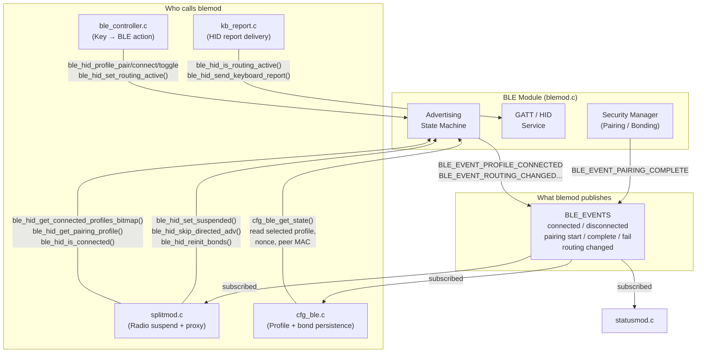

# BLE Module (`blemod`)

> **Source:** `components/ble_module/` — `blemod.c`, `ble_hid_service.c`
> **Public API:** `include/blemod.h`

The BLE module is the **Bluetooth HID peripheral stack** of the keyboard. It wraps the NimBLE host into a clean, opaque interface that the rest of the firmware talks to without knowing anything about GAP, GATT, or the NimBLE internals. It is responsible for:

- Advertising the keyboard as a HID peripheral to up to **9 simultaneous paired hosts** (profiles).
- Managing the pairing, bonding, reconnection, and advertising lifecycle.
- Sending keyboard and media key HID reports to the connected host.
- Broadcasting its internal state changes to the rest of the system as **events** on the `event_bus`.

It deliberately owns **nothing** outside of BLE. It never calls into the keyboard scanner or the split module. The dependency direction is strictly **inward**: everyone else calls into `blemod`, and `blemod` talks back only through the event bus.

---

## How the Stack Works (Briefly)

Under the hood, `blemod` uses the **NimBLE** host, which is Espressif's open-source BLE stack. It runs on a dedicated FreeRTOS task (`ble_host_task`) started by `nimble_port_freertos_init()`. Because NimBLE is event-driven, all actual BLE work happens inside the stack callbacks; `blemod.c` is essentially a collection of those callbacks and the glue that manages state around them.

**Advertising state machine** — three modes managed by a single function `ble_hid_advertise()`:

| Mode | When | Visibility | Intervals |
|---|---|---|---|
| **PAIRING** | Explicitly requested | Discoverable (GEN_DISC) | 20–30 ms fast, 60 s max |
| **RECONNECTING** | Trying to reconnect a known profile | Hidden (NON_DISC) | 20–30 ms fast, 15 s |
| **BACKGROUND** | Idle, routing active, profile not connected | Hidden (NON_DISC) | 800–1000 ms slow |

**Address rotation** — each of the 9 profile slots uses a unique *static random address* derived from the device's base BT MAC plus a per-slot `addr_nonce`. When you pair a profile (`ble_hid_profile_pair()`), the nonce increments, the address rotates, and the host sees it as a completely new device — forcing a clean re-pair without touching any other profile.

**Security** — "Just Works" pairing (no PIN, no passkey), with `sm_sc = 1` (Secure Connections / ECDH). Enough for a keyboard. Bond keys are stored in NVS by NimBLE automatically via `ble_store_config`.

**Pairing credential ownership** — `blemod` does NOT write credentials to app-level NVS directly. It fires `BLE_EVENT_PAIRING_COMPLETE` (with the peer MAC address as payload) and lets [[CONFIG_MODULE]] (`cfg_ble`) handle the save. This keeps persistence concerns out of the BLE stack.

---

## Connections to Other Modules

### 1. [[KEYBOARD_MODULE]] — HID Report Delivery

**File:** `components/keyboard/kb_report.c`

This is the most direct connection and the core reason the module exists: the keyboard matrix → BLE pipe.

**How it works:**

`kb_report.c` is the transport router. Every time a key event produces a new HID state, it calls either `kb_send_report()` or `kb_send_consumer_report()`. Inside those functions, the **first thing checked** is `ble_hid_is_routing_active()`:

```c
// kb_report.c
esp_err_t kb_send_report(const uint8_t *v_nkro) {
    if (ble_hid_is_routing_active()) {
        if (!ble_hid_is_connected()) return ESP_ERR_INVALID_STATE;
        // convert NKRO bitmap → 6KRO + modifiers, then:
        return ble_hid_send_keyboard_report(report, 8);
    }
    // ... USB path
}
```

**Why it's exclusive:** BLE and USB paths are mutually exclusive by design. If BLE routing is active, traffic goes over BLE **only** — there's no fallback to USB, and no split between transports. The `kb_hid_ready()` function similarly returns the BLE connection state when BLE routing is on, so the rest of the keyboard manager never even tries to send while BLE is down.

**NKRO → 6KRO conversion:** USB can do full N-Key Rollover via a bitmap report. BLE uses the legacy 8-byte boot-style report (1 modifier byte + 6 key slots). The conversion happens in `kb_report.c`, transparently — `blemod` never sees the NKRO format.

---

### 2. [[KEYBOARD_MODULE]] — BLE System Actions (via `ble_controller`)

**File:** `main/ble_controller.c`

This is a thin controller layer that bridges keyboard macro events (physical key presses) to BLE profile management commands.

**How it works:**

`ble_controller_init()` registers a listener on the `KB_EVENTS / KB_EVENT_SYSTEM_ACTION` event bus channel. When the user presses a key mapped to a BLE system action (e.g., `SYS_ACTION_BLE_1` through `SYS_ACTION_BLE_9`), the keyboard tap/hold engine fires an event. `ble_controller` receives it and calls the appropriate `blemod` API:

| Key event | Action |
|---|---|
| Single tap on BLE 1–9 | `ble_hid_profile_connect_and_select(id)` |
| Hold on BLE 1–9 | `ble_hid_profile_pair(id)` |
| Double tap on BLE 1–9 | `ble_hid_profile_toggle_connection(id)` |
| Single tap on BLE Toggle | `ble_hid_set_routing_active(!current)` |

**Why this exists as a separate file:** `ble_controller.c` acts as a firewall. The keyboard module doesn't need to know BLE exists, and `blemod` doesn't need to know there are physical keys. This controller translates between two completely independent vocabularies.

**Split-awareness:** The controller **ignores events from the SLAVE half**:
```c
if (splitmod_get_role() == SPLIT_ROLE_SLAVE) return;
```
This is critical — the slave's tap/hold engine would otherwise fire with different timing than the master's, causing the same key event to execute twice (once on each half). Only the master executes BLE commands from physical keys.

---

### 3. [[SPLIT_MODULE]] — Radio Suspend and BLE State Proxying

**Files:** `components/split/splitmod.c`

This is the most architecturally complex relationship. Both keyboard halves have a Bluetooth radio, but only one can act as the BLE peripheral at any time.

#### 3a. Radio Suspension (MASTER owns BLE, SLAVE kills it)

Every time the split module resolves a role — whether on initial connect or a role swap — it calls `apply_ble_routing_for_role()`:

```c
static void apply_ble_routing_for_role(split_role_t role) {
    bool should_suspend = (role == SPLIT_ROLE_SLAVE);
    // ...
    ble_hid_skip_directed_adv();   // optimization for Android on role swap
    ble_hid_set_suspended(should_suspend);
}
```

`ble_hid_set_suspended(true)` **disconnects all active BLE connections and stops advertising** without touching any config. `ble_hid_set_suspended(false)` re-enables the stack and kicks off advertising again.

**Why:** Both ESP32-S3 radios would compete for the same 2.4 GHz channel and the same host device if both were advertising. The slave goes dark so the master has full ownership of the BLE link.

**Role swap optimization:** When a role swap happens and the new master resumes BLE, it first calls `ble_hid_skip_directed_adv()`. Directed (high-duty) advertising is a BLE optimization where the peripheral targets a specific host, but Android ignores it entirely — wasting 1.28 seconds before falling back to undirected. Skipping it means the new master shows up to the host immediately.

#### 3b. Bond Sync After Role Swap

When a role swap happens, the new master needs the BLE bond keys (LTKs) that the old master had negotiated with the host. This is handled entirely by [[CONFIG_MODULE]] in `cfg_ble.c`:

- On successful pairing, `cfg_ble` fires `CONFIG_EVENT_KIND_UPDATED` with kind `CFGMOD_KIND_BLE_BOND`.
- `splitmod` listens to config updates and pushes the bond blob to the slave via `SPLIT_MSG_CONFIG_SYNC`.
- When the slave later becomes master, it already has the LTKs ready. `cfg_ble_bond_write_all()` is called to inject them into the NimBLE store, and then `ble_hid_reinit_bonds()` is called to warm the hardware resolving list.

**Why `ble_hid_reinit_bonds()`?** NimBLE keeps a hardware-level "resolving list" in the BT controller (not in RAM) that maps IRKs to peer addresses for private address resolution. Writing bond keys via `ble_store_write_*` updates the NimBLE RAM store but not the hardware list. `ble_hid_reinit_bonds()` forces a full NimBLE re-init to sync both. It must only be called while suspended (no active connections) to avoid corrupt state.

#### 3c. BLE State Proxy → SLAVE Display / Status

The slave's screen, LEDs, and configurator display need to show the correct BLE connection state — which profile is active, how many are connected, whether pairing is in progress — even though its own BLE radio is off.

**How:** Every time a BLE event fires on the master (`BLE_EVENT_PROFILE_CONNECTED`, `BLE_EVENT_ROUTING_CHANGED`, etc.), `splitmod` listens via `on_ble_event_for_slave()` and calls `send_ble_status_to_slave()`. This function packages the current BLE state into a `SPLIT_MSG_BLE_STATUS` packet and sends it to the slave over ESP-NOW. On the slave side, this triggers `SPLIT_EVENT_BLE_STATUS_UPDATED`, which [[STATUS_MODULE]] consumes to update whatever display element is showing connection state.

#### 3d. BLE Command Proxy ← SLAVE Configurator

The USB Configurator app connects to whichever half is physically plugged in. If that half is the SLAVE, BLE commands from the configurator need to reach the master.

```
[Configurator App]
       │  USB Raw HID (MODULE_BLE command)
       ▼
[SLAVE's ble_usb_callback()]   ←─ registered in splitmod
       │  SPLIT_MSG_BLE_CMD over ESP-NOW
       ▼
[MASTER's execute_ble_cmd()]
       │  direct call to blemod API
       ▼
[ble_hid_set_routing_active() / ble_hid_profile_pair() / etc.]
```

The slave's `ble_usb_callback()` checks `splitmod_get_role()`. If SLAVE and connected, it packages the command into `split_ble_cmd_payload_t` and sends it over ESP-NOW. The master receives `SPLIT_MSG_BLE_CMD`, calls `execute_ble_cmd()`, which calls the actual `blemod` functions. The result propagates back via `BLE_EVENT_*` → `send_ble_status_to_slave()` → the configurator gets updated state.

---

### 4. [[CONFIG_MODULE]] — Profile Persistence and Bond Management

**Files:** `components/config_module/cfg_ble.c`, `cfg_ble.h`

`blemod` knows nothing about NVS or JSON. All persistence is owned by `cfg_ble`.

**Profile state (`cfg_ble_state_t`)** — serialized to NVS as JSON under the `CFGMOD_KIND_CONNECTION` / `"ble_cfg"` key. Contains: which profile is selected, BLE routing on/off, and for each of the 9 profile slots: peer MAC address, address type, and `addr_nonce`.

**How `blemod` reads config:** At runtime, `blemod` calls `cfg_ble_get_state()` directly to read the selected profile, routing flag, peer addresses, and nonces. This is a synchronous, in-memory read — no NVS access at runtime.

**How `blemod` triggers config saves:** It doesn't. On pairing success, `blemod` fires:
```c
esp_event_post(BLE_EVENTS, BLE_EVENT_PAIRING_COMPLETE, &result, sizeof(result), 0);
```
`cfg_ble` is subscribed to `BLE_EVENT_PAIRING_COMPLETE`. It receives the peer MAC, writes the new profile data, increments `sync_version` (so a split slave will not reject this as a stale sync), and saves to NVS. It also deduplicates: if the same physical host re-pairs on a different profile slot, the old slot is invalidated automatically.

**Bond key management** — NimBLE stores raw cryptographic bond keys (LTKs, IRKs, CCCDs) in its own NVS partition via `ble_store_config`. `cfg_ble` provides a serialization layer on top:
- `cfg_ble_bond_read_all()` — iterates NimBLE's volatile store and packs all records into a flat binary blob.
- `cfg_ble_bond_write_all()` — clears the current store and replays a received blob. Used by the SLAVE when it receives a bond sync from the MASTER.

**Stale sync guard:** `sync_version` is a monotonically increasing counter on the bond blob. If the slave receives a bond sync with a `sync_version` lower than its own, it silently drops it. This prevents the slave from reverting its bonds to an older state after a cross-split pairing event.

---

### 5. [[USB_MODULE]] — Mutual Exclusivity

**File:** `components/keyboard/kb_report.c`

BLE and USB are architecturally mutually exclusive transports. There is no "send to both" mode.

The gate is `ble_hid_is_routing_active()` in `kb_send_report()` and `kb_hid_ready()`. When BLE routing is enabled:
- USB keyboard reports are **never sent**, even if a USB host is connected.
- `kb_hid_ready()` returns `false` if BLE is routing but not yet connected, blocking the keyboard manager from sending.

When BLE routing is disabled:
- `kb_send_report()` falls through to the TinyUSB path.
- The BLE advertisements continue in background mode, but no HID data flows.

**Why this matters:** Without this gate, a brief BLE drop while USB is connected would cause half the keypresses to go to the BLE host and half to the USB host — a confusing split-brain scenario. The explicit routing flag makes the active transport unambiguous at all times.

---

### 6. [[STATUS_MODULE]] — Event Consumer

**File:** `components/status_module/statusmod.c`

`statusmod` subscribes to the full set of `BLE_EVENTS` to drive UI feedback (LEDs, screen, configurator status panel). It is a pure **consumer** — it writes nothing to `blemod`.

Events consumed:

| Event | Payload | What statusmod does |
|---|---|---|
| `BLE_EVENT_PROFILE_CONNECTED` | `int profile_idx` | Mark profile as connected |
| `BLE_EVENT_PROFILE_DISCONNECTED` | `int profile_idx` | Mark profile as disconnected |
| `BLE_EVENT_PAIRING_STARTED` | `int profile_idx` | Show pairing mode indicator |
| `BLE_EVENT_PAIRING_COMPLETE` | `ble_pairing_result_t` | Confirm pairing success |
| `BLE_EVENT_PAIRING_FAILED` | `int profile_idx` | Show failure |
| `BLE_EVENT_PAIRING_TIMEOUT` | `int profile_idx` | Show timeout |
| `BLE_EVENT_ROUTING_CHANGED` | `bool active` | Update transport indicator |

On the SLAVE half, `statusmod` instead consumes `SPLIT_EVENT_BLE_STATUS_UPDATED` (posted by `splitmod` after receiving `SPLIT_MSG_BLE_STATUS` from the master) to show the same information — since the slave never sees real `BLE_EVENTS` because its radio is suspended.

---

## Dependency Flow Summary



---

## Initialization Order (from `main.c`)

```
event_bus_init()
cfg_init()           ← cfg_ble_init() subscribes to BLE_EVENT_PAIRING_COMPLETE
usb_init()
ble_hid_init()       ← NimBLE stack starts, GATT registered, advertising begins
ble_controller_init() ← registers KB_EVENT_SYSTEM_ACTION handler
status_module_init() ← subscribes to BLE_EVENTS
splitmod_init()      ← may call ble_hid_set_suspended() after role negotiation
kb_manager_start()
```

`cfg_init()` must come before `ble_hid_init()` so that `cfg_ble_get_state()` returns valid profile data the moment the BLE stack first calls `ble_hid_advertise()` on sync.

---

##  File Map

| File | Responsibility |
|---|---|
| `blemod.c` | Core logic for NimBLE integration, advertising state machine, and profile handling. |
| `ble_hid_service.c` | GATT service implementation for standard HID Report Maps and control points. |
| `ble_controller.c` | Translation layer bridging physical key events to BLE system commands. |
| `include/blemod.h` | Public APIs for sending reports, selecting profiles, and managing the radio. |
