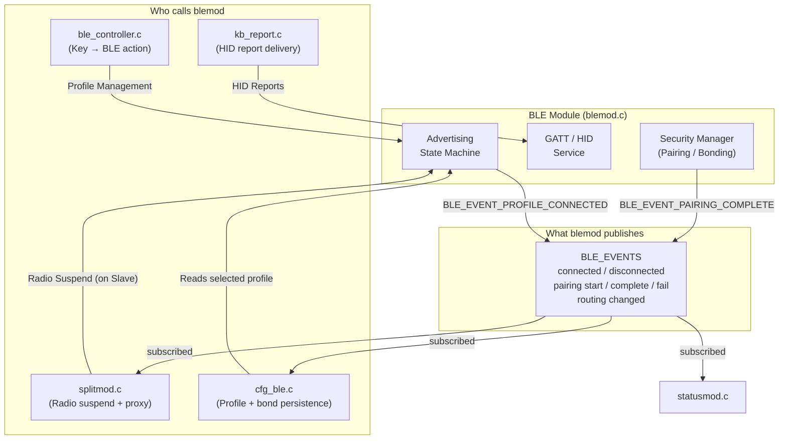

# BLE Module (`blemod`)

> **For deep debugging and implementation details, see:** `components/ble_module/BLE_MODULE.md`

## What it does
The BLE module is the **Bluetooth HID peripheral stack** of the keyboard. It wraps the NimBLE host into a clean interface responsible for advertising the keyboard, managing the pairing/bonding lifecycle, and sending wireless HID reports to connected hosts. It also exposes a Custom GATT service for wireless configuration.

## Why it exists
To isolate all Bluetooth complexity from the core keyboard logic. The module owns nothing outside of BLE: it never calls into the keyboard scanner or the split module. Instead, other modules call into it, and it broadcasts state changes (e.g., connected, pairing) via the system Event Bus.

## Module Connections
- **[KEYBOARD_MODULE](KEYBOARD_MODULE.md)**: Sends HID keyboard reports to the BLE stack to be transmitted to the active wireless host.
- **[SPLIT_MODULE](SPLIT_MODULE.md)**: Suspends the BLE radio on the Slave half to prevent interference and proxies BLE commands across the split link.
- **[CONFIG_MODULE](CONFIG_MODULE.md)**: Reads the active profile and saves persistent pairing/bonding keys (LTKs) when BLE fires a pairing success event.
- **[STATUS_MODULE](STATUS_MODULE.md)**: Listens to BLE events (connections, routing changes) to update user-facing UI indicators.

## Dependency Flow

