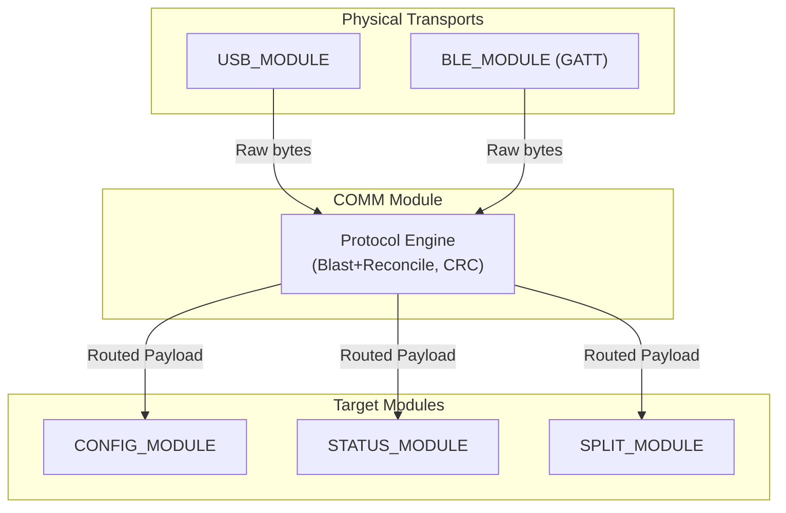

# COMM Module (`comm_module`)

> **For deep debugging and implementation details, see:** `components/comm_module/COMM_MODULE.md`

## What it does
The `comm_module` is the **transport-agnostic protocol engine** of the keyboard. It implements the Blast+Reconcile protocol to provide a reliable, flow-controlled data pipe for the Configurator app to read and write configuration, control the split link, and query device status.

## Why it exists
To decouple the logic of "talking to the configurator" from the physical transport. It knows nothing about USB or BLE; those modules register themselves as transports at boot. The COMM module handles variable packet length validation, CRC checking, chunking, and routing the incoming payloads to the correct sub-module (like CONFIG or STATUS) based on the Module ID.

## Module Connections
- **[USB_MODULE](USB_MODULE.md)**: Registers as a wired transport, passing raw byte arrays from the USB host to the COMM engine.
- **[BLE_MODULE](BLE_MODULE.md)**: Registers as a wireless transport via its Custom GATT service, passing raw bytes from the BLE host.
- **[CONFIG_MODULE](CONFIG_MODULE.md)**: The primary receiver of COMM payloads, handling GET/SET commands to read or modify persistent settings.
- **[STATUS_MODULE](STATUS_MODULE.md)**: Polled by the COMM engine to push live device state to the Configurator.
- **[SPLIT_MODULE](SPLIT_MODULE.md)**: Receives commands via COMM to control split pairing, role swapping, and benchmarking.
- **[CONFIGURATOR](CONFIGURATOR.md)**: The external Web app that sits on the other side of this protocol, acting as the client.

## Dependency Flow

