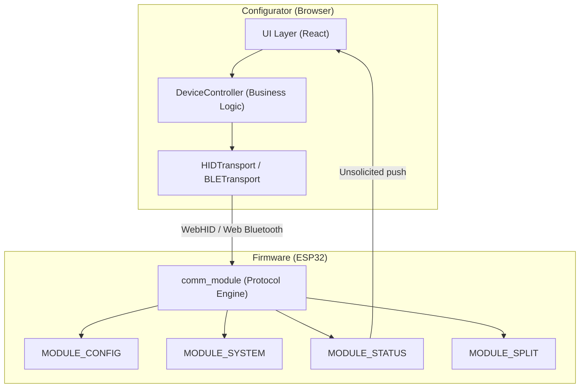

# Configurator (Web App)

> **For deep debugging and implementation details, see:** `configurator/CONFIGURATOR.md`

## What it does
The **Configurator** is the browser-based GUI (React + Vite) for the keyboard firmware. It communicates with the device over either USB (WebHID) or Bluetooth (Web Bluetooth), implementing the exact same Blast+Reconcile transport protocol as the firmware.

## Why it exists
To allow users to visually edit layouts, macros, custom keys, and device identity without installing a driver or companion app. It acts as the only external consumer of the firmware's `MODULE_CONFIG`, `MODULE_SYSTEM`, `MODULE_STATUS`, `MODULE_SPLIT`, and `MODULE_BLE` channels.

## Module Connections
- **[COMM_MODULE](COMM_MODULE.md)**: The Configurator speaks exactly the same Blast+Reconcile protocol as this module to guarantee lossless data transfer over WebHID/WebBluetooth.
- **[CONFIG_MODULE](CONFIG_MODULE.md)**: Targeted via GET/SET requests to visually edit layouts, macros, custom keys, and device identity.
- **[STATUS_MODULE](STATUS_MODULE.md)**: Sends unsolicited status payloads to the Configurator to update the UI's live connection and health indicators.
- **[KEYBOARD_MODULE](KEYBOARD_MODULE.md)**: Accepts `SYS_CMD_INJECT_KEY` commands from the Configurator to simulate physical key presses for testing layouts.
- **[SPLIT_MODULE](SPLIT_MODULE.md)**: Managed remotely by the Configurator to handle pairing and unpairing of halves.

## Dependency Flow

