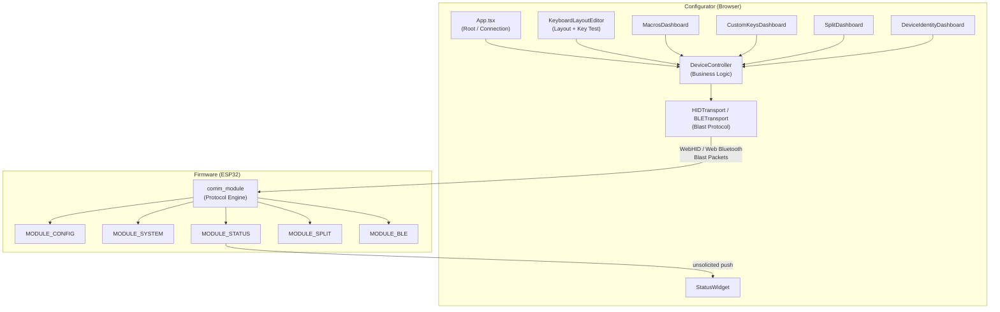

# Configurator (Web App)

> **Source:** `configurator/src/`
> **Entry point:** `configurator/src/main.tsx` → `App.tsx`
> **Tech stack:** React 19 + TypeScript + Vite — runs entirely in the browser, no backend server.

The **Configurator** is the browser-based GUI for the keyboard firmware. It communicates with the device over either the **USB COMM channel (WebHID API)** or the **BLE COMM channel (Web Bluetooth API)**, implementing the exact same Blast+Reconcile transport protocol as the firmware. The user never installs a driver or companion app — they open a URL, click Connect, and the browser talks directly to the keyboard.

> [!NOTE]
> Because WebHID is a high-privilege device API, browsers strictly require a **Secure Context (HTTPS)** to enable it. Consequently, for local testing and development purposes only, the server runs over HTTPS using `@vitejs/plugin-basic-ssl` (`https://localhost:5173`) with a self-signed certificate. Any production/public hosting must be configured with a standard trusted SSL/TLS certificate (such as Let's Encrypt).

It is the **only external consumer** of the firmware's `MODULE_CONFIG`, `MODULE_SYSTEM`, `MODULE_STATUS`, `MODULE_SPLIT`, and `MODULE_BLE` channels.

---

## Internal Architecture

The application is divided into three layers that mirror the firmware's own layered design:

```
┌────────────────────────────────────────────────────────────────────┐
│  UI Layer  (React components)                                      │
│  App.tsx / KeyboardLayoutEditor / MacrosDashboard / SplitDashboard │
│  CustomKeysDashboard / DeviceIdentityDashboard / StatusWidget      │
├────────────────────────────────────────────────────────────────────┤
│  Business Logic Layer                                              │
│  DeviceController.ts   (typed command methods)                     │
│  hooks/useMacros.ts    (macro CRUD + state + 7s timeout guard)     │
│  hooks/useCustomKeys.ts (custom key CRUD + state + 7s timeout guard)│
│  hooks/useCombos.ts     (combos CRUD + state + 7s timeout guard)   │
│  stores/notificationStore.ts  (global notification state)          │
│  stores/layoutStore.ts        (physical layout + connection state)  │
├────────────────────────────────────────────────────────────────────┤
│  Transport Layer                                                   │
│  HIDTransport.ts  (WebHID, CRC-8, Blast+Reconcile state machine)   │
└────────────────────────────────────────────────────────────────────┘
```

### 1. Transport Layer (`HIDTransport.ts` / `BLETransport.ts`)

This is the TypeScript mirror of the firmware's protocol engine (`comm_module`). It implements:

- **WebHID discovery**: Filters for `VID=0x303A / PID=0x1324`.
- **Web Bluetooth discovery**: Filters for the Custom GATT COMM Service UUID (`4D544546-0001-4B42-4254-455F434F4D4D`).
- **Auto-reconnect**: Polls every 2 seconds for reconnection after disconnect.
- **CRC-8**: Same polynomial (`0x07`) and lookup table as `usb_crc.c` in the firmware. Every outgoing packet is CRC-stamped; incoming packets are verified.
- **Packet structure** (63 bytes, mirrors `usb_packet_msg_t`):

| Offset | Size | Field |
|---|---|---|
| 0 | 1 | `flags` |
| 1 | 2 | `remaining_packets` (little-endian) |
| 3 | 1 | `payload_len` |
| 4 | 58 | `payload` |
| 62 | 1 | `crc` |

- **Blast+Reconcile TX/RX**: For payloads larger than 58 bytes (e.g., full layer dumps, macro libraries), the transport fires all `MID` packets without waiting for individual ACKs, then performs bitmap reconciliation to retransmit any gaps. This matches the firmware's blast mode exactly — both sides speak the same protocol.
- **Serial Task Queue**: All commands run through a FIFO queue with a 50 ms inter-task delay. This prevents protocol overlap if the UI fires multiple requests simultaneously (e.g., loading all four layers at once).
- **Unsolicited push handling**: Incoming `MODULE_STATUS` packets from the firmware are dispatched to registered `onStatusUpdate` observers without going through the command queue.

### 2. Business Logic Layer (`DeviceController.ts`)

Wraps `HIDTransport` with typed, named methods so UI components never deal with raw bytes:

```ts
// Examples
controller.getPhysicalLayout()    // → GET MODULE_CONFIG / CFG_KEY_PHYSICAL_LAYOUT
controller.setLayer(0, layerData) // → SET MODULE_CONFIG / CFG_KEY_LAYER_0
controller.saveMacro(macro)       // → SET MODULE_CONFIG / CFG_KEY_MACRO_SINGLE
controller.sendInjectKey(r, c, pressed) // → MODULE_SYSTEM / SYS_CMD_INJECT_KEY
controller.toggleBleRouting()     // → MODULE_BLE / BLE_CMD_TOGGLE_ROUTING
```

The legacy `HIDService.ts` file is a thin re-export façade that maps old import paths to this new structure for backward compatibility.

### 3. UI Layer

| Component | Section / Role | What it manages |
|---|---|---|
| `App.tsx` | Root shell | Connection state, sidebar state, Developer Mode |
| `KeyboardLayoutEditor.tsx` | Always visible | Visual key editor, layer switching, multi-selection (Ctrl+Drag), physical layout management |
| `Sidebar.tsx` | Right-edge navigation | Glassmorphic icon rail + expandable panel; hosts dashboards; Settings + Console button triggers |
| `MacrosDashboard.tsx` | Sidebar panel | Macro list, event sequence editor, CRUD + Export/Import, Search bar |
| `MacroTimelineEditor.tsx` | Visual Macro Editor | Visual track representation, DOM batching playback, marquee selection |
| `CustomKeysDashboard.tsx` | Sidebar panel | Press/Release and MultiAction key rule editing + Export/Import, Search bar |
| `CombosDashboard.tsx` | Sidebar panel | Combos list, `ComboKeySelector` + Export/Import, Search bar |
| `SettingsModal.tsx` | Modal (gear icon) | Wraps DeviceDashboard for device name, split link, BLE identity settings |
| `DevConsoleModal.tsx` | Modal (dev mode) | Developer console log viewer (replaces DevControlsPanel bottom strip) |
| `StatusWidget.tsx` | Header | Always visible indicators for BLE/USB/Split state pushed from [STATUS_MODULE](file:///home/srleg/Projects/Tecleados-ESP-Firmware/universe/modules/STATUS_MODULE.md) |
| `SearchableKeyModal.tsx` | Modal Picker | Searchable HID key picker modal with custom title support |

### 4. Global UI Interactions
- **Shortcuts:** `Escape` closes sidebars, modals, and clears selection. `Ctrl+1/2/3` jumps to Macros, Custom Keys, and Combos dashboards respectively. `Ctrl+F` focuses the search bar inside the active dashboard.
- **Glassmorphism:** The sidebar and dashboard cards heavily utilize translucent, blurred backgrounds to seamlessly integrate over the 3D rendering canvas.

---

> [!TIP]
> For exhaustive technical details on the configurator's implementation, rendering pipeline, KLE import, macros, custom keys, combos, and internal state management, please refer to the primary [Configurator Technical Documentation](../../configurator/CONFIGURATOR.md).


## Cross-Module Connections

### [COMM_MODULE](file:///home/srleg/Projects/Tecleados-ESP-Firmware/universe/modules/COMM_MODULE.md) — The Protocol Engine

All configurator↔firmware traffic flows through the transport-agnostic `comm_module`. The configurator mirrors the firmware's protocol constants word-for-word in `types/protocol.ts`:
- Same Flag byte definitions (`FIRST`, `MID`, `LAST`, `ACK`, `NAK`, etc.)
- Same CRC-8 polynomial and table
- Adapts dynamically to the transport's max packet size (63 bytes for USB, up to 260 bytes for BLE).

Any mismatch between `types/protocol.ts` and `comm_defs.h` will break communication silently (packets will CRC-fail or be routed to the wrong module).

### [CONFIG_MODULE](file:///home/srleg/Projects/Tecleados-ESP-Firmware/universe/modules/CONFIG_MODULE.md) — Read/Write Everything

The configurator is the primary client of `cfg_usb_callback()`. Every user action maps to a GET or SET command on a specific `key_id`:

| User Action | Command | Key ID |
|---|---|---|
| Open "Layout" section | GET | `CFG_KEY_LAYER_0..3` |
| Save layer changes | SET | `CFG_KEY_LAYER_0..3` |
| Open "Layout" (dev mode) | GET | `CFG_KEY_PHYSICAL_LAYOUT` |
| Save physical layout | SET | `CFG_KEY_PHYSICAL_LAYOUT` |
| Open "Macros & CKs" | GET | `CFG_KEY_MACROS`, `CFG_KEY_MACRO_LIMITS` |
| Edit a macro | GET / SET | `CFG_KEY_MACRO_SINGLE` |
| Open "Macros & CKs" | GET | `CFG_KEY_CKEYS` |
| Edit a custom key | GET / SET | `CFG_KEY_CKEY_SINGLE` |
| Open "Macros & CKs" | GET | `CFG_KEY_COMBOS`, `CFG_KEY_COMBO_LIMITS` |
| Edit a combo | GET / SET | `CFG_KEY_COMBO_SINGLE` |
| Open "Identity" (dev mode) | GET | `CFG_KEY_SYSTEM` |
| Save identity | SET | `CFG_KEY_SYSTEM` (name, mirror_cols, variant) |

### [STATUS_MODULE](file:///home/srleg/Projects/Tecleados-ESP-Firmware/universe/modules/STATUS_MODULE.md) — Live State Display

The `StatusWidget.tsx` component subscribes to unsolicited status pushes from the firmware. On initial connection, `App.tsx` sends a `MODULE_STATUS` poll to request an immediate snapshot before any BLE or split event fires. The widget maps the JSON fields to human-readable indicators:

```json
{ "mode": 1, "profile": 2, "pairing": -1, "bitmap": 7, "split_state": 4, "split_role": 1 }
```

### [SPLIT_MODULE](file:///home/srleg/Projects/Tecleados-ESP-Firmware/universe/modules/SPLIT_MODULE.md) — Split Keyboard Control

`SplitDashboard.tsx` sends `MODULE_SPLIT` commands for pairing, unpairing, role swap, and RTT benchmarking. It also uses `MODULE_BLE` to toggle BLE routing or connect/pair profiles. If the plugged-in half is the slave, the firmware transparently proxies these BLE commands to the master over the ESP-NOW link — the configurator does not need to know which half it is talking to.

### [KEYBOARD_MODULE](file:///home/srleg/Projects/Tecleados-ESP-Firmware/universe/modules/KEYBOARD_MODULE.md) — Key Test Mode

The "Key Test" feature in `KeyboardLayoutEditor.tsx` uses `MODULE_SYSTEM` to inject simulated key presses into the firmware's matrix scanner:

| Command | Byte | Effect |
|---|---|---|
| `SYS_CMD_INJECT_KEY` | `0x01` | Simulate press/release at `[row, col]` |
| `SYS_CMD_CLEAR_INJECTED` | `0x02` | Release all injected keys |

Injected keys pass through the full keyboard pipeline (layers, macros, custom keys) and produce real HID output. This lets the user verify that a layout change works before saving.


## Dependency Flow



