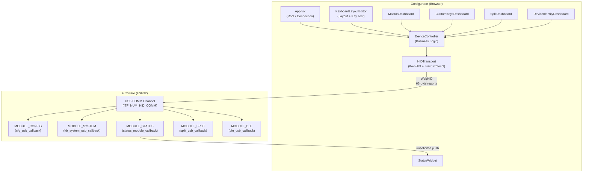

# Configurator (Web App)

> **Source:** `configurator/src/`
> **Entry point:** `configurator/src/main.tsx` → `App.tsx`
> **Tech stack:** React 19 + TypeScript + Vite — runs entirely in the browser, no backend server.

The **Configurator** is the browser-based GUI for the keyboard firmware. It communicates with the device over [[USB_MODULE|the USB COMM channel]] using the **WebHID API**, implementing the exact same Blast+Reconcile transport protocol as the firmware. The user never installs a driver or companion app — they open a URL, click Connect, and the browser talks directly to the keyboard. 

> [!NOTE]
> Because WebHID is a high-privilege device API, browsers strictly require a **Secure Context (HTTPS)** to enable it. Consequently, for local testing and development purposes only, the server runs over HTTPS using `@vitejs/plugin-basic-ssl` (`https://localhost:5173`) with a self-signed certificate. Any production/public hosting must be configured with a standard trusted SSL/TLS certificate (such as Let's Encrypt).

It is the **only external consumer** of the firmware's `MODULE_CONFIG`, `MODULE_SYSTEM`, `MODULE_STATUS`, `MODULE_SPLIT`, and `MODULE_BLE` channels.

---

## Internal Architecture

The application is divided into three layers that mirror the firmware's own layered design:

```
┌────────────────────────────────────────────────────────────────────┐
│  UI Layer  (React components)                                      │
│  App.tsx / KeyboardLayoutEditor / MacrosDashboard / SplitDashboard │
│  CustomKeysDashboard / DeviceIdentityDashboard / StatusWidget      │
├────────────────────────────────────────────────────────────────────┤
│  Business Logic Layer                                              │
│  DeviceController.ts   (typed command methods)                     │
│  hooks/useMacros.ts    (macro CRUD + state + 7s timeout guard)     │
│  hooks/useCustomKeys.ts (custom key CRUD + state + 7s timeout guard)│
│  hooks/useCombos.ts     (combos CRUD + state + 7s timeout guard)   │
│  stores/notificationStore.ts  (global notification state)          │
│  stores/layoutStore.ts        (physical layout + connection state)  │
├────────────────────────────────────────────────────────────────────┤
│  Transport Layer                                                   │
│  HIDTransport.ts  (WebHID, CRC-8, Blast+Reconcile state machine)   │
└────────────────────────────────────────────────────────────────────┘
```

### 1. Transport Layer (`HIDTransport.ts`)

This is the TypeScript mirror of the firmware's `usb_callbacks_tx.c` / `usb_callbacks_rx.c`. It implements:

- **WebHID discovery**: Filters for `VID=0x303A / PID=0x1324`. Polls every 2 seconds for reconnection after disconnect.
- **CRC-8**: Same polynomial (`0x07`) and lookup table as `usb_crc.c` in the firmware. Every outgoing packet is CRC-stamped; incoming packets are verified.
- **Packet structure** (63 bytes, mirrors `usb_packet_msg_t`):

| Offset | Size | Field |
|---|---|---|
| 0 | 1 | `flags` |
| 1 | 2 | `remaining_packets` (little-endian) |
| 3 | 1 | `payload_len` |
| 4 | 58 | `payload` |
| 62 | 1 | `crc` |

- **Blast+Reconcile TX/RX**: For payloads larger than 58 bytes (e.g., full layer dumps, macro libraries), the transport fires all `MID` packets without waiting for individual ACKs, then performs bitmap reconciliation to retransmit any gaps. This matches the firmware's blast mode exactly — both sides speak the same protocol.
- **Serial Task Queue**: All commands run through a FIFO queue with a 50 ms inter-task delay. This prevents protocol overlap if the UI fires multiple requests simultaneously (e.g., loading all four layers at once).
- **Unsolicited push handling**: Incoming `MODULE_STATUS` packets from the firmware are dispatched to registered `onStatusUpdate` observers without going through the command queue.

### 2. Business Logic Layer (`DeviceController.ts`)

Wraps `HIDTransport` with typed, named methods so UI components never deal with raw bytes:

```ts
// Examples
controller.getPhysicalLayout()    // → GET MODULE_CONFIG / CFG_KEY_PHYSICAL_LAYOUT
controller.setLayer(0, layerData) // → SET MODULE_CONFIG / CFG_KEY_LAYER_0
controller.saveMacro(macro)       // → SET MODULE_CONFIG / CFG_KEY_MACRO_SINGLE
controller.sendInjectKey(r, c, pressed) // → MODULE_SYSTEM / SYS_CMD_INJECT_KEY
controller.toggleBleRouting()     // → MODULE_BLE / BLE_CMD_TOGGLE_ROUTING
```

The legacy `HIDService.ts` file is a thin re-export façade that maps old import paths to this new structure for backward compatibility.

### 3. UI Layer

| Component | Section / Role | What it manages |
|---|---|---|
| `App.tsx` | Root shell | Connection state, section routing (Header Nav), Developer Mode |
| `KeyboardLayoutEditor.tsx` | "Layout" section | Visual key editor, layer switching, multi-selection (Ctrl+Drag), physical layout management |
| `MacrosDashboard.tsx` | "Macros & CKs" | Macro list, event sequence editor, CRUD + Export/Import |
| `CustomKeysDashboard.tsx` | "Macros & CKs" | Press/Release and MultiAction key rule editing + Export/Import |
| `CombosDashboard.tsx` | "Macros & CKs" | Combos list, combo grid selector + Export/Import |
| `SplitDashboard.tsx` | "Split" section | Pairing, role swap, latency benchmark, remote matrix visualizer |
| `DeviceIdentityDashboard.tsx` | "Identity" (Dev) | Device name, split mirror/variant, shared BLE address (Developer Mode only) |
| `StatusWidget.tsx` | Header | Always visible indicators for BLE/USB/Split state pushed from [[STATUS_MODULE]] |
| `DevControlsPanel.tsx` | Dev Mode only | Raw packet log (bottom strip), protocol debug tools |

---

## The Physical Layout System

The physical layout describes **where each key sits on the desk** — not what it does. It drives the visual rendering in `KeyboardLayoutEditor.tsx` and is stored persistently by [[CONFIG_MODULE|`cfg_physical.c`]] on the device.

### On-Wire Format

The firmware stores and returns a JSON blob (up to 4096 bytes):

```json
{
  "rows": 6,
  "cols": 18,
  "layout": [
    [row, col, w×100, h×100, x×100, y×100,  ...repeat per key...],
    ...one array per visual row...
  ],
  "rotation": {
    "row-col": [r×10, rx×100, ry×100]
  }
}
```

- Each key occupies **6 consecutive integers** in its visual-row array. Dimensions are scaled by 100 to avoid floating-point in NVS.
- The optional `rotation` side-map records rotation data for keys that are not axis-aligned (e.g., angled thumb clusters). It is keyed by `"row-col"` string so old firmware that ignores unknown JSON fields is unaffected.
- `r` is scaled by **10** (not 100) to preserve one decimal place of precision for common angles like `±15.5°`.

Parsing and serialization live in `configurator/src/utils/layoutUtils.ts` (`parsePhysicalLayoutJson` / `serializePhysicalLayout`).

### In-App Representation (`PhysKey`)

```ts
interface PhysKey {
    row: number;   // matrix row (used to look up action codes in layer data)
    col: number;   // matrix column
    w: number;     // width in KLE units
    h: number;     // height in KLE units
    x: number;     // absolute X position (top-left corner, KLE units)
    y: number;     // absolute Y position (top-left corner, KLE units)
    r?: number;    // rotation angle in degrees (positive = clockwise)
    rx?: number;   // rotation origin X (KLE units, absolute)
    ry?: number;   // rotation origin Y (KLE units, absolute)
}
```

### Visual Rendering

`KeyboardLayoutEditor.tsx` renders each `PhysKey` as an absolutely-positioned `<button>` inside a single `position: relative` container:

```
left  = (pk.x - minKeyX) × 3.2rem
top   = (pk.y - minKeyY) × 3.2rem
width = pk.w × 3.2rem − 0.25rem   (gap)
height = pk.h × 3.2rem − 0.25rem  (gap)
```

For rotated keys, a CSS transform is applied so the visual rotation matches KLE exactly:
```css
transform: rotate(pk.r deg);
transform-origin: (pk.rx − pk.x) × 3.2rem  (pk.ry − pk.y) × 3.2rem;
```

The bounding box of the container is computed by rotating the four corners of every key mathematically, so rotated thumb clusters never clip or overflow the container.

---

## KLE Import Pipeline

The configurator can import a physical layout directly from **Keyboard Layout Editor** JSON (copy-pasted from keyboard-layout-editor.com). The pipeline lives in `configurator/src/utils/kleParser.ts`.

### KLE Parser Rules

The parser implements the full KLE state machine, including the rotation spec that most community parsers get wrong:

| State variable | Reset behaviour |
|---|---|
| `currentX` | Resets to `0` at the start of each KLE row |
| `currentY` | Accumulates; advances by `+1` at end of each row |
| `currentR`, `currentRx`, `currentRy` | **Persistent** across rows — only change when explicitly set |

Critical ordering inside each property object `{...}`:
1. `rx` → `currentX = rx`, **`currentY = currentRy`** (Y snaps back to the stored rotation origin)
2. `ry` → `currentY = ry`, `currentRy = ry`
3. `r` → `currentR = r`
4. `x`, `y` → applied as **offsets** on top of the (possibly reset) position

Step 1 is the most commonly mis-implemented rule. When `rx` is set without `ry`, `currentY` must still snap to the last stored `currentRy`. This is what makes asymmetric thumb-cluster pairs (where only the first key sets `ry`) land in the correct symmetric position.

### Post-Parse Corrections

After the raw parse, two normalization passes run:

1. **Auto-anchor**: Shifts the entire layout so the minimum `(x, y)` across all keys is `(0, 0)`. The rotation origins `(rx, ry)` are shifted by the same amount to preserve geometry.

2. **Collision resolution**: `Math.round(x)` and `Math.round(y)` are used as the matrix `col`/`row`. For split keyboards, rotated thumb-cluster keys often round to the same integer pair as a key in the main body. When a collision is detected, `col` is incremented until a free slot is found, guaranteeing every physical key has a unique `{row, col}` identity. The user can then correct the matrix assignments using the row/col overlay in Developer Mode.

---

## Layer Data

Each layer is a `6 × 18` matrix of 16-bit action codes, matching the firmware's `MATRIX_ROWS × MATRIX_COLS` constants in `kb_manager.c`. The action code spaces are defined in `types/protocol.ts` and mirror `kb_layout.h`:

| Range | Type | Description |
|---|---|---|
| `0x0001`–`0x00FF` | HID Key | Standard keyboard keys |
| `0x0100`–`0x01FF` | Media Key | Consumer control (Volume, Play, etc.) |
| `0x2000`–`0x20FF` | System Action | Layer toggles, BLE profile swap, split pairing |
| `0x3000`–`0x3FFF` | Custom Key | User-defined multi-action keys |
| `0x4000`–`0x4FFF` | Macro | Triggers a named macro sequence |
| `0xFFFF` | Transparent | Falls through to the layer below |

Layer data is serialized as a flat JSON array (one array per layer row) and sent via `CFG_KEY_LAYER_0`–`CFG_KEY_LAYER_3` on `MODULE_CONFIG`.

---

## Cross-Module Connections

### [[USB_MODULE]] — The Communication Pipe

All configurator↔firmware traffic flows through the USB COMM channel (`ITF_NUM_HID_COMM`). The configurator mirrors the firmware's protocol constants word-for-word in `types/protocol.ts`:
- Same `VID/PID` for device discovery
- Same `COMM_REPORT_SIZE = 63`, `MAX_PAYLOAD_LENGTH = 58`
- Same flag byte definitions (`FIRST`, `MID`, `LAST`, `ACK`, `NAK`, etc.)
- Same CRC-8 polynomial and table

Any mismatch between `types/protocol.ts` and `usb_defs.h` / `cfgmod.h` will break communication silently (packets will CRC-fail or be routed to the wrong module).

### [[CONFIG_MODULE]] — Read/Write Everything

The configurator is the primary client of `cfg_usb_callback()`. Every user action maps to a GET or SET command on a specific `key_id`:

| User Action | Command | Key ID |
|---|---|---|
| Open "Layout" section | GET | `CFG_KEY_LAYER_0..3` |
| Save layer changes | SET | `CFG_KEY_LAYER_0..3` |
| Open "Layout" (dev mode) | GET | `CFG_KEY_PHYSICAL_LAYOUT` |
| Save physical layout | SET | `CFG_KEY_PHYSICAL_LAYOUT` |
| Open "Macros & CKs" | GET | `CFG_KEY_MACROS`, `CFG_KEY_MACRO_LIMITS` |
| Edit a macro | GET / SET | `CFG_KEY_MACRO_SINGLE` |
| Open "Macros & CKs" | GET | `CFG_KEY_CKEYS` |
| Edit a custom key | GET / SET | `CFG_KEY_CKEY_SINGLE` |
| Open "Macros & CKs" | GET | `CFG_KEY_COMBOS` |
| Edit a combo | GET / SET | `CFG_KEY_COMBO_SINGLE` |
| Open "Identity" (dev mode) | GET | `CFG_KEY_SYSTEM` |
| Save identity | SET | `CFG_KEY_SYSTEM` (name, mirror_cols, variant) |

### [[STATUS_MODULE]] — Live State Display

The `StatusWidget.tsx` component subscribes to unsolicited status pushes from the firmware. On initial connection, `App.tsx` sends a `MODULE_STATUS` poll to request an immediate snapshot before any BLE or split event fires. The widget maps the JSON fields to human-readable indicators:

```json
{ "mode": 1, "profile": 2, "pairing": -1, "bitmap": 7, "split_state": 4, "split_role": 1 }
```

### [[SPLIT_MODULE]] — Split Keyboard Control

`SplitDashboard.tsx` sends `MODULE_SPLIT` commands for pairing, unpairing, role swap, and RTT benchmarking. It also uses `MODULE_BLE` to toggle BLE routing or connect/pair profiles. If the plugged-in half is the slave, the firmware transparently proxies these BLE commands to the master over the ESP-NOW link — the configurator does not need to know which half it is talking to.

### [[KEYBOARD_MODULE]] — Key Test Mode

The "Key Test" feature in `KeyboardLayoutEditor.tsx` uses `MODULE_SYSTEM` to inject simulated key presses into the firmware's matrix scanner:

| Command | Byte | Effect |
|---|---|---|
| `SYS_CMD_INJECT_KEY` | `0x01` | Simulate press/release at `[row, col]` |
| `SYS_CMD_CLEAR_INJECTED` | `0x02` | Release all injected keys |

Injected keys pass through the full keyboard pipeline (layers, macros, custom keys) and produce real HID output. This lets the user verify that a layout change works before saving.

---

## 3D Background Studio Environment (`Background3D.tsx` / `App.tsx` / `index.css`)

The configurator features a highly immersive, multi-layered background environment combining a **procedurally generated real-time 3D keyboard canvas** with an ultra-clean, minimalist studio vignette backdrop. It requires no external assets and relies entirely on runtime generation for lightweight execution.

### 1. Minimalist Dark Studio Vignette Backdrop
To keep the absolute focus on the gorgeous 3D model, its materials, shadows, and subtle reflections, the background is completely free of distracting tech patterns, lights, grids, or particles:
- **Clean Studio Gradient**: A smooth, professional, ultra-dark obsidian radial vignette backdrop with a localized warm amber-copper sunset glow directly behind the keyboard (`radial-gradient(circle at 50% 35%, #2d1304 0%, #0c0501 55%, #050201 100%)`) provides an extremely premium, eye-friendly, and deep atmospheric backdrop.
- **Transparent 3D Canvas**: The 3D Three.js canvas renders transparently (`gl={{ alpha: true }}`) allowing the deep, smooth studio backdrop gradient to show through.
- **Atmospheric Studio Fog**: A subtle, matched dark warm-charcoal fog (`<fog attach="fog" args={['#0c0501', 26, 48]} />`) blends the distant edges of the scene smoothly, keeping the atmosphere clearly present with a beautiful warm copper rim-glow while retaining perfect model clarity in the foreground.
- **Premium Studio Scene Lighting**: Specular and ambient lights inside the 3D scene are tuned to create a realistic specular highlights bloom across the keyboard keycaps, baseplate, and switches. Dedicated dual warm orange spotlights (`#ffa552` and `#ff7300` at `650.0` intensity each) are positioned symmetrically behind the keyboard at `[-9, 6, -10]` and `[9, 6, -10]`, targeting the center of the keyboard to project a clear, stunning double rim lighting glow on the backside without blinding the user.
- **Contact Shadows**: High-end floor contact shadows (`ContactShadows`) are cast directly beneath the keyboard model, anchoring it in the 3D space as if resting on a premium dark matte studio surface.

### 2. Pointer Isolation and Interactivity
- **Pointer Isolation**: All transparent structural HTML panels use `pointer-events: none`, allowing clicks and drags on empty space to pass directly through to the 3D Canvas. Interactive dashboard controls explicitly use `pointer-events: auto` to prevent conflicts.
- **Canvas-Wide Drag Rotation**: A native `pointerdown` listener allows smooth drag-rotation of the 3D keyboard model from any empty backdrop area, while aborting automatically if the click starts on any interactive 2D panel or keyboard keycap.

### 3. Auto-Rotation and Weaving Animation
To achieve a premium, high-end studio feel, the keyboard model avoids continuous spinning in favor of a smooth, lifelike weaving animation:
- **Sine-Wave Weaving**: The keyboard oscillates smoothly left-to-right along the Y-axis (`Math.sin(state.clock.elapsedTime * weaveFreq + weaveSeed) * weaveAmp`), creating a subtle perspective shift.
- **Randomized Phase Offset**: A `weaveSeed` ref is initialized at load with a random phase (`Math.random() * Math.PI * 2`) ensuring that each page load starts from a fresh, unique angle.
- **Tuned Motion Design**: The animation uses a slow frequency (`weaveFreq = 0.18` rad/s, resulting in a ~35-second full cycle) and subtle amplitude (`weaveAmp = 0.26` rad, approximately ±15° of rotation) for an extremely calm and premium visual presence.
- **Smooth Transition**: The auto-rotate strength is smoothly interpolated (using `lerp`) when transitioning between active user-controlled drag rotation and the idle weaving animation, avoiding abrupt visual snaps.

### 4. 3D Model Rendering Pipeline

1. **Hardcoded fallback** — when no physical layout is loaded, a static 65% keyboard with pre-assigned key colours is displayed (keyed to a standard 65% layout's modifier positions).
2. **Dynamic generation** — when a physical layout is loaded from the device, the renderer derives all geometry from the `PhysKey[][]` data in `layoutStore`.
3. **Colourisation** — each keycap mesh is coloured based on the active layer's action code at that key's `{row, col}` matrix position, using `getKeyClass()` from `KeyDefinitions.ts`:
   - Standard keys → dark charcoal (`#111111`)
   - Modifiers / action keys (Ctrl, Shift, Alt, Enter, Esc, Caps, Menu, arrows…) → deep blue (`#2a61a8`)
   - F1–F12 → forest green (`#2a7a3b`)
   - System actions, macros, and custom keys → deep purple (`#6436b5`)
   - Unassigned / transparent → near-black (`#080b0f`)

### Split Keyboard Detection

The renderer detects split keyboards by scanning for **column gaps** in the middle of the physical layout. If a contiguous column range with no assigned keys is found, the layout is partitioned into two independent clusters:

- The right half is identified by `isLayoutMirrored === true` on the split object.
- Each half is rendered with independent tenting (Z-axis rotation) and a lateral offset for visual separation.
- Each half gets its own custom baseplate (see below).

### Custom Baseplates (Minkowski Sum Algorithm)

Each key cluster has a **custom-fitted backplate** computed at runtime:

1. Collect the four padded corners of every keycap in the cluster (applying full rotation math for angled thumb clusters via `rotatePoint`).
2. Compute the **2D Convex Hull** of all corner points using Andrew's monotone chain algorithm.
3. Expand the hull using a **Minkowski sum**: each flat edge is offset outward by radius `R`, and every vertex corner is bridged by a perfect circular arc using `shape.absarc()`. This eliminates all sharp corners.
4. Extrude the resulting `THREE.Shape` downward with a bevelled edge via `ExtrudeGeometry`.

This produces a single mesh that tightly hugs the keyboard's exact ergonomic contour, whether it is a simple rectangle (65%) or a complex split with angled thumb clusters.

### Rotation Pivot Correctness

KLE rotation data uses an external pivot point `(rx, ry)`, not the key's own centre. The renderer replicates this exactly:

- A `<group>` is positioned at the pivot world coordinate.
- The group is rotated by `-pk.r` degrees on the Y axis.
- The key mesh is placed inside the group at its offset from the pivot.
- Corner points are rotated the same way when collecting hull vertices, so the baseplate fits correctly around angled thumb clusters without clipping.

### Connection-Driven Visibility

The 3D canvas is hidden when no keyboard is connected and revealed on connection via a **smooth CSS transition**:

- `isConnected` is stored in `layoutStore` and updated by `App.tsx`'s `hidService.onConnectionChange` handler.
- On connect: `opacity 0 → 1` + `translateY(40px → 0)` over 2.5 s with a spring-like `cubic-bezier(0.16, 1, 0.3, 1)` easing.
- On disconnect: the transition runs in reverse — the keyboard gracefully sinks into the background.
- Simultaneously, keycap colours fade in over ~2.5 s via per-frame `opacity` interpolation in `useFrame` (Three.js render loop), so the colour information blooms in slowly rather than snapping into place.

### State Wiring

| State | Source | Consumer |
|---|---|---|
| `physicalLayout` | `KeyboardLayoutEditor` (on device load / KLE import) | `Background3D` (geometry generation) |
| `layers` / `activeLayer` | `KeyboardLayoutEditor` (on device load) | `Background3D` (key colouring) |
| `isConnected` | `App.tsx` (connection handler) | `Background3D` (fade in/out) |

All shared state lives in `stores/layoutStore.ts` (Zustand). Clearing the layout store on disconnect (setting `physicalLayout → null`, `layers → [null,…]`) is what triggers the fade-out.

### 2D/3D Interaction & Pointer Isolation

To prevent conflicts between the 2D layout editor (dragging to select keys) and the 3D canvas background (dragging to rotate the keyboard model), the application implements a strict pointer-events isolation system:

1. **CSS Pointer Isolation (`index.css`)**:
   - Transparent structural layout wrappers and page dashboard containers (`.app-layout`, `.app-main-content`, `.app-sections-area`, `.section-container`, `.macros-ckeys-split-view`, `.layout-editor`, `.macros-dashboard`, `.custom-keys-dashboard`, `.dd-page`, etc.) are styled with `pointer-events: none`. This allows clicks on any empty space around the dashboards to pass directly through the DOM layers to the 3D Canvas.
   - All interactive 2D UI components, dashboards, columns, controls, modals, and settings blocks (`.main-header`, `.layout-toolbar`, `.keyboard-grid`, `.glass-panel`, `.modal-overlay`, `.devctrl-page`, `.list-column`, `.dd-page-header`, `.dd-sections`, `.dd-section`, etc., along with standard buttons, links, and inputs) have `pointer-events: auto` explicitly set. They fully intercept all mouse interactions, preventing rotation triggers when editing layouts.

2. **Canvas-Wide Drag Rotation (`Background3D.tsx`)**:
   - A native `pointerdown` listener is bound directly to the `window` within `useEffect` inside the `KeyboardModel` component.
   - To prevent conflict with 2D dashboard interactivity, the handler utilizes a highly comprehensive `.closest()` selector filter. If a click starts on any interactive panel, column, modal, dropdown, header, button, input, or keyboard grid, the handler immediately aborts.
   - Any drag starting on the empty background space or around the 3D keyboard model initiates the rotation seamlessly, providing a robust, responsive, and cross-browser customizer experience without any dependency on standard DOM hit-testing constraints.

---

## Global Notification System

A Zustand-based notification store (`stores/notificationStore.ts`) provides a unified, non-intrusive user feedback mechanism used across all dashboards. It replaces all `alert()` calls and ad-hoc local error states.

```typescript
showNotification(message: string | React.ReactNode, type?: NotificationType): void
// NotificationType: 'info' | 'warning' | 'error' | 'success'
```

Any component calls `useNotificationStore().showNotification(...)` without prop drilling. It supports displaying rich, interactive custom widgets (such as the detailed double-column **Benchmark Results Card** for link delay and polling rate measurements) directly inside dismissible floating overlays. `App.tsx` renders the resulting toast and manages auto-dismiss timers:

| Type      | Auto-dismiss | Use case |
|-----------|-------------|----------|
| `success` | 2.5 s       | Confirmed saves, completed exports |
| `info`    | 6 s         | Status changes |
| `warning` | 6 s         | Non-fatal issues (layout not stored, import needs save) |
| `error`   | 6 s         | Failed or timed-out operations |

Hovering the toast pauses the dismiss timer. On mouse-leave a grace period restarts (1.5 s for success, 4 s for others). Every notification can also be manually dismissed via the "x" close button. On Linux, connectivity errors trigger a specialized, persistent help overlay with actionable fix commands and udev rules.

---

## Save Timeout Guard

All write operations to the device are protected by a 7-second timeout via `utils/withTimeout.ts`:

```typescript
export function withTimeout<T>(promise: Promise<T>, ms: number): Promise<T>
export class TimeoutError extends Error { readonly isTimeout = true; }
```

On expiry, `TimeoutError` is caught at the call site and surfaced as an `error` notification with a "please retry" suggestion. The saving/busy state is always cleared via `finally` so the UI never gets stuck. Covered operations:

- `useMacros`: `saveMacro`, `deleteMacro`
- `useCustomKeys`: `saveCustomKey`, `deleteCustomKey`
- `useCombos`: `saveCombo`, `deleteCombo`
- `DeviceIdentityDashboard`: `saveDeviceIdentity`
- `SplitDashboard`: `splitStartPairing`, `splitCancelPairing`, `splitUnpair`, `splitRoleSwap`
- `KeyboardLayoutEditor`: per-layer saves, KLE physical layout SET

---

## Data Portability (Export/Import)

The configurator supports full configuration portability via JSON files, allowing users to backup their settings or share layouts:

- **Full Layouts**: The "..." menu in the Layout section provides options to export or import the entire layer set and (in Dev Mode) the physical layout geometry.
- **Macros**: The Macros dashboard allows selective export of macro sequences and batch import from JSON.
- **Custom Keys**: Similar to macros, custom key rules can be exported and imported to preserve complex behaviors.
- **Combos**: Combo definitions can also be fully exported and imported from JSON.

Imported data is validated against matrix bounds and device limits before being written to the device.

---

## Developer Mode

Developer Mode is hidden by default to prevent accidental configuration changes. It is toggled via the **Code** typed anywhere on the keyboard while the app is focused:
`↑` `↑` `↓` `↓` `←` `→` `←` `→` `B` `A`

When enabled, the state is persisted in `localStorage` and unlocks:

- The **Identity** section in the main navigation.
- The **Physical Layout** management in the Layout section (via the "..." menu), allowing GET/SET operations.
- The **Row/Col Edit Mode** overlay in the Layout section: each key shows its matrix `R/C` coordinates, and clicking selects a key to reassign its matrix position. A polyline SVG overlay connects keys that share the same row (cyan) or column (magenta).
- The **DevControlsPanel** bottom strip, showing a live raw packet log with flags decoded in human-readable form.
- The **KLE Import** interface for replacing the physical layout with raw JSON.

The `isDeveloperMode` flag is passed as a prop from `App.tsx` down to each dashboard component. Components that have dev-only features gate them with `{isDeveloperMode && ...}`.

---

## Dependency Flow



---

## File Map

| File | Responsibility |
|---|---|
| `App.tsx` | Root component: WebHID connection lifecycle, section routing, Developer Mode, global notification rendering |
| `HIDService.ts` | Backward-compat re-export façade — maps old import paths to new module structure |
| `KeyboardLayoutEditor.tsx` | Main layout editor: layer management, physical layout rendering, KLE/JSON import, save timeout guard |
| `MacrosDashboard.tsx` | Macro list + event-sequence editor (CRUD + Portability), success/error notifications |
| `CustomKeysDashboard.tsx` | Custom key rule editor (PressRelease and MultiAction modes + Portability), success/error notifications |
| `CombosDashboard.tsx` | Combo rule editor (keys, action, strict order + Portability), success/error notifications |
| `SplitDashboard.tsx` | Split link management, role swap, RTT benchmark, remote matrix visualizer, success/error notifications |
| `DeviceIdentityDashboard.tsx` | Device identity (Identity section): name, split variant, and shared BLE ID, success/error notifications |
| `StatusWidget.tsx` | Live BLE / USB / Split status indicator fed by unsolicited firmware pushes |
| `services/HIDTransport.ts` | WebHID driver: CRC-8, Blast+Reconcile TX/RX state machine, reconnect polling |
| `services/DeviceController.ts` | Typed command API over HIDTransport; high-level methods for every firmware operation |
| `stores/notificationStore.ts` | Zustand: `notification` state + `showNotification(message, type)` — consumed globally |
| `stores/layoutStore.ts` | Zustand: `physicalLayout`, `layers`, `activeLayer`, `isConnected` — shared between `KeyboardLayoutEditor` and `Background3D` |
| `utils/withTimeout.ts` | Promise timeout wrapper + `TimeoutError`; protects all device writes with a 7 s deadline |
| `utils/kleParser.ts` | KLE JSON parser: full rotation state machine, auto-anchor, collision resolution |
| `utils/layoutUtils.ts` | Physical layout serialization/deserialization including rotation side-map |
| `utils/packetUtils.ts` | Debug helpers: decodes flag bytes to human-readable strings |
| `types/protocol.ts` | Single source of truth for all wire protocol constants (mirrors `usb_defs.h`, `cfgmod.h`) |
| `types/device.ts` | Shared TypeScript types: `PhysKey`, `DeviceStatus`, `DeviceIdentity`, `NotificationType` |
| `types/macros.ts` | Macro and MacroElement type definitions |
| `types/customKeys.ts` | CustomKey, CustomKeyPR, CustomKeyMA type definitions |
| `types/combos.ts` | Combo type definitions |
| `hooks/useMacros.ts` | React hook: macro list state + fetch/save/delete with 7 s timeout guard |
| `hooks/useCustomKeys.ts` | React hook: custom key state + fetch/save/delete with 7 s timeout guard |
| `hooks/useCombos.ts` | React hook: combo state + fetch/save/delete with 7 s timeout guard |
| `components/Background3D.tsx` | Full-page 3D keyboard background: procedural geometry, split detection, Minkowski-sum baseplates, connection-driven fade animation |
| `components/SearchableKeyModal.tsx` | Searchable HID key picker modal with custom title support |
| `components/MacroEditorModal.tsx` | Full macro event-sequence editor modal |
| `components/DevControlsPanel.tsx` | Developer mode raw packet log and debug controls |
