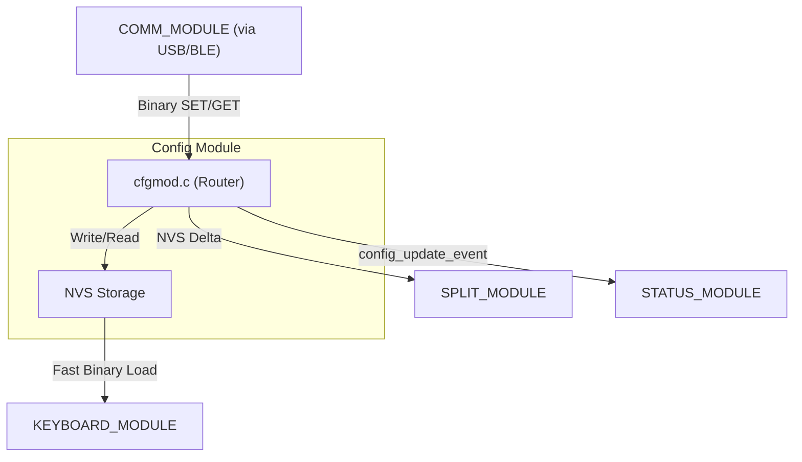

# Config Module (`config_module`)

> **For deep debugging and implementation details, see:** `components/config_module/CONFIG_MODULE.md`

## What it does
The **Config Module** is the authoritative source of truth for all persistent state in the firmware. It abstracts Non-Volatile Storage (NVS), managing the serialization and runtime distribution of user settings (layouts, macros, system identity).

## Why it exists
To maximize performance and centralize state. It stores all configurations as pure binary C-structs in NVS for instant loading. Instead of individual modules managing their own NVS keys, `config_module` handles all reads/writes and pushes updates to the rest of the system via the Event Bus when settings change.

## Module Connections
- **[COMM_MODULE](COMM_MODULE.md)**: The primary ingress point. It routes external GET/SET commands from the user's Configurator directly into NVS operations.
- **[KEYBOARD_MODULE](KEYBOARD_MODULE.md)**: Performs ultra-fast binary reads of the Layout and Macro registers to evaluate keystrokes at runtime.
- **[SPLIT_MODULE](SPLIT_MODULE.md)**: Mirrors all configuration changes from the Master over to the Slave to keep both halves perfectly synchronized.
- **[STATUS_MODULE](STATUS_MODULE.md)**: Listens for configuration update events to refresh its state cache and alert the user.
- **[BLE_MODULE](BLE_MODULE.md)**: Retrieves the active Bluetooth profile and relies on the Config module to securely persist its cryptographic bond keys.

## Dependency Flow

