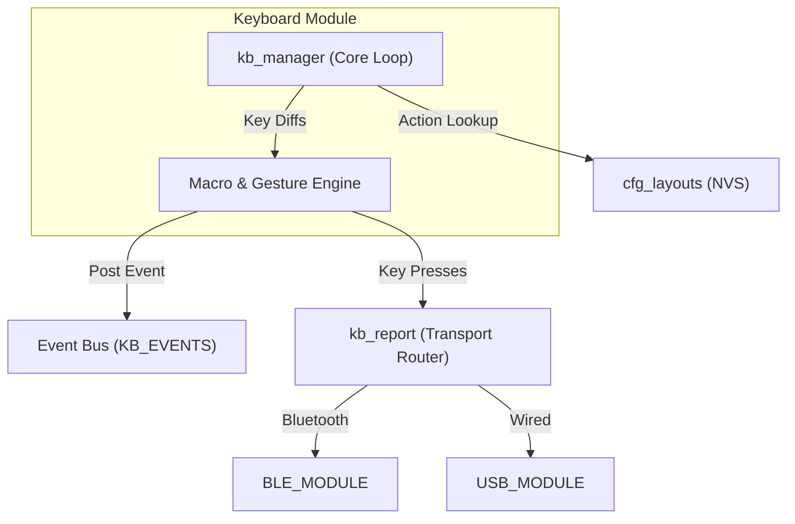

# Keyboard Module (`kb_module`)

> **For deep debugging and implementation details, see:** `components/keyboard/KEYBOARD_MODULE.md`

## What it does
The Keyboard module is the **central nervous system** of the firmware. It manages the entire lifecycle of a keypress: high-frequency hardware matrix scanning, debouncing, layer-aware key mapping, macro execution, and tap/hold gestures.

## Why it exists
To serve as the primary "Producer" of data in the system. It figures out what keys the user pressed and what actions those keys trigger. Once evaluated, it fulfills HID reports locally (via `USB_MODULE` or `BLE_MODULE`) or delegates split matrix scanning to the `SPLIT_MODULE`.

## Module Connections
- **[CONFIG_MODULE](CONFIG_MODULE.md)**: Queried extensively during the matrix scan loop to resolve physical keys into logical layer actions and macros.
- **[USB_MODULE](USB_MODULE.md)**: Receives wired HID keystroke reports when the keyboard is physically tethered and BLE routing is inactive.
- **[BLE_MODULE](BLE_MODULE.md)**: Receives wireless HID keystroke reports when BLE routing is active. It also receives system control commands (like switching profiles) triggered by physical key combinations.
- **[SPLIT_MODULE](SPLIT_MODULE.md)**: Used to merge matrix data from the Slave half so the Master's logic engine sees one unified keyboard.
- **[CONFIGURATOR](CONFIGURATOR.md)**: Can remotely inject simulated keystrokes into the logic engine via the COMM pipe for testing.

## Dependency Flow

