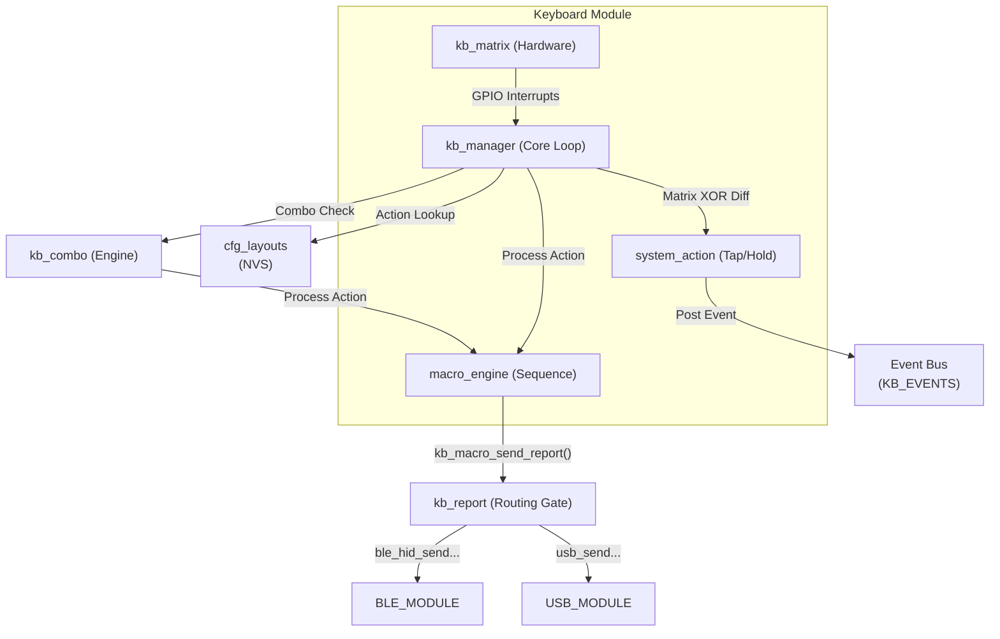

# Keyboard Module (`kb_module`)

> **Source:** `components/keyboard/` — `kb_manager.c`, `kb_matrix.c`, `kb_layout.c`, `kb_macro.c`, `kb_system_action.c`, `kb_report.c`, `kb_custom_key.c`, `kb_state.c`, `kb_combo.c`
> **Public API:** `include/kb_manager.h`, `include/kb_layout.h`, `include/kb_matrix.h`, `include/kb_report.h`, `include/kb_combo.h`

The Keyboard module is the **central nervous system** of the firmware. It is responsible for the entire lifecycle of a keypress: from high-frequency hardware scanning and debouncing to the complex logic of layers, macros, and multi-transport HID reporting.

It acts as the primary "Producer" of data in the system, either fulfilling reports locally via [[USB_MODULE]] or delegating to [[BLE_MODULE]] and [[SPLIT_MODULE]].

---

##  Internal Architecture

The module is not a single entity but a coordinated system of specialized tasks and state machines designed to maintain a **1200Hz polling rate** while handling asynchronous events like macro execution and configuration updates.

### 1. The Multi-Task Pipeline

| Task | Priority | Core | Responsibility |
|---|---|---|---|
| `kb_mgr` | 5 | Any | The main loop: Scanning, debouncing, and matrix merging. |
| `kb_macro` | 4 | Any | The macro executor: Handles sequential key injections and delays. |
| `kb_sys_action` | 5 | Any | The tap/hold machine: Manages timing for double-taps and holds. |
| `kb_tap_n` (x4) | 4 | Any | Worker tasks for fire-and-forget taps (e.g. from custom keys). |

### 2. High-Performance Matrix scanning
The `kb_mgr` task drives the column GPIOs and reads the row GPIOs at a rate of 1200 times per second. To achieve this without starving the rest of the system, it uses an **Interrupt-Driven Wake** mechanism:

- When no keys are held, the task enters a blocked state (`ulTaskNotifyTake`).
- Any GPIO change on the matrix triggers a hardware interrupt.
- The ISR notifies the task to wake up and resume high-frequency scanning.
- This ensures **0% CPU usage** when the keyboard is idle while maintaining **sub-millisecond latency** on the first press.

#### Split column mirroring
The `kb_matrix_scan()` function accepts a `bool mirror_cols` flag. When enabled, each physical column `N` detected by the scanner is reported as logical column `(KB_MATRIX_COL_COUNT − 1 − N)`. This is essential for the "mirrored" half of a split keyboard (traditionally the right hand), where the physical traces of the columns are often reversed relative to the left half. 

The mirroring state is maintained as a module-level `s_mirror_cols` static in `kb_manager.c`, which is:
- Initialized from `cfg_system_t.split_mirror_cols` during `kb_manager_start()`.
- Dynamically updated via a `CONFIG_EVENT_KIND_UPDATED` handler, allowing changes saved in the Configurator to take effect immediately on the next scan cycle without requiring a device restart.

### 3. Virtual NKRO "Snapshotting"
To prevent I/O blocking from slowing down the logic engine, the keyboard uses a **Virtual NKRO Map** (`s_v_nkro`):
1.  All modules (layouts, macros, system actions) write their desired key states to the 256-bit bitmap.
2.  The management task takes a **mutex-protected snapshot** of this map (taking ~50ns).
3.  The snapshot is then passed to the reporting layer (`kb_report.c`) where it may wait for USB/BLE transport.
4.  This decoupling ensures that logical key presses never wait for slow radio or USB acknowledge cycles.

---

##  Logic Engine

### 1. Action Code Spaces
Keys are not just HID constants; they are 16-bit **Action Codes** that define complex behaviors:

| Range | Name | Description |
|---|---|---|
| `0x0001` – `0x00FF` | **HID Key** | Standard keyboard keys (A, B, Shift, etc). |
| `0x0100` – `0x01FF` | **Media Key** | Consumer controls (Volume, Play/Pause). |
| `0x2000` – `0x20FF` | **System Action**| Layer toggles, BLE profile swaps, Split pairing. |
| `0x3000` – `0x3FFF` | **Custom Key** | User-defined complex keys (Configurator presets). |
| `0x4000` – `0x4FFF` | **Macro** | Trigger for a multi-step sequence defined in NVS. |

### 2. Combos
The `kb_combo` engine intercepts keys before they are resolved into single actions. 
- It monitors the state of all keys pressed.
- When a combination of keys matches a defined combo, the combo's action is fired.
- Depending on the combo configuration, it may retroactively release the individual keys (`cancelKeys: true`) or suppress the individual keys during a timeout window (`delayedPress: true`).

### 3. The Tap / Hold State Machine
Specialized "system actions" (like BLE profile switching) are processed via `kb_system_action.c`. This sub-module implements a state machine that distinguishes between:
- **Single Tap**: Press and release within <300ms.
- **Hold**: Press sustained for >500ms.
- **Double Tap**: Two consecutive presses within <300ms of each other.

Whenever a complex gesture is completed, the keyboard module **publishes an event** to the system bus: `KB_EVENTS / KB_EVENT_SYSTEM_ACTION`. This decouples the keyboard logic from the [[BLE_MODULE]], which listens for these events to trigger profile swaps.

---

##  Module Connections

### [[USB_MODULE]] — Direct Wire Interface
*   **Routing**: If BLE is inactive, HID reports are formatted for USB.
*   **Boot vs NKRO**: The module detects if the PC is in BIOS mode via `usb_keyboard_use_boot_protocol()` and automatically switches from the 231-key NKRO bitmap to the legacy 6KRO report.
*   **Remote Injection**: Used by the [[CONFIGURATOR]] to simulate matrix activity for testing.

### [[BLE_MODULE]] — Radio Management
*   **The Routing Gate**: `kb_report.c` uses `ble_hid_is_routing_active()` as a master switch. When enabled, it performs the **NKRO → 6KRO conversion** (splitting the bitmap into 6 slots + modifiers) before passing it to the BLE stack.
*   **Decoupled Control**: Instead of calling BLE functions directly, the keyboard broadcasts events. The `ble_controller.c` file in the [[BLE_MODULE]] consumes these to select profiles or pair devices.

### [[SPLIT_MODULE]] — Logical Merging
*   **Slave Role**: The keyboard provides a callback (`kb_manager_set_matrix_cb`). When the split module detects this device is a slave, it hooks into this to intercept raw matrix deltas and send them to the master.
*   **Master Role**: The Master half receives these deltas and calls `kb_manager_set_remote_matrix()`. The keyboard task OR-es this remote bitmap with the local hardware scan, processing the entire split unit as a single virtual matrix.

### [[CONFIGURATOR]] — NVS Persistence
*   **Layout Resolution**: Uses `cfg_layouts.h` to pull keymaps from NVS. If a key is `KB_KEY_TRANSPARENT`, the lookup engine recursively falls back to the base layer.
*   **Live Reloading**: Listens to `CFGMOD_KIND_MACRO` updates. When you save a macro in the browser, the keyboard engine instantly reloads the runtime structures without a reboot.

---

##  Dependency Flow

---

##  File Map

| File | Responsibility |
|---|---|
| `kb_manager.c` | Task management, 1200Hz loop, debouncing, and matrix merging logic. |
| `kb_matrix.c` | Low-level GPIO scanning and Interrupt-on-change initialization. |
| `kb_layout.c` | Keymap lookup and recursive layer fallback (`KB_KEY_TRANSPARENT`). |
| `kb_macro.c` | Multithreaded macro executor with stacking and cancellation support. |
| `kb_system_action.c`| Tap/Hold/Double-tap state machine and event bus broadcasting. |
| `kb_report.c` | The master routing decision point between USB and BLE transports. |
| `kb_custom_key.c` | Handler for "Custom Key" action codes (presets from the configurator). |
| `kb_combo.c` | Runtime engine for evaluating combos, canceling keys, and delaying keys. |
| `kb_state.c` | Management of HID LED states (Caps Lock, Num Lock) shared across modules. |
| `kb_bitmap.h` | Inline bitmap utilities for high-performance bit manipulation. |
