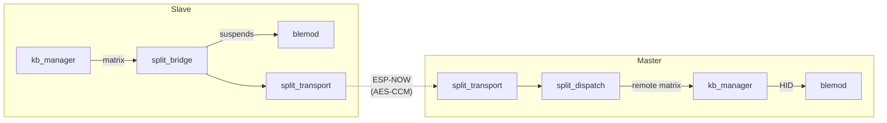

# Split Module (splitmod)

> **Source:** `components/split/` — 14 `.c` files organized in layers (see File Map).
> **Public API:** `include/splitmod.h`, `include/split_protocol.h`

The **Split Module** turns two independent ESP32 halves into a single, cohesive keyboard. It owns the low-latency wireless link, dynamic role negotiation, and the transparent proxying of matrix state, BLE control, and configuration data between Master and Slave.

Traffic rides on **ESP-NOW** for peer-to-peer communication with sub-millisecond keystroke overhead.

---

## Internal Architecture

The module uses a **Master/Slave Proxy** model where roles are negotiated at every connect. Internally it is structured as a **layered pipeline** — the public API (`splitmod.c`) is now a thin orchestrator that wires together single-responsibility sub-modules.

### 1. Dynamic Role Negotiation
Roles are decided by priority, not hardcoded to Left/Right:
- **USB Priority**: a half physically plugged into a USB host wins Master.
- **BLE Priority**: historical alignment with an active BLE host.
- **Preferred / Last / MAC tiebreaker**: deterministic fallbacks so the link is stable when neither half is plugged in.

Implemented in [split_role.c]; driven by [split_dispatch.c] on `ROLE_NEGOTIATE` reception.

### 2. Encrypted ESP-NOW Transport
All traffic is secured using **AES-128-CCM** with anti-replay:
- **Pairing**: unencrypted X25519 ECDH exchange derives a shared session key ([split_pair.c], [split_crypto.c].
- **MIC**: every packet carries a MIC authenticated by [split_transport.c] before dispatch.
- **Replay window**: 16-bit modular sequence window in [split_session.c] — forward half accepted, rest dropped.

### 3. Fragmentation Protocol
ESP-NOW's ~240-byte payload limit means large transfers (the full config blob, macro DB, BLE bonds) are fragmented and reassembled by [split_config_sync.c]. Reassembly tracks received fragments in a 32-bit bitmap → **max 32 fragments / ~7.2 KB per logical message**.

### 4. State-Machine Task
One FreeRTOS task ([split_task.c]) drives the whole connection lifecycle at ~100 Hz:

| State          | Tick behavior                                                                            |
| -------------- | ---------------------------------------------------------------------------------------- |
| `PAIRING`      | Broadcast DISCOVERY every 500 ms; respect pairing deadline.                              |
| `CONNECTING`   | Retransmit `ROLE_NEGOTIATE` every 500 ms until the peer ACKs.                            |
| `CONNECTED`    | 150 ms heartbeat (slave→master), bench probes (master), drain deferred config-sync work. |
| `DISCONNECTED` | Reconnect with exponential backoff (500 ms → 5 s).                                       |

The task owns all NVS-heavy / blocking work (config sync push). Event-bus and WiFi-task contexts only **request** work via three `volatile bool` flags — they never block.

---

## Layered Architecture

```
splitmod.c                     ← public API + event handler registration
   │
   ├─► split_task.c            ← main loop, timers, deferred-work pump
   │       │
   │       └─► split_dispatch.c  ← inbound message routing (per-msg handlers)
   │                │
   │                ├─► split_bridge.c   ← kb / BLE routing, BLE proxy
   │                ├─► split_bench.c    ← RTT benchmark (master probes)
   │                ├─► split_sync.c     ← remote matrix state
   │                ├─► split_config_sync.c ← fragmented NVS replication
   │                ├─► split_pair.c     ← X25519 ECDH + NVS pairing data
   │                └─► split_role.c     ← role-decision logic
   │
   ├─► split_session.c         ← all session state (state, role, MACs, seq, RSSI…)
   ├─► split_transport.c       ← ESP-NOW send/recv, AES-CCM, MIC verify
   ├─► split_crypto.c          ← X25519 + HKDF primitives
   ├─► split_protocol.c        ← shared protocol helpers
   └─► split_usb.c             ← MODULE_SPLIT commands from Configurator
```

Every file has a single responsibility. No source owns shared mutable state — that lives in `split_session.c` behind accessor functions (seq allocator protected by `portMUX_TYPE` for cross-core safety).

---

## Cross-Module Connections

### [[KEYBOARD_MODULE]] — Matrix Merging
- **Slave**: [split_bridge.c] registers `on_matrix_change` as the `kb_manager` callback; every change is serialised into `SPLIT_MSG_KEY_STATE_FULL` (always full, never delta — ESP-NOW is fire-and-forget, a dropped delta would corrupt the peer's view forever).
- **Master**: [split_dispatch.c] feeds received bitmaps into `kb_manager_set_remote_matrix()`. The local scanner XOR-merges them with its own matrix.

### [[BLE_MODULE]] — Radio Management & Proxy
- **Role-based suspend**: [split_bridge.c] suspends the slave's BLE radio (`ble_hid_set_suspended(true)`) to avoid 2.4 GHz contention and host-side confusion.
- **MAC sharing**: on first master promotion `split_bridge` auto-populates `cfg_system.ble_shared_addr` from its own BT MAC. After a role swap, the new master advertises with the same address → seamless reconnect on the host.
- **Configurator proxy**: BLE commands arriving on the slave's `MODULE_BLE` USB channel are tunneled over `SPLIT_MSG_BLE_CMD` and executed on the master (source of truth). Master pushes `SPLIT_MSG_BLE_STATUS` back to the slave for widget sync.

### [[USB_MODULE]] — Host Interface
- `tud_mounted()` is the primary input for role negotiation.
- [split_usb.c] handles configurator traffic on `MODULE_SPLIT`: START_PAIRING, CANCEL_PAIRING, UNPAIR, GET_STATUS, GET_REMOTE_MATRIX, ROLE_SWAP, RUN_BENCH, GET_BENCH.

### [[CONFIG_MODULE]] — Persistent Sync
- [splitmod.c] listens for `CONFIG_EVENT_KIND_UPDATED`. Whenever a syncable key is updated, it **flags** `split_task` to push the change — the event-bus task never blocks on NVS.
- [split_config_sync.c] owns fragmentation, reassembly, and ACK/retry.
- Receiving a stale remote `ble_cfg` triggers **reverse sync** — the local side pushes its own `ble_cfg` + bonds back so both halves converge.

---

## Message Protocol

The protocol ([split_protocol.h]) uses a standardized header for all over-the-air packets.

| Type | Name | Description |
|---|---|---|
| `0x01` | `DISCOVERY` | Pairing broadcast. |
| `0x02` | `PAIR_REQUEST` / `PAIR_RESPONSE` | X25519 key exchange. |
| `0x11` | `ROLE_NEGOTIATE` | Handshake that decides who is Master. |
| `0x12` | `ROLE_SWAP_REQ` / `ROLE_SWAP_ACK` | Runtime role swap. |
| `0x21` | `KEY_STATE_FULL` | 14-byte bitfield of the remote half's matrix. |
| `0x31` | `HEARTBEAT` | Keepalive + RTT/latency measurement. |
| `0x41` | `CONFIG_SYNC` / `CONFIG_SYNC_ACK` | Fragmented NVS replication. |
| `0x51` | `PING` / `PONG` | RTT benchmark probes. |
| `0x61` | `BLE_CMD` | Slave → Master BLE control proxy. |
| `0x62` | `BLE_STATUS` | Master → Slave BLE status push. |
| `0x71` | `DISCONNECT` | Graceful shutdown. |

---

## Dependency Flow



---

## File Map

### Public API
| File | Responsibility |
|---|---|
| `splitmod.c` | Public API (`splitmod_*`), event-handler registration, init/deinit wiring. Thin orchestrator. |

### Core State & Loop
| File | Responsibility |
|---|---|
| `split_session.c` | All session state (state, role, MACs, seq counters, RSSI, latency, peer_last_seen, link_stale). Cross-core-safe seq allocator. |
| `split_task.c` | Main ~100 Hz state-machine task: PAIRING / CONNECTING / CONNECTED / DISCONNECTED ticks + deferred-work pump. |
| `split_dispatch.c` | Inbound message dispatcher — per-type handlers, anti-replay + stale-recovery prelude. |

### Service Layers
| File | Responsibility |
|---|---|
| `split_transport.c` | Low-level ESP-NOW send/receive, AES-CCM encrypt/authenticate, peer table. |
| `split_crypto.c` | X25519 ECDH + HKDF primitives. |
| `split_pair.c` | Pairing FSM (DISCOVERY → PAIR_REQUEST → PAIR_RESPONSE), pairing data in NVS. |
| `split_role.c` | Role-decision logic (`split_role_on_negotiate`, `split_role_on_swap_req/ack`). Persists last role. |
| `split_sync.c` | Remote matrix state + `KEY_STATE_FULL/DELTA` serialisation. |
| `split_config_sync.c` | Fragment + reassemble NVS entries over ESP-NOW. 32-fragment (7.2 KB) max. |
| `split_bridge.c` | kb_manager + BLE routing for the current role; BLE proxy (cmd from slave, status to slave). |
| `split_bench.c` | RTT benchmark — master sends PING probes, records RTT on PONG. |
| `split_usb.c` | `MODULE_SPLIT` USB commands from the Configurator. |
| `split_protocol.c` | Shared protocol helpers (header (de)serialise). |

---

## Concurrency & Safety Notes

- **Cross-core seq allocator**: `split_session_next_seq()` uses `portMUX_TYPE` critical section. The transport TX context, event-bus task, and WiFi RX task all mint seq numbers; without the mutex two cores could hand out the same seq and poison the anti-replay window.
- **Deferred work**: `on_config_updated` runs on the event-bus task. It must not call `split_config_sync_push_all` directly — that path does `vTaskDelay(10ms)` on per-fragment retry and would starve the bus. Instead it flips `s_config_sync_incremental`; `split_task` drains it.
- **Anti-replay**: dropped replay frames are *not* logged at INFO — a flapping link would spam the log. Use `ESP_LOGD` for visibility during debugging.
- **NVS from split_task**: the task stack must live in **internal DRAM** (`MALLOC_CAP_INTERNAL`). NVS writes disable the SPI cache; a SPIRAM-backed stack would crash mid-write.

---

## Recent Changes (2026-04)

- **Clean-code refactor**: `splitmod.c` split from 1305 → 259 lines across 7 new modules (session, task, dispatch, bridge, bench, usb + keeps existing transport/pair/role/sync/config_sync/crypto/protocol). No functional changes.
- **Config-sync capacity fix**: reassembly bitmap widened from `uint8_t` → `uint32_t`. Previously `1u << idx` with `idx ≥ 8` was UB and silently corrupted multi-fragment pushes once any payload exceeded 8 fragments (≈1.8 KB). New cap: 32 fragments / ≈7.2 KB; oversize messages are rejected at fragment-0 with `ESP_ERR_INVALID_SIZE`.
