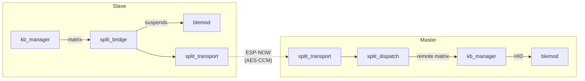

# Split Module (splitmod)

> **Source:** `components/split/` — 14 `.c` files organized in layers (see File Map).
> **Public API:** `include/splitmod.h`, `include/split_protocol.h`

The **Split Module** turns two independent ESP32 halves into a single, cohesive keyboard. It owns the low-latency wireless link, dynamic role negotiation, and the transparent proxying of matrix state, BLE control, and configuration data between Master and Slave.

Traffic rides on **ESP-NOW** for peer-to-peer communication with sub-millisecond keystroke overhead.

---

## Internal Architecture

The module uses a **Master/Slave Proxy** model where roles are negotiated at every connect. Internally it is structured as a **layered pipeline** — the public API (`splitmod.c`) is now a thin orchestrator that wires together single-responsibility sub-modules.

### 1. Dynamic Role Negotiation
Roles are decided by priority, not hardcoded to Left/Right. The algorithm in `split_role_decide()` ([split_role.c]) evaluates in strict priority order:

1. **Unsynced BLE data**: if one side has a fresh bond that hasn't been synced to the peer yet, it *must* become Master so the bond isn't lost.
2. **USB host connection**: a half physically plugged into a USB host wins Master — it is already producing HID reports via USB and the host expects them from that device.
3. **BLE host connection**: the side with an active BLE connection owns the wireless output path.
4. **Last persisted role**: the recorded role from the previous session drives continuity after a reconnect, preventing spurious inversions.
5. **MAC tiebreaker**: the side with the higher MAC address wins — fully deterministic.

Every priority uses provably antisymmetric checks: when one side returns at a given priority, the other side also returns at that same priority with the complementary role. It is therefore **impossible for both sides to end up with the same role**.

> **Implementation note**: the `proposed_role` field is still present in `split_role_negotiate_payload_t` and `split_pair_data_t` for wire compatibility but is transmitted as 0 and ignored in all role decisions.

Implemented in [split_role.c]; driven by [split_dispatch.c] on `ROLE_NEGOTIATE` reception.

### 2. Encrypted ESP-NOW Transport
All traffic is secured using **AES-128-CCM** with anti-replay:
- **Pairing**: unencrypted X25519 ECDH exchange derives a long-term **Paired Key** stored in NVS ([split_pair.c], [split_crypto.c]).
- **MIC**: every packet carries a 4-byte MIC authenticated by [split_transport.c] before dispatch.
- **On-wire frame layout (packed, little-endian):**
 *
 *   `[magic:2][proto:1][type:1][seq:6][payload:0..236][mic:4]`  (frame version 0x02)
 *
 *   The 10-byte header is the AAD (authenticated but not encrypted). Payload + MIC are AES-128-CCM encrypted.
- **Nonce Security & Cross-Reboot Epoch**: 48-bit sequence number stored in the header. To prevent nonce reuse across reboots, an NVS-backed **Sequence Epoch** (`spl_epc`) is incremented on boot. The epoch occupies the top 16 bits of the 48-bit sequence, while the lower 32 bits form a per-session packet counter.
- **Anti-Replay**: Simple strictly-increasing check in [split_session.c]. Because the 48-bit space is practically infinite, a strict `seq > last_seq` evaluation is used instead of modular windows. Duplicates and replays are implicitly dropped.

#### Key Hierarchy (TSK-first architecture)

| Key | Slot | Lifetime | Purpose |
|-----|------|----------|---------|
| Paired Key | `s_handshake_key` | NVS-persisted | Encrypts `ROLE_NEGOTIATE` and `DISCOVERY`; fallback for cross-reboot reconnects |
| Transient Session Key (TSK) | `s_session_key` | Per-session (in RAM) | Encrypts ALL other traffic after the first successful `ROLE_NEGOTIATE` |

**TSK derivation** happens at the end of every successful `ROLE_NEGOTIATE` exchange:
1. Each half advertises a random 32-bit salt in the `random_salt` field of `split_role_negotiate_payload_t`.
2. Both sides compute `TSK = SHA-256(paired_key ∥ min(own_salt, peer_salt) ∥ max(own_salt, peer_salt))[0:16]`.
3. The `min/max` sort guarantees both devices derive the **same key** regardless of who received whose message first.
4. On activation: TX/RX sequence counters are reset to 0 and a 1500 ms **grace period** is started to absorb in-flight packets encrypted with the old key.

**Session start-up sequence:**
```
Boot / pair complete
  └─ session_key = NULL          (plaintext mode — no outbound encryption)
     handshake_key = paired_key  (ROLE_NEGOTIATE encrypted with this)
     ↓
ROLE_NEGOTIATE exchange (encrypted with handshake key)
  └─ TSK derived from salts
     session_key = TSK           (all subsequent traffic encrypted with TSK)
     handshake_key unchanged     (still used if peer reboots and needs fallback)
```

**Discovery / Pairing traffic** (`DISCOVERY`, `PAIR_REQUEST`, `PAIR_RESPONSE`) is always sent in plaintext to bootstrap the session when no shared key exists yet.

**Dual-key decryption fallback**: if decryption with the primary TSK fails on a `ROLE_NEGOTIATE`, the transport retries with the handshake key. This lets a rebooted device (which has no TSK) re-enter a running session whose peer has a stale TSK.

**DMA isolation**: all PSA Crypto operations (AES-CCM, SHA-256, ECDH) use a 512-byte static DMA workspace in global DRAM (`s_dma_work`, split into `DMA_IN`/`DMA_OUT` halves). Stack memory is never used as a PSA buffer, preventing DMA access faults on ESP32-S3. A DMA semaphore serialises concurrent callers.

### 3. Fragmentation Protocol
ESP-NOW's ~236-byte payload limit means large transfers (the full config blob, macro DB, BLE bonds) are fragmented and reassembled by [split_config_sync.c]. Reassembly tracks received fragments in a **256-bit bitmap** (`uint8_t received_map[32]`) → **max 255 fragments / ~57 KB per logical message**.
- **Memory**: Large reassembly and push buffers are allocated in **PSRAM** (`MALLOC_CAP_SPIRAM`) to preserve internal DRAM.
- **Timeout**: Abandoned reassemblies time out after 2 seconds to free heap resources.
- **Background write interlock**: once a complete blob is handed to the `split_task` background writer, a `write_pending` flag blocks any new reassembly for the same slot until the write and ACK complete. A monotonic `session_id` tag detects if a new transfer arrived mid-write.
- **ACK semaphore**: Master waits up to 5 seconds per entry for a `CONFIG_SYNC_ACK` from Slave before declaring failure.

### 4. State-Machine Task

One FreeRTOS task ([split_task.c]) drives the whole connection lifecycle at ~100 Hz:

| State          | Tick behavior                                                                                 |
| -------------- | --------------------------------------------------------------------------------------------- |
| `IDLE`         | No peer paired — waiting. No periodic transmissions.                                          |
| `PAIRING`      | Broadcast DISCOVERY every 500 ms; respect pairing deadline.                                   |
| `CONNECTING`   | Retransmit `ROLE_NEGOTIATE` every 500 ms until the peer ACKs.                                 |
| `CONNECTED`    | 150 ms heartbeat (slave→master, with master echo for RTT), bench probes (master), drain deferred config-sync work, **process deferred reassembly I/O**. |
| `DISCONNECTED` | Reconnect with exponential backoff (500 ms → 5 s).                                            |

The task owns all NVS-heavy / blocking work (config sync push). Event-bus and WiFi-task contexts only **request** work via two `volatile bool` flags and one `volatile uint32_t` kind-mask — they never block:

- `s_config_sync_pending` — triggers a full push after initial connect (with settle delay).
- `s_config_sync_kind_mask` — bitmask of `(1 << cfgmod_kind_t)` for incremental pushes from `on_config_updated`.
- `s_reverse_ble_sync` — peer sent stale/conflicting ble_cfg; push ours back.

---

## Layered Architecture

```
splitmod.c                     ← public API + event handler registration
   │
   ├─► split_task.c            ← main loop, timers, deferred-work pump
   │       │
   │       └─► split_dispatch.c  ← inbound message routing (per-msg handlers)
   │                │
   │                ├─► split_bridge.c   ← kb / BLE routing, BLE proxy
   │                ├─► split_bench.c    ← RTT benchmark (master probes)
   │                ├─► split_sync.c     ← remote matrix state
   │                ├─► split_config_sync.c ← fragmented NVS replication
   │                ├─► split_pair.c     ← X25519 ECDH + NVS pairing data
   │                └─► split_role.c     ← role-decision logic
   │
   ├─► split_session.c         ← all session state (state, role, MACs, seq, RSSI…)
   ├─► split_transport.c       ← ESP-NOW send/recv, AES-CCM, MIC verify
   ├─► split_crypto.c          ← X25519 + HKDF primitives
   ├─► split_protocol.c        ← shared protocol helpers
   └─► split_usb.c             ← MODULE_SPLIT commands from Configurator
```

Every file has a single responsibility. No source owns shared mutable state — that lives in `split_session.c` behind accessor functions (seq allocator protected by `portMUX_TYPE` for cross-core safety).

---

## Cross-Module Connections

### [KEYBOARD_MODULE](file:///home/srleg/Projects/Tecleados-ESP-Firmware/universe/modules/KEYBOARD_MODULE.md) — Matrix Merging
- **Slave**: [split_bridge.c] registers `on_matrix_change` as the `kb_manager` callback; every change is serialised into `SPLIT_MSG_KEY_STATE_FULL` (always full, never delta — ESP-NOW is fire-and-forget, a dropped delta would corrupt the peer's view forever). While connected as slave, `kb_manager_set_paused(true)` suppresses local HID output.
- **Master**: [split_dispatch.c] feeds received bitmaps into `kb_manager_set_remote_matrix()`. The local scanner XOR-merges them with its own matrix.
- **Battery-adaptive scan rate**: the slave's heartbeat tick also reads the battery level and calls `kb_manager_set_scan_divisor()` (÷1 / ÷2 / ÷4 at >30 % / 10-30 % / <10 % charge) to reduce scan load at low battery.

### [BLE_MODULE](file:///home/srleg/Projects/Tecleados-ESP-Firmware/universe/modules/BLE_MODULE.md) — Radio Management & Proxy
- **Role-based suspend**: [split_bridge.c] suspends the slave's BLE radio (`ble_hid_set_suspended(true)`) to avoid 2.4 GHz contention and host-side confusion.
- **MAC sharing**: on first master promotion `split_bridge` auto-populates `cfg_system.ble_shared_addr` from its own BT MAC. After a role swap, the new master advertises with the same address → seamless reconnect on the host.
- **BLE state handover**: when a half becomes Master (via negotiation or role swap), it calls `ble_hid_seed_handover_state(ble_connected_bitmap, selected_profile)` with the values the outgoing Master reported — so BLE connection context is transferred without dropping the host.
- **Configurator proxy**: BLE commands arriving on the slave's `MODULE_BLE` USB channel are tunneled over `SPLIT_MSG_BLE_CMD` and executed on the master (source of truth). Master pushes `SPLIT_MSG_BLE_STATUS` back to the slave for widget sync. This callback (`split_bridge_ble_usb_callback`) is registered for `MODULE_BLE` in `splitmod_init`.

### [USB_MODULE](file:///home/srleg/Projects/Tecleados-ESP-Firmware/universe/modules/USB_MODULE.md) — Host Interface
- `tud_mounted()` is sampled and sent in `ROLE_NEGOTIATE`; a half with an active USB-host connection wins Priority 3 of role negotiation.
- [split_usb.c] handles configurator traffic on `MODULE_SPLIT`: START_PAIRING, CANCEL_PAIRING, UNPAIR, GET_STATUS, GET_REMOTE_MATRIX, ROLE_SWAP, RUN_BENCH, GET_BENCH.

### [CONFIG_MODULE](file:///home/srleg/Projects/Tecleados-ESP-Firmware/universe/modules/CONFIG_MODULE.md) — Persistent Sync
- [splitmod.c] listens for `CONFIG_EVENT_KIND_UPDATED`. Whenever a syncable key is updated, it **sets the bit** for that `cfgmod_kind_t` in `s_config_sync_kind_mask` — the event-bus task never blocks on NVS.
- [split_config_sync.c] owns fragmentation, reassembly, and ACK/retry.
- **BLE config sync direction** is role-based:
  - **Slave** always accepts `ble_cfg` from Master ("trust mode").
  - **Master** ignores `ble_cfg` received from Slave. If the version numbers differ, it triggers a reverse sync to correct the slave.
- **Bond sync guard**: Master ignores all incoming bond data from Slave (always triggers reverse sync). A Slave only accepts incoming bonds if the peer has at least as many bond records locally; otherwise it requests a reverse sync.

---

## Message Protocol

The protocol ([split_protocol.h]) uses a standardized header for all over-the-air packets.

| Type   | Name                              | Description |
|--------|-----------------------------------|-------------|
| `0x01` | `DISCOVERY`                       | Pairing broadcast beacon. Unencrypted. |
| `0x02` | `PAIR_REQUEST`                    | X25519 key exchange initiation. Unencrypted. |
| `0x03` | `PAIR_RESPONSE`                   | X25519 key exchange completion. Unencrypted. |
| `0x10` | `ROLE_NEGOTIATE`                  | Handshake that decides who is Master. |
| `0x11` | `ROLE_SWAP_REQ`                   | Request role swap. |
| `0x12` | `ROLE_SWAP_ACK`                   | Acknowledge role swap. |
| `0x20` | `KEY_STATE_FULL`                  | Full 14-byte matrix bitmap from slave. |
| `0x21` | `KEY_STATE_DELTA`                 | Incremental: only changed bytes (with bitmask). |
| `0x30` | `HEARTBEAT`                       | Slave→Master keepalive; Master echoes back unchanged `sent_us` for RTT measurement. |
| `0x31` | `DISCONNECT`                      | Graceful shutdown signal. |
| `0x40` | `CONFIG_SYNC`                     | Fragmented NVS data fragment. |
| `0x41` | `CONFIG_SYNC_ACK`                 | Config sync acknowledged by receiver. |
| `0x50` | `PING`                            | RTT benchmark probe (Master → Slave). |
| `0x51` | `PONG`                            | RTT benchmark reply (Slave echoes PING payload). |
| `0x60` | `BLE_CMD`                         | Slave → Master: forward a BLE command from USB. |
| `0x61` | `BLE_STATUS`                      | Master → Slave: push live BLE state. |

### Heartbeat RTT & Link Benchmarking
- **Heartbeat Latency**: The slave sends `HEARTBEAT` with `sent_us = esp_timer_get_time()`. The master **echoes the exact same `sent_us` value back** in its own heartbeat reply. When the slave receives the echo, it computes `RTT = now_us - sent_us` and stores `latency_us = RTT / 2`.
- **Delay (RTT/2) Benchmark**: Measures true one-way connection propagation delay over a sequence of ~20 high-speed packet exchanges, recording min, average, and maximum delays as RTT/2.
- **Maximum Polling Rate Benchmark**: Stress tests both keyboard matrix schedulers simultaneously during a 2-second "full blast" dwell period. Both Master and Slave track their low-level matrix scan frequency, capturing:
  * **Floor HZ**: The lowest recorded scan frequency under load.
  * **Avg HZ**: The average scan frequency over the test duration.
  * **Peak HZ**: The peak achieved polling rate frequency.

---

## Dependency Flow



---

## File Map

### Public API
| File | Responsibility |
|---|---|
| `splitmod.c` | Public API (`splitmod_*`), event-handler registration, init/deinit wiring. Thin orchestrator. |

### Core State & Loop
| File | Responsibility |
|---|---|
| `split_session.c` | All session state (state, role, MACs, seq counters, RSSI, latency, peer_last_seen, link_stale). Cross-core-safe seq allocator. |
| `split_task.c` | Main ~100 Hz state-machine task: IDLE / PAIRING / CONNECTING / CONNECTED / DISCONNECTED ticks + deferred-work pump. |
| `split_dispatch.c` | Inbound message dispatcher — per-type handlers, anti-replay + stale-recovery prelude. |

### Service Layers
| File | Responsibility |
|---|---|
| `split_transport.c` | Low-level ESP-NOW send/receive, AES-CCM encrypt/authenticate, peer table. WiFi STA mode with power-save disabled for minimum latency. |
| `split_crypto.c` | X25519 ECDH + HKDF primitives. |
| `split_pair.c` | Pairing FSM (DISCOVERY → PAIR_REQUEST → PAIR_RESPONSE), pairing data in NVS. |
| `split_role.c` | Role-decision logic (`split_role_decide`, `split_role_on_negotiate`, `split_role_on_swap_req/ack`). Persists last role. |
| `split_sync.c` | Remote matrix state + `KEY_STATE_FULL/DELTA` serialisation. Mutex-protected for WiFi-task / kb-task cross-core access. |
| `split_config_sync.c` | Fragment + reassemble NVS entries over ESP-NOW. 32-fragment (7.2 KB) max. Role-aware BLE/bond sync guards. |
| `split_bridge.c` | kb_manager + BLE routing for the current role; BLE proxy (cmd from slave, status to slave); power management on role transitions. |
| `split_bench.c` | RTT benchmark — master sends PING probes, records RTT on PONG. |
| `split_usb.c` | `MODULE_SPLIT` USB commands from the Configurator. |
| `split_protocol.c` | Shared protocol helpers (header (de)serialise). |

---

## Concurrency & Safety Notes

- **Cross-core seq allocator**: `split_session_next_seq()` uses `portMUX_TYPE` critical section. The transport TX context, event-bus task, and WiFi RX task all mint seq numbers; without the mutex two cores could hand out the same seq and poison the anti-replay window.
- **Deferred work**: `on_config_updated` runs on the event-bus task. It must not call `split_config_sync_push` directly — that path does `vTaskDelay(10 ms)` per-fragment retry and would starve the bus. Instead it sets a bit in `s_config_sync_kind_mask`; `split_task` drains it.
- **Anti-replay**: 48-bit sequence numbers are verified on every packet. The upper 16 bits use a persistent **Sequence Epoch** to prevent reusing sequence numbers across resets. Since the space is practically infinite, a strict "greater than" check is used instead of modular windows.
- **NVS Deferral**: Fragment reassembly logic in `split_config_sync.c` marks blobs as "write pending" instead of writing immediately. The `split_task` performs the slow `cfgmod_write_storage` call in the background to prevent blocking the WiFi task.
- **PSRAM for Blobs**: All configuration and reassembly buffers are now moved to PSRAM to avoid large internal heap spikes.

---

## Recent Changes (2026-05)

- **One-Way Delay Benchmark (RTT/2)**: Refactored connection delay calculation to divide the measured RTT by 2, representing accurate single-transport physical propagation timing instead of two-way ping. Configured test sequence to collect ~20 packets.
- **Maximum Polling Rate Benchmarking**: Added real-time tracking of matrix scanning frequency on both Master and Slave devices. Under full-blast 2-second stress test dwell periods, devices measure `floor_hz`, `avg_hz`, and `peak_hz` performance metrics to gauge matrix scheduler stability under load.
- **Rich Floating Glassmorphic Notifications**: Upgraded Configurator frontend to render complete double-column benchmark results directly inside a 20-second dismissible floating notification toast, leveraging full backdrop blur (`blur(25px)`) and responsive layouts.

## Recent Changes (2026-04)

- **Clean-code refactor**: `splitmod.c` split from 1305 → 259 lines across 7 new modules (session, task, dispatch, bridge, bench, usb + keeps existing transport/pair/role/sync/config_sync/crypto/protocol). No functional changes.
- **Config-sync capacity fix**: reassembly bitmap widened from `uint8_t` → `uint8_t[32]` (256 bits). Previously `1u << idx` with `idx ≥ 8` was UB and silently corrupted multi-fragment pushes. New cap: 255 fragments / ≈57 KB. **Master now waits for a per-push ACK semaphore (5 s timeout)** before moving to the next entry.
- **Macros & Custom Keys sync**: `split_config_sync_push_kind()` now recursively pushes all dynamic sub-keys (`mac_<n>`, `ck_<n>`) in addition to the index blobs, ensuring Slave receives complete Macro and Custom Key state.
- **BLE/Bond sync guards**: config sync now enforces role-based ownership — Master ignores BLE config and bond data received from Slave, triggering corrective reverse syncs instead.
- **BLE state handover**: `ble_hid_seed_handover_state()` is called when a half becomes Master to transfer BLE connection context from the former master, preventing spurious disconnects on the host side.
- **Battery-adaptive scan rate**: slave-side heartbeat tick now reads battery level and adjusts `kb_manager_set_scan_divisor` to reduce power draw at low charge.
- **USB priority bug fix**: `own_usb_connected` / `peer_usb_connected` were being collected and transmitted in `ROLE_NEGOTIATE` but never consulted in `split_role_decide()`. Priority 2 (USB) is now implemented.
- **Default connectivity mode changed to USB**: `cfg_ble.c` previously defaulted `ble_routing_enabled = true` on a fresh flash. Changed to `false` so a keyboard boots in USB mode and BLE must be explicitly enabled.
- **Role preference removed**: the `proposed_role` / `preferred_role` system was broken — it was not antisymmetric. The wire field is retained (sent as 0) for compatibility. The `last_role` priority has been rewritten with explicit mirror checks.
- **Hardening phase (2026-04 / security)**: sequence numbers widened to 48-bit with an **NVS-backed Sequence Epoch** to prevent cross-reboot nonce reuse. Background NVS writing deployed. Reassembly and push buffers moved to PSRAM. 2 s reassembly timeout added. Out-of-bounds memory vulnerabilities in the dispatch layer were eliminated.
- **TSK (Transient Session Key) architecture (2026-04 / crypto hardening)**:
  - Added `random_salt` field to `split_role_negotiate_payload_t` (wire version bumped to `0x02`).
  - `split_crypto_derive_session_key()` API changed from `(nonce_a[], nonce_b[])` to `(uint32_t salt_own, uint32_t salt_peer)` with symmetric min/max sort so both sides always produce the same TSK.
  - On boot and on disconnect, `session_key = NULL` (plaintext). The paired key lives only in the `handshake` slot and is used exclusively for `ROLE_NEGOTIATE` / recovery frames.
  - `split_transport` gains a dual-key receive path: tries TSK first, falls back to handshake key for `ROLE_NEGOTIATE`, allowing cross-reboot reconnects without re-pairing.
  - `split_session_set_local_salt()` is sticky for 10 seconds to prevent race conditions during rapid reconnects. `split_session_force_local_salt()` bypasses the guard — used only at pairing completion.
  - Auth failure counter (`split_session_inc_auth_failure`) feeds a reactive recovery: `split_task` forces disconnect after 5 consecutive decryption failures instead of waiting for the link-stale timeout.
  - A 1500 ms grace period post-TSK activation suppresses false auth-failure counts from in-flight packets encrypted with the old key.
- **DMA isolation for PSA Crypto**: a 512-byte static workspace (`s_dma_work`) in global DRAM provides `DMA_IN`/`DMA_OUT` regions. No PSA operation ever uses stack memory, eliminating DMA access faults on ESP32-S3. A dedicated semaphore (`s_dma_sem`) serialises concurrent callers with a 500 ms timeout.
- **Status module live refresh**: the manual status-request callback now re-reads live BLE bitmap data from the stack before composing the response, preventing stale data if an earlier event push was lost.
- **Configurator 5 s heartbeat poll**: `App.tsx` now calls `fetchStatus()` every 5 seconds while connected so the widget self-corrects without user action.
