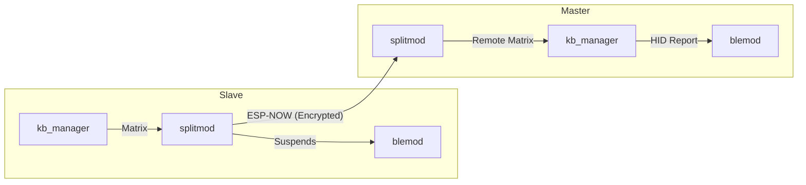

# Split Module (splitmod)

> **Source:** `components/split/` — `splitmod.c`, `split_transport.c`, `split_pairing.c`, `split_util.c`
> **Public API:** `include/splitmod.h`, `include/split_protocol.h`

The **Split Module** is responsible for turning two independent ESP32 halves into a single, cohesive keyboard unit. It manages the low-latency wireless link, dynamic role negotiation, and the transparent proxying of matrix state and configuration data between the Master and Slave.

It utilizes the **ESP-NOW** protocol for high-performance, peer-to-peer communication, ensuring that keystrokes from the remote half reach the host with sub-millisecond overhead.

---

## Internal Architecture

The module's architecture is based on a **Master/Slave Proxy** model, where roles are determined dynamically at boot time.

### 1. Dynamic Role Negotiation
Instead of hardcoding "Left" or "Right" roles, the module negotiates who will be the Master based on priority:
- **USB Priority**: A half physically plugged into a USB host has the highest priority to become Master.
- **BLE Priority**: Historical alignment with bonded BLE hosts.
- **MAC Tiebreaker**: A deterministic fallback to ensure a stable link when neither half is plugged into USB.

### 2. Encrypted ESP-NOW Transport
All traffic between halves is secured using **AES-128-CCM**. 
- **Pairing**: Uses an unencrypted X25519 elliptic curve exchange to derive a shared session key.
- **Validation**: Every packet includes a Message Integrity Check (MIC) to prevent replay attacks or packet injection.

### 3. Fragmentation Protocol
Since ESP-NOW has a payload limit of ~240 bytes, the module implements a custom fragmentation layer for large transfers (like pushing a 20KB macro database from Master to Slave).

---

## Cross-Module Connections

The Split Module act as the bidirectional glue for the entire system.

### [[KEYBOARD_MODULE]] — Matrix Merging
- **Slave Operation**: Captures raw matrix state and packages it into `SPLIT_MSG_KEY_STATE_FULL` packets sent at the scan rate (1200Hz).
- **Master Operation**: Receives remote matrix bits and feeds them into `kb_manager_set_remote_matrix()`. The local scanner then XOR-merges these with its own keys to produce a single virtual keyboard.

### [[BLE_MODULE]] — Radio Management
- **Role-Based Suspend**: To avoid 2.4GHz interference and host-side confusion, the Slave's BLE radio is put into a suspended state (`ble_hid_set_suspended(true)`).
- **MAC Sharing**: Upon connection, the Master syncs its BT MAC address to the Slave. If a role swap occurs, the Slave assumes that MAC address, allowing the PC to maintain a seamless connection.

### [[USB_MODULE]] — Host Interface
- **Detection**: Uses `tud_mounted()` to detect the physical wire, which is the primary input for role negotiation.
- **Configurator Logic**: Handles requests for split status, manual unpairing, and role-swap commands coming from the web app.

### [[CONFIG_MODULE]] — Persistent Sync
- **Delta Syncing**: Listens for `CONFIG_EVENT_KIND_UPDATED`. Whenever a user saves a layout or macro on the Master, the Split Module fragments the change and pushes it to the Slave's NVS.

---

## Message Protocol

The protocol (`split_protocol.h`) uses a standardized 6-byte header for all over-the-air packets.

| Type | Name | Description |
|---|---|---|
| `0x11` | `ROLE_NEGOTIATE` | Initial handshake to decide who is Master. |
| `0x21` | `KEY_STATE_FULL` | 14-byte bitfield of the remote half's matrix. |
| `0x31` | `HEARTBEAT` | Regular sync to calculate RTT latency and link health. |
| `0x41` | `CONFIG_SYNC` | Fragmented transport for NVS data replication. |

---

## Dependency Flow

---

## File Map

| File | Responsibility |
|---|---|
| `splitmod.c` | Role negotiation logic, module init, and high-level message dispatch. |
| `split_transport.c` | Low-level ESP-NOW management, encryption, and fragmentation logic. |
| `split_pairing.c` | X25519 key exchange and secure session establishment. |
| `split_util.c` | Role determining helpers and common utility functions. |
