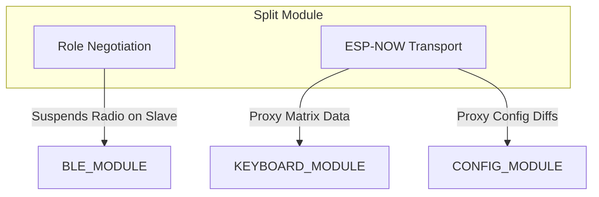

# Split Module (`splitmod`)

> **For deep debugging and implementation details, see:** `components/split/SPLIT_MODULE.md`

## What it does
The **Split Module** turns two independent ESP32 halves into a single, cohesive keyboard over an encrypted ESP-NOW wireless link. It handles dynamic role negotiation (deciding who is Master and who is Slave on boot) and transparently proxies matrix state, BLE control, and configuration data between the two halves.

## Why it exists
To completely hide the complexity of the split connection from the rest of the firmware. The `KEYBOARD_MODULE` thinks it is scanning a single large matrix. The `BLE_MODULE` doesn't know there's a slave half (the slave's radio is explicitly suspended by this module to prevent interference). It guarantees both halves stay perfectly in sync.

## Module Connections
- **[KEYBOARD_MODULE](KEYBOARD_MODULE.md)**: Intercepts raw matrix scanning on the Slave and proxies it to the Master. On the Master, it injects the remote matrix data into the logic loop.
- **[BLE_MODULE](BLE_MODULE.md)**: Actively suspends the BLE radio on the Slave to prevent 2.4GHz interference and proxies BLE state back and forth.
- **[CONFIG_MODULE](CONFIG_MODULE.md)**: Replicates NVS layout and macro updates from the Master to the Slave so both halves operate on the exact same logic rules.
- **[STATUS_MODULE](STATUS_MODULE.md)**: The Slave's Status module depends entirely on split proxy messages to know what the Master's connection state looks like.

## Dependency Flow

