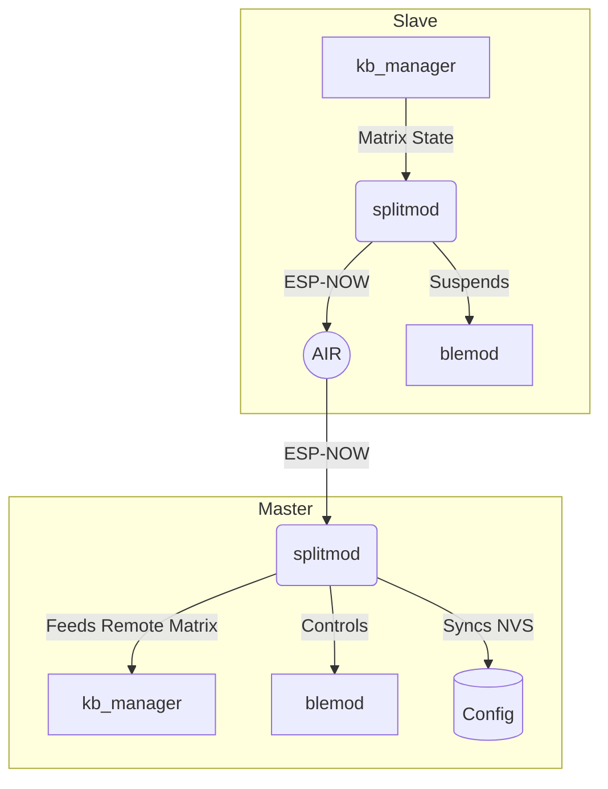

#  Split Keyboard Module (`splitmod`)

This note describes the architecture, protocols, and internal connections of the Split Keyboard Module (`components/split/`).

## High-Level Overview

The `splitmod` component is responsible for turning two separate ESP32 halves into a single cohesive keyboard. Instead of a hardcoded "left" and "right" side, the firmware dynamically negotiates roles (`MASTER` and `SLAVE`) on boot based on their connections (USB/BLE) to the host.

This module doesn't handle the physical key scanning itself; instead, it acts as a **bridge**, passing state from the SLAVE to the MASTER over ESP-NOW, and syncing configuration (BLE bonds, custom layouts) back down.

### Key Concepts

- **ESP-NOW Transport**: Used for peer-to-peer wireless communication because it offers low latency and is native to Espressif chips.
- **Dynamic Role Negotiation**: When the halves connect, they decide who is Master based on:
  1. Active USB Connection (USB device forcefully becomes Master).
  2. Active BLE connection/bonding.
  3. Last persisted NVS role.
  4. MAC address tiebreaker.
- **AES-128 Encryption**: After an initial X25519 pairing exchange, all traffic is encrypted with AES-128-CCM to prevent sniffing or replay attacks.

---

## Connections to Other Modules

The most important aspect of the split module is how it acts as a transparent proxy. It integrates heavily with other subsystems via direct function calls and the system `event_bus`.

### 1.  Keyboard Routing & Matrix ([[KEYBOARD_MODULE]])

The Split Module dictates whether local key events should be processed or forwarded:
- **When SLAVE:** `splitmod` calls `kb_manager_set_paused(true)` and registers a matrix callback. Thus, instead of routing local keypresses to USB/BLE, the keyboard manager just packages the raw matrix bits and `splitmod` sends them over ESP-NOW (`SPLIT_MSG_KEY_STATE_FULL`/`DELTA`).
- **When MASTER:** `splitmod` receives matrix packets over the air and feeds them into the system via `kb_manager_set_remote_matrix()`. The local `kb_manager` combines its own matrix with the remote matrix to generate single, unified HID reports.

### 2.  Bluetooth Low Energy ([[BLE_MODULE]])

Since both halves have Bluetooth chips, they cannot both advertise and connect to a PC.
- **Role-based BLE Suspend**: Through `apply_ble_routing_for_role()`, the SLAVE is commanded to put its BLE stack to sleep (`ble_hid_set_suspended(true)`), avoiding interference. The MASTER runs its BLE stack normally.
- **Shared MAC Address**: Upon becoming Master, the module automatically populates the `ble_shared_addr` config entry with the Master's BT MAC. This is config-synced to the Slave. If a role swap occurs and the Slave becomes Master, it will advertise using the former Master's exact MAC address, allowing the host PC to auto-reconnect without a re-pair!
- **State Proxying**: The Master pushes its BLE connection state and active profile to the Slave via `SPLIT_MSG_BLE_STATUS`. This allows a display/LEDs on the Slave half to accurately reflect connection status even though its own BLE radio is off.
- **Command Proxying**: If the user taps a USB Custom Key on the SLAVE to "Switch to BLE Profile 2", the Slave fires a `SPLIT_MSG_BLE_CMD` to the Master, which receives it and executes the remote proxy command via `execute_ble_cmd()`.

### 3.  USB Module ([[USB_MODULE]])

- **Host Connection Detection**: `tud_mounted()` is checked during Role Negotiation to strongly bias USB-plugged halves into becoming the Master.
- **Configurator Proxying**: The desktop App communicates over USB raw HID. If the desktop app requests matrix debugging or split status actions (unpair, force role swap), `splitmod` handles these via `split_usb_callback()`.

### 4.  Configuration & Sync ([[CONFIG_MODULE]])

When a user uses the Configurator to change keymaps, macros or BLE bonds on the Master, those changes must be replicated to the Slave so the Slave is ready to take over if roles are swapped.
- Listens to `CONFIG_EVENT_KIND_UPDATED` on the system event bus.
- Fires a `SPLIT_MSG_CONFIG_SYNC` fragmentation protocol to dynamically push updated NVS blocks.
- **Reverse Sync**: If the Slave connects and realizes its BLE bond data is newer than the Master's (e.g. they connected to a host while separated), a reverse-sync is triggered to pass the fresher bonds up to the Master.

---

## Message Protocol (ESP-NOW Wire Format)

Found in `split_protocol.h`. Packets have a custom 6-byte header:
`[magic:2][proto:1][type:1][seq:2][payload:0..240][mic:4]`

### Notable Messages:
*   `0x0_` **Pairing**: `DISCOVERY`, `PAIR_REQUEST`, `PAIR_RESPONSE` (unencrypted elliptic curve exchange).
*   `0x1_` **Roles**: `ROLE_NEGOTIATE`, `ROLE_SWAP_REQ`, `ROLE_SWAP_ACK`.
*   `0x2_` **Key State**: `KEY_STATE_FULL` (14-byte complete matrix), `KEY_STATE_DELTA` (currently disabled due to coexistence packet loss risks, so it exclusively sends FULL).
*   `0x3_` **Link**: `HEARTBEAT` (Every 150ms. Master echoes Slave's timestamp for RTT latency calculation).
*   `0x4_` **Config Sync**: `CONFIG_SYNC` and `CONFIG_SYNC_ACK`.

---
## Summary Diagram

