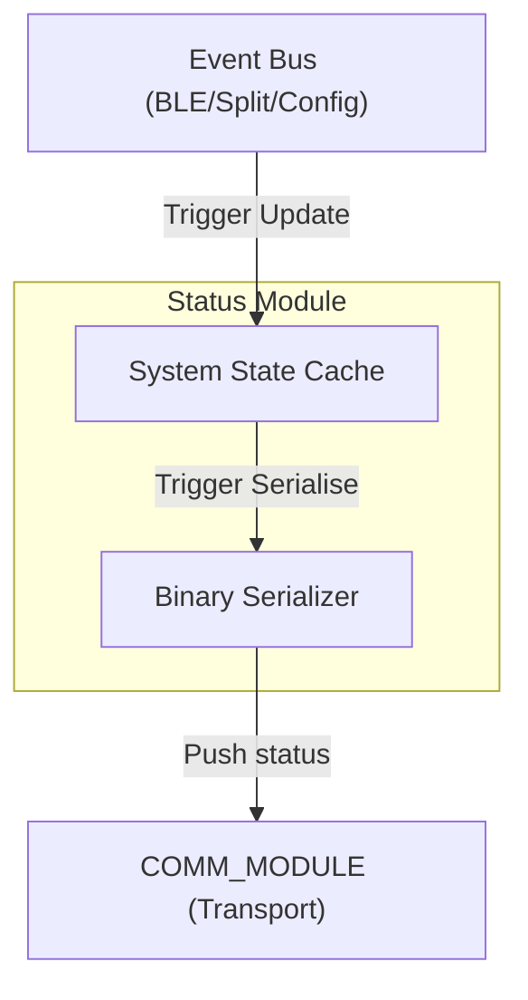

# Status Module (`statusmod`)

> **For deep debugging and implementation details, see:** `components/status_module/STATUS_MODULE.md`

## What it does
The **Status Module** is the state aggregator and synchronization engine of the firmware. It acts as a high-fidelity "State Cache" that gathers real-time data from across the system (BLE, Split, Config) and presents it as a unified, serializable snapshot for the external Configurator.

## Why it exists
To serve as the bridge between internal asynchronous events and the external user interface, ensuring the user sees exactly what the keyboard is doing (e.g., active profiles, split health) without constantly polling other modules. It uses a purely reactive Observe-Update-Push cycle.

## Module Connections
- **[BLE_MODULE](BLE_MODULE.md)**: The Status module observes BLE events to track active profiles, pairing status, and radio routing.
- **[SPLIT_MODULE](SPLIT_MODULE.md)**: In Slave mode, local BLE hardware is dead, so the Status module relies entirely on authoritative state proxies sent by the Master via the Split link.
- **[CONFIG_MODULE](CONFIG_MODULE.md)**: Monitored for persistent setting changes that alter the device's operational mode.
- **[COMM_MODULE](COMM_MODULE.md)**: Used as the transport layer to push the aggregated binary snapshot out to the Configurator app.

## Dependency Flow

