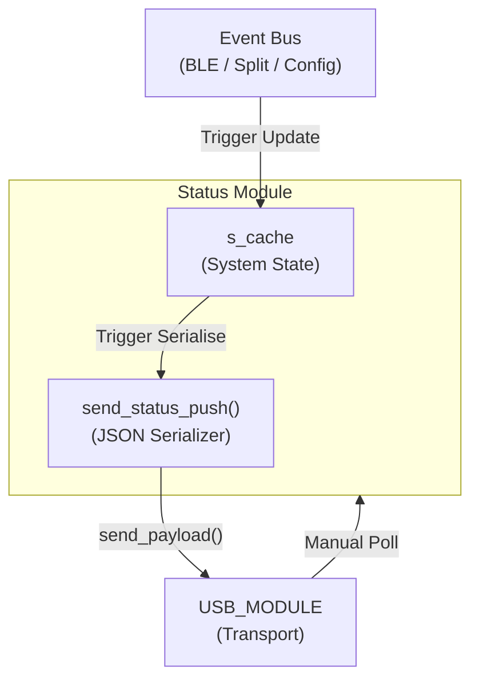

# Status Module (statusmod)

> **Source:** `components/status_module/` — `statusmod.c`
> **Public API:** `include/statusmod.h`

The **Status Module** is the state aggregator and synchronization engine of the firmware. It acts as a high-fidelity "State Cache" that gathers real-time data from across the system and presents it as a unified, serializable snapshot for the external Configurator.

It serves as the bridge between internal asynchronous events and the external user interface, ensuring the user sees exactly what the keyboard is doing at any given millisecond.

---

## Internal Architecture

The module operates on a purely reactive **Observe-Update-Push** cycle. It does not own the hardware state but mirrors it for reporting purposes.

### 1. The State Cache (`s_cache`)
Central to the module is the `s_cache` static structure. It maintains the "authoritative local view" of the system:
- **Transport**: Current active routing (USB vs. BLE).
- **Profiles**: Selected index, pairing slot, and the 16-bit connectivity bitmap.
- **Split**: Current role (Master/Slave) and connection health status.

### 2. Event-Driven Propagation
Instead of polling other modules (which would be inefficient), the Status Module subscribes to the system-wide Event Bus. Whenever a change is detected in the [[BLE_MODULE]], [[SPLIT_MODULE]], or [[CONFIG_MODULE]], the cache is updated and a push is automatically triggered.

### 3. The Push Mechanism
Every cache update triggers `send_status_push()`. This function performs three steps:
1.  **Serialization**: Formats the `s_cache` into a minified JSON string.
2.  **Framing**: Attaches the `MODULE_STATUS` wire header.
3.  **Transmission**: Hands the packet to the [[USB_MODULE]] for physical delivery to the host.

---

## Cross-Module Connections

The Status Module sits at the intersection of all major subsystems, acting as their collective voice.

### [[USB_MODULE]] — The Delivery Vehicle
- **Manual Polling**: Registers a callback via `usbmod_register_callback`. If the Configurator app sends a manual request, the Status Module forces an immediate cache refresh and push.
- **Payload Transport**: Uses the high-priority `send_payload` API to ensure status updates reach the PC even during heavy keyboard activity.

### [[BLE_MODULE]] — Connection Authority
- Subscribes to `BLE_EVENTS`. It tracks profile connection/disconnection, routing toggles, and pairing timer statuses.
- It translates binary stack events into user-friendly status bits (e.g., bit 2 of the bitmap means "Profile 3 is connected").

### [[SPLIT_MODULE]] — Synchronization Bridge
- **Master Authority**: In split configurations, the Master half is the authority for BLE connectivity. 
- **Authoritative Sync**: The Master pushes its live BLE state to the Slave via `SPLIT_EVENT_BLE_STATUS_UPDATED`.
- **Slave Logic**: When in the Slave role, the Status Module ignores local BLE hardware events (since the radio is suspended) and relies entirely on these authoritative pushes from the Master to update its local cache.

### [[CONFIG_MODULE]] — Settings Source
- Monitors `CONFIG_EVENTS` to catch user configuration changes (like switching the default boot profile) that aren't triggered by physical key presses.

---

## Communication Protocol

Status is communicated as an extensible JSON object. This allows the firmware to add new diagnostic fields (like battery level or signal strength) without breaking compatibility with older configurator versions.

### Example Payload
```json
{
  "mode": 1,
  "profile": 2,
  "pairing": -1,
  "bitmap": 5,
  "split_state": 3,
  "split_role": 1
}
```

---

## Dependency Flow



---

## File Map

| File | Responsibility |
|---|---|
| `statusmod.c` | Implements the state cache, event bus subscribers, and JSON push logic. |
| `statusmod.h` | Defines the public initialization and status message structures. |
