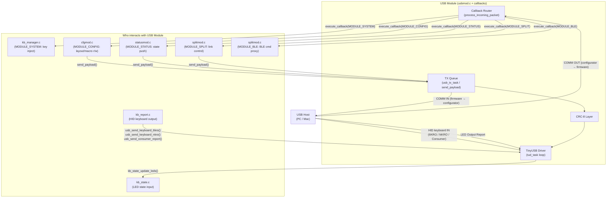

# USB Module (`usbmod`)

> **Source:** `components/usb_module/` — `usbmod.c`, `usb_callbacks.c`, `usb_callbacks_rx.c`, `usb_callbacks_tx.c`, `usb_send.c`, `usb_crc.c`
> **Public API:** `include/usbmod.h`

The USB module is the **physical wire interface** of the keyboard. It wraps TinyUSB into a clean, opaque interface that exposes exactly two things to the rest of the firmware:

1. **HID keyboard output** — sending keystrokes to the USB host (the PC, the Mac, whatever is plugged in).
2. **A bidirectional vendor channel** — a raw 63-byte HID pipe used by the web configurator app to read and write keyboard configuration, control the split link, manage BLE profiles, and query device status.

The module itself is **deliberately dumb about what goes through the vendor channel**. It does not parse configuration or care about BLE. It is a byte pipe with a routing table. Everything else is someone else's problem.

---

## The Two USB Interfaces

The firmware presents **two HID interfaces** to the USB host simultaneously:

### Interface 0 — HID Keyboard (`ITF_NUM_HID_KBD`)

This is the standard keyboard. It exposes three HID report types:

| Report ID | Type | What it carries |
|---|---|---|
| `REPORT_ID_KEYBOARD` (1) | 6KRO | Standard boot-protocol keyboard: 1 modifier byte + 6 key slots |
| `REPORT_ID_NKRO` (2) | NKRO bitmap | Full 231-key bitmap for N-Key Rollover — the host can receive every key simultaneously |
| `REPORT_ID_CONSUMER` (4) | Consumer Control | Media keys: Play/Pause, Volume Up/Down, Mute, etc. |

**Endpoint:** IN only (`0x81`). The keyboard only talks *to* the host.

**Output reports (host → keyboard):** The host may send LED state (Caps Lock, Num Lock, Scroll Lock) back on this interface. That is how the firmware knows to light the Caps Lock LED.

### Interface 1 — HID Comm (`ITF_NUM_HID_COMM`)

This is a vendor-defined, bidirectional 63-byte HID interface. It has no standard HID usage — its Usage Page is `0xFF 0xFF` (vendor-defined). The host OS treats it like a generic HID device and will not load a keyboard driver on top of it.

**Endpoints:**
- IN (`0x82`): firmware → configurator
- OUT (`0x02`): configurator → firmware

**Purpose:** This is the configurator's data pipe. The web configurator (running in a browser via WebHID) opens this interface and uses it to send commands and receive responses. Packet size: **63 bytes** (`COMM_REPORT_SIZE`).

---

## Internal Architecture

```
                          ┌───────────────────────────────────────────────┐
                          │             USB Module                        │
                          │                                               │
  USB Host (PC)           │  ┌─────────────┐  ┌─────────────┐             │
       │                  │  │ Interface 0 │  │ Interface 1 │             │
       │  HID keyboard    │  │   (KBD)     │  │   (COMM)    │             │
       ├─────────────────►│  │             │  │             │             │
       │  LED reports     │  │             │  │             │             │
       │◄─────────────────│  └─────────────┘  └─────────────┘             │
       │                  │         │                 │                   │
       │  COMM reports    │         ▼                 ▼                   │
       ├─────────────────►│  kb_state_update_leds()  usb_processing_queue │
       │  COMM reports    │                           │                   │
       │◄─────────────────│                    usb_processing_task        │
                          │                           │                   │
                          │                    process_incoming_packet()  │
                          │                           │                   │
                          │               ┌───────────────────┐           │
                          │               │  Callback Table   │           │
                          │               │  [MODULE_CONFIG]  │           │
                          │               │  [MODULE_SYSTEM]  │           │
                          │               │  [MODULE_ACTION]  │           │
                          │               │  [MODULE_STATUS]  │           │
                          │               │  [MODULE_SPLIT]   │           │
                          │               │  [MODULE_BLE]     │           │
                          │               └───────────────────┘           │
                          └───────────────────────────────────────────────┘
```

### Tasks Spawned by `usb_init()`

| Task | File | Stack | Core | Priority | What it does |
|---|---|---|---|---|---|
| `usb_task` | `usbmod.c` | 4 KB | Core 1 | 5 | Calls `tud_task()` in a tight loop — this is the TinyUSB event pump |
| `usb_tx_task` | `usb_callbacks_tx.c` | 4 KB | Any | 10 | Dequeues outgoing payloads and sends them over `ITF_NUM_HID_COMM` |
| `usb_processing_task` | `usb_callbacks.c` | 8 KB | Any | 5 | Dequeues and processes incoming COMM packets (routes to module callbacks) |
| `usb_cb_timeouts_task` | `usb_callbacks.c` | 4 KB | Any | 5 | Watches for stale RX/TX buffers and erases them after timeout |

`usb_task` runs on Core 1 to keep TinyUSB off Core 0 where the BLE stack and keyboard scanner run.

`usb_tx_task` runs at **priority 10** (higher than everything else) because sending a response to the configurator must not be blocked by keyboard scanning or BLE events. A missed response would cause the configurator to time out and retry.

---

## The COMM Protocol (How the Wire Works)

The 63-byte COMM packets implement a **reliable, ordered, flow-controlled transfer layer** on top of raw HID interrupt reports. This was necessary because:

- HID interrupt endpoints do not guarantee delivery.
- A single config payload (e.g., all keyboard layouts as JSON) can reach **20+ KB**, which doesn't fit in one 63-byte report.
- The web configurator and the firmware must stay in sync even if individual USB frames are dropped.

### Packet Structure (`usb_packet_msg_t`, 63 bytes)

```
Offset  Size   Field
──────────────────────────────
0       1      flags
1       2      remaining_packets  (little-endian)
3       1      payload_len
4       58     payload            (MAX_PAYLOAD_LENGTH = 58 bytes of actual data)
62      1      crc                (CRC-8 over bytes 0–61)
```

### Flag Byte

```
Bit 7  FIRST      — first packet in a transfer
Bit 6  MID        — middle packet in a transfer
Bit 5  LAST       — last packet in a transfer
Bit 4  ACK        — acknowledgement (response to a packet we sent)
Bit 3  NAK        — negative acknowledgement (ask to resend)
Bit 2  OK         — payload processed successfully
Bit 1  ERR        — payload processing failed
Bit 0  ABORT      — abort the current transfer

Combined flags:
  MID|ACK (0x50)  = STATUS_REQ — sender asking for a bitmap of received packets
  MID|NAK (0x48)  = BITMAP     — receiver reporting which packets it got
```

### Transfer Modes

#### Sequential Mode (small payloads — 1 packet)

The simplest case. The sender sends a single packet with `FIRST|LAST`. The receiver ACKs. If the sender gets NAK, it resends up to 3 times before aborting.

#### Blast Mode (large payloads — multiple packets)

Used when a payload needs more than one packet. Designed as a **fire-and-forget burst with bitmap reconciliation** — instead of waiting for an ACK after every packet (which would be extremely slow at 63 bytes/packet over USB HID), the sender fires all middle packets as fast as possible. Full flow:

```
Sender                          Receiver
  │
  ├── FIRST (rem = N-1) ────────►│ (triggers blast mode, ACKs the handshake)
  │◄─── ACK ─────────────────────┤
  │
  ├── MID[1] ───────────────────►│  \
  ├── MID[2] ───────────────────►│   | all mid packets fired without waiting
  ├── MID[3] ───────────────────►│  /
  │
  ├── STATUS_REQ ────────────────►│ (ask: "what did you receive?")
  │◄─── BITMAP (bitfield) ────────┤ (bitmap: each bit = was packet N received)
  │
  ├── [retransmit gaps] ─────────►│
  │
  ├── (repeat STATUS_REQ / BITMAP up to 5 rounds)
  │
  ├── LAST ──────────────────────►│ (triggers commit + callback execution)
  │◄─── ACK|OK (or ACK|ERR) ──────┤
```

The RX side maintains a **bitmap** (`rx_blast_bitmap`, using 48 bytes = 384 bits, max 384 packets) to track which packets arrived. Each MID packet writes directly to its position in the RX buffer (`rx_buf`) at offset `index * 58`. No sequential assembly — random-access writes. On LAST, `rx_blast_commit()` concatenates the payload lengths, calls `process_rx_buffer()`, and dispatches to the corresponding module callback.

### CRC

CRC-8 (polynomial `0x07`, initial value `0x00`) computed over bytes 0–61 (all fields except the CRC byte itself). The table is precomputed. Verification: compute CRC over all 63 bytes — if the packet is valid, the result is `0x00` (the remainder property of CRC).

### Payload Format (Inside the 58-byte payload)

Once a complete multi-packet transfer is assembled in `rx_buf`, the first byte is the **module ID** (`usb_msg_module_t`). The rest is passed verbatim to that module's registered callback:

```
rx_buf[0]       = module ID (e.g., MODULE_CONFIG = 0, MODULE_SPLIT = 4...)
rx_buf[1..N-1]  = module-specific payload (e.g., JSON, command bytes)
```

Similarly, when a module sends *back* to the configurator via `send_payload()`, the first byte of the payload it provides is its own module ID — so the configurator knows who is answering.

---

## How the Callback System Works

The COMM pipe is shared by multiple firmware modules. The USB module doesn't know or care what the payloads mean. It purely routes based on the module ID byte at the start of each assembled payload.

### Registration

Any module that wants to receive COMM messages registers a callback during init:

```c
// Prototype
void usbmod_register_callback(usb_msg_module_t module, usb_data_callback_t cb);

// Type
typedef bool (*usb_data_callback_t)(uint8_t *data, uint16_t data_len);
```

The callback receives `data` pointing to `rx_buf[1]` (skipping the module ID byte) and `data_len = rx_buf_len - 1`. It returns `true` on success, `false` to signal an error (which causes the USB module to send `ACK|ERR` to the configurator).

### Module ID Table

```c
typedef enum usb_msg_module : uint8_t {
    MODULE_CONFIG = 0,    // cfg_usb_callback()   in cfgmod.c
    MODULE_SYSTEM,        // kb_system_usb_callback() in kb_manager.c
    MODULE_ACTION,        // (unused/reserved)
    MODULE_STATUS,        // status_module_callback() in statusmod.c
    MODULE_SPLIT,         // split_usb_callback()  in splitmod.c
    MODULE_BLE,           // ble_usb_callback()    in splitmod.c
    USB_MODULE_COUNT
} usb_msg_module_t;
```

---

## Connections to Other Modules

---

### 1. [[KEYBOARD_MODULE]] — HID Report Output (Keyboard → USB)

**Files:** `components/keyboard/kb_report.c`, `components/keyboard/kb_manager.c`

This is the module's primary output path. The keyboard scanner produces keystrokes; the USB module sends them to the PC.

#### 1a. HID Report Delivery (`kb_report.c`)

`kb_report.c` is the transport router. On every key event, `kb_macro_send_report()` eventually calls `kb_send_report(const uint8_t *v_nkro)`. That function is the **exclusive** transport decision point:

```c
// kb_report.c (simplified)
esp_err_t kb_send_report(const uint8_t *v_nkro) {
    if (ble_hid_is_routing_active()) {
        // BLE path — USB is bypassed entirely when BLE routing is on
        return ble_hid_send_keyboard_report(...);
    }
    // USB path
    if (!tud_mounted()) return ESP_FAIL;
    if (usb_keyboard_use_boot_protocol()) {
        return usb_send_keyboard_6kro(modifiers, basic_keys);
    }
    return usb_send_keyboard_nkro(modifiers, v_nkro, NKRO_BYTES);
}
```

**Why this matters:** USB and BLE are **mutually exclusive**. The USB module never gets a HID report when BLE routing is active. There is no "send to both" mode. This is not an accident — it is the explicit design to prevent split-brain scenarios where half your keystrokes go to the BLE host and half to the USB host.

**Boot protocol detection:** `usb_keyboard_use_boot_protocol()` queries `tud_hid_n_get_protocol(ITF_NUM_HID_KBD)`. When the host requests Boot Protocol mode (legacy BIOS / KVM compatibility), the firmware drops to 6KRO automatically. The keyboard manager logs a message when the protocol changes. When in non-boot mode, full NKRO is used.

**Why NKRO over USB but 6KRO over BLE:** The standard Bluetooth HID profile only defines the 8-byte boot report format. True NKRO would require a custom GATT service. Since the BLE module follows the standard, it is capped at 6 simultaneous non-modifier keys. USB has no such limitation — the NKRO bitmap descriptor allows 231 keys simultaneously.

#### 1b. LED Feedback (USB → Keyboard)

**File:** `components/usb_module/usb_callbacks.c` → `components/keyboard/kb_state.c`

When the USB host changes an LED state (Caps Lock, Num Lock, Scroll Lock), it sends an **HID Output Report** on `ITF_NUM_HID_KBD`. TinyUSB calls `tud_hid_set_report_cb()`, which delegates to `usbmod_tud_hid_set_report_cb()` in `usb_callbacks.c`:

```c
// usb_callbacks.c
void usbmod_tud_hid_set_report_cb(...) {
    if (instance == ITF_NUM_HID_KBD && report_type == HID_REPORT_TYPE_OUTPUT) {
        uint8_t led_status = buffer[...];
        kb_state_update_leds(led_status);  // ← this is the cross-module call
        return;
    }
    // ... COMM interface handling
}
```

`kb_state_update_leds()` is in `components/keyboard/kb_state.c`. Currently it uses the LED byte to drive the RGB indicator (Caps Lock → red LED). The USB module does not need to know any of that — it just fires the function and moves on.

**Why this is in `usb_callbacks.c` and not in the keyboard module:** TinyUSB requires that `tud_hid_set_report_cb()` be defined at link time in the same compilation unit as the TinyUSB core (or accessible from it). The keyboard module uses this USB module as a dependency — not the other way around. To avoid a circular dependency, the USB module owns the TinyUSB callback and calls out to the keyboard module.

#### 1c. Key Injection (USB → Keyboard, TEST path)

**File:** `components/keyboard/kb_manager.c`, registered as `MODULE_SYSTEM`

The keyboard manager registers a `MODULE_SYSTEM` callback during `kb_manager_start()`:

```c
usbmod_register_callback(MODULE_SYSTEM, kb_system_usb_callback);
```

This callback accepts two commands from the configurator:

| Command byte | Command | Effect |
|---|---|---|
| `0x01` | `SYS_CMD_INJECT_KEY` | Simulate a key press/release at row/col — used by the tester in the configurator |
| `0x02` | `SYS_CMD_CLEAR_INJECTED` | Clear all simulated keys |

These injected keys are merged into the hardware scan matrix **before debounce** and processed identically to real key presses. They are automatically cleared if USB becomes suspended or not ready (`tud_suspended() || !tud_ready()`), preventing phantom stuck keys if the cable is unplugged during a test.

---

### 2. [[CONFIG_MODULE]] — Configuration Read/Write (Configurator ↔ NVS)

**Files:** `components/config_module/cfgmod.c`

This is the heaviest consumer of the COMM channel by far. The entire keyboard configuration flows through this connection: key layouts, macros, custom keys, BLE profile state, physical layout, system settings.

`cfg_init()` registers the callback during NVS initialization:

```c
usbmod_register_callback(MODULE_CONFIG, cfg_usb_callback);
```

#### What the Configurator Sends (GET/SET Commands)

Every COMM payload for `MODULE_CONFIG` starts with a `cfgmod_wire_header_t`:
- `cmd` — `CFG_CMD_GET` or `CFG_CMD_SET`
- `key_id` — which config item is being read/written (layer 0–3, macros, custom keys, system settings, etc.)

`cfg_usb_callback()` allocates a response buffer from PSRAM (up to 32 KB), calls `cfgmod_handle_usb_comm()`, then calls `send_payload()` to ship the response back through the COMM channel.

**Why the response goes through `send_payload()` directly:** The config callback has its own response that it builds internally and needs to transmit. It calls `send_payload()` (the TX queue entry point) rather than returning a payload through the callback return value. This is for size: a full layout serialization can be 20+ KB, which requires blast mode. The callback return value is just a `bool` (success/failure).

#### Key Payload Types

| `key_id` | What it represents | Storage location |
|---|---|---|
| `CFG_KEY_LAYER_0..3` | Key layout for each layer | NVS `cfg_lay` namespace |
| `CFG_KEY_MACROS` | Macro outline (all IDs + names) | NVS `cfg_mac` namespace |
| `CFG_KEY_MACRO_SINGLE` | Individual macro definition | NVS `cfg_mac` namespace |
| `CFG_KEY_CKEYS` | Custom key outline | NVS `cfg_ck` namespace |
| `CFG_KEY_CKEY_SINGLE` | Individual custom key | NVS `cfg_ck` namespace |
| `CFG_KEY_SYSTEM` | System config (device name, variant) | NVS `cfg` namespace |
| `CFG_KEY_PHYSICAL_LAYOUT` | Physical key positions | NVS `cfg` namespace |

All payloads are **JSON** (minified). On SET, they are deserialized into typed structs and stored as binary blobs (with JSON fallback for legacy formats). On GET, the structs are serialized back to JSON. cJSON is configured to allocate from PSRAM to prevent large config ASTs from exhausting internal RAM.

---

### 3. [[SPLIT_MODULE]] — Split Keyboard Control (Configurator ↔ Both Halves)

**Files:** `components/split/splitmod.c` — two callbacks registered

`splitmod_init()` registers **two** USB callbacks:

```c
usbmod_register_callback(MODULE_SPLIT, split_usb_callback);
usbmod_register_callback(MODULE_BLE,   ble_usb_callback);
```

This is the most architecturally interesting connection because the USB module is only physically present on the half that is plugged in — but the configurator needs to control *both* halves, including BLE which lives on whichever half is the MASTER.

#### 3a. `MODULE_SPLIT` — Split Link Management

`split_usb_callback()` handles these commands from the configurator:

| Command byte | Name | What it does |
|---|---|---|
| `0x01` | `START_PAIRING` | Puts this half into split pairing mode |
| `0x02` | `CANCEL_PAIRING` | Cancels ongoing pairing |
| `0x03` | `UNPAIR` | Clears pairing data from NVS, disconnects |
| `0x04` | `GET_STATUS` | No-op — configurator polls via MODULE_STATUS instead |
| `0x05` | `GET_REMOTE_MATRIX` | Returns the remote half's key state as a JSON array |
| `0x06` | `ROLE_SWAP` | Requests master/slave role swap |
| `0x07` | `RUN_BENCH` | Starts RTT latency benchmark |
| `0x08` | `GET_BENCH` | Returns benchmark results as JSON |

Responses are sent back via `send_usb_json_response()` → `send_payload()`, prefixed with `MODULE_SPLIT` so the configurator knows who answered.

#### 3b. `MODULE_BLE` — BLE Commands Proxied Through the SLAVE

`ble_usb_callback()` is a **routing layer**. The configurator sends BLE commands (toggle routing, start pairing, connect profile) to whichever half is plugged in. If that half is the **MASTER**, the command runs locally:

```c
execute_ble_cmd(cmd, arg);   // calls ble_hid_set_routing_active(), ble_hid_profile_pair(), etc.
```

If that half is the **SLAVE** (USB plugged into the slave, BLE running on the master), the command is tunneled over the split link:

```c
split_ble_cmd_payload_t payload = {.cmd = cmd, .arg = arg};
split_transport_send(s_peer_mac, SPLIT_PROTO_SPLIT, SPLIT_MSG_BLE_CMD, ...);
```

The master receives `SPLIT_MSG_BLE_CMD`, calls `execute_ble_cmd()`, runs the BLE operation, and the resulting BLE event propagates back via `SPLIT_MSG_BLE_STATUS` → `SPLIT_EVENT_BLE_STATUS_UPDATED` → [[STATUS_MODULE]] → USB COMM response to the configurator.

**Why is this callback registered in `splitmod.c` and not `blemod.c`?** Because the routing decision (am I SLAVE? do I need to forward this?) requires knowledge of the split state. `blemod` knows nothing about split roles. `splitmod` knows both — it owns the role state and can call `blemod` directly. Registering the callback in `splitmod` keeps the dependency direction correct: `splitmod` → `blemod`, not the other way around.

---

### 4. [[STATUS_MODULE]] — Status Push on Demand

**Files:** `components/status_module/statusmod.c`

`status_module_init()` registers:

```c
usbmod_register_callback(MODULE_STATUS, status_module_callback);
```

The callback is trivially simple:

```c
static bool status_module_callback(uint8_t *data, uint16_t data_len) {
    send_status_push();   // assembles JSON and calls send_payload()
    return true;
}
```

When the configurator sends any payload to `MODULE_STATUS`, the status module pushes the current device state as JSON over the COMM channel:

```json
{
  "mode": 1,        // 1 = BLE routing active, 0 = USB
  "profile": 2,     // selected BLE profile index
  "pairing": -1,    // profile currently pairing (-1 = none)
  "bitmap": 7,      // bitmask of connected BLE profiles
  "split_state": 2, // split_state_t enum value
  "split_role": 1   // split_role_t enum value
}
```

**Why this exists as a pull mechanism through USB:** The status module is normally event-driven — it pushes state on BLE events, split events, and config events automatically. The `MODULE_STATUS` USB callback handles the case where the configurator has just opened the connection and needs an immediate snapshot before any events fire. It's a "hello, what's your current state?" handshake.

The response flows back through `send_payload()`, prefixed with `MODULE_STATUS`, so the configurator knows this is a status packet and not a config response.

---

### 5. [[BLE_MODULE]] — Mutual Exclusivity (Passive Relationship)

**Files:** `components/keyboard/kb_report.c`

The USB module and the BLE module do **not call each other directly**. Their relationship is enforced by the transport gate in `kb_report.c` (see §1a above).

From the USB module's point of view: when BLE routing is active, the keyboard output functions (`usb_send_keyboard_6kro`, `usb_send_keyboard_nkro`, `usb_send_consumer_report`) simply never get called. The USB hardware remains mounted and connected — ther USB COMM channel stays open for the configurator — but no HID keyboard traffic flows.

From the BLE module's point of view: it doesn't know USB exists. It is called by `kb_report.c` when routing is active, and that's the full extent of the relationship.

The **only explicit interaction** between USB and BLE is the `MODULE_BLE` callback registered by `splitmod` (§3b above), which uses the USB COMM channel to receive configurator commands and proxy them to `blemod`.

---

## Device Descriptor and Identification

`usb_init()` reads from [[CONFIG_MODULE]] (`cfg_system_get()`) before calling `tinyusb_driver_install()` to override two USB string descriptors dynamically:

| Descriptor | Default | Dynamic override |
|---|---|---|
| `iProduct` (string 2) | `"TEF"` | `"{device_name} ({split_variant})"` — e.g. `"Tecleados Pro (Left)"` |
| `iSerialNumber` (string 3) | `"13548"` | MAC address formatted as `"AABBCCDDEEFF"` |

**Why the MAC as serial number:** This makes each unit uniquely identifiable on the USB bus. Without this, two keyboards with the same firmware would present identical serial numbers, which causes problems on operating systems that use serial numbers for device-specific settings (macOS input source associations, Linux udev rules).

**Why the product name includes the split variant:** The configurator and OS device manager show this string. Without it, both halves of a split keyboard look identical in the device list. `split_variant` is set to `"Left"` or `"Right"` (or whatever the user configured) so they are distinguishable.

USB identifiers used:
- `idVendor`: `0x303A` (Espressif's USB VID)
- `idProduct`: `0x1324` (custom PID assigned to this project)
- `bcdDevice`: `0x0101` (firmware version 1.1)

---

## Initialization Sequence

`usb_init()` is called from `main.c` `init_procedure()` in this order:

```
event_bus_init()
cfg_init()        ← cfg_ble_init() and usbmod_register_callback(MODULE_CONFIG, ...)
         │
         └── sets up cfg_system, which usb_init() will read for product name
         
usb_init()        ← tinyusb_driver_install(), launches usb_task
         │
         └── usb_callbacks_init()
                    ├── usb_tx_init() (TX queue + usb_tx_task)
                    ├── create usb_processing_queue
                    ├── launch usb_processing_task
                    └── launch usb_cb_timeouts_task
         
ble_hid_init()         ← NimBLE stack starts
ble_controller_init()
status_module_init()   ← usbmod_register_callback(MODULE_STATUS, ...)
splitmod_init()        ← usbmod_register_callback(MODULE_SPLIT, ...) and (MODULE_BLE, ...)
kb_manager_start()     ← usbmod_register_callback(MODULE_SYSTEM, ...)
```

**Critical ordering notes:**

- `cfg_init()` must come **before** `usb_init()` so the product name and serial number overrides are available at driver install time.
- All `usbmod_register_callback()` calls happen **after** `usb_init()` but the USB COMM channel is already live at that point. There is a brief window (a few hundred milliseconds) between `usb_init()` returning and the last callback being registered where a COMM packet arriving for an unregistered module would be dropped with an `ESP_LOGE`. In practice this is not a problem because the configurator waits for an initial status push before sending commands.
- `kb_manager_start()` delays 500ms before starting the scan task to let USB/GPIO settle.

---

## Dependency Flow Summary



---

## File Map

| File | Responsibility |
|---|---|
| `usbmod.c` | TinyUSB driver install, `usb_init()`, HID report send functions, TinyUSB callback shims |
| `usb_callbacks.c` | COMM packet processing, callback registration/dispatch, task spawning |
| `usb_callbacks_rx.c` | RX buffer management, blast mode receive + bitmap tracking, `process_rx_buffer()` |
| `usb_callbacks_tx.c` | TX queue + task, blast mode send + bitmap reconciliation, `send_payload()` |
| `usb_send.c` | Low-level `send_single_packet()` and `build_send_single_msg_packet()` helpers |
| `usb_crc.c` | CRC-8 table + `usb_crc_prepare_packet()` / `usb_crc_verify_packet()` |
| `include/usbmod.h` | Public API for the rest of the firmware |
| `include/usb_defs.h` | `usb_msg_module_t` enum, flag constants, `usb_packet_msg_t` struct |
| `include/usb_descriptors.h` | Static TinyUSB device/configuration/HID report descriptors |
| `include/usb_callbacks.h` | Internal callback registration/execution API |
| `include/usb_callbacks_rx.h` | RX buffer constants and blast mode API |
| `include/usb_callbacks_tx.h` | TX buffer constants, blast mode API, `send_payload()` declaration |
| `include/usb_send.h` | Low-level send function declarations |
| `include/usb_crc.h` | CRC function declarations |
