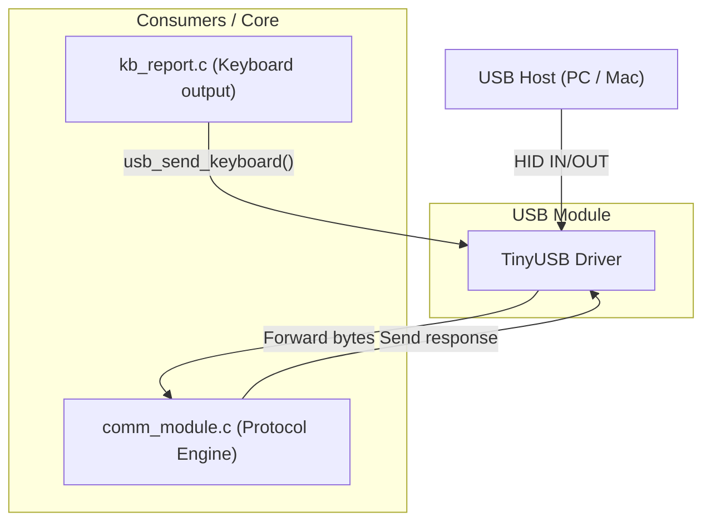

# USB Module (`usbmod`)

> **For deep debugging and implementation details, see:** `components/usb_module/USB_MODULE.md`

## What it does
The `usb_module` is the **physical wire interface** of the keyboard. It wraps TinyUSB to expose exactly two things: HID keyboard output (sending keystrokes to the PC) and a bidirectional vendor-defined channel that registers as a transport for the `comm_module`.

## Why it exists
To isolate USB hardware and TinyUSB boilerplate from the application. It acts purely as a "dumb" pipe: it doesn't parse configuration, evaluate macros, or route logic. It just takes physical bytes from the USB host and hands them to the protocol engine, and vice versa.

## Module Connections
- **[KEYBOARD_MODULE](KEYBOARD_MODULE.md)**: Pushes finalized NKRO/6KRO HID keyboard reports and consumer (media) reports directly to the USB interface.
- **[COMM_MODULE](COMM_MODULE.md)**: Registers a bidirectional vendor-defined HID channel on the USB stack to serve as the wired transport for Configurator traffic.

## Dependency Flow

